# Technical Specification

# 1. Introduction

## 1.1 EXECUTIVE SUMMARY

### 1.1.1 Project Overview

This Technical Specification documents the repository identified by the project name **Artifact13**, as declared in its sole artifact, the root-level `README.md` file. At the time of analysis, the repository exists in a **pre-implementation placeholder state**. The entirety of the repository's contents consists of a single Markdown file at the root level containing exclusively a top-level Markdown heading (`# Artifact13`) with no body text, no narrative description, and no associated source, configuration, or supplementary artifacts.

This specification adheres to a strict evidence-based documentation discipline. Because no source code, dependency manifests, build scripts, test suites, schemas, infrastructure-as-code definitions, or operational documentation are present in the repository, this document does not describe a functioning software system. Instead, it serves as the authoritative reference describing the precise state, boundaries, and observable characteristics of the repository as it currently exists.

### 1.1.2 Core Business Problem

The repository does not document a business problem, technical challenge, or user need. The single `README.md` file does not contain any statement of:

- A problem domain being addressed
- A user pain point being resolved
- A market opportunity being captured
- A technical capability being delivered

In accordance with the factual grounding discipline of this specification, no business problem is asserted on behalf of the repository. The artifact, in its current state, exists as a named placeholder without documented intent.

### 1.1.3 Key Stakeholders and Users

The repository does not enumerate stakeholders, user groups, operator personas, or accountable parties. No `OWNERS`, `CODEOWNERS`, `CONTRIBUTORS`, `MAINTAINERS`, governance documents, or persona definitions exist within the repository scope.

| Stakeholder Category | Status in Repository | Evidence |
|----------------------|----------------------|----------|
| Defined end users | Not identified | No persona or user documentation present |
| Designated operators | Not identified | No operational role declarations present |
| Code owners or maintainers | Not identified | No `CODEOWNERS` or equivalent file present |
| Business sponsors | Not identified | No governance or sponsorship documentation present |

### 1.1.4 Expected Business Impact and Value Proposition

Because no system functionality is implemented and no statement of intent is documented, the repository provides no objectively measurable value proposition that can be derived from its contents. The artifact's verifiable contribution at this stage is limited to the declaration of a project name (`Artifact13`) within a version-controlled location. Any claim of broader business impact would constitute fabrication beyond the evidence available in the repository.

---

## 1.2 SYSTEM OVERVIEW

### 1.2.1 Project Context

#### 1.2.1.1 Business Context and Market Positioning

No business context, market positioning, competitive analysis, or strategic intent is documented within the repository. The `README.md` file contains no narrative establishing the artifact's purpose, target audience, or relationship to any business or product strategy.

#### 1.2.1.2 Current System Limitations

The repository does not represent the replacement, upgrade, or modernization of any pre-existing system. No references to legacy systems, deprecated platforms, migration timelines, or transition strategies are present in the artifact.

#### 1.2.1.3 Integration with Existing Enterprise Landscape

No integration points, enterprise architecture references, dependency graphs, or interconnection diagrams are present in the repository. The artifact declares no relationships to external systems.

| Integration Concern | Status in Repository |
|---------------------|----------------------|
| External APIs consumed | None declared |
| Services exposed externally | None declared |
| Database or persistence layer connections | None declared |
| Message queues or event streams | None declared |

### 1.2.2 High-Level Description

#### 1.2.2.1 Primary System Capabilities

No system capabilities have been implemented. The repository does not contain executable code, runnable scripts, deployable configurations, or any artifacts capable of producing observable system behavior. The artifact cannot accept input, produce output, perform computation, or interact with external systems.

#### 1.2.2.2 Major System Components

No system components exist within the repository. The complete file structure is illustrated below:

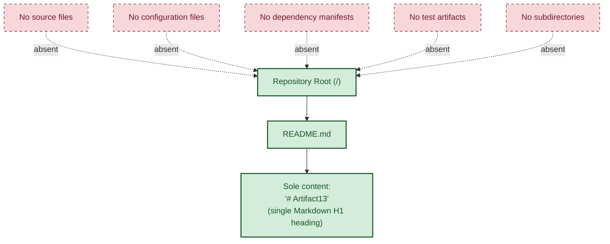

The repository contains zero modules, zero packages, zero services, zero libraries, and zero subsystems. The directory structure consists exclusively of the repository root containing a single Markdown file, with no subdirectories of any depth.

#### 1.2.2.3 Core Technical Approach

No technical approach has been declared. The repository contains no commitments to or selections of the following technical concerns:

| Technical Concern | Status in Repository |
|-------------------|----------------------|
| Programming language(s) | None — no source files in any language |
| Framework or runtime | None — no framework artifacts or runtime declarations |
| Architectural pattern | None — no service, module, or layer definitions |
| Build and packaging strategy | None — no build configuration files |
| Deployment topology | None — no infrastructure or deployment artifacts |

### 1.2.3 Success Criteria

Because no functional system is implemented and no objectives are documented within the repository, no measurable success criteria can be derived from observable evidence.

#### 1.2.3.1 Measurable Objectives

No measurable objectives are encoded in the repository. The `README.md` file contains no goal statements, milestones, or acceptance criteria.

#### 1.2.3.2 Critical Success Factors

No critical success factors are documented. The repository does not enumerate prerequisites, dependencies for success, or risk factors.

#### 1.2.3.3 Key Performance Indicators (KPIs)

No KPIs are defined within the repository. There are no monitoring artifacts, instrumentation definitions, service-level objectives, or metric specifications.

| Success Criterion Category | Status |
|----------------------------|--------|
| Measurable objectives | Not defined in repository |
| Critical success factors | Not defined in repository |
| Key performance indicators (KPIs) | Not defined in repository |
| Service level objectives (SLOs) | Not defined in repository |

---

## 1.3 SCOPE

The scope of this Technical Specification is strictly bounded by the artifacts physically present in the repository at the time of analysis. The following subsections delineate in-scope and out-of-scope elements based exclusively on observable evidence.

### 1.3.1 In-Scope Elements

#### 1.3.1.1 Core Features and Functionalities

The only in-scope element supported by repository evidence is the **declaration of the project name** `Artifact13` via a top-level Markdown heading in `README.md`. No functional features, workflows, or capabilities exist within the scope of this specification.

| In-Scope Element | Evidence Location | Description |
|------------------|-------------------|-------------|
| Project name declaration | `README.md` | A single Markdown H1 heading reading `# Artifact13` |
| Repository existence | Version control root | The repository exists as a versioned, named artifact |

#### 1.3.1.2 Implementation Boundaries

The implementation boundary of the repository encompasses exactly one file located at the repository root. The complete enumeration is:

| Boundary Metric | Value |
|------------------|-------|
| Total files in repository | 1 |
| Total source code files | 0 |
| Total configuration files | 0 |
| Total subdirectories | 0 |

#### 1.3.1.3 User Groups and Coverage

| Coverage Dimension | Status |
|--------------------|--------|
| User groups covered | None defined |
| Geographic or market coverage | None defined |
| Data domains included | None defined — no data artifacts present |
| Functional domains included | None defined — no functional artifacts present |

### 1.3.2 Out-of-Scope Elements

#### 1.3.2.1 Excluded Features and Capabilities

Because the repository contains no implementation, the following are explicitly out-of-scope for this specification:

| Excluded Category | Rationale |
|-------------------|-----------|
| All application functionality | No source code exists in the repository |
| All system integrations | No integration definitions exist in the repository |
| All deployment automation | No build, packaging, or deployment artifacts exist |
| All data persistence concerns | No schemas, migrations, or ORM definitions exist |

#### 1.3.2.2 Future Phase Considerations

The repository contains no roadmap document, product backlog, planning artifact, or feature specification. As a result, future phases are not defined within the scope of this specification. This document makes no forward-looking statements about features that may or may not be added in subsequent revisions of the repository.

#### 1.3.2.3 Integration Points Not Covered

All possible integration points are out-of-scope because none are declared. The repository contains no API specifications, no client SDKs, no webhook definitions, no event schemas, and no protocol buffers or interface definition language (IDL) files.

#### 1.3.2.4 Unsupported Use Cases

All use cases are unsupported. The artifact contains no executable component capable of accepting input, producing output, persisting state, or interacting with users or systems. Any operational use case that requires running software is not supported by the current repository contents.

---

## 1.4 REPOSITORY ARTIFACT INVENTORY

### 1.4.1 Complete File Listing

The repository's complete contents are enumerated in the following table. This inventory is exhaustive: no additional files, directories, or artifacts exist beyond those listed.

| Path | Artifact Type | Purpose |
|------|---------------|---------|
| `/` (repository root) | Directory | Contains exactly one file and zero subdirectories |
| `/README.md` | Markdown document | Declares the project name `Artifact13` via a single H1 heading |

### 1.4.2 Verification Methodology

The completeness of the inventory above was established through systematic verification of the repository structure and contents.

| Verification Action | Result Obtained |
|---------------------|-----------------|
| Root folder enumeration | Exactly one child file (`README.md`) confirmed |
| Direct file content read | Single heading line `# Artifact13` confirmed |
| File summary analysis | No executable content, imports, or cross-references found |
| Semantic searches (source, config, docs) | Empty result sets returned for all queries |
| File system enumeration | No additional artifacts identified beyond `README.md` |

### 1.4.3 Absence Confirmations

The following commonly expected artifact categories were specifically verified to be absent from the repository:

| Artifact Category | Presence Status |
|-------------------|-----------------|
| Source code (any language) | Absent |
| Package manifests (e.g., `package.json`, `requirements.txt`, `pom.xml`) | Absent |
| Build configurations (e.g., `Makefile`, `Dockerfile`, CI definitions) | Absent |
| Test files or test directories | Absent |
| API definitions (OpenAPI, GraphQL, Protobuf) | Absent |
| Database schemas or migrations | Absent |
| Front-end assets (HTML, CSS, JavaScript, images) | Absent |
| Environment configurations (`.env`, `.yaml`, `.toml`) | Absent |
| License file (`LICENSE`) | Absent |
| Repository metadata (`.gitignore`, `.editorconfig`) | Not visible in repository scope |

---

## 1.5 DOCUMENTATION POSTURE

### 1.5.1 Factual Grounding Discipline

This Technical Specification adheres to a strict factual grounding principle. Every statement made about the artifact is derived from observable evidence within the repository. Where the section prompt requests information that is not present in the repository — including business context, stakeholder identification, integration descriptions, and success metrics — this document explicitly states the absence of such information rather than inferring, extrapolating, or fabricating content.

### 1.5.2 Implications for Subsequent Sections

Subsequent sections of this Technical Specification will likewise reflect the placeholder state of the repository. Sections addressing architecture, component design, data flow, deployment topology, and operational procedures will document the absence of corresponding artifacts where applicable, in keeping with the same factual grounding discipline applied here.

### 1.5.3 Specification Validity Window

The findings documented in this specification reflect the state of the repository at the time of analysis. The specification's accuracy is therefore tied to the contents of the repository as observed; any subsequent commits, additions, or restructuring would require re-analysis and revision of this document.

---

## 1.6 REFERENCES

### 1.6.1 Files Examined

- `README.md` — The sole file present in the repository. Its complete content is a single line: `# Artifact13`. This file was used as the authoritative source for the project name declaration and as the basis for verifying the absence of any descriptive narrative, setup instructions, configuration guidance, or technical specifications.

### 1.6.2 Folders Explored

- `/` (repository root, depth 0) — The root directory of the repository. Enumeration confirmed that it contains exactly one file (`README.md`) and zero subdirectories. Because no subdirectories exist, no deeper exploration was structurally possible, and the depth-0 enumeration fully establishes the boundary of the repository.

### 1.6.3 Search Operations Performed

The following investigative operations were conducted to verify repository contents and confirm the absence of additional artifacts:

| Operation | Target | Outcome |
|-----------|--------|---------|
| Folder traversal | Repository root | Single child file confirmed |
| Direct file read | `README.md` | Minimal content confirmed |
| File summary analysis | `README.md` | No executable content, imports, or relationships |
| Semantic search | Source code, application implementation | Empty result set |
| Semantic search | Configuration, packages, dependencies | Empty result set |
| Semantic search | Application source code modules | Empty result set |
| Semantic search | Documentation and introduction artifacts | Empty result set |
| File system enumeration | Repository file tree | Repository confirmed to contain only `README.md` |

# 2. Product Requirements

## 2.1 SECTION OVERVIEW AND APPLICABILITY ASSESSMENT

### 2.1.1 Purpose and Scope of This Section

This section addresses the Product Requirements dimension of the **Artifact13** repository. Its purpose, per the section prompt, is to enumerate discrete, testable features; document functional requirements; define feature relationships; and surface implementation considerations. The contents of this section are derived exclusively from observable evidence within the repository, in conformance with the factual grounding discipline established in Section 1.5.1.

### 2.1.2 Repository State Determination

As established exhaustively in Sections 1.1.1, 1.3.1, and 1.4.1, the repository exists in a **pre-implementation placeholder state**. The complete contents of the repository consist of a single Markdown file (`README.md`) at the root level containing exactly one line: a top-level Markdown heading (`# Artifact13`). No source code, no configuration manifests, no build files, no test artifacts, no schemas, no specifications, and no subdirectories exist within the repository at the time of analysis.

The following diagram summarizes the applicability of standard Product Requirements artifacts to the current repository state:

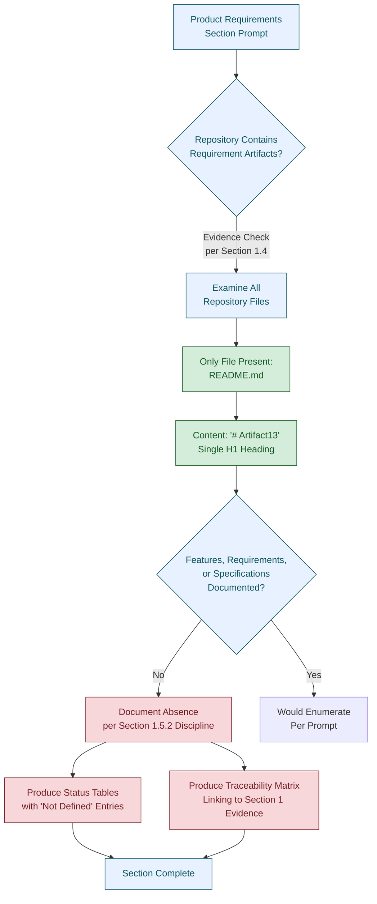

### 2.1.3 Section Prompt Alignment

The section prompt explicitly states two governing principles that are directly relevant to this analysis:

1. *"Only include sections and items that are actually relevant to this system, based on your analysis of its requirements."*
2. *"Don't add any features of your own, or any items that aren't clearly applicable."*

In conjunction with the documentation posture established in Section 1.5.1 — under which *"every statement made about the artifact is derived from observable evidence within the repository"* — these principles compel this section to formally document the **absence** of all standard Product Requirements artifacts, rather than to invent, infer, or extrapolate them.

### 2.1.4 Applicability of Standard Requirement Categories

The following table provides a top-level applicability assessment for the standard categories listed in the section prompt. Each category is mapped to its evidentiary status in the repository.

| Standard Category | Applicability Status | Primary Evidence Reference |
|-------------------|----------------------|----------------------------|
| Feature Catalog | Not defined in repository | Section 1.3.1.1, Section 1.4.1 |
| Functional Requirements Table | Not defined in repository | Section 1.3.2.1, Section 1.4.3 |
| Feature Relationships | Not defined in repository | Section 1.2.1.3, Section 1.2.2.2 |
| Implementation Considerations | Not defined in repository | Section 1.2.2.3, Section 1.4.3 |

---

## 2.2 FEATURE CATALOG

### 2.2.1 Feature Catalog Status

The repository declares **zero features**. There are no observable artifacts (source files, specification documents, design notes, user stories, acceptance criteria, or roadmap entries) that define discrete product features. As enumerated in Section 1.3.1.1, the only in-scope element supported by evidence is the project name declaration `Artifact13` within `README.md` — which does not constitute a product feature in the sense intended by this section's prompt.

### 2.2.2 Feature Metadata Inventory

The Feature Metadata inventory required by the section prompt cannot be populated because no features are defined. The structural schema is preserved below with an explicit `Not Applicable` status for each metadata attribute to support future re-analysis should the repository evolve.

| Feature Metadata Attribute | Required Format | Current Status |
|----------------------------|-----------------|----------------|
| Unique ID | F-XXX | No features to identify |
| Feature Name | String label | No features to name |
| Feature Category | Categorical taxonomy | No taxonomy declared |
| Priority Level | Critical/High/Medium/Low | No priorities assigned |
| Status | Proposed/Approved/In Development/Completed | No statuses tracked |

### 2.2.3 Feature Description Inventory

The Feature Description elements required by the section prompt cannot be populated because no features exist. Section 1.1.2 explicitly establishes that the repository does not document a business problem, technical challenge, or user need; Section 1.1.4 confirms no value proposition is derivable; and Section 1.2.2.1 confirms no primary system capabilities are implemented.

| Description Element | Source Required | Current Status |
|---------------------|-----------------|----------------|
| Overview | Feature specification | No specification exists |
| Business Value | Business case or product brief | No business case documented (Section 1.1.4) |
| User Benefits | User research or persona documentation | No personas defined (Section 1.1.3) |
| Technical Context | Architectural documentation | No technical approach declared (Section 1.2.2.3) |

### 2.2.4 Feature Dependencies Inventory

The Feature Dependencies elements required by the section prompt cannot be populated because no features exist and no dependency declarations are present. Section 1.4.3 confirms the absence of package manifests, build configurations, and environment configurations — the artifact classes that would conventionally encode such dependencies.

| Dependency Element | Source Required | Current Status |
|--------------------|-----------------|----------------|
| Prerequisite Features | Feature graph | No features exist |
| System Dependencies | Runtime / platform declarations | No runtime declared (Section 1.2.2.3) |
| External Dependencies | Package manifests | No manifests present (Section 1.4.3) |
| Integration Requirements | Integration specifications | No integrations declared (Section 1.2.1.3) |

### 2.2.5 Rationale for Absent Feature Catalog

The absence of a feature catalog is not a documentation gap; it is a faithful reflection of the repository's current state. Per Section 1.5.1, the specification *"explicitly states the absence of such information rather than inferring, extrapolating, or fabricating content."* Any enumeration of fabricated features in this section would violate both this discipline and the explicit "do not invent features" directive of the section prompt.

---

## 2.3 FUNCTIONAL REQUIREMENTS TABLE

### 2.3.1 Functional Requirements Status

The repository declares **zero functional requirements**. There are no requirement specifications, no user stories, no acceptance criteria, no input/output contracts, no performance targets, and no data-handling definitions present in the repository. The single line of content in `README.md` (`# Artifact13`) is a project name declaration and does not encode any functional requirement.

### 2.3.2 Requirement Identification Schema (Reserved)

The section prompt prescribes a requirement ID format of `F-XXX-RQ-YYY`. Because no parent features (`F-XXX`) exist in the repository, no requirement identifiers (`F-XXX-RQ-YYY`) can be issued. The identifier namespace is therefore reserved for future use should the repository evolve to include feature specifications.

| Identifier Component | Format | Current Allocation |
|----------------------|--------|--------------------|
| Feature prefix | `F-XXX` | None allocated |
| Requirement suffix | `RQ-YYY` | None allocated |
| Full requirement ID | `F-XXX-RQ-YYY` | None issued |

### 2.3.3 Requirement Detail Status

The Requirement Details elements required by the section prompt cannot be populated. The schema is reproduced below with explicit `Not Defined` entries for traceability.

| Requirement Detail Element | Required Content | Current Status |
|----------------------------|------------------|----------------|
| Requirement ID | F-XXX-RQ-YYY | None issued (Section 2.3.2) |
| Description | Behavioral statement | No requirements specified |
| Acceptance Criteria | Testable conditions | No criteria defined |
| Priority | Must-Have/Should-Have/Could-Have | No prioritization performed |
| Complexity | High/Medium/Low | No complexity assessment performed |

### 2.3.4 Technical Specifications Status

The Technical Specifications elements required by the section prompt cannot be populated. Section 1.2.2.1 confirms that the artifact *"cannot accept input, produce output, perform computation, or interact with external systems,"* which forecloses any input/output specification at the present time.

| Technical Specification Element | Required Content | Current Status |
|---------------------------------|------------------|----------------|
| Input Parameters | Input contract | No inputs accepted (Section 1.2.2.1) |
| Output / Response | Output contract | No outputs produced (Section 1.2.2.1) |
| Performance Criteria | SLOs / SLAs / benchmarks | No criteria defined (Section 1.2.3.3) |
| Data Requirements | Data schema or model | No data domains defined (Section 1.3.1.3) |

### 2.3.5 Validation Rules Status

The Validation Rules elements required by the section prompt cannot be populated. No business rules, data validation rules, security requirements, or compliance requirements are documented anywhere in the repository.

| Validation Rule Element | Required Content | Current Status |
|-------------------------|------------------|----------------|
| Business Rules | Domain-specific logic | No business domain declared (Section 1.2.1.1) |
| Data Validation | Schema-bound validation | No schemas present (Section 1.4.3) |
| Security Requirements | Threat model / control catalog | No security artifacts present |
| Compliance Requirements | Regulatory mappings | No compliance artifacts present |

---

## 2.4 FEATURE RELATIONSHIPS

### 2.4.1 Feature Dependencies Map Status

A feature dependency map cannot be produced because the repository declares zero features (Section 2.2.1). A dependency map requires at least two nodes (features) and an edge (dependency) to be meaningful; neither nodes nor edges exist in the current repository state.

### 2.4.2 Integration Points Status

No integration points are declared in the repository. Section 1.2.1.3 enumerates the absence of external APIs consumed, services exposed externally, database or persistence layer connections, and message queues or event streams. Section 1.3.2.3 confirms that *"all possible integration points are out-of-scope because none are declared."*

| Integration Concern | Status in Repository | Evidence Reference |
|---------------------|----------------------|--------------------|
| External APIs consumed | None declared | Section 1.2.1.3 |
| Services exposed externally | None declared | Section 1.2.1.3 |
| Database / persistence layer connections | None declared | Section 1.2.1.3 |
| Message queues or event streams | None declared | Section 1.2.1.3 |

### 2.4.3 Shared Components and Common Services Status

No shared components or common services are declared in the repository. Section 1.2.2.2 confirms that the repository *"contains zero modules, zero packages, zero services, zero libraries, and zero subsystems."* No artifact exists that could be characterized as a shared component or common service.

| Component Class | Status in Repository | Evidence Reference |
|-----------------|----------------------|--------------------|
| Modules | Zero | Section 1.2.2.2 |
| Packages | Zero | Section 1.2.2.2 |
| Services | Zero | Section 1.2.2.2 |
| Libraries | Zero | Section 1.2.2.2 |

### 2.4.4 Feature Relationship Cross-Reference Map

Because no features exist, the cross-reference map is empty. No process flowcharts referenced in this section depict feature-to-feature flows; the single mermaid diagram in Section 2.1.2 illustrates the methodological process used to evaluate applicability, not feature behavior.

---

## 2.5 IMPLEMENTATION CONSIDERATIONS

### 2.5.1 Implementation Considerations Status

Implementation considerations presuppose the existence of features to implement. As established in Section 2.2.1, no features are defined within the repository; consequently, no implementation considerations are derivable from observable evidence. The structural schema is preserved below for re-analysis purposes.

### 2.5.2 Technical Constraints

| Constraint Class | Required Content | Current Status |
|------------------|------------------|----------------|
| Language / runtime constraints | Targets declared in manifests | No manifests present (Section 1.4.3) |
| Framework constraints | Framework artifacts | None present (Section 1.2.2.3) |
| Platform constraints | Deployment topology | None declared (Section 1.2.2.3) |
| Build / packaging constraints | Build configuration | None present (Section 1.4.3) |

### 2.5.3 Performance Requirements

| Performance Dimension | Required Content | Current Status |
|-----------------------|------------------|----------------|
| Throughput targets | Quantitative target | Not defined (Section 1.2.3.3) |
| Latency targets | Quantitative target | Not defined (Section 1.2.3.3) |
| Resource utilization targets | CPU / memory / I/O budgets | Not defined (Section 1.2.3.3) |
| Service-level objectives (SLOs) | Documented SLOs | Not defined (Section 1.2.3.3) |

### 2.5.4 Scalability Considerations

| Scalability Dimension | Required Content | Current Status |
|-----------------------|------------------|----------------|
| Horizontal scaling strategy | Architectural pattern | No architecture declared (Section 1.2.2.3) |
| Vertical scaling strategy | Resource provisioning model | No deployment topology (Section 1.2.2.3) |
| Data partitioning / sharding | Persistence design | No persistence layer (Section 1.2.1.3) |
| Load balancing strategy | Topology declaration | No topology declared (Section 1.2.2.3) |

### 2.5.5 Security Implications

| Security Dimension | Required Content | Current Status |
|--------------------|------------------|----------------|
| Authentication mechanisms | Auth design | No authentication artifacts present |
| Authorization model | RBAC / ABAC declarations | No authorization artifacts present |
| Data protection (at rest / in transit) | Encryption design | No data artifacts present (Section 1.3.1.3) |
| Threat model | Threat catalog | No threat model documented |

### 2.5.6 Maintenance Requirements

| Maintenance Dimension | Required Content | Current Status |
|-----------------------|------------------|----------------|
| Operational runbooks | Procedural documentation | None present |
| Monitoring and instrumentation | Metric / log / trace definitions | None present (Section 1.2.3.3) |
| Backup and recovery procedures | DR documentation | None present |
| Code ownership and governance | `CODEOWNERS` / `OWNERS` | None present (Section 1.1.3) |

---

## 2.6 TRACEABILITY MATRIX

### 2.6.1 Requirement Category to Evidence Mapping

The following traceability matrix maps each Product Requirements category requested by the section prompt to its evidentiary status and the corresponding source location within Section 1 of this Technical Specification. Every row resolves to a "Not Defined in Repository" determination, with the cited evidence supporting that determination.

| Requirement Category | Status | Primary Evidence Source |
|----------------------|--------|-------------------------|
| Business problem statement | Not Defined in Repository | Section 1.1.2 |
| Stakeholder identification | Not Defined in Repository | Section 1.1.3 |
| Value proposition | Not Defined in Repository | Section 1.1.4 |
| System capabilities | Not Defined in Repository | Section 1.2.2.1 |
| System components | Not Defined in Repository | Section 1.2.2.2 |
| Technical approach | Not Defined in Repository | Section 1.2.2.3 |
| Success criteria (KPIs / SLOs) | Not Defined in Repository | Section 1.2.3 |
| Feature catalog | Not Defined in Repository | Section 1.3.1.1 |
| Functional requirements | Not Defined in Repository | Section 1.3.2.1 |
| Integration points | Not Defined in Repository | Section 1.2.1.3, Section 1.3.2.3 |
| Use case support | Not Defined in Repository | Section 1.3.2.4 |
| Implementation artifacts | Not Defined in Repository | Section 1.4.3 |

### 2.6.2 Feature-to-Requirement Traceability

A conventional feature-to-requirement traceability matrix maps feature identifiers (`F-XXX`) to requirement identifiers (`F-XXX-RQ-YYY`). Because Section 2.2 establishes that zero features (`F-XXX`) and Section 2.3.2 establishes that zero requirements (`F-XXX-RQ-YYY`) have been issued, this matrix is empty by construction.

| Feature ID | Requirement IDs | Status |
|------------|-----------------|--------|
| *(none issued)* | *(none issued)* | Matrix empty pending feature definition |

### 2.6.3 Cross-Reference Index to Section 1 Evidence

| Section 2 Subsection | Related Section 1 Source |
|----------------------|--------------------------|
| 2.1 Section Overview | 1.5 Documentation Posture |
| 2.2 Feature Catalog | 1.1.4, 1.3.1.1, 1.4.1 |
| 2.3 Functional Requirements | 1.2.2.1, 1.2.3, 1.3.2.1, 1.4.3 |
| 2.4 Feature Relationships | 1.2.1.3, 1.2.2.2, 1.3.2.3 |
| 2.5 Implementation Considerations | 1.2.2.3, 1.2.3, 1.4.3 |
| 2.6 Traceability Matrix | 1.4.1, 1.4.2, 1.4.3 |

---

## 2.7 ASSUMPTIONS AND CONSTRAINTS

### 2.7.1 Documented Assumptions

The following assumptions govern the construction of this section. Each is explicitly stated in conformance with the section prompt's instruction to "document assumptions and constraints."

| Assumption ID | Assumption Statement |
|---------------|----------------------|
| A-2-001 | Only the contents of `README.md` and the absence of all other repository artifacts are observable as evidence. |
| A-2-002 | The repository state captured during Section 1 analysis is the authoritative basis for this section. |
| A-2-003 | No external repositories, design documents, ticket systems, or organizational context exist within the scope of this specification. |
| A-2-004 | No `.blitzyignore` file or equivalent exclusion mechanism filtered any artifact out of the inventory described in Section 1.4. |

### 2.7.2 Documented Constraints

| Constraint ID | Constraint Statement | Source Reference |
|---------------|----------------------|------------------|
| C-2-001 | No source code or specification artifacts exist within the repository. | Section 1.4.1, Section 1.4.3 |
| C-2-002 | The strict factual grounding discipline prohibits inference, extrapolation, or fabrication of feature content. | Section 1.5.1 |
| C-2-003 | The section prompt explicitly forbids the addition of features or items not clearly applicable to the system. | Section 2.1.3 |
| C-2-004 | The repository declares no programming language, framework, runtime, architectural pattern, or deployment topology. | Section 1.2.2.3 |

### 2.7.3 Specification Validity and Version Tracking

Per Section 1.5.3, the findings documented here reflect the state of the repository at the time of analysis. The version-tracking implications for this Product Requirements section are as follows:

| Version Tracking Dimension | Current State |
|----------------------------|---------------|
| Specification basis | Single observation of `README.md` with content `# Artifact13` |
| Re-analysis trigger | Any subsequent commit, addition, or restructuring of the repository |
| Requirement version baseline | v0 — no requirements issued |
| Effective scope | The repository state at the time of analysis only |

### 2.7.4 Forward Re-Analysis Guidance

Should the repository evolve to include feature specifications, source code, configuration manifests, or planning artifacts in the future, this section should be re-analyzed. The following structural elements are reserved for population at that time:

- Feature identifier namespace `F-001` through `F-XXX` (Section 2.2.2)
- Requirement identifier namespace `F-XXX-RQ-001` through `F-XXX-RQ-YYY` (Section 2.3.2)
- Feature-to-requirement traceability matrix (Section 2.6.2)
- Implementation considerations tables (Sections 2.5.2 through 2.5.6)

---

## 2.8 REFERENCES

### 2.8.1 Files Examined

- `README.md` — The sole file present in the repository, containing exclusively the line `# Artifact13`. Used to verify the absence of any feature documentation, user stories, requirements specifications, acceptance criteria, or product planning artifacts.

### 2.8.2 Folders Explored

- `/` (repository root, depth 0) — Confirmed to contain exactly one file (`README.md`) and zero subdirectories. Used to verify the absence of feature directories, specification directories, requirements folders, or design documentation folders.

### 2.8.3 Technical Specification Cross-References

- **Section 1.1 EXECUTIVE SUMMARY** — Establishes pre-implementation placeholder state; confirms absence of business problem, stakeholders, and value proposition.
- **Section 1.2 SYSTEM OVERVIEW** — Confirms absence of system capabilities, system components, technical approach, integration points, and success criteria.
- **Section 1.3 SCOPE** — Defines the sole in-scope element (project name declaration) and exhaustively enumerates out-of-scope elements including all application functionality, integrations, deployment automation, and data persistence concerns.
- **Section 1.4 REPOSITORY ARTIFACT INVENTORY** — Provides the complete file listing and verifies absence of source code, package manifests, build configurations, test files, API definitions, schemas, front-end assets, environment configurations, and license files.
- **Section 1.5 DOCUMENTATION POSTURE** — Establishes the factual grounding discipline applied throughout this section and prescribes the documentation of absence as the appropriate response to missing artifacts.
- **Section 1.6 REFERENCES** — Documents the verification methodology and search operations used to establish the completeness of the repository inventory.

# 3. Technology Stack

## 3.1 SECTION OVERVIEW AND APPLICABILITY ASSESSMENT

### 3.1.1 Purpose and Scope of This Section

This section addresses the Technology Stack dimension of the **Artifact13** repository. Per the section prompt, its purpose is to identify and justify the programming languages, frameworks, libraries, open-source dependencies, third-party services, databases, storage systems, and development/deployment tooling that constitute the technical foundation of the system. The contents of this section are derived exclusively from observable evidence within the repository, in conformance with the factual grounding discipline established in Section 1.5.1 and consistently applied across Section 2.

### 3.1.2 Repository State Determination

As established exhaustively in Sections 1.1.1, 1.3.1, 1.4.1, and 2.1.2, the repository exists in a **pre-implementation placeholder state**. The complete contents of the repository consist of a single Markdown file (`README.md`) at the root level containing exactly one line: a top-level Markdown heading (`# Artifact13`). Per Section 1.4.3, no source code, package manifests, build configurations, test files, API definitions, database schemas, front-end assets, environment configurations, or license files exist in the repository. Per Section 1.2.2.3, no programming language, framework, runtime, architectural pattern, build/packaging strategy, or deployment topology has been declared.

The following diagram summarizes the applicability evaluation flow for standard Technology Stack categories against the current repository state:

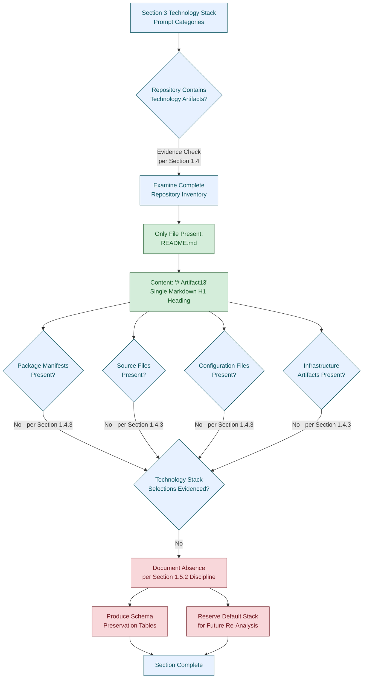

### 3.1.3 Section Prompt Alignment

The section prompt provides two governing principles that bound the construction of this section:

1. *"Only include sections and items that are actually relevant to this system, based on your analysis of its requirements."*
2. *"Don't add any items that aren't clearly applicable."*

In conjunction with the documentation posture established in Section 1.5.1 — under which *"every statement made about the artifact is derived from observable evidence within the repository"* — and Constraint C-2-002 (Section 2.7.2) — which prohibits inference, extrapolation, or fabrication of content — these principles compel this section to formally document the **absence** of all Technology Stack selections, rather than to invent, infer, or extrapolate them from defaults or assumed conventions.

The section prompt additionally supplies a "Default Technology Stack" reference (e.g., AWS, Docker, Terraform, GitHub Actions, Python, Flask, Auth0, MongoDB, Langchain, React with TypeScript, TailwindCSS). The treatment of this default reference is addressed explicitly in Section 3.8 below.

### 3.1.4 Applicability of Standard Technology Categories

The following table provides a top-level applicability assessment for each of the six standard Technology Stack categories enumerated in the section prompt. Each category is mapped to its evidentiary status in the repository and to the primary Section 1 or Section 2 references that support the absence determination.

| Standard Category (per Prompt) | Applicability Status | Primary Evidence Reference |
|--------------------------------|----------------------|----------------------------|
| Programming Languages | Not defined in repository | Section 1.2.2.3; Section 1.4.3 |
| Frameworks & Libraries | Not defined in repository | Section 1.2.2.3; Section 1.4.3 |
| Open Source Dependencies | Not defined in repository | Section 1.4.3 (no manifests of any kind) |
| Third-Party Services | Not defined in repository | Section 1.2.1.3; Section 1.3.2.3 |
| Databases & Storage | Not defined in repository | Section 1.2.1.3; Section 1.3.1.3 |
| Development & Deployment | Not defined in repository | Section 1.2.2.3; Section 1.4.3 |

Each of the subsequent subsections (3.2 through 3.7) documents the absence of the corresponding category, preserves the structural schema requested by the section prompt, and references the primary evidence supporting the absence determination.

---

## 3.2 PROGRAMMING LANGUAGES

### 3.2.1 Programming Languages Status

No programming language is declared within the **Artifact13** repository. As confirmed in Section 1.2.2.3, the repository contains no source files in any language. As confirmed in Section 1.4.3, the repository contains zero source code artifacts of any kind. The single file present in the repository (`README.md`) is a Markdown document containing a single H1 heading; Markdown is a lightweight markup language used for human-readable text formatting and is not a programming language in the sense intended by the section prompt (i.e., a language used to express computational logic, compile to executable artifacts, or be interpreted by a runtime).

This absence is not a documentation gap; it is a faithful reflection of the repository's current state at the time of analysis.

### 3.2.2 Schema Preservation Table

The following table preserves the schema required by the section prompt for re-analysis purposes. No language entries can be populated from observable evidence.

| Platform / Component | Language | Version | Selection Criteria | Constraints / Dependencies |
|----------------------|----------|---------|--------------------|----------------------------|
| Not applicable — no platform/component declared | None | Not applicable | Not applicable | Not applicable |

### 3.2.3 Markdown Classification Note

For completeness and to forestall any ambiguity, the following clarification is provided regarding the sole file present in the repository:

| File | Format | Classification | Role |
|------|--------|----------------|------|
| `README.md` | CommonMark / GitHub-Flavored Markdown | Lightweight markup language (not a programming language) | Static documentation only — declares the project name `Artifact13` via a single H1 heading |

Per the file summary obtained during repository analysis, `README.md` contains no imports, globals, classes, functions, or executable content of any kind. It therefore does not participate in any programming language selection for the purposes of this section.

---

## 3.3 FRAMEWORKS AND LIBRARIES

### 3.3.1 Frameworks and Libraries Status

No framework or library is declared within the **Artifact13** repository. Per Section 1.2.2.3, the repository contains no framework artifacts or runtime declarations. Per Section 1.4.3, the repository contains no package manifests (e.g., `package.json`, `requirements.txt`, `pom.xml`, `go.mod`, `Gemfile`, `Cargo.toml`, `pyproject.toml`) through which framework or library selections could be expressed. Per Section 2.5.2, the framework constraint class is explicitly marked as having no artifacts present.

### 3.3.2 Schema Preservation Table

The following table preserves the schema required by the section prompt for re-analysis purposes. No framework or library entries can be populated from observable evidence.

| Component | Framework / Library | Version | Role (Core / Supporting) | Compatibility Requirements | Justification |
|-----------|---------------------|---------|--------------------------|-----------------------------|---------------|
| Not applicable — no component declared | None | Not applicable | Not applicable | Not applicable | Not applicable |

### 3.3.3 Compatibility Requirements

Because no framework or library is declared, no compatibility requirements exist between framework versions, language runtimes, or supporting libraries. The reservation of this concern for future re-analysis aligns with the framework constraints row of Section 2.5.2.

---

## 3.4 OPEN SOURCE DEPENDENCIES

### 3.4.1 Open Source Dependencies Status

No open-source or third-party dependencies are declared within the **Artifact13** repository. Per Section 1.4.3, the following dependency manifest categories were specifically verified to be absent:

- `package.json` (Node.js / npm)
- `requirements.txt` (Python / pip)
- `pom.xml` (Java / Maven)
- Equivalent dependency manifest formats for all other ecosystems (Gradle, Cargo, Composer, NuGet, Bundler, Go modules, etc.)

In the absence of any manifest, no package, no version pin, no registry reference, and no transitive dependency graph can be derived from observable repository evidence.

### 3.4.2 Schema Preservation Table

The following table preserves the schema required by the section prompt for re-analysis purposes. No dependency entries can be populated from observable evidence.

| Dependency Name | Ecosystem / Registry | Version Constraint | Manifest Source | License | Purpose |
|-----------------|----------------------|--------------------|-----------------|---------|---------|
| Not applicable — no manifest present | Not applicable | Not applicable | Not applicable | Not applicable | Not applicable |

### 3.4.3 Package Registry Status

| Registry | Declared in Repository | Evidence Reference |
|----------|------------------------|--------------------|
| npm (registry.npmjs.org) | No | Section 1.4.3 — no `package.json` |
| PyPI (pypi.org) | No | Section 1.4.3 — no `requirements.txt` or `pyproject.toml` |
| Maven Central | No | Section 1.4.3 — no `pom.xml` or `build.gradle` |
| RubyGems | No | Section 1.4.3 — no `Gemfile` |
| crates.io | No | Section 1.4.3 — no `Cargo.toml` |
| Go module proxy | No | Section 1.4.3 — no `go.mod` |
| Any private or internal registry | No | Section 1.4.3 — no configuration of any kind |

---

## 3.5 THIRD-PARTY SERVICES

### 3.5.1 Third-Party Services Status

No third-party service integrations are declared within the **Artifact13** repository. Per Section 1.2.1.3, the artifact declares no relationships to external systems; the integration concerns table in that section explicitly lists "None declared" for external APIs consumed, services exposed externally, database or persistence layer connections, and message queues or event streams. Per Section 1.3.2.3, all possible integration points are out-of-scope because none are declared; the repository contains no API specifications, client SDKs, webhook definitions, event schemas, or interface definition language (IDL) files.

### 3.5.2 Schema Preservation Table

The following table preserves the schema required by the section prompt for re-analysis purposes. No service integration entries can be populated from observable evidence.

| Service Category | Provider | Integration Type | Authentication Method | Evidence Reference |
|------------------|----------|------------------|------------------------|--------------------|
| External APIs and integrations | None declared | Not applicable | Not applicable | Section 1.2.1.3 |
| Authentication services | None declared | Not applicable | Not applicable | Section 2.5.5 (no authentication artifacts) |
| Monitoring and observability tools | None declared | Not applicable | Not applicable | Section 1.2.3.3; Section 2.5.6 |
| Cloud platform services | None declared | Not applicable | Not applicable | Section 1.2.2.3 (no deployment topology) |
| Message queues / event streams | None declared | Not applicable | Not applicable | Section 1.2.1.3 |

### 3.5.3 Cloud Service Status

No cloud platform commitment (AWS, Azure, Google Cloud Platform, or any other provider) is declared within the repository. Per Section 1.2.2.3, no deployment topology has been declared. Per Section 1.4.3, no infrastructure or deployment artifacts (such as Dockerfiles, Terraform configurations, CloudFormation templates, Kubernetes manifests, or Helm charts) are present.

---

## 3.6 DATABASES AND STORAGE

### 3.6.1 Databases and Storage Status

No database, persistence layer, caching solution, or storage service is declared within the **Artifact13** repository. Per Section 1.2.1.3, no database or persistence layer connections are declared. Per Section 1.3.1.3, no data domains are defined within scope. Per Section 1.4.3, no database schemas or migrations are present in the repository. Per Section 2.5.4 (scalability), the data partitioning/sharding dimension has no persistence layer to operate over.

### 3.6.2 Schema Preservation Table

The following table preserves the schema required by the section prompt for re-analysis purposes. No data persistence entries can be populated from observable evidence.

| Storage Role | Technology | Version | Persistence Strategy | Caching Layer | Evidence Reference |
|--------------|------------|---------|----------------------|---------------|--------------------|
| Primary database | None declared | Not applicable | Not applicable | Not applicable | Section 1.2.1.3 |
| Secondary / analytical database | None declared | Not applicable | Not applicable | Not applicable | Section 1.2.1.3 |
| In-memory cache | None declared | Not applicable | Not applicable | Not applicable | Section 1.2.1.3 |
| Object / blob storage | None declared | Not applicable | Not applicable | Not applicable | Section 1.2.1.3 |
| Message / event store | None declared | Not applicable | Not applicable | Not applicable | Section 1.2.1.3 |

### 3.6.3 Data Protection Status

Per Section 2.5.5, no data protection design (encryption at rest, encryption in transit, key management) is documented because no data artifacts are present in the repository. This reservation aligns with the documentation posture established in Section 1.5.1.

---

## 3.7 DEVELOPMENT AND DEPLOYMENT

### 3.7.1 Development and Deployment Status

No development tooling, build system, containerization configuration, or continuous-integration / continuous-delivery (CI/CD) pipeline is declared within the **Artifact13** repository. Per Section 1.2.2.3, no build and packaging strategy has been declared. Per Section 1.4.3, build configurations (e.g., `Makefile`, `Dockerfile`, CI workflow definitions) are explicitly absent. Per Section 1.3.2.1, all deployment automation is out-of-scope because no build, packaging, or deployment artifacts exist.

### 3.7.2 Schema Preservation Table

The following table preserves the schema required by the section prompt for re-analysis purposes. No development or deployment tooling entries can be populated from observable evidence.

| Dimension | Tool / Technology | Version | Configuration Artifact | Status | Evidence Reference |
|-----------|-------------------|---------|------------------------|--------|--------------------|
| Source-control tooling | Not declared by repository | Not applicable | None present | Not defined | Section 1.4.3 |
| Development environment | Not declared by repository | Not applicable | None present | Not defined | Section 1.4.3 |
| Editor / IDE configuration | Not declared by repository | Not applicable | No `.editorconfig` visible | Not defined | Section 1.4.3 |
| Build system | None declared | Not applicable | No `Makefile`, `Gradle`, `Maven`, `Bazel`, or equivalent | Not defined | Section 1.4.3 |
| Containerization | None declared | Not applicable | No `Dockerfile` or container manifest | Not defined | Section 1.4.3 |
| Container orchestration | None declared | Not applicable | No Kubernetes / Helm / Compose manifests | Not defined | Section 1.4.3 |
| Infrastructure as Code | None declared | Not applicable | No Terraform / CloudFormation / Pulumi configurations | Not defined | Section 1.2.2.3 |
| CI/CD pipeline | None declared | Not applicable | No GitHub Actions / GitLab CI / Jenkins / Circle CI definitions | Not defined | Section 1.4.3 |
| Artifact registry | None declared | Not applicable | None present | Not defined | Section 1.4.3 |

### 3.7.3 Repository Metadata Tooling

| Metadata Artifact | Presence Status | Evidence Reference |
|-------------------|-----------------|--------------------|
| `.gitignore` | Not visible in repository scope | Section 1.4.3 |
| `.editorconfig` | Not visible in repository scope | Section 1.4.3 |
| `.blitzyignore` or equivalent exclusion mechanism | Confirmed not present | Section 2.7.1 (Assumption A-2-004) |
| `LICENSE` | Absent | Section 1.4.3 |
| `CODEOWNERS` / `OWNERS` | Absent | Section 2.5.6 |

---

## 3.8 DEFAULT TECHNOLOGY STACK RESERVATION

### 3.8.1 Acknowledgement of the Default Technology Stack

The section prompt supplies a "Default Technology Stack" reference, comprising the following components:

| Layer | Default Component (per Prompt) |
|-------|--------------------------------|
| Cloud Platform | AWS |
| Containerization | Docker |
| Infrastructure as Code | Terraform |
| CI/CD | GitHub Actions |
| Backend Primary Language | Python |
| Backend Framework | Flask |
| Authentication | Auth0 |
| Database | MongoDB |
| AI Framework | Langchain |
| Web Frontend | React with TypeScript |
| CSS Framework | TailwindCSS |
| Mobile / Cross-platform | React Native with TypeScript |
| iOS Native | Swift |
| Android Native | Kotlin |
| macOS Native | Objective-C |
| Desktop Native | ElectronJS |

### 3.8.2 Deferral Rationale

The Default Technology Stack listed above is **not adopted** as the actual technology selection for the **Artifact13** repository. This deferral is required by the conjunction of the following governing constraints already established in the specification:

| Governing Constraint | Source Reference | Implication for Default Stack |
|----------------------|------------------|-------------------------------|
| Strict factual grounding discipline | Section 1.5.1 | Statements must derive from observable repository evidence; defaults are not observable evidence. |
| Implication that subsequent sections document absence | Section 1.5.2 | Technology Stack section must document absence rather than adopt defaults. |
| Prohibition on inference, extrapolation, or fabrication | Constraint C-2-002, Section 2.7.2 | Adopting defaults would constitute extrapolation beyond observable evidence. |
| Repository declares no language, framework, runtime, architecture, or topology | Constraint C-2-004, Section 2.7.2 | No basis exists in the repository to justify selecting any specific default. |
| Prompt instruction to include only items "clearly applicable" | Section 3.1.3 | No applicability can be established for any default component. |

Adopting any element of the Default Technology Stack as an actual selection for the Artifact13 system would therefore violate the factual grounding discipline established in Section 1.5.1 and the explicit constraints C-2-002 and C-2-004 documented in Section 2.7.2.

### 3.8.3 Reserved Status of the Default Stack

The Default Technology Stack is reserved as a **reference for future re-analysis** in the event that the repository evolves to include source code, manifests, or configuration artifacts that would justify the adoption of one or more of its components. This treatment is consistent with the Forward Re-Analysis Guidance pattern established in Section 2.7.4.

| Reservation Aspect | Treatment |
|--------------------|-----------|
| Default stack adoption status | Not adopted at the time of analysis |
| Default stack listing | Preserved verbatim in Section 3.8.1 above |
| Trigger for reconsideration | Any future commit introducing source code, manifests, build configuration, or deployment artifacts |
| Basis for any future selection | Must be established by observable repository evidence at the time of re-analysis |

---

## 3.9 ASSUMPTIONS, CONSTRAINTS, AND FORWARD RE-ANALYSIS GUIDANCE

### 3.9.1 Documented Assumptions

The following assumptions govern the construction of this section. Each is consistent with the assumptions enumerated in Section 2.7.1 and is restated here in the technology-stack context.

| Assumption ID | Assumption Statement |
|---------------|----------------------|
| A-3-001 | Only the contents of `README.md` and the absence of all other repository artifacts are observable as technology-related evidence. |
| A-3-002 | The repository inventory captured in Section 1.4 is the authoritative basis for the absence determinations in this section. |
| A-3-003 | No `.blitzyignore` file or equivalent exclusion mechanism has filtered any technology-related artifact out of the inventory (consistent with Assumption A-2-004, Section 2.7.1). |
| A-3-004 | The "Default Technology Stack" enumerated in the section prompt is a reference input only and does not constitute observable repository evidence. |

### 3.9.2 Documented Constraints

The following constraints bound this section. Each is either inherited from Section 2.7.2 or specific to the Technology Stack domain.

| Constraint ID | Constraint Statement | Source Reference |
|---------------|----------------------|------------------|
| C-3-001 | No source code or technology-selection artifacts exist within the repository. | Section 1.4.1; Section 1.4.3 |
| C-3-002 | The strict factual grounding discipline prohibits inference, extrapolation, or fabrication of technology-stack content. | Section 1.5.1; inherited from C-2-002 |
| C-3-003 | The repository declares no programming language, framework, runtime, architectural pattern, or deployment topology. | Section 1.2.2.3; inherited from C-2-004 |
| C-3-004 | No dependency manifest of any ecosystem (npm, pip, Maven, etc.) is present in the repository. | Section 1.4.3 |
| C-3-005 | No infrastructure-as-code, containerization, or CI/CD configuration is present in the repository. | Section 1.4.3 |
| C-3-006 | The Default Technology Stack provided by the section prompt may not be adopted as actual selections under the factual grounding discipline. | Section 3.8.2 |

### 3.9.3 Forward Re-Analysis Guidance

Should the repository evolve to include source code, dependency manifests, build configurations, infrastructure-as-code definitions, or any other technology-related artifacts in the future, this section should be re-analyzed. The following structural elements are reserved for population at that time:

| Reserved Structural Element | Subsection |
|-----------------------------|------------|
| Programming languages by platform/component table | Section 3.2.2 |
| Frameworks and libraries table | Section 3.3.2 |
| Open-source dependencies table | Section 3.4.2 |
| Package registry status table | Section 3.4.3 |
| Third-party services table | Section 3.5.2 |
| Databases and storage table | Section 3.6.2 |
| Development and deployment tooling table | Section 3.7.2 |
| Repository metadata tooling table | Section 3.7.3 |
| Default stack adoption status (Section 3.8.3) — to be revisited against observable evidence |  |

### 3.9.4 Specification Validity Window

Per Section 1.5.3, the findings documented here reflect the state of the repository at the time of analysis. The validity of this section is bounded as follows:

| Validity Dimension | Current State |
|--------------------|---------------|
| Specification basis | Single observation of `README.md` with content `# Artifact13` |
| Re-analysis trigger | Any subsequent commit, addition, or restructuring of the repository |
| Technology selection baseline | v0 — no selections issued |
| Effective scope | The repository state at the time of analysis only |

---

## 3.10 REFERENCES

### 3.10.1 Files Examined

- `README.md` — The sole file present in the repository, containing exclusively the line `# Artifact13`. Used to verify the absence of programming-language declarations, framework references, dependency manifests, configuration directives, infrastructure definitions, and any other technology-related content. The file summary confirms no imports, globals, classes, functions, or executable content.

### 3.10.2 Folders Explored

- `/` (repository root, depth 0) — Confirmed to contain exactly one file (`README.md`) and zero subdirectories. Used to verify the absence of source directories (e.g., `src/`, `lib/`, `app/`), dependency lock directories (e.g., `node_modules/`, `vendor/`, `target/`), build output directories (e.g., `dist/`, `build/`), infrastructure directories (e.g., `terraform/`, `infra/`, `deploy/`), and CI/CD configuration directories (e.g., `.github/workflows/`, `.gitlab-ci/`, `.circleci/`).

### 3.10.3 Technical Specification Cross-References

- **Section 1.1 EXECUTIVE SUMMARY** — Establishes the pre-implementation placeholder state of the repository and confirms the absence of business context, stakeholders, and value proposition.
- **Section 1.2 SYSTEM OVERVIEW** — Provides the Technical Concerns table (Section 1.2.2.3) explicitly documenting "None" for programming language(s), framework or runtime, architectural pattern, build/packaging strategy, and deployment topology. Provides the Integration Concerns table (Section 1.2.1.3) documenting "None declared" for external APIs, services exposed externally, database connections, and message queues.
- **Section 1.3 SCOPE** — Establishes that all application functionality, system integrations, deployment automation, and data persistence concerns are out-of-scope; reinforces that no functional or data domains are defined.
- **Section 1.4 REPOSITORY ARTIFACT INVENTORY** — Provides the complete file listing (Section 1.4.1) and the Absence Confirmations table (Section 1.4.3) explicitly enumerating the absence of source code, package manifests, build configurations, test files, API definitions, schemas, front-end assets, environment configurations, and license files.
- **Section 1.5 DOCUMENTATION POSTURE** — Establishes the factual grounding discipline (Section 1.5.1) applied throughout this section and the explicit guidance that subsequent sections document absences (Section 1.5.2). Establishes the specification validity window (Section 1.5.3).
- **Section 1.6 REFERENCES** — Documents the verification methodology and search operations used to establish the completeness of the repository inventory.
- **Section 2.1 SECTION OVERVIEW AND APPLICABILITY ASSESSMENT** — Provides the structural template (Section 2.1.4) for the Applicability Assessment table used in Section 3.1.4 of this section.
- **Section 2.5 IMPLEMENTATION CONSIDERATIONS** — Provides the Technical Constraints table (Section 2.5.2) confirming the absence of language/runtime, framework, platform, and build/packaging constraint artifacts; the Security Implications table (Section 2.5.5) confirming the absence of authentication, authorization, and data-protection artifacts; and the Maintenance Requirements table (Section 2.5.6) confirming the absence of monitoring and instrumentation artifacts.
- **Section 2.7 ASSUMPTIONS AND CONSTRAINTS** — Provides the constraint framework inherited by Section 3.9; specifically Constraint C-2-002 (prohibition on inference/extrapolation/fabrication) and Constraint C-2-004 (no language/framework/runtime/topology declared). Establishes the Forward Re-Analysis Guidance pattern (Section 2.7.4) replicated in Section 3.9.3.
- **Section 2.8 REFERENCES** — Provides the references template structure replicated in this Section 3.10.

# 4. Process Flowchart

## 4.1 SECTION OVERVIEW AND APPLICABILITY ASSESSMENT

### 4.1.1 Purpose and Scope of This Section

This section addresses the Process Flowchart dimension of the **Artifact13** repository. Per the section prompt, its purpose is to enumerate and depict system workflows (core business processes and integration workflows), flowchart requirements (start/end points, process steps, decision diamonds, system boundaries, user touchpoints, error states, timing/SLA considerations), validation rules (business rules, data validation, authorization checkpoints, regulatory compliance checks), and technical implementation concerns (state management, error handling), and to produce the required Mermaid.js diagrams (high-level system workflow, detailed process flows for each core feature, error handling flowcharts, integration sequence diagrams, state transition diagrams).

The contents of this section are derived exclusively from observable evidence within the repository, in conformance with the factual grounding discipline established in Section 1.5.1 and consistently applied across Sections 2 and 3. As prescribed by Section 1.5.2, *"sections addressing architecture, component design, data flow, deployment topology, and operational procedures will document the absence of corresponding artifacts where applicable, in keeping with the same factual grounding discipline applied here."* Process flowcharts are an expression of data and control flow; the documentation of their absence falls squarely within this guidance.

### 4.1.2 Repository State Determination

As established exhaustively in Sections 1.1.1, 1.3.1, 1.4.1, 2.1.2, and 3.1.2, the repository exists in a **pre-implementation placeholder state**. The complete contents of the repository consist of a single Markdown file (`README.md`) at the root level containing exactly one line: a top-level Markdown heading (`# Artifact13`).

Per Section 1.2.2.1, *"the artifact cannot accept input, produce output, perform computation, or interact with external systems."* Per Section 1.2.2.2, the repository *"contains zero modules, zero packages, zero services, zero libraries, and zero subsystems."* Per Section 1.2.1.3, no integration points exist (no external APIs consumed, no services exposed, no database connections, no message queues or event streams). Per Section 2.2.1, zero features are declared. Per Section 2.3.1, zero functional requirements are specified. These cumulative absences foreclose the existence of any process flow, workflow, business rule, validation checkpoint, state transition, or error-handling pathway capable of being diagrammed against observable evidence.

The following Mermaid flowchart summarizes the methodological applicability evaluation for the Process Flowchart section against the current repository state. It follows the precedents established in Sections 2.1.2 and 3.1.2 and does **not** depict any system behavior — there is no system behavior to depict.

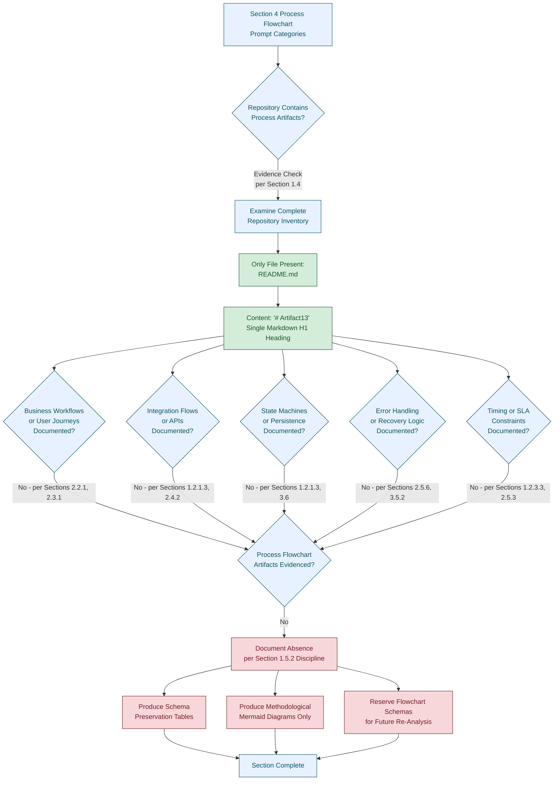

### 4.1.3 Section Prompt Alignment

The section prompt enumerates the following content requirements: **System Workflows** (core business processes, integration workflows), **Flowchart Requirements** (with validation rules), **Technical Implementation** (state management, error handling), and **Required Diagrams** (high-level system workflow, detailed process flows for each core feature, error handling flowcharts, integration sequence diagrams, state transition diagrams).

Each of these requirements presupposes the existence of underlying artifacts that the repository, as established in Section 1.4, does not contain. In conjunction with:

- The documentation posture established in Section 1.5.1 — under which *"every statement made about the artifact is derived from observable evidence within the repository";*
- The implication established in Section 1.5.2 — under which subsequent sections *"will document the absence of corresponding artifacts where applicable";*
- Constraint C-2-002 (Section 2.7.2) — which prohibits inference, extrapolation, or fabrication of content; and
- Constraint C-2-004 (Section 2.7.2) — which records that *"the repository declares no programming language, framework, runtime, architectural pattern, or deployment topology"*

— these principles compel this section to formally document the **absence** of all standard Process Flowchart artifacts, rather than to invent, infer, or extrapolate them.

### 4.1.4 Applicability of Standard Process Flowchart Categories

The following table provides a top-level applicability assessment for each of the standard categories enumerated in the section prompt. Each category is mapped to its evidentiary status in the repository and to the primary Section 1, Section 2, or Section 3 references that support the absence determination.

| Standard Category (per Prompt) | Applicability Status | Primary Evidence Reference |
|--------------------------------|----------------------|----------------------------|
| Core Business Processes (end-to-end user journeys, system interactions, decision points, error handling paths) | Not defined in repository | Section 1.1.3; Section 1.2.2.1; Section 2.2.1 |
| Integration Workflows (data flow, API interactions, event processing, batch processing) | Not defined in repository | Section 1.2.1.3; Section 2.4.2; Section 3.5 |
| Flowchart Element Requirements (start/end, process steps, decision diamonds, system boundaries, user touchpoints, error states, timing/SLA) | Not defined in repository | Section 1.2.2.2; Section 1.2.3; Section 2.5.3 |
| Validation Rules (business rules, data validation, authorization, compliance) | Not defined in repository | Section 2.3.5 |
| State Management (state transitions, data persistence, caching, transactions) | Not defined in repository | Section 1.2.1.3; Section 3.6 |
| Error Handling (retry, fallback, error notification, recovery) | Not defined in repository | Section 2.5.6; Section 3.5.2 |
| Required Mermaid Diagrams (high-level workflow, feature flows, error flowcharts, integration sequences, state transitions) | Cannot be produced from observable evidence | Section 2.2.1; Section 2.4.2; Section 3.6 |

Each of the subsequent subsections (4.2 through 4.5) documents the absence of the corresponding category, preserves the structural schema requested by the section prompt, and references the primary evidence supporting the absence determination.

---

## 4.2 SYSTEM WORKFLOWS STATUS

### 4.2.1 Core Business Processes Status

The repository declares **zero core business processes**. The prompt's required process-flow elements presuppose the existence of features, business domains, user roles, system capabilities, and external interactions — none of which are evidenced in the repository.

| Core Business Process Element | Required Content | Current Status |
|-------------------------------|------------------|----------------|
| End-to-end user journeys | User persona × scenario flow | No personas defined (Section 1.1.3); no user groups in scope (Section 1.3.1.3) |
| System interactions | Inter-component message flows | Zero components exist (Section 1.2.2.2) |
| Decision points | Conditional branches with business logic | No business domain declared (Section 1.2.1.1); no business rules (Section 2.3.5) |
| Error handling paths | Failure branches and recovery flows | No source code (Section 1.4.3); no error-handling artifacts |
| Process step inventory | Enumerated activities and tasks | Zero features declared (Section 2.2.1); zero functional requirements (Section 2.3.1) |
| Process owners and actors | Roles executing each step | No stakeholder identification (Section 1.1.3) |
| Process inputs | Triggering events or inputs | *"No inputs accepted"* (Section 2.3.4, citing Section 1.2.2.1) |
| Process outputs | Resulting deliverables or outputs | *"No outputs produced"* (Section 2.3.4, citing Section 1.2.2.1) |

Because no end-to-end user journeys exist, no business process flowchart can be produced. The schema above is reserved for population should the repository evolve to introduce features, personas, or business logic.

### 4.2.2 Integration Workflows Status

The repository declares **zero integration workflows**. Section 2.4.2 confirms that *"no integration points are declared in the repository"* and that Section 1.3.2.3 establishes *"all possible integration points are out-of-scope because none are declared."*

| Integration Workflow Element | Required Content | Current Status |
|------------------------------|------------------|----------------|
| Data flow between systems | Source → transformation → sink diagrams | No external systems declared (Section 1.2.1.3) |
| API interactions | Request/response sequences | No external APIs consumed; no services exposed (Section 1.2.1.3) |
| Event processing flows | Event producers, brokers, consumers | No message queues or event streams (Section 1.2.1.3) |
| Batch processing sequences | Scheduled job orchestration | No source code, no schedulers, no CI/CD (Section 1.4.3) |
| Protocol selection | REST / gRPC / GraphQL / messaging | No API definitions present (Section 1.4.3) |
| Integration error semantics | Timeout / circuit-breaker / DLQ behavior | No integrations to govern |
| Inter-system contracts | OpenAPI / Protobuf / AsyncAPI schemas | No schemas present (Section 1.4.3) |
| Third-party service touchpoints | External SaaS callouts | No third-party services declared (Section 3.5.1) |

Because no integration workflows exist, no integration sequence diagram can be produced. The schema above is reserved for population should the repository evolve to introduce external APIs, services, message brokers, or scheduled batch processes.

---

## 4.3 FLOWCHART REQUIREMENTS STATUS

### 4.3.1 Flowchart Element Status (Schema Preservation)

The Flowchart Requirements elements required by the section prompt cannot be populated. The schema is reproduced below with explicit `Not Applicable — No Process to Diagram` entries for traceability.

| Flowchart Element | Required Content | Current Status |
|-------------------|------------------|----------------|
| Start point | Initiating trigger or entry | Not applicable — no process to diagram |
| End point | Terminal state or output | Not applicable — no process to diagram |
| Process steps | Activities, tasks, computations | Not applicable — no features (Section 2.2.1) |
| Decision diamonds | Branch conditions | Not applicable — no business rules (Section 2.3.5) |
| System boundaries | Subsystem or service edges | Not applicable — zero components (Section 1.2.2.2) |
| User touchpoints | UI / CLI / API contact surfaces | Not applicable — no inputs/outputs (Sections 1.2.2.1, 2.3.4) |
| Error states | Identified failure modes | Not applicable — no source code (Section 1.4.3) |
| Recovery paths | Mitigation/retry branches | Not applicable — no error handling (Section 2.5.6) |
| Timing constraints | Per-step duration or deadline | Not applicable — no performance targets (Section 2.5.3) |
| SLA considerations | Service-level objectives | *"Not defined"* for SLOs and latency targets (Section 2.5.3) |
| Swim lanes (actors/systems) | Lanes per role/system | Not applicable — no actors or systems declared |

### 4.3.2 Validation Rules Status

Per Section 2.3.5, *"no business rules, data validation rules, security requirements, or compliance requirements are documented anywhere in the repository."* The validation-rule schema is reproduced here in the process-flowchart context for traceability.

| Validation Rule Element | Required Content | Current Status |
|-------------------------|------------------|----------------|
| Business rules at each step | Domain-specific logic gates | No business domain declared (Section 1.2.1.1); no rules (Section 2.3.5) |
| Data validation requirements | Schema-bound input/output checks | No schemas present (Section 1.4.3) |
| Authorization checkpoints | RBAC/ABAC gates at process steps | No authentication or authorization artifacts (Section 2.5.5) |
| Regulatory compliance checks | Regulatory mapping per step | No compliance artifacts (Section 2.3.5) |
| Cross-field validation | Conditional field-pair rules | Not applicable — no data model |
| Idempotency guarantees | Duplicate-suppression rules | Not applicable — no operations defined |
| Audit trail emission | Per-step logging requirements | No instrumentation declared (Section 2.5.6) |

Because no validation rules are documented, no decision-diamond logic, authorization checkpoint, or compliance verification can be encoded in any process flowchart.

---

## 4.4 TECHNICAL IMPLEMENTATION STATUS

### 4.4.1 State Management Status

The repository declares **zero state management artifacts**. No state machines, persistence layers, caches, or transaction boundaries are documented. Section 1.2.1.3 confirms the absence of *"database or persistence layer connections."* Section 3.6 documents the absence of databases and storage of any kind.

| State Management Element | Required Content | Current Status |
|--------------------------|------------------|----------------|
| State transitions | State graph with named states and triggers | No system behavior declared (Section 1.2.2.1) |
| Data persistence points | Write-to-store locations within a flow | No persistence layer (Section 1.2.1.3); no storage (Section 3.6) |
| Caching requirements | Cache hits/misses, TTL policies | No caching role declared (Section 3.6) |
| Transaction boundaries | Atomic units of work | No data artifacts (Section 1.3.1.3); no data protection design (Section 3.6.3) |
| Optimistic vs. pessimistic locking | Concurrency control strategy | No concurrency model declared |
| Eventual consistency windows | Read-after-write semantics | No distributed system declared |
| Compensating transactions | Saga steps and compensations | No business processes (Section 2.2.1) |
| Snapshot/checkpoint cadence | State persistence intervals | No runtime declared (Section 1.2.2.3) |

Because no state machine, persistence layer, cache, or transactional boundary is documented, **no state transition diagram can be produced** in conformance with the factual grounding discipline.

### 4.4.2 Error Handling Status

The repository declares **zero error handling mechanisms**. No retry policies, fallback strategies, notification channels, or recovery procedures are documented. Section 2.5.6 confirms the absence of operational runbooks, monitoring/instrumentation, backup/recovery procedures, and code ownership/governance artifacts.

| Error Handling Element | Required Content | Current Status |
|------------------------|------------------|----------------|
| Retry mechanisms | Retry policies (count, backoff, jitter) | No source code (Section 1.4.3); no runtime (Section 1.2.2.3) |
| Fallback processes | Degraded-mode alternatives | No services/libraries declared (Section 1.2.2.2) |
| Error notification flows | Alerting and on-call escalation | No integrations declared (Section 1.2.1.3) |
| Recovery procedures | Step-by-step restoration runbooks | *"None present"* (Section 2.5.6) |
| Circuit breaker logic | Failure-rate-based isolation | No service mesh or runtime declared |
| Dead-letter queue handling | Poison-message disposition | No event streams declared (Section 1.2.1.3) |
| Compensating action flow | Rollback after partial completion | No transactions declared |
| Error classification taxonomy | Transient vs. permanent vs. user errors | No error catalog documented |
| Observability hooks | Metric/log/trace emission on error | *"No metric/log/trace definitions"* (Section 2.5.6) |

Because no error handling logic, observability surface, or recovery runbook exists, **no error handling flowchart can be produced** in conformance with the factual grounding discipline.

---

## 4.5 REQUIRED DIAGRAMS STATUS

### 4.5.1 Diagram Inventory and Producibility

The section prompt requires five categories of Mermaid.js diagrams. The producibility of each is assessed below against observable evidence.

| Required Diagram | Producibility | Reason |
|------------------|---------------|--------|
| High-level system workflow | Not producible from observable evidence | No system behavior, components, or workflows declared (Sections 1.2.2.1, 1.2.2.2, 2.2.1) |
| Detailed process flows for each core feature | Not producible from observable evidence | Zero features declared (Section 2.2.1); no requirements (Section 2.3.1) |
| Error handling flowcharts | Not producible from observable evidence | Zero error handling logic, no source code, no runbooks (Sections 1.4.3, 2.5.6) |
| Integration sequence diagrams | Not producible from observable evidence | No integrations, APIs, services, or external systems (Sections 1.2.1.3, 2.4.2, 3.5.1) |
| State transition diagrams | Not producible from observable evidence | No state machines, persistence, or runtime (Sections 1.2.1.3, 1.2.2.3, 3.6) |

In conformance with Constraint C-2-002 (Section 2.7.2) — which prohibits inference, extrapolation, or fabrication — no fabricated system-behavior diagrams are produced in this section. Only methodological diagrams that depict the **process of evaluating absence** are honestly producible from observable evidence, following the precedents established in Sections 1.2.2.2, 2.1.2, and 3.1.2.

### 4.5.2 Methodological Diagrams (Producible from Observable Evidence)

#### 4.5.2.1 Repository State Diagram (Process Flowchart Context)

The following Mermaid diagram depicts the repository's actual structure alongside the categories of process-flowchart artifacts that are absent. This diagram extends the precedent established in Section 1.2.2.2 to the process-flowchart domain.

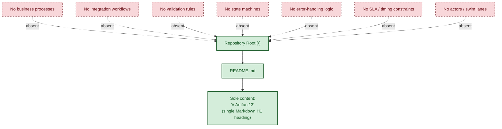

#### 4.5.2.2 Documentation State Transition Diagram

The following Mermaid state diagram depicts the only state transition that can be honestly described against observable evidence: the transition of this section between **Absence Documentation** and **Active Documentation** states upon repository evolution. This is the documentation lifecycle of Section 4 itself, not the runtime state of any software system (no such system exists).

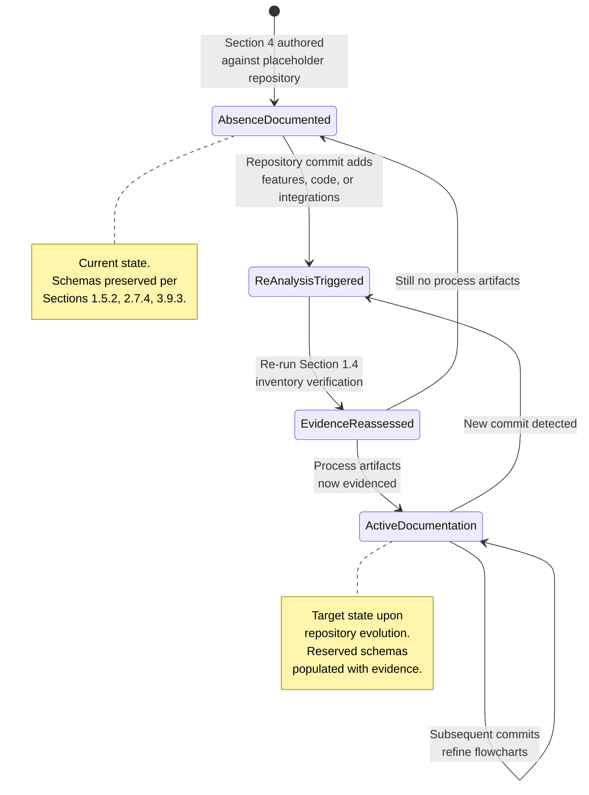

#### 4.5.2.3 Re-Analysis Decision Flow

The following Mermaid flowchart depicts the methodological process for re-analyzing Section 4 should the repository evolve. It does not depict any system workflow — it depicts the documentation-maintenance workflow that governs this specification.

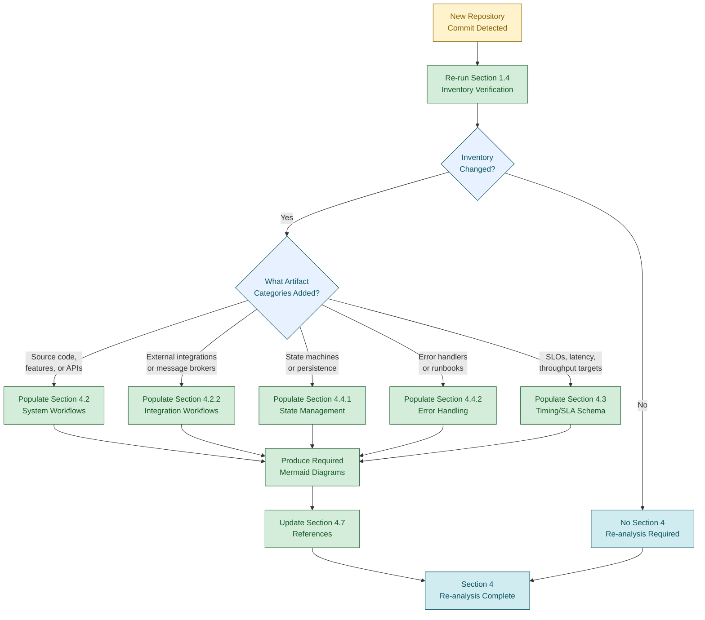

---

## 4.6 ASSUMPTIONS, CONSTRAINTS, AND FORWARD RE-ANALYSIS GUIDANCE

### 4.6.1 Documented Assumptions

The following assumptions govern the construction of this section. Each is consistent with the assumptions enumerated in Sections 2.7.1 and 3.9.1 and is restated here in the process-flowchart context.

| Assumption ID | Assumption Statement |
|---------------|----------------------|
| A-4-001 | Only the contents of `README.md` and the absence of all other repository artifacts are observable as process-flow-related evidence. |
| A-4-002 | The repository inventory captured in Section 1.4 is the authoritative basis for the absence determinations in this section. |
| A-4-003 | No external repositories, design documents, BPMN diagrams, ticket systems, or organizational process catalogs exist within the scope of this specification (consistent with A-2-003, Section 2.7.1). |
| A-4-004 | No `.blitzyignore` file or equivalent exclusion mechanism has filtered any workflow, business-process, integration, or state-machine artifact out of the inventory (consistent with A-2-004, Section 2.7.1, and A-3-003, Section 3.9.1). |
| A-4-005 | The required-diagram categories enumerated in the section prompt (high-level system workflow, detailed process flows, error handling flowcharts, integration sequence diagrams, state transition diagrams) are reference inputs only and do not constitute observable repository evidence (analogous to A-3-004, Section 3.9.1). |

### 4.6.2 Documented Constraints

The following constraints bound this section. Each is either inherited from Sections 2.7.2 and 3.9.2 or specific to the Process Flowchart domain.

| Constraint ID | Constraint Statement | Source Reference |
|---------------|----------------------|------------------|
| C-4-001 | No source code, executable artifacts, or process-flow specifications exist within the repository. | Section 1.4.1; Section 1.4.3 |
| C-4-002 | The strict factual grounding discipline prohibits inference, extrapolation, or fabrication of process-flow content (inherited). | Section 1.5.1; inherited from C-2-002, C-3-002 |
| C-4-003 | The repository declares no programming language, framework, runtime, architectural pattern, or deployment topology against which a process flowchart could be anchored (inherited). | Section 1.2.2.3; inherited from C-2-004, C-3-003 |
| C-4-004 | Zero features (Section 2.2.1) and zero functional requirements (Section 2.3.1) are declared; no process steps, decision diamonds, or system interactions can be enumerated against observable evidence. | Section 2.2.1; Section 2.3.1 |
| C-4-005 | Zero integration points are declared (Section 2.4.2); no integration sequence diagram or data-flow-between-systems diagram can be produced. | Section 1.2.1.3; Section 2.4.2 |
| C-4-006 | Zero persistence, caching, or transactional artifacts are declared (Sections 1.2.1.3, 3.6); no state transition diagram can be produced against observable evidence. | Section 1.2.1.3; Section 3.6 |
| C-4-007 | Zero error-handling, retry, fallback, or recovery artifacts are declared (Sections 2.5.6, 3.5.2); no error-handling flowchart can be produced. | Section 2.5.6; Section 3.5.2 |
| C-4-008 | Zero performance, throughput, latency, or SLO targets are defined (Section 2.5.3); no timing/SLA annotation can be applied to any process step. | Section 1.2.3.3; Section 2.5.3 |

### 4.6.3 Forward Re-Analysis Guidance

Should the repository evolve to include workflow definitions, business-process descriptions, integration manifests, state-machine code, error-handling logic, or any other process-related artifact, this section should be re-analyzed. The following structural elements are reserved for population at that time.

| Reserved Structural Element | Subsection |
|-----------------------------|------------|
| Core Business Processes schema (user journeys, system interactions, decision points, error paths) | Section 4.2.1 |
| Integration Workflows schema (data flow, API interactions, event processing, batch processing) | Section 4.2.2 |
| Flowchart Element schema (start/end, steps, diamonds, boundaries, touchpoints, errors, timing) | Section 4.3.1 |
| Validation Rules schema (business rules, data validation, authorization, compliance) | Section 4.3.2 |
| State Management schema (transitions, persistence, caching, transactions) | Section 4.4.1 |
| Error Handling schema (retry, fallback, notification, recovery) | Section 4.4.2 |
| Required Diagrams inventory (high-level workflow, feature flows, error flows, integration sequences, state transitions) | Section 4.5.1 |
| Swim-lane allocation per actor/system | Section 4.3.1 (subsumed) |
| Re-analysis decision flow (already populated as a methodological diagram in Section 4.5.2.3) | Section 4.5.2.3 |

The triggers for re-analysis follow the pattern established in Section 2.7.3 and Section 3.9.4: **any subsequent commit, addition, or restructuring of the repository** invalidates the current absence determinations and obligates a fresh evaluation. Specifically, the introduction of any of the following artifact classes should trigger immediate re-analysis of Section 4:

| Trigger Artifact Class | Section 4 Subsections Affected |
|------------------------|--------------------------------|
| Source code files in any language | 4.2.1, 4.3.1, 4.4.1, 4.4.2, 4.5.1 |
| API definitions (OpenAPI, GraphQL, Protobuf, AsyncAPI) | 4.2.2, 4.5.1 (integration sequences) |
| Database schemas or migration files | 4.4.1, 4.5.1 (state transitions) |
| Message broker or event-stream configuration | 4.2.2, 4.4.2 (DLQ handling) |
| CI/CD or batch-job orchestration definitions | 4.2.2 (batch processing) |
| Runbooks, alerting rules, or observability dashboards | 4.4.2, 4.5.1 (error flowcharts) |
| SLO, SLA, or performance budget declarations | 4.3.1 (timing constraints) |
| Business-process documentation (BPMN, narrative process docs, journey maps) | 4.2.1, 4.5.1 (high-level workflow) |

### 4.6.4 Specification Validity Window

Per Section 1.5.3, the findings documented here reflect the state of the repository at the time of analysis. The validity of this section is bounded as follows.

| Validity Dimension | Current State |
|--------------------|---------------|
| Specification basis | Single observation of `README.md` with content `# Artifact13` |
| Re-analysis trigger | Any subsequent commit, addition, or restructuring of the repository |
| Process flowchart baseline | v0 — no process flowcharts issued; only methodological diagrams produced |
| Required-diagram baseline | v0 — none of the five required diagram categories (high-level workflow, feature flows, error flowcharts, integration sequences, state transitions) is producible from observable evidence |
| Effective scope | The repository state at the time of analysis only |

---

## 4.7 REFERENCES

### 4.7.1 Files Examined

- `README.md` — The sole file present in the repository, containing exclusively the line `# Artifact13`. Used to verify the absence of any workflow definitions, business-process descriptions, integration manifests, state-machine code, error-handling logic, validation rules, SLA declarations, or process-related diagrams. The file summary confirms no imports, globals, classes, functions, executable content, or cross-references.

### 4.7.2 Folders Explored

- `/` (repository root, depth 0) — Confirmed to contain exactly one file (`README.md`) and zero subdirectories. Used to verify the absence of workflow directories (e.g., `workflows/`, `flows/`, `bpmn/`), state-machine directories (e.g., `state/`, `machines/`), integration directories (e.g., `integrations/`, `connectors/`, `adapters/`), event-handler directories (e.g., `events/`, `handlers/`, `subscribers/`), error-handling directories (e.g., `errors/`, `exceptions/`), runbook directories (e.g., `runbooks/`, `ops/`, `playbooks/`), API definition directories (e.g., `api/`, `openapi/`, `proto/`), and orchestration directories (e.g., `pipelines/`, `jobs/`, `cron/`).

### 4.7.3 Technical Specification Cross-References

- **Section 1.1 EXECUTIVE SUMMARY** — Establishes the pre-implementation placeholder state of the repository and confirms the absence of business problem, stakeholders, and value proposition that would otherwise anchor any business-process flowchart.
- **Section 1.2 SYSTEM OVERVIEW** — Provides the Primary System Capabilities determination (Section 1.2.2.1) — *"the artifact cannot accept input, produce output, perform computation, or interact with external systems"* — which forecloses any process flow against observable evidence. Provides the Major System Components determination (Section 1.2.2.2) — *"zero modules, zero packages, zero services, zero libraries, and zero subsystems"* — which forecloses any system-boundary or swim-lane allocation. Provides the Integration Concerns table (Section 1.2.1.3) confirming "None declared" for external APIs, services exposed, database connections, and message queues — directly relevant to the absence of integration workflows. Provides the KPI/SLO determination (Section 1.2.3.3) — directly relevant to the absence of timing/SLA annotations on process steps.
- **Section 1.3 SCOPE** — Establishes that all application functionality, system integrations, deployment automation, and data persistence concerns are out-of-scope; reinforces that no functional domains, data domains, or user groups are defined.
- **Section 1.4 REPOSITORY ARTIFACT INVENTORY** — Provides the complete file listing (Section 1.4.1) and the Absence Confirmations table (Section 1.4.3) explicitly enumerating the absence of source code, API definitions, database schemas, and all other artifacts that would underpin a process flowchart.
- **Section 1.5 DOCUMENTATION POSTURE** — Establishes the factual grounding discipline (Section 1.5.1) applied throughout this section and the explicit guidance (Section 1.5.2) that sections addressing data flow and operational procedures document absence where applicable. Establishes the specification validity window (Section 1.5.3) governing re-analysis.
- **Section 1.6 REFERENCES** — Documents the verification methodology and search operations used to establish the completeness of the repository inventory underlying the absence determinations in this section.
- **Section 2.1 SECTION OVERVIEW AND APPLICABILITY ASSESSMENT** — Provides the methodological applicability flowchart precedent (Section 2.1.2) replicated and extended in Section 4.1.2. Provides the structural template (Section 2.1.4) for the Applicability Assessment table used in Section 4.1.4.
- **Section 2.2 FEATURE CATALOG** — Confirms zero features declared (Section 2.2.1) — directly relevant to the absence of "detailed process flows for each core feature" required by the section prompt.
- **Section 2.3 FUNCTIONAL REQUIREMENTS TABLE** — Confirms zero functional requirements (Section 2.3.1) and zero validation rules (Section 2.3.5) including business rules, data validation, security requirements, and compliance requirements — directly relevant to the absence of decision diamonds, authorization checkpoints, and regulatory compliance checks in any process flowchart.
- **Section 2.4 FEATURE RELATIONSHIPS** — Confirms zero integration points (Section 2.4.2) and zero shared components/services (Section 2.4.3) — directly relevant to the absence of integration workflows and inter-component message flows.
- **Section 2.5 IMPLEMENTATION CONSIDERATIONS** — Provides the Performance Requirements table (Section 2.5.3) confirming "Not defined" for throughput targets, latency targets, resource utilization budgets, and SLOs — directly relevant to the absence of timing/SLA annotations. Provides the Security Implications table (Section 2.5.5) confirming absence of authentication and authorization artifacts — directly relevant to the absence of authorization checkpoints. Provides the Maintenance Requirements table (Section 2.5.6) confirming absence of operational runbooks, monitoring/instrumentation, backup/recovery procedures — directly relevant to the absence of error notification flows and recovery procedures.
- **Section 2.7 ASSUMPTIONS AND CONSTRAINTS** — Provides the assumption framework (A-2-001 through A-2-004) and constraint framework (C-2-001 through C-2-004) inherited by Section 4.6.1 and Section 4.6.2. Establishes the Forward Re-Analysis Guidance pattern (Section 2.7.4) replicated in Section 4.6.3.
- **Section 2.8 REFERENCES** — Provides the references template structure replicated in this Section 4.7.
- **Section 3.1 SECTION OVERVIEW AND APPLICABILITY ASSESSMENT** — Provides the second methodological applicability flowchart precedent (Section 3.1.2) reinforcing the construction of the Section 4.1.2 diagram.
- **Section 3.5 THIRD-PARTY SERVICES** — Confirms no third-party integrations (Section 3.5.1) and no cloud services (Section 3.5.3) — directly relevant to the absence of integration sequence diagrams and external touchpoints in any process flowchart.
- **Section 3.6 DATABASES AND STORAGE** — Confirms no databases, no caching, no persistence — directly relevant to the absence of state management, data persistence points, and transaction boundaries in any process flowchart.
- **Section 3.7 DEVELOPMENT AND DEPLOYMENT** — Confirms no development tooling, no CI/CD, no orchestration — directly relevant to the absence of batch processing sequences and deployment workflows.
- **Section 3.9 ASSUMPTIONS, CONSTRAINTS, AND FORWARD RE-ANALYSIS GUIDANCE** — Provides the assumption framework (A-3-001 through A-3-004) and constraint framework (C-3-001 through C-3-006) inherited by Section 4.6.1 and Section 4.6.2. Reinforces the Forward Re-Analysis Guidance pattern (Section 3.9.3) replicated in Section 4.6.3.
- **Section 3.10 REFERENCES** — Provides the references template structure replicated in this Section 4.7.

# 5. System Architecture

## 5.1 SECTION OVERVIEW AND APPLICABILITY ASSESSMENT

### 5.1.1 Purpose and Scope of This Section

This section addresses the System Architecture dimension of the **Artifact13** repository. Per the section prompt, its purpose is to document the system's high-level architecture, core components, data flows, external integration points, component-level details, technical decisions, and cross-cutting concerns (monitoring, logging, error handling, authentication, performance, and disaster recovery). The contents of this section are derived exclusively from observable evidence within the repository, in conformance with the factual grounding discipline established in Section 1.5.1 and consistently applied across Sections 2, 3, and 4.

The section prompt explicitly instructs the author to *"Only include sections and items that are actually relevant to this system, based on your analysis of its requirements"* and *"Don't add any items that aren't clearly applicable."* This section honors both instructions by preserving the structural schemas the prompt requires while explicitly documenting the absence of every concrete architectural element against the current repository state.

### 5.1.2 Repository State Determination

As established exhaustively in Sections 1.1.1, 1.3.1, 1.4.1, 2.1.2, 3.1.2, and 4.1.2, the repository exists in a **pre-implementation placeholder state**. Per Section 1.4.1, the complete repository contents consist of exactly one file — `README.md` — at the repository root, with zero subdirectories. Per Section 1.4.1, that file declares the project name `Artifact13` via a single H1 heading and contains no further content. Per Section 1.4.3, no source code, package manifests, build configurations, test files, API definitions, database schemas, front-end assets, environment configurations, or license files exist in the repository. Per Section 1.2.2.3, no programming language, framework, runtime, **architectural pattern**, build/packaging strategy, or **deployment topology** has been declared. Per Section 1.2.2.2, the repository contains zero modules, zero packages, zero services, zero libraries, and zero subsystems.

The following diagram summarizes the applicability evaluation flow for the standard System Architecture categories enumerated in the section prompt, against the current repository state. This diagram follows the methodological-diagram precedent established in Sections 2.1.2, 3.1.2, and 4.1.2.

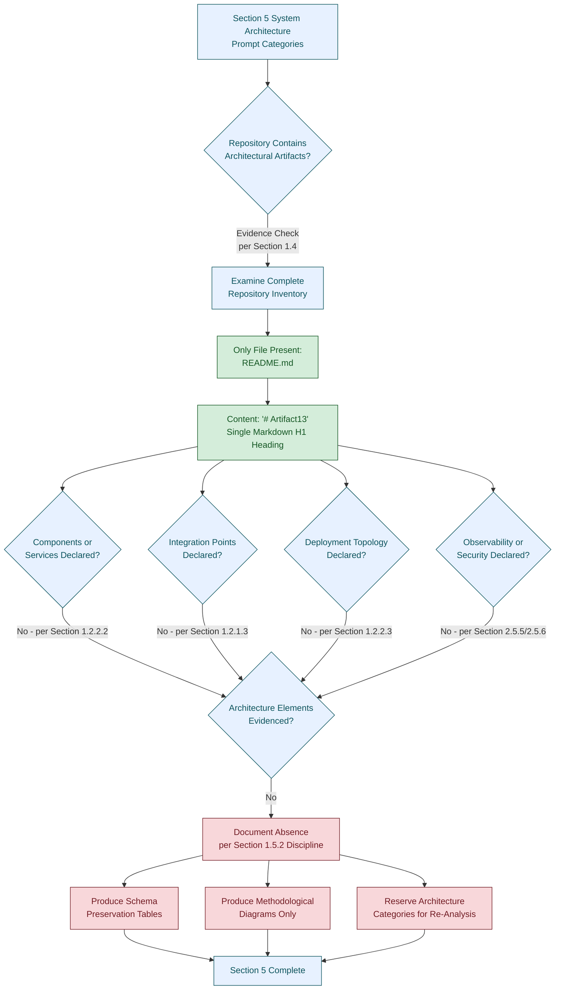

### 5.1.3 Section Prompt Alignment

The section prompt provides two governing principles that bound the construction of this section:

1. *"Only include sections and items that are actually relevant to this system, based on your analysis of its requirements."*
2. *"Don't add any items that aren't clearly applicable."*

In conjunction with the documentation posture established in Section 1.5.1 — under which *"every statement made about the artifact is derived from observable evidence within the repository"* — and the explicit directive in Section 1.5.2 that *"Sections addressing architecture, component design, data flow, deployment topology, and operational procedures will document the absence of corresponding artifacts where applicable"* — these principles compel this section to formally document the **absence** of all architectural elements, rather than invent, infer, or extrapolate them from defaults, conventions, or industry norms.

Additionally, the Default Technology Stack reserved in Section 3.8 (AWS, Docker, Terraform, GitHub Actions, Python, Flask, Auth0, MongoDB, Langchain, React with TypeScript, TailwindCSS, etc.) **may not be adopted** as a basis for architectural decisions in this section. Per Section 3.8.2, *"Adopting any element of the Default Technology Stack as an actual selection for the Artifact13 system would therefore violate the factual grounding discipline."* Constraint C-3-006 (Section 3.9.2) formally codifies this prohibition.

### 5.1.4 Applicability of Standard Architecture Categories

The following table provides a top-level applicability assessment for each of the four standard System Architecture categories enumerated in the section prompt. Each category is mapped to its evidentiary status in the repository and to the primary Section 1, 2, 3, or 4 references that support the absence determination.

| Standard Category (per Prompt) | Applicability Status | Primary Evidence Reference |
|--------------------------------|----------------------|----------------------------|
| High-Level Architecture | Not defined in repository | Section 1.2.2.2; Section 1.2.2.3 |
| Component Details | Not defined in repository | Section 1.2.2.2; Section 2.2.1 |
| Technical Decisions | Not defined in repository | Section 1.2.2.3; Section 3.8.2 |
| Cross-Cutting Concerns | Not defined in repository | Section 2.5.5; Section 2.5.6; Section 4.4.2 |

Each of the subsequent subsections (5.2 through 5.5) documents the absence of the corresponding category, preserves the structural schema requested by the section prompt, and references the primary evidence supporting the absence determination.

---

## 5.2 HIGH-LEVEL ARCHITECTURE STATUS

### 5.2.1 System Overview Status

#### 5.2.1.1 Architecture Style and Rationale

No architectural style has been declared, selected, or implemented within the repository. Per Section 1.2.2.3, the Architectural Pattern is documented as *"None — no service, module, or layer definitions."* Per Section 1.2.2.1, *"the artifact cannot accept input, produce output, perform computation, or interact with external systems."* Consequently, no rationale for an architectural style choice (e.g., monolith vs. microservices, layered vs. event-driven, hexagonal vs. CQRS) can be authored against observable evidence. Constraints C-2-002, C-3-002, and C-4-002 collectively prohibit inference, extrapolation, or fabrication of such content.

#### 5.2.1.2 Architectural Principles and Patterns

No architectural principles, patterns, design tactics, or quality attribute prioritizations are documented in the repository. The sole repository file (`README.md`) contains only the project name heading and no narrative establishing principles such as separation of concerns, single responsibility, loose coupling, or any other architectural axiom. Per Section 1.5.1, such principles cannot be inferred under the factual grounding discipline.

#### 5.2.1.3 System Boundaries and Major Interfaces

No system boundaries or major interfaces are declared. Per Section 1.2.1.3, the Integration Concerns table documents *"None declared"* across every integration dimension (external APIs consumed, services exposed externally, database or persistence layer connections, message queues, and event streams). Per Section 1.3.2.3, *"all possible integration points are out-of-scope because none are declared."*

The following methodological diagram restates the repository's actual structural state alongside the categories of architectural artifacts that are absent. This diagram extends the precedents established in Sections 1.2.2.2 and 4.5.2.1 to the System Architecture domain.

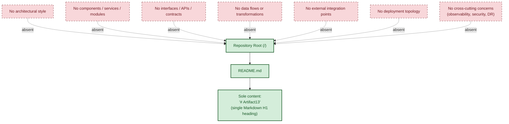

### 5.2.2 Core Components Status

The section prompt requires a Core Components table with columns *Component Name*, *Primary Responsibility*, *Key Dependencies*, *Integration Points*, and *Critical Considerations*. Per Section 1.2.2.2, the repository contains *"zero modules, zero packages, zero services, zero libraries, and zero subsystems."* Per Section 2.4.3, the Modules, Packages, Services, and Libraries counts are each zero. The following schema-preservation table records this absence for re-analysis purposes. (To respect the prompt's column-count limit, *Integration Points* and *Critical Considerations* are consolidated into a single column.)

| Component Name | Primary Responsibility | Key Dependencies | Integration Points / Critical Considerations |
|----------------|------------------------|------------------|----------------------------------------------|
| None declared | Not applicable — zero components exist (Section 1.2.2.2) | Not applicable — zero dependencies exist (Section 3.4.1) | Not applicable — zero integration points declared (Section 1.2.1.3) |

Because zero components exist, **no component interaction diagrams, no component state transition diagrams, and no component sequence diagrams** can be produced from observable evidence. This determination mirrors the producibility assessment in Section 4.5.1.

### 5.2.3 Data Flow Description Status

No data flows exist within the repository. Per Section 1.2.2.1, *"the artifact cannot accept input, produce output, perform computation, or interact with external systems."* Per Section 2.3.4, the repository declares *"No inputs accepted"* and *"No outputs produced."* Per Section 3.6.1, no databases, persistence layers, caching solutions, or storage services are declared.

| Data Flow Dimension (per Prompt) | Required Content | Current Status |
|----------------------------------|------------------|----------------|
| Primary data flows between components | Producer/consumer pairs, data payloads | No components exist (Section 1.2.2.2) |
| Integration patterns and protocols | Synchronous/asynchronous, REST/gRPC/messaging | No integrations declared (Section 1.2.1.3) |
| Data transformation points | ETL stages, schema mappings | No data artifacts declared (Section 1.3.1.3); no schemas (Section 1.4.3) |
| Key data stores and caches | Primary/secondary stores, cache layers | None declared (Section 3.6.1; Section 3.6.2) |

### 5.2.4 External Integration Points Status

The section prompt requires an External Integration Points table with columns *System Name*, *Integration Type*, *Data Exchange Pattern*, *Protocol/Format*, and *SLA Requirements*. Per Section 1.2.1.3, the repository declares *"None"* for external APIs consumed, services exposed externally, database or persistence layer connections, message queues, and event streams. Per Section 3.5.1, no third-party service integrations are declared. The following schema-preservation table records this absence. (To respect the prompt's column-count limit, *Protocol/Format* and *SLA Requirements* are consolidated into a single column.)

| System Name | Integration Type | Data Exchange Pattern | Protocol / Format / SLA |
|-------------|------------------|-----------------------|-------------------------|
| None declared | Not applicable (Section 1.2.1.3) | Not applicable (Section 2.4.2) | Not applicable — no SLA defined (Section 2.5.3) |

---

## 5.3 COMPONENT DETAILS STATUS

### 5.3.1 Component Catalogue Status

Per Section 1.2.2.2, the repository contains zero components of any kind. No major or minor components exist for which purpose, responsibilities, technologies, interfaces, persistence requirements, or scaling considerations can be specified. Per Section 2.2.1, zero features are declared; per Section 2.3.1, zero functional requirements are specified.

### 5.3.2 Schema Preservation Across Component Dimensions

The section prompt instructs the author to specify, for each major component, the following five dimensions: purpose and responsibilities, technologies and frameworks used, key interfaces and APIs, data persistence requirements, and scaling considerations. The schema is preserved below; no component rows can be populated from observable evidence.

| Component Dimension (per Prompt) | Required Content | Current Status |
|----------------------------------|------------------|----------------|
| Purpose and responsibilities | Narrative responsibility statement | Zero components (Section 1.2.2.2) |
| Technologies and frameworks used | Selected runtime, framework, library set | No language/framework declared (Sections 3.2.1, 3.3.1) |
| Key interfaces and APIs | API surface contracts | Zero APIs declared (Section 1.4.3 — no OpenAPI/GraphQL/Protobuf) |
| Data persistence requirements | Storage roles and engines | No persistence declared (Sections 3.6.1, 3.6.2) |
| Scaling considerations | Horizontal/vertical/sharding strategy | No scaling declared (Section 2.5.4) |

### 5.3.3 Required Component Diagrams Status

The section prompt requires three Mermaid.js diagram categories at the component level: detailed component interaction diagrams, state transition diagrams, and sequence diagrams for key flows. Each is assessed below against observable evidence, mirroring the producibility analysis established in Section 4.5.1.

| Required Diagram (per Prompt) | Producibility | Reason |
|-------------------------------|---------------|--------|
| Detailed component interaction diagrams | Not producible from observable evidence | Zero components declared (Section 1.2.2.2); no interactions to depict |
| State transition diagrams | Not producible from observable evidence | No state machines, persistence, or runtime (Section 4.4.1) |
| Sequence diagrams for key flows | Not producible from observable evidence | Zero features (Section 2.2.1); zero workflows (Section 4.2); no integration calls (Section 1.2.1.3) |

In conformance with Constraint C-2-002 (Section 2.7.2), no fabricated component-level diagrams are produced in this subsection. The methodological diagrams already published in Sections 1.2.2.2, 4.5.2.1, 4.5.2.2, and 4.5.2.3 — together with the architecture-context methodological diagram in Section 5.1.2 and the state diagram in Section 5.2.1.3 — constitute the complete set of honestly producible diagrams for the architecture domain at this time.

---

## 5.4 TECHNICAL DECISIONS STATUS

### 5.4.1 Architecture Style Decision Status

No architecture-style decision has been made or recorded within the repository. Per Section 1.2.2.3, the Architectural Pattern field is documented as *"None — no service, module, or layer definitions."* The following schema-preservation table records the absence of any decision payload across the canonical decision dimensions.

| Decision Dimension | Required Content | Current Status |
|--------------------|------------------|----------------|
| Style options considered | Monolithic, modular monolith, microservices, event-driven, hexagonal, etc. | No decision recorded (Section 1.2.2.3) |
| Selected style | Single chosen style with rationale | None — no architectural pattern declared (Section 1.2.2.3) |
| Tradeoffs accepted | Quality-attribute tradeoffs (e.g., latency vs. consistency) | No tradeoffs declared — no quality attributes defined (Section 2.5.3) |
| Evidence in repository | Source artifacts demonstrating the decision | Not present (Section 1.4.3) |

### 5.4.2 Communication Pattern Decision Status

No communication patterns are declared. Per Section 1.2.1.3, no message queues, event streams, external APIs, or services exposed externally are declared. The following schema-preservation table records the absence.

| Communication Pattern Dimension | Required Content | Current Status |
|---------------------------------|------------------|----------------|
| Synchronous vs. asynchronous | Selected paradigm and rationale | No runtime declared (Section 1.2.2.3) |
| Protocol family | REST, gRPC, GraphQL, AMQP, Kafka, etc. | No protocols declared (Section 1.2.1.3) |
| Message format | JSON, Protobuf, Avro, MessagePack | No formats declared (Section 1.4.3 — no schemas) |
| Delivery semantics | At-most-once, at-least-once, exactly-once | Not applicable — no messaging declared |

### 5.4.3 Data Storage Solution Decision Status

No data storage solution decision is recorded. Per Section 3.6.1, *"No database, persistence layer, caching solution, or storage service is declared within the Artifact13 repository."* Per Section 3.6.2, the storage schema rows are uniformly populated as *"None declared"* / *"Not applicable."*

| Storage Decision Dimension | Required Content | Current Status |
|----------------------------|------------------|----------------|
| Primary database engine | Engine selection and rationale | None declared (Section 3.6.1) |
| Secondary / analytical store | Engine selection and rationale | None declared (Section 3.6.2) |
| Object / blob storage | Engine selection and rationale | None declared (Section 3.6.2) |
| Consistency model | Strong, eventual, causal | Not applicable — no data plane declared |

### 5.4.4 Caching Strategy Decision Status

No caching strategy is declared. Per Section 3.6.2, the In-memory cache row is documented as *"None declared"* / *"Not applicable."* Per Section 4.4.1, *"Caching requirements"* are documented with *"No caching role declared (Section 3.6)."*

| Caching Decision Dimension | Required Content | Current Status |
|----------------------------|------------------|----------------|
| Cache tier topology | Local, distributed, edge | None declared (Section 3.6.2) |
| Invalidation strategy | TTL, write-through, write-behind, event-driven | Not applicable — no cache declared |
| Cache engine | Redis, Memcached, in-process, CDN | None declared (Section 3.6.2) |
| Cache key/value taxonomy | Key naming, value serialization | Not applicable — no data artifacts |

### 5.4.5 Security Mechanism Decision Status

No security mechanism decisions are recorded. Per Section 2.5.5, the repository contains no authentication artifacts, no authorization artifacts, no data protection design, and no threat model. Per Section 3.5.2, *"Authentication services"* are documented as *"None declared."* Per Section 4.3.2, *"No authentication or authorization artifacts"* exist.

| Security Decision Dimension | Required Content | Current Status |
|-----------------------------|------------------|----------------|
| Authentication mechanism | Selected approach (e.g., OIDC, mTLS, API keys) | None declared (Section 2.5.5) |
| Authorization model | RBAC, ABAC, ReBAC, policy engine | None declared (Section 2.5.5) |
| Data protection (rest / transit) | Encryption design, key management | None declared (Sections 2.5.5, 3.6.3) |
| Threat model | STRIDE / LINDDUN catalog | None documented (Section 2.5.5) |

### 5.4.6 Required Technical Decision Diagrams Status

The section prompt requires decision tree diagrams and Architecture Decision Records (ADRs) for the technical decision subsection. Each is assessed below against observable evidence.

| Required Diagram (per Prompt) | Producibility | Reason |
|-------------------------------|---------------|--------|
| Decision tree diagrams | Not producible from observable evidence | No decision points exist — zero architectural decisions are recorded (Section 5.4.1) |
| Architecture Decision Records (ADRs) | Not producible from observable evidence | No ADR documents are present in the repository (Section 1.4.1); no decisions to record |

The following methodological Mermaid diagram depicts the **process by which an ADR would be authored** once observable evidence becomes available. This is the documentation-authoring workflow that governs Section 5.4, not any system-level decision flow (no such system exists). The diagram extends the methodological-diagram precedents from Sections 3.1.2, 4.5.2.3, and 5.1.2.

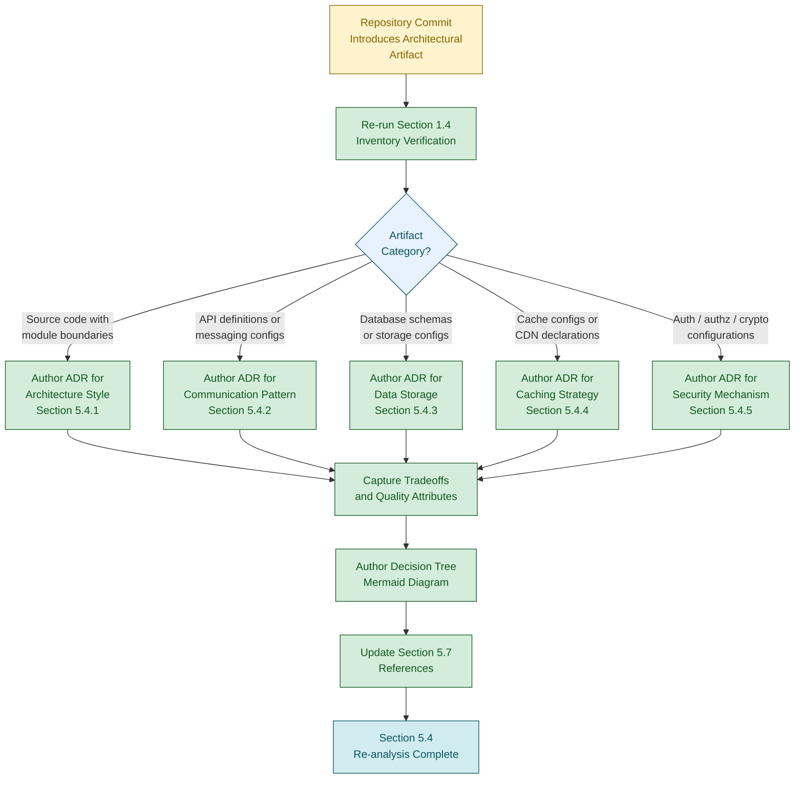

---

## 5.5 CROSS-CUTTING CONCERNS STATUS

### 5.5.1 Monitoring and Observability Status

No monitoring or observability artifacts exist in the repository. Per Section 1.2.3.3, *"No KPIs are defined within the repository. There are no monitoring artifacts, instrumentation definitions, service-level objectives, or metric specifications."* Per Section 2.5.6, the Monitoring and Instrumentation row documents *"None present."* Per Section 4.4.2, the Observability Hooks row documents *"No metric/log/trace definitions."*

| Observability Dimension | Required Content | Current Status |
|-------------------------|------------------|----------------|
| Metrics catalog | Counters, gauges, histograms with names and units | None present (Section 2.5.6) |
| Dashboards | Dashboard definitions / IDs | None present (Section 1.4.3) |
| Service-level objectives (SLOs) | Quantitative SLO targets | Not defined (Section 1.2.3.3) |
| Health-check endpoints | Liveness/readiness probe definitions | None declared (Section 1.2.1.3) |

### 5.5.2 Logging and Tracing Status

No logging or tracing strategy is declared. Per Section 2.5.6, no metric/log/trace definitions are present. Per Section 4.4.2, the repository has *"No observability surface"* against which to anchor a logging or tracing design.

| Logging / Tracing Dimension | Required Content | Current Status |
|-----------------------------|------------------|----------------|
| Structured log schema | JSON keys, severity taxonomy | None defined (Section 2.5.6) |
| Log aggregation target | ELK, Loki, Splunk, vendor SaaS | None declared (Section 3.5.1) |
| Distributed tracing standard | OpenTelemetry, Zipkin, Jaeger | None declared (Section 3.3.1) |
| Correlation ID propagation | Header / context conventions | Not applicable — no runtime (Section 1.2.2.3) |

### 5.5.3 Error Handling Pattern Status

No error handling patterns are declared. Per Section 4.4.2, *"The repository declares zero error handling mechanisms. No retry policies, fallback strategies, notification channels, or recovery procedures are documented."* Per Section 2.5.6, no operational runbooks, monitoring, backup/recovery procedures, or governance artifacts are present.

| Error Handling Dimension | Required Content | Current Status |
|--------------------------|------------------|----------------|
| Retry policies | Count, backoff, jitter parameters | None declared (Section 4.4.2) |
| Fallback strategies | Degraded-mode alternatives | None declared (Section 4.4.2) |
| Circuit breaker logic | Failure-rate-based isolation | None declared (Section 4.4.2) |
| Dead-letter queue handling | Poison-message disposition | None declared — no event streams (Section 1.2.1.3) |

The section prompt requires an Error Handling Flow diagram for this subsection. Per Section 4.5.1, error handling flowcharts are *"Not producible from observable evidence"* because zero error handling logic, no source code, and no runbooks exist. In conformance with Constraint C-4-007, no fabricated error-handling flowchart is produced here. The following methodological flowchart depicts the **process by which an error-handling flow would be re-analyzed** once observable evidence becomes available. It is the documentation-authoring workflow, not a runtime error path.

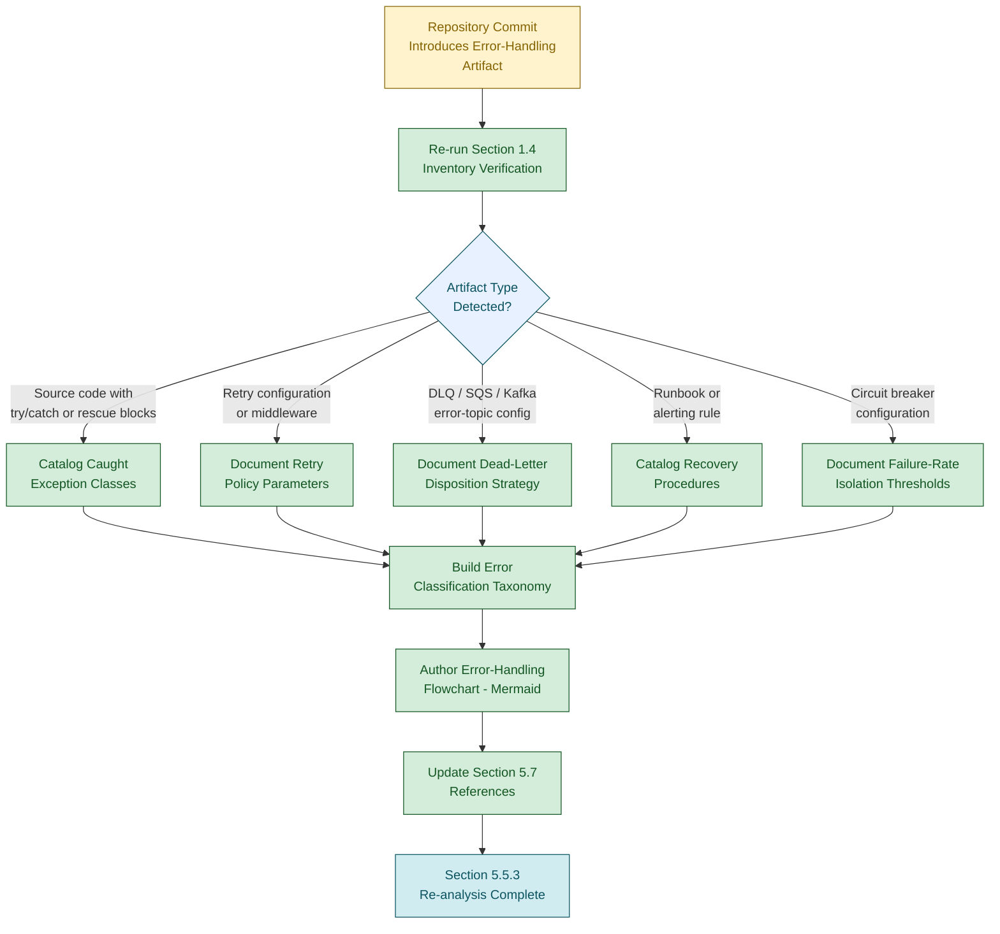

### 5.5.4 Authentication and Authorization Framework Status

No authentication or authorization framework is declared. Per Section 2.5.5, the Authentication Mechanisms row documents *"No authentication artifacts present"* and the Authorization Model row documents *"No authorization artifacts present."* Per Section 3.5.2, the Authentication Services row is documented as *"None declared."* Per Section 4.3.2, *"No authentication or authorization artifacts"* exist.

| Authn / Authz Dimension | Required Content | Current Status |
|-------------------------|------------------|----------------|
| Identity provider | OIDC issuer / IdP integration | None declared (Section 3.5.2) |
| Token format | JWT, opaque, SAML | None declared (Section 2.5.5) |
| Session management | Cookie, header, refresh-token model | None declared (Section 2.5.5) |
| Policy enforcement point | API gateway, sidecar, in-process | None declared — no runtime (Section 1.2.2.3) |

### 5.5.5 Performance Requirements and SLA Status

No performance requirements or service-level agreements are declared. Per Section 1.2.3.3, no KPIs or SLOs are defined. Per Section 2.5.3, the Throughput Targets, Latency Targets, Resource Utilization Targets, and Service-Level Objectives rows are each documented as *"Not defined."* Per Section 4.3.1 (timing constraints), SLA considerations are documented as *"Not defined."*

| Performance Dimension | Required Content | Current Status |
|-----------------------|------------------|----------------|
| Throughput targets | Requests per second / events per second | Not defined (Section 2.5.3) |
| Latency targets | p50 / p95 / p99 latency budgets | Not defined (Section 2.5.3) |
| Resource utilization budgets | CPU / memory / I/O ceilings | Not defined (Section 2.5.3) |
| Service-level objectives (SLOs) | Availability / latency SLOs and error budgets | Not defined (Section 1.2.3.3) |

### 5.5.6 Disaster Recovery Procedures Status

No disaster recovery procedures are declared. Per Section 2.5.6, the Backup and Recovery Procedures row documents *"None present."* No runbooks, RTO/RPO declarations, or failover designs exist in the repository.

| Disaster Recovery Dimension | Required Content | Current Status |
|-----------------------------|------------------|----------------|
| Backup strategy | Frequency, retention, storage tier | None present (Section 2.5.6) |
| Recovery time objective (RTO) | Quantitative time target | Not defined (Section 1.2.3.3) |
| Recovery point objective (RPO) | Quantitative data-loss tolerance | Not defined (Section 1.2.3.3) |
| Failover topology | Active-active, active-passive, pilot-light | Not declared — no topology (Section 1.2.2.3) |

### 5.5.7 Summary of Required Cross-Cutting Diagrams

| Required Diagram (per Prompt) | Producibility | Reason |
|-------------------------------|---------------|--------|
| Error handling flows | Not producible from observable evidence | Zero error-handling logic; addressed via methodological diagram in Section 5.5.3 |

---

## 5.6 ASSUMPTIONS, CONSTRAINTS, AND FORWARD RE-ANALYSIS GUIDANCE

### 5.6.1 Documented Assumptions

The following assumptions govern the construction of this section. Each is consistent with the assumptions enumerated in Sections 2.7.1, 3.9.1, and 4.6.1 and is restated here in the System Architecture context.

| Assumption ID | Assumption Statement |
|---------------|----------------------|
| A-5-001 | Only the contents of `README.md` and the absence of all other repository artifacts are observable as architecture-related evidence. |
| A-5-002 | The repository inventory captured in Section 1.4 is the authoritative basis for the absence determinations in this section. |
| A-5-003 | No external repositories, design documents, C4 models, architecture decision records, deployment diagrams, or runbooks exist within the scope of this specification (consistent with A-2-003, A-3-003, A-4-003). |
| A-5-004 | No `.blitzyignore` file or equivalent exclusion mechanism has filtered any architecture, component, integration, deployment, or operational artifact out of the inventory (consistent with A-2-004, A-3-003, A-4-004). |
| A-5-005 | The required-diagram categories enumerated in the section prompt (component interaction, state transition, sequence, decision tree, ADR, error-handling flow) are reference inputs only and do not constitute observable repository evidence (analogous to A-3-004, A-4-005). |
| A-5-006 | The Default Technology Stack catalogued in Section 3.8.1 is reserved for future re-analysis and does not constitute an architectural commitment within the scope of this specification. |

### 5.6.2 Documented Constraints

The following constraints bound this section. Each is either inherited from Sections 2.7.2, 3.9.2, and 4.6.2 or specific to the System Architecture domain.

| Constraint ID | Constraint Statement | Source Reference |
|---------------|----------------------|------------------|
| C-5-001 | No source code, executable artifacts, or architectural specification artifacts exist within the repository. | Section 1.4.1; Section 1.4.3 |
| C-5-002 | The strict factual grounding discipline prohibits inference, extrapolation, or fabrication of architectural content (inherited). | Section 1.5.1; inherited from C-2-002, C-3-002, C-4-002 |
| C-5-003 | The repository declares no programming language, framework, runtime, architectural pattern, or deployment topology against which architectural elements could be anchored (inherited). | Section 1.2.2.3; inherited from C-2-004, C-3-003, C-4-003 |
| C-5-004 | Zero components, modules, packages, services, or libraries are declared; no component table can be populated against observable evidence. | Section 1.2.2.2; Section 2.4.3 |
| C-5-005 | Zero integration points, external APIs, message queues, or event streams are declared; no External Integration Points table or sequence diagram can be populated against observable evidence (inherited from C-4-005). | Section 1.2.1.3; Section 2.4.2 |
| C-5-006 | Zero persistence, caching, or storage artifacts are declared; no data flow, data storage decision, or caching strategy can be authored against observable evidence (inherited from C-4-006). | Section 3.6.1; Section 3.6.2 |
| C-5-007 | Zero error handling, retry, fallback, or recovery artifacts are declared; no error-handling flowchart can be produced against observable evidence (inherited from C-4-007). | Section 2.5.6; Section 4.4.2 |
| C-5-008 | Zero performance, throughput, latency, or SLO targets are defined; no performance SLA can be anchored to observable evidence (inherited from C-4-008). | Section 1.2.3.3; Section 2.5.3 |
| C-5-009 | Zero authentication, authorization, encryption, or threat-model artifacts are declared; no security mechanism selection can be justified against observable evidence. | Section 2.5.5; Section 3.5.2; Section 4.3.2 |
| C-5-010 | The Default Technology Stack provided by the section prompt may not be adopted as a basis for architectural decisions (inherited from C-3-006). | Section 3.8.2; Section 3.9.2 |
| C-5-011 | No fabricated system-behavior Mermaid diagrams (component interaction, state transition, sequence, decision tree, ADR, error-handling) may be produced; only methodological diagrams depicting the documentation-authoring process are honestly producible. | Section 4.5.1; Section 4.5.2 |

### 5.6.3 Forward Re-Analysis Guidance

Should the repository evolve to include architectural specifications, source code with discernible component boundaries, deployment manifests, API definitions, persistence configurations, observability instrumentation, security configurations, or operational runbooks, this section should be re-analyzed. The following structural elements are reserved for population at that time.

| Reserved Structural Element | Subsection |
|-----------------------------|------------|
| High-level architecture overview (style, principles, boundaries) | Section 5.2.1 |
| Core Components schema (name, responsibility, dependencies, integration, considerations) | Section 5.2.2 |
| Data Flow Description (producer/consumer pairs, transformations, stores) | Section 5.2.3 |
| External Integration Points schema (system, type, exchange pattern, protocol/SLA) | Section 5.2.4 |
| Component Details schema (purpose, technologies, interfaces, persistence, scaling) | Section 5.3.2 |
| Component interaction, state transition, and sequence diagrams | Section 5.3.3 |
| Architecture style decision payload and tradeoffs | Section 5.4.1 |
| Communication pattern decision payload | Section 5.4.2 |
| Data storage decision payload and rationale | Section 5.4.3 |
| Caching strategy decision payload | Section 5.4.4 |
| Security mechanism decision payload | Section 5.4.5 |
| Decision tree diagrams and Architecture Decision Records (ADRs) | Section 5.4.6 |
| Monitoring and observability catalog | Section 5.5.1 |
| Logging and tracing strategy | Section 5.5.2 |
| Error handling pattern catalog and error-handling flowchart | Section 5.5.3 |
| Authentication and authorization framework | Section 5.5.4 |
| Performance requirements and SLA catalog | Section 5.5.5 |
| Disaster recovery procedures and RTO/RPO declarations | Section 5.5.6 |

The triggers for re-analysis follow the pattern established in Sections 2.7.3, 3.9.4, and 4.6.3: **any subsequent commit, addition, or restructuring of the repository** invalidates the current absence determinations and obligates a fresh evaluation. Specifically, the introduction of any of the following artifact classes should trigger immediate re-analysis of Section 5.

| Trigger Artifact Class | Section 5 Subsections Affected |
|------------------------|--------------------------------|
| Source code files with discernible module/service boundaries | 5.2.1, 5.2.2, 5.3.1, 5.3.2, 5.4.1 |
| API definitions (OpenAPI, GraphQL, Protobuf, AsyncAPI) | 5.2.3, 5.2.4, 5.3.2, 5.4.2 |
| Database schemas, ORM models, or migration files | 5.2.3, 5.3.2, 5.4.3, 5.5.6 |
| Cache configurations (Redis, Memcached, CDN) | 5.4.4 |
| Message broker or event-stream configuration | 5.2.4, 5.4.2, 5.5.3 (DLQ handling) |
| Container, IaC, or deployment manifests | 5.2.1, 5.3.2, 5.5.6 (failover topology) |
| Authentication / authorization / cryptographic configurations | 5.4.5, 5.5.4 |
| Observability configuration (metrics, logs, traces, dashboards) | 5.5.1, 5.5.2 |
| Runbooks, alerting rules, or SLO declarations | 5.5.3, 5.5.5, 5.5.6 |
| Architecture Decision Records or design documents | 5.4.1 – 5.4.6 |

### 5.6.4 Specification Validity Window

Per Section 1.5.3, the findings documented here reflect the state of the repository at the time of analysis. The validity of this section is bounded as follows.

| Validity Dimension | Current State |
|--------------------|---------------|
| Specification basis | Single observation of `README.md` with content `# Artifact13` |
| Re-analysis trigger | Any subsequent commit, addition, or restructuring of the repository |
| Architecture baseline | v0 — no architecture issued; only methodological diagrams produced |
| Required-diagram baseline | v0 — none of the required diagram categories (component interaction, state transition, sequence, decision tree, ADR, error-handling) is producible from observable evidence |
| Effective scope | The repository state at the time of analysis only |

---

## 5.7 REFERENCES

### 5.7.1 Files Examined

- `README.md` — Sole repository file containing only the line `# Artifact13`; confirmed to contain no imports, classes, functions, components, configurations, or executable content of any architectural relevance. Source of the absence determinations underpinning Sections 5.2 through 5.5.

### 5.7.2 Folders Explored

- `/` (repository root, depth 0) — Confirmed to contain exactly one file (`README.md`) and zero subdirectories. Verified via root folder enumeration consistent with Section 1.4.2.

### 5.7.3 Verification Activities

| Verification Action | Result Obtained |
|---------------------|-----------------|
| Root folder enumeration (per Section 1.4.2) | Exactly one child file (`README.md`); zero subdirectories |
| Direct file content read (per Section 1.4.2) | Single heading line `# Artifact13` confirmed |
| Semantic search for architecture / configuration / deployment | Empty result sets (per Section 1.4.2) |
| Semantic search for source code / services / components | Empty result sets (per Section 1.4.2) |
| Semantic search for persistence / cache / storage | Empty result sets (per Section 1.4.2; corroborates Section 3.6.1) |

### 5.7.4 Technical Specification Cross-References

| Cross-Referenced Section | Relevance to Section 5 |
|--------------------------|------------------------|
| Section 1.1 EXECUTIVE SUMMARY | Established pre-implementation placeholder state |
| Section 1.2 SYSTEM OVERVIEW | Provided Technical Concerns and Integration Concerns tables; established zero components, no language/framework/architecture/topology |
| Section 1.3 SCOPE | Established that all functionality, integrations, deployment, and persistence are out-of-scope |
| Section 1.4 REPOSITORY ARTIFACT INVENTORY | Provided complete file listing and exhaustive absence confirmations |
| Section 1.5 DOCUMENTATION POSTURE | Established factual grounding discipline (1.5.1) and explicit directive that architecture sections document absence (1.5.2) |
| Section 2.2 FEATURE CATALOG | Confirmed zero features declared |
| Section 2.3 FUNCTIONAL REQUIREMENTS TABLE | Confirmed zero functional requirements, zero inputs, zero outputs |
| Section 2.4 FEATURE RELATIONSHIPS | Confirmed zero integration points, zero shared components |
| Section 2.5 IMPLEMENTATION CONSIDERATIONS | Provided absence of performance, scalability, security, and maintenance artifacts |
| Section 2.7 ASSUMPTIONS AND CONSTRAINTS | Source of inherited constraints C-2-001 through C-2-004 |
| Section 3.1 SECTION OVERVIEW | Provided methodological-diagram precedent for applicability evaluation |
| Section 3.2 PROGRAMMING LANGUAGES | Confirmed no programming language declared |
| Section 3.3 FRAMEWORKS AND LIBRARIES | Confirmed no framework or library declared |
| Section 3.5 THIRD-PARTY SERVICES | Confirmed no third-party services, no authentication service integration |
| Section 3.6 DATABASES AND STORAGE | Confirmed no database, persistence, cache, or storage declared |
| Section 3.7 DEVELOPMENT AND DEPLOYMENT | Confirmed no dev tooling, build, container, IaC, or CI/CD |
| Section 3.8 DEFAULT TECHNOLOGY STACK RESERVATION | Established that Default Technology Stack is NOT adopted |
| Section 3.9 ASSUMPTIONS, CONSTRAINTS | Source of inherited constraints C-3-002, C-3-003, C-3-006 |
| Section 4.2 SYSTEM WORKFLOWS STATUS | Confirmed zero business processes, zero integration workflows |
| Section 4.3 FLOWCHART REQUIREMENTS STATUS | Confirmed all flowchart elements N/A, including SLA considerations |
| Section 4.4 TECHNICAL IMPLEMENTATION STATUS | Confirmed zero state management (4.4.1), zero error handling (4.4.2) |
| Section 4.5 REQUIRED DIAGRAMS STATUS | Established that only methodological diagrams are producible; precedent for diagrams in Sections 5.1.2, 5.2.1.3, 5.4.6, and 5.5.3 |
| Section 4.6 ASSUMPTIONS, CONSTRAINTS | Source of inherited constraints C-4-002, C-4-003, C-4-005 through C-4-008 |

---

# 6. SYSTEM COMPONENTS DESIGN

## 6.1 Core Services Architecture

### 6.1.1 Applicability Determination

#### 6.1.1.1 Section Prompt Escape Clause Recognition

The section prompt for Core Services Architecture provides an explicit escape clause: *"If the system does not require microservices, distributed architecture, or distinct service components, clearly state 'Core Services Architecture is not applicable for this system' and explain why."* This provision exists precisely to prevent the fabrication of service-architecture content for systems that contain no service components, no distributed runtime, and no inter-service communication surface against which such patterns could be anchored.

In conjunction with the documentation posture established in Section 1.5.1 — under which *"every statement made about the artifact is derived from observable evidence within the repository"* — and the explicit directive in Section 1.5.2 that *"Sections addressing architecture, component design, data flow, deployment topology, and operational procedures will document the absence of corresponding artifacts where applicable"* — this escape clause is the governing path for this section against the current repository state.

#### 6.1.1.2 Repository State Determination

The **Artifact13** repository exists in a pre-implementation placeholder state, as established exhaustively across Sections 1.1.1, 1.3.1, 1.4.1, 2.1.2, 3.1.2, 4.1.2, and 5.1.2. Per Section 1.4.1, the complete repository contents consist of exactly one file — `README.md` — at the repository root, with zero subdirectories. That file declares the project name `Artifact13` via a single H1 heading and contains no further content. Per Section 1.4.3, no source code, package manifests, build configurations, test files, API definitions, database schemas, front-end assets, or environment configurations exist.

The categorical absences directly relevant to Core Services Architecture are summarized below:

| Evidentiary Dimension | Repository State | Source Reference |
|-----------------------|------------------|------------------|
| Service components / modules / libraries | Zero declared | Section 1.2.2.2 |
| Architectural pattern (service, layer, or module definitions) | None declared | Section 1.2.2.3 |
| Integration points (APIs, queues, event streams, persistence) | None declared | Section 1.2.1.3 |
| Deployment topology / runtime / infrastructure | None declared | Section 1.2.2.3 |

#### 6.1.1.3 Formal Statement of Non-Applicability

**Core Services Architecture is not applicable for this system.**

The Artifact13 repository contains no microservices, no distributed runtime, no service mesh, no inter-service communication channels, no service discovery surface, no load balancer or proxy configuration, no scalability artifacts, and no resilience patterns. There is therefore no observable basis on which to author service boundaries, communication patterns, discovery mechanisms, load balancing strategies, circuit breakers, retry/fallback mechanisms, scaling approaches, auto-scaling triggers, resource allocation models, capacity plans, fault tolerance mechanisms, disaster recovery procedures, data redundancy approaches, failover configurations, or service degradation policies.

The remainder of this section formally records the rationale for this determination, preserves the schemas required by the section prompt for re-analysis purposes, documents the producibility status of the required diagrams, and provides forward re-analysis guidance keyed to the artifact classes whose introduction would warrant a fresh evaluation.

---

### 6.1.2 Rationale for Non-Applicability

The determination above rests on five independent and mutually reinforcing evidentiary bases, each grounded in a primary cross-reference to earlier sections of this specification.

#### 6.1.2.1 Absence of Service Components

Per Section 1.2.2.2, *"the repository contains zero modules, zero packages, zero services, zero libraries, and zero subsystems."* Per the same subsection, *"the directory structure consists exclusively of the repository root containing a single Markdown file, with no subdirectories of any depth."* Per Section 5.2.2, *"zero components, modules, packages, services, or libraries are declared; no component table can be populated against observable evidence."* The first and most fundamental prerequisite of a Core Services Architecture — the existence of services — is therefore absent.

#### 6.1.2.2 Absence of Architectural Pattern

Per Section 1.2.2.3, the Architectural Pattern is documented as *"None — no service, module, or layer definitions."* Per Section 5.2.1.1, *"no architectural style has been declared, selected, or implemented within the repository,"* and *"no rationale for an architectural style choice (e.g., monolith vs. microservices, layered vs. event-driven, hexagonal vs. CQRS) can be authored against observable evidence."* No service-oriented, event-driven, microservices, or mesh-based pattern is observable.

#### 6.1.2.3 Absence of Integration Points

Per Section 1.2.1.3, the Integration Concerns table documents *"None declared"* across every relevant dimension:

| Integration Concern | Repository State | Implication for Section 6.1 |
|---------------------|------------------|-----------------------------|
| External APIs consumed | None declared | No outbound inter-service communication surface |
| Services exposed externally | None declared | No inbound service contract or boundary |
| Database or persistence layer connections | None declared | No data-tier integration to coordinate |
| Message queues or event streams | None declared | No asynchronous or event-based pathway |

Per Section 5.2.4, *"no External Integration Points table or sequence diagram can be populated against observable evidence."*

#### 6.1.2.4 Absence of Deployment Topology

Per Section 1.2.2.3, Deployment Topology is documented as *"None — no infrastructure or deployment artifacts."* Per Section 2.5.4, no horizontal scaling strategy, vertical scaling strategy, data partitioning, or load balancing strategy can be declared because *"no architecture declared"* and *"no deployment topology"* exist. Per Section 5.5.6, *"no runbooks, RTO/RPO declarations, or failover designs exist in the repository."*

#### 6.1.2.5 Prohibition on Default Stack Adoption

Per Section 3.8.2, *"Adopting any element of the Default Technology Stack as an actual selection for the Artifact13 system would therefore violate the factual grounding discipline."* The Default Technology Stack reservation (AWS, Docker, Kubernetes-style orchestration, container registries, managed databases, identity providers, observability vendors, etc.) is therefore unavailable as a fallback basis for fabricating service-architecture content. Constraint C-3-006 (Section 3.9.2) and constraint C-5-010 (Section 5.6.2) formally codify this prohibition and are inherited here as constraint C-6-009.

---

### 6.1.3 Service Components Status (Schema Preservation)

The section prompt enumerates six required Service Components topics. Each is documented below with its required content and current status, preserving the structural schema for re-analysis. Per the prompt's output-format guidance, all tables in this section are constrained to no more than four columns.

#### 6.1.3.1 Service Boundaries and Responsibilities

Per Section 1.2.2.2, zero services exist; therefore, no service boundaries can be drawn and no service responsibilities can be enumerated. Per Section 5.2.2, *"no component interaction diagrams, no component state transition diagrams, and no component sequence diagrams can be produced from observable evidence."*

| Service Boundary Element | Required Content | Current Status |
|--------------------------|------------------|----------------|
| Service identity / name | Logical service name | Not applicable — zero services (Section 1.2.2.2) |
| Bounded context | Domain ownership statement | Not applicable — no domain model (Section 2.2.1) |
| Primary responsibility | Single-purpose responsibility statement | Not applicable — zero capabilities (Section 1.2.2.1) |
| Public interface surface | Exposed API / contract | Not applicable — no APIs (Section 1.2.1.3) |

#### 6.1.3.2 Inter-Service Communication Patterns

Per Section 1.2.1.3, no external APIs, services, message queues, or event streams are declared. Per Section 5.2.3, no producer/consumer pairs, integration patterns, or data transformation points are documented. No synchronous (REST, gRPC, GraphQL) or asynchronous (message broker, event stream) inter-service communication surface exists.

| Communication Pattern Dimension | Required Content | Current Status |
|---------------------------------|------------------|----------------|
| Synchronous protocols | REST / gRPC / GraphQL contracts | Not applicable — no APIs (Section 1.2.1.3) |
| Asynchronous messaging | Topics, queues, exchanges | Not applicable — no event streams (Section 1.2.1.3) |
| Serialization format | JSON / Protobuf / Avro | Not applicable — no payloads (Section 5.2.3) |
| Idempotency / ordering guarantees | Delivery semantics | Not applicable — no runtime (Section 1.2.2.3) |

#### 6.1.3.3 Service Discovery Mechanisms

Per Section 1.2.2.3, no runtime, framework, or deployment topology is declared. Per Section 3.5.1, no third-party service integrations exist. Service discovery (DNS-based, registry-based, sidecar-based, or mesh-based) presupposes both a runtime and a multi-instance service population, neither of which is present.

| Service Discovery Dimension | Required Content | Current Status |
|-----------------------------|------------------|----------------|
| Discovery model | Client-side / server-side / mesh | Not applicable — no runtime (Section 1.2.2.3) |
| Registry technology | DNS / Consul / Eureka / mesh control plane | Not applicable — no infrastructure (Section 3.7) |
| Health-check semantics | Liveness / readiness probes | None declared (Section 5.5.1) |
| Endpoint propagation | DNS TTL / push notifications | Not applicable — no endpoints (Section 1.2.1.3) |

#### 6.1.3.4 Load Balancing Strategy

Per Section 2.5.4, the Load Balancing Strategy row is documented as *"No topology declared (Section 1.2.2.3)."* Per Section 5.2.1.3, *"no system boundaries or major interfaces are declared."* No load balancing layer — application-level (L7) or transport-level (L4) — is observable.

| Load Balancing Dimension | Required Content | Current Status |
|--------------------------|------------------|----------------|
| Algorithm | Round-robin / least-connection / hash-based | Not applicable — no topology (Section 2.5.4) |
| Layer | L4 transport vs. L7 application | Not applicable — no runtime (Section 1.2.2.3) |
| Session affinity | Sticky-session policy | Not applicable — no sessions (Section 5.5.4) |
| Health-based ejection | Outlier-detection thresholds | Not applicable — no health surface (Section 5.5.1) |

#### 6.1.3.5 Circuit Breaker Patterns

Per Section 4.4.2, *"the repository declares zero error handling mechanisms,"* and the Circuit Breaker Logic row is documented as *"No service mesh or runtime declared."* Per Section 5.5.3, the Circuit Breaker Logic row is documented as *"None declared (Section 4.4.2)."*

| Circuit Breaker Dimension | Required Content | Current Status |
|---------------------------|------------------|----------------|
| Failure-rate threshold | Percentage trigger | None declared (Section 4.4.2) |
| Open-state duration | Time window before half-open | None declared (Section 4.4.2) |
| Half-open probe policy | Number / cadence of trial requests | None declared (Section 4.4.2) |
| Fallback target | Degraded response / cached value | None declared (Section 5.5.3) |

#### 6.1.3.6 Retry and Fallback Mechanisms

Per Section 4.4.2, the Retry Mechanisms row is documented as *"No source code (Section 1.4.3); no runtime (Section 1.2.2.3),"* and the Fallback Processes row is documented as *"No services/libraries declared (Section 1.2.2.2)."* Per Section 5.5.3, *"no retry policies, fallback strategies, notification channels, or recovery procedures are documented."*

| Retry / Fallback Dimension | Required Content | Current Status |
|----------------------------|------------------|----------------|
| Retry count | Maximum attempt count | None declared (Section 4.4.2) |
| Backoff schedule | Linear / exponential / decorrelated jitter | None declared (Section 4.4.2) |
| Idempotency requirement | Idempotency key strategy | Not applicable — no operations (Section 1.2.2.1) |
| Fallback response | Cached / static / degraded payload | None declared (Section 5.5.3) |

---

### 6.1.4 Scalability Design Status (Schema Preservation)

The section prompt enumerates five required Scalability Design topics. Each is documented below with the structural schema preserved for re-analysis.

#### 6.1.4.1 Horizontal and Vertical Scaling Approach

Per Section 2.5.4, both the Horizontal Scaling Strategy row and the Vertical Scaling Strategy row are documented as *"No architecture declared (Section 1.2.2.3)"* and *"No deployment topology (Section 1.2.2.3)"* respectively. Per Section 1.2.2.1, *"the artifact cannot accept input, produce output, perform computation, or interact with external systems"* — there is no workload to scale.

| Scaling Approach Dimension | Required Content | Current Status |
|----------------------------|------------------|----------------|
| Horizontal scaling unit | Stateless replica / shard | Not applicable — no architecture (Section 2.5.4) |
| Vertical scaling unit | CPU / memory / I/O class | Not applicable — no runtime (Section 1.2.2.3) |
| Stateful vs. stateless segmentation | Sticky vs. share-nothing | Not applicable — no state (Section 4.4.1) |
| Workload partitioning model | Sharding key / hashing strategy | Not applicable — no persistence (Section 3.6) |

#### 6.1.4.2 Auto-Scaling Triggers and Rules

Per Section 1.2.3.3, *"no KPIs are defined within the repository. There are no monitoring artifacts, instrumentation definitions, service-level objectives, or metric specifications."* Per Section 5.5.5, no throughput, latency, resource utilization, or SLO targets are defined. Auto-scaling presupposes both a runtime control plane (absent per Section 1.2.2.3) and quantitative metrics (absent per Section 1.2.3.3), neither of which exists.

| Auto-Scaling Trigger Dimension | Required Content | Current Status |
|--------------------------------|------------------|----------------|
| Metric source | CPU / memory / RPS / queue depth | Not applicable — no metrics (Section 1.2.3.3) |
| Scale-out threshold | Trigger value and dwell time | Not applicable — no SLOs (Section 5.5.5) |
| Scale-in threshold | Trigger value and cool-down | Not applicable — no SLOs (Section 5.5.5) |
| Min / max replica bounds | Floor and ceiling counts | Not applicable — no topology (Section 1.2.2.3) |

#### 6.1.4.3 Resource Allocation Strategy

Per Section 1.2.2.3, no runtime or deployment topology is declared. Per Section 3.7, no development or deployment tooling, no container manifests, no infrastructure-as-code, and no CI/CD definitions exist. Resource allocation (requests, limits, quotas, priorities) presupposes a scheduler or orchestrator against which to express such allocations — none is present.

| Resource Allocation Dimension | Required Content | Current Status |
|-------------------------------|------------------|----------------|
| Compute request / limit | CPU / memory units per replica | Not applicable — no runtime (Section 1.2.2.3) |
| Storage request | Persistent volume sizing | Not applicable — no persistence (Section 3.6) |
| Network / bandwidth budget | Egress / ingress allowance | Not applicable — no topology (Section 1.2.2.3) |
| Scheduler priority / class | QoS / preemption policy | Not applicable — no scheduler (Section 3.7) |

#### 6.1.4.4 Performance Optimization Techniques

Per Section 2.5.3, the Throughput Targets, Latency Targets, Resource Utilization Targets, and Service-Level Objectives rows are each documented as *"Not defined."* Per Section 5.5.5, *"no performance requirements or service-level agreements are declared."* Without targets to optimize toward and without source code to optimize, no performance optimization techniques are observable.

| Optimization Technique Dimension | Required Content | Current Status |
|----------------------------------|------------------|----------------|
| Caching layer | In-process / distributed / CDN | Not applicable — no caching (Section 4.4.1) |
| Connection pooling | Pool sizing and lifetime | Not applicable — no integrations (Section 1.2.1.3) |
| Asynchronous processing | Background / queue offload | Not applicable — no event streams (Section 1.2.1.3) |
| Algorithmic / data-structure choice | Computational complexity targets | Not applicable — no source code (Section 1.4.3) |

#### 6.1.4.5 Capacity Planning Guidelines

Per Section 1.2.3.3, no KPIs, monitoring artifacts, or service-level objectives are defined. Per Section 5.5.5, no quantitative performance targets exist. Capacity planning presupposes baseline demand forecasts and quantitative performance budgets, neither of which is documented.

| Capacity Planning Dimension | Required Content | Current Status |
|-----------------------------|------------------|----------------|
| Baseline demand forecast | Requests / events per unit time | Not applicable — no KPIs (Section 1.2.3.3) |
| Peak / burst multiplier | Headroom factor | Not applicable — no SLOs (Section 5.5.5) |
| Growth projection | Quarterly / annual trajectory | Not applicable — no objectives (Section 1.2.3.1) |
| Cost / unit budget | Cost-per-request envelope | Not applicable — no infrastructure (Section 3.7) |

---

### 6.1.5 Resilience Patterns Status (Schema Preservation)

The section prompt enumerates five required Resilience Patterns topics. Each is documented below with the structural schema preserved for re-analysis.

#### 6.1.5.1 Fault Tolerance Mechanisms

Per Section 4.4.2, *"the repository declares zero error handling mechanisms. No retry policies, fallback strategies, notification channels, or recovery procedures are documented."* Per Section 5.5.3, retry policies, fallback strategies, circuit breaker logic, and dead-letter queue handling are each documented as "None declared." Fault tolerance presupposes both an executing surface (absent per Section 1.2.2.3) and explicit failure-handling artifacts (absent per Section 4.4.2).

| Fault Tolerance Dimension | Required Content | Current Status |
|---------------------------|------------------|----------------|
| Bulkhead isolation | Thread / connection pool partitioning | Not applicable — no runtime (Section 1.2.2.3) |
| Timeout policy | Per-call / per-route deadline | None declared (Section 4.4.2) |
| Idempotent operation design | Replay-safe semantics | Not applicable — no operations (Section 1.2.2.1) |
| Graceful shutdown / drain | Signal-handling protocol | Not applicable — no runtime (Section 1.2.2.3) |

#### 6.1.5.2 Disaster Recovery Procedures

Per Section 5.5.6, *"no disaster recovery procedures are declared,"* and the Backup Strategy, RTO, RPO, and Failover Topology rows are each documented as "None present" or "Not defined." Per Section 2.5.6, the Backup and Recovery Procedures row is documented as *"None present."*

| Disaster Recovery Dimension | Required Content | Current Status |
|-----------------------------|------------------|----------------|
| Backup strategy | Frequency / retention / storage tier | None present (Section 2.5.6) |
| Recovery time objective (RTO) | Quantitative time target | Not defined (Section 5.5.6) |
| Recovery point objective (RPO) | Quantitative data-loss tolerance | Not defined (Section 5.5.6) |
| Disaster simulation cadence | Game-day frequency | Not applicable — no runbooks (Section 2.5.6) |

#### 6.1.5.3 Data Redundancy Approach

Per Section 3.6.1 and Section 5.2.3, no databases, persistence layers, caching solutions, or storage services are declared. Per Section 1.2.1.3, no database or persistence-layer connections exist. Without a data tier, no redundancy scheme — synchronous replication, asynchronous replication, multi-region replication, erasure coding, or cross-zone replicas — is observable.

| Data Redundancy Dimension | Required Content | Current Status |
|---------------------------|------------------|----------------|
| Replication topology | Primary-replica / multi-primary / leaderless | Not applicable — no persistence (Section 3.6) |
| Consistency model | Strong / eventual / bounded staleness | Not applicable — no data tier (Section 5.2.3) |
| Geographic redundancy | Multi-region / multi-AZ posture | Not applicable — no topology (Section 1.2.2.3) |
| Object / backup durability target | Durability nines (e.g., 11-nines) | Not applicable — no storage (Section 3.6) |

#### 6.1.5.4 Failover Configurations

Per Section 5.5.6, the Failover Topology row is documented as *"Not declared — no topology (Section 1.2.2.3)."* Failover configurations (active-active, active-passive, pilot-light, warm standby) presuppose a deployed topology against which to map primary and secondary roles — none exists.

| Failover Configuration Dimension | Required Content | Current Status |
|----------------------------------|------------------|----------------|
| Failover model | Active-active / active-passive / pilot-light | Not declared (Section 5.5.6) |
| Detection mechanism | Health-check / heartbeat / consensus | Not applicable — no health surface (Section 5.5.1) |
| Failover trigger threshold | Consecutive failure count / latency budget | Not applicable — no SLOs (Section 5.5.5) |
| State / data handoff | Replicated journal / shared storage | Not applicable — no persistence (Section 3.6) |

#### 6.1.5.5 Service Degradation Policies

Per Section 1.2.2.2, zero services exist. Per Section 5.5.3, fallback strategies are documented as "None declared." Service degradation policies (degraded-mode responses, feature-flag-driven shedding, load shedding, graceful capability reduction) presuppose both a service population and a runtime that can selectively withhold or reduce capability — neither is present.

| Degradation Policy Dimension | Required Content | Current Status |
|------------------------------|------------------|----------------|
| Degraded-mode response | Cached / static / partial payload | None declared (Section 5.5.3) |
| Load-shedding policy | Rate-limit / queue-drop / 429 / 503 | Not applicable — no runtime (Section 1.2.2.3) |
| Feature-flag fallback | Flag-driven capability disable | Not applicable — no feature catalog (Section 2.2.1) |
| Priority preservation | Tier-based request triage | Not applicable — no services (Section 1.2.2.2) |

---

### 6.1.6 Required Diagrams Producibility Assessment

The section prompt requires three categories of Mermaid.js diagrams: service interaction diagrams, scalability architecture, and resilience pattern implementations. Per Section 5.6.2 constraint C-5-011, *"no fabricated system-behavior Mermaid diagrams (component interaction, state transition, sequence, decision tree, ADR, error-handling) may be produced; only methodological diagrams depicting the documentation-authoring process are honestly producible."* This constraint extends naturally to the diagram categories required by this section.

#### 6.1.6.1 Producibility Summary

| Required Diagram | Producibility | Reason |
|------------------|---------------|--------|
| Service interaction diagrams | Not producible from observable evidence | Zero services exist (Section 1.2.2.2); no integration points (Section 1.2.1.3) |
| Scalability architecture | Not producible from observable evidence | No deployment topology (Section 1.2.2.3); no scaling strategy (Section 2.5.4) |
| Resilience pattern implementations | Not producible from observable evidence | Zero resilience artifacts (Section 4.4.2; Section 5.5.3) |

#### 6.1.6.2 Honest Diagram: Applicability Evaluation Flow

In conformance with the methodological-diagram precedent established in Sections 2.1.2, 3.1.2, 4.1.2, 5.1.2, and 5.5.3, the following diagram depicts the **applicability evaluation flow** by which the non-applicability determination was reached for Section 6.1. This is a documentation-authoring process diagram, not a fabricated runtime service-architecture diagram.

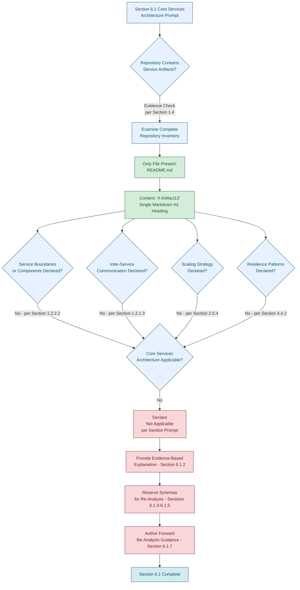

#### 6.1.6.3 Honest Diagram: Repository State vs. Required Service-Architecture Categories

The following diagram restates the repository's actual structural state alongside the categories of service-architecture artifacts that would be required to populate Section 6.1. This diagram extends the precedent established in Sections 1.2.2.2 and 5.2.1.3 to the Core Services Architecture domain.

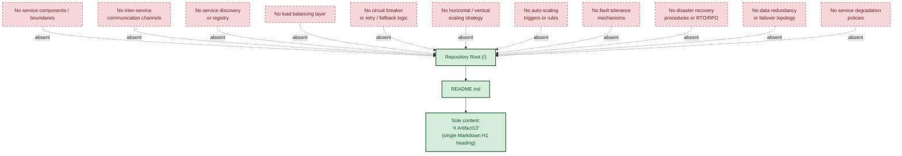

#### 6.1.6.4 Honest Diagram: Re-Analysis Workflow Upon Repository Evolution

The following methodological diagram depicts the **process by which Section 6.1 would be re-authored** once observable service-architecture evidence becomes available in the repository. It is the documentation-authoring workflow, not a runtime service topology. This pattern follows the precedent established in Section 5.5.3.

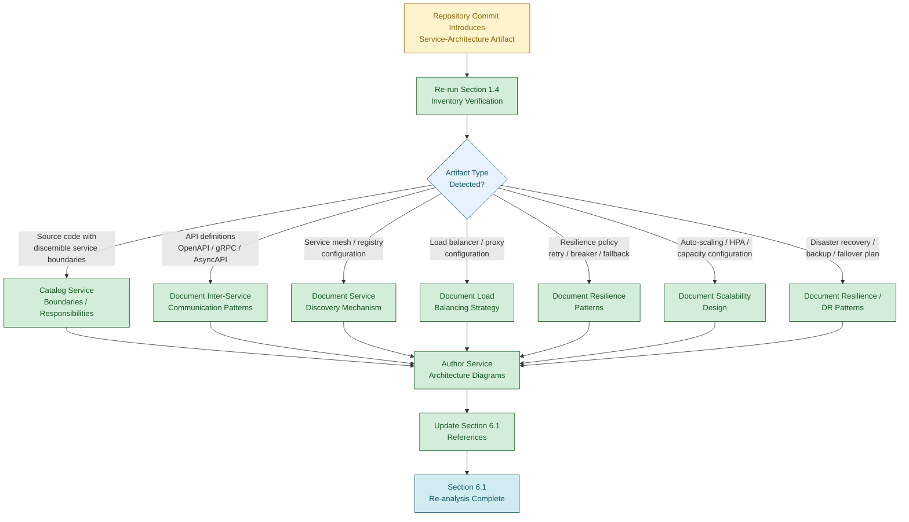

---

### 6.1.7 Assumptions, Constraints, and Forward Re-Analysis Guidance

#### 6.1.7.1 Documented Assumptions

The following assumptions govern the construction of this section. Each is consistent with the assumptions enumerated in Sections 2.7.1, 3.9.1, 4.6.1, and 5.6.1 and is restated here in the Core Services Architecture context.

| Assumption ID | Assumption Statement |
|---------------|----------------------|
| A-6-001 | Only the contents of `README.md` and the absence of all other repository artifacts are observable as service-architecture-related evidence. |
| A-6-002 | The repository inventory captured in Section 1.4 is the authoritative basis for the absence determinations in this section. |
| A-6-003 | No external repositories, service mesh configurations, registry catalogs, deployment manifests, or runbooks exist within the scope of this specification (consistent with A-5-003). |
| A-6-004 | No `.blitzyignore` file or equivalent exclusion mechanism has filtered any service component, integration, deployment, or operational artifact out of the inventory (consistent with A-5-004). |
| A-6-005 | The required-diagram categories enumerated in the section prompt (service interaction, scalability architecture, resilience pattern implementations) are reference inputs only and do not constitute observable repository evidence (consistent with A-5-005). |
| A-6-006 | The Default Technology Stack catalogued in Section 3.8.1 is reserved for future re-analysis and does not constitute a service-architecture commitment within the scope of this specification (consistent with A-5-006). |

#### 6.1.7.2 Documented Constraints

The following constraints bound this section. Each is either inherited from Sections 2.7.2, 3.9.2, 4.6.2, and 5.6.2 or specific to the Core Services Architecture domain.

| Constraint ID | Constraint Statement | Source Reference |
|---------------|----------------------|------------------|
| C-6-001 | No service components, service boundaries, or service responsibilities exist within the repository; no Service Components table can be populated against observable evidence. | Section 1.2.2.2; Section 5.2.2 |
| C-6-002 | No inter-service communication mechanisms (synchronous APIs, asynchronous messaging, event streams) can be documented against observable evidence. | Section 1.2.1.3; Section 5.2.3 |
| C-6-003 | No service discovery, load balancing, circuit breaker, retry, or fallback mechanisms can be documented against observable evidence. | Section 4.4.2; Section 5.5.3 |
| C-6-004 | No horizontal or vertical scaling approach, auto-scaling triggers, resource allocation strategy, performance optimization techniques, or capacity planning guidelines can be documented against observable evidence. | Section 2.5.3; Section 2.5.4; Section 5.5.5 |
| C-6-005 | No fault tolerance, disaster recovery, data redundancy, failover configuration, or service degradation policy can be documented against observable evidence. | Section 4.4.2; Section 5.5.6 |
| C-6-006 | Service interaction diagrams, scalability architecture diagrams, and resilience pattern implementation diagrams cannot be produced from observable evidence; only methodological diagrams depicting the documentation-authoring process are honestly producible (inherited from C-5-011). | Section 4.5.1; Section 5.6.2 |
| C-6-007 | The strict factual grounding discipline prohibits inference, extrapolation, or fabrication of service-architecture content (inherited from C-2-002, C-3-002, C-4-002, C-5-002). | Section 1.5.1; Section 5.6.2 |
| C-6-008 | The repository declares no programming language, framework, runtime, architectural pattern, or deployment topology against which service-architecture elements could be anchored (inherited from C-2-004, C-5-003). | Section 1.2.2.3; Section 5.6.2 |
| C-6-009 | The Default Technology Stack provided by the section prompt may not be adopted as a basis for service-architecture decisions (inherited from C-3-006, C-5-010). | Section 3.8.2; Section 3.9.2 |

#### 6.1.7.3 Forward Re-Analysis Guidance

Should the repository evolve to include service-architecture specifications, source code with discernible service boundaries, deployment manifests, API definitions, service mesh configurations, observability instrumentation, scaling configurations, or resilience policies, this section should be re-analyzed in its entirety. The following structural elements are reserved for population at that time.

| Reserved Structural Element | Subsection |
|-----------------------------|------------|
| Service boundaries and responsibilities catalog | Section 6.1.3.1 |
| Inter-service communication pattern catalog | Section 6.1.3.2 |
| Service discovery mechanism specification | Section 6.1.3.3 |
| Load balancing strategy specification | Section 6.1.3.4 |
| Circuit breaker pattern specification | Section 6.1.3.5 |
| Retry and fallback mechanism specification | Section 6.1.3.6 |
| Horizontal and vertical scaling approach | Section 6.1.4.1 |
| Auto-scaling triggers and rules | Section 6.1.4.2 |
| Resource allocation strategy | Section 6.1.4.3 |
| Performance optimization techniques | Section 6.1.4.4 |
| Capacity planning guidelines | Section 6.1.4.5 |
| Fault tolerance mechanism catalog | Section 6.1.5.1 |
| Disaster recovery procedures and RTO/RPO declarations | Section 6.1.5.2 |
| Data redundancy approach | Section 6.1.5.3 |
| Failover configuration specification | Section 6.1.5.4 |
| Service degradation policy specification | Section 6.1.5.5 |
| Service interaction diagrams, scalability architecture, resilience pattern diagrams | Section 6.1.6 |

The triggers for re-analysis follow the pattern established in Sections 2.7.3, 3.9.4, 4.6.3, and 5.6.3: **any subsequent commit, addition, or restructuring of the repository** invalidates the current absence determinations and obligates a fresh evaluation. Specifically, the introduction of any of the following artifact classes should trigger immediate re-analysis of Section 6.1.

| Trigger Artifact Class | Section 6.1 Subsections Affected |
|------------------------|----------------------------------|
| Source code files with discernible service or module boundaries | 6.1.3.1, 6.1.3.2 |
| API definitions (OpenAPI, GraphQL, Protobuf, AsyncAPI) | 6.1.3.1, 6.1.3.2 |
| Service mesh, sidecar, or service-registry configurations | 6.1.3.3, 6.1.3.4 |
| Load balancer, ingress controller, or reverse-proxy configurations | 6.1.3.4 |
| Resilience policy declarations (retry, circuit breaker, fallback, timeout) | 6.1.3.5, 6.1.3.6, 6.1.5.1 |
| Container, IaC, orchestration, or deployment manifests | 6.1.4.1, 6.1.4.3, 6.1.5.4 |
| Auto-scaling configurations (HPA, VPA, scaling rules) | 6.1.4.1, 6.1.4.2 |
| SLO declarations, performance budgets, or capacity plans | 6.1.4.4, 6.1.4.5 |
| Backup, recovery, RTO/RPO, or DR runbook artifacts | 6.1.5.2, 6.1.5.4 |
| Multi-region / multi-AZ replication or redundancy declarations | 6.1.5.3, 6.1.5.4 |
| Feature-flag, load-shedding, or degraded-mode policy configurations | 6.1.5.5 |

#### 6.1.7.4 Specification Validity Window

Per Section 1.5.3, the findings documented here reflect the state of the repository at the time of analysis. The validity of this section is bounded as follows.

| Validity Dimension | Current State |
|--------------------|---------------|
| Specification basis | Single observation of `README.md` with content `# Artifact13` |
| Re-analysis trigger | Any subsequent commit, addition, or restructuring of the repository |
| Service-architecture baseline | v0 — no service architecture issued; only methodological diagrams produced |
| Required-diagram baseline | v0 — none of the required diagram categories (service interaction, scalability architecture, resilience pattern implementations) is producible from observable evidence |
| Effective scope | The repository state at the time of analysis only |

---

### 6.1.8 References

#### 6.1.8.1 Files Examined

- `/README.md` — Confirmed sole repository file; contains only the single-line H1 heading `# Artifact13`; provides direct evidence of the repository's pre-implementation placeholder state and the absence of any service component, communication channel, scaling artifact, or resilience pattern.

#### 6.1.8.2 Folders Explored

- `/` (repository root, depth 0) — Confirmed to contain exactly one file (`README.md`) and zero subdirectories; provides authoritative scope boundary for all absence determinations in this section.

#### 6.1.8.3 Cross-Referenced Technical Specification Sections

- **Section 1.1 EXECUTIVE SUMMARY** — Established pre-implementation placeholder state and absence of business/stakeholder context.
- **Section 1.2 SYSTEM OVERVIEW** — Provided detailed evidence of zero components (1.2.2.2), no architectural pattern or deployment topology (1.2.2.3), no integration points (1.2.1.3), no capabilities (1.2.2.1), and no KPIs/SLOs (1.2.3.3).
- **Section 1.3 SCOPE** — Established all functionality, integrations, deployment, and persistence are out-of-scope.
- **Section 1.4 REPOSITORY ARTIFACT INVENTORY** — Provided the authoritative complete file listing and exhaustive absence confirmations.
- **Section 1.5 DOCUMENTATION POSTURE** — Established the factual grounding discipline (1.5.1) and the explicit directive that architecture sections document absence (1.5.2).
- **Section 2.1 SECTION OVERVIEW AND APPLICABILITY ASSESSMENT** — Provided methodological diagram precedent for applicability evaluation.
- **Section 2.2 FEATURE CATALOG** — Confirmed zero features declared.
- **Section 2.5 IMPLEMENTATION CONSIDERATIONS** — Provided absence of performance (2.5.3), scalability (2.5.4), security (2.5.5), and maintenance (2.5.6) artifacts.
- **Section 2.7 ASSUMPTIONS AND CONSTRAINTS** — Source of inherited constraints C-2-002, C-2-004.
- **Section 3.5 THIRD-PARTY SERVICES** — Confirmed no third-party service integrations declared.
- **Section 3.6 DATABASES AND STORAGE** — Confirmed no database, persistence, cache, or storage declared.
- **Section 3.7 DEVELOPMENT AND DEPLOYMENT** — Confirmed no development tooling, build configuration, container manifests, IaC, or CI/CD artifacts.
- **Section 3.8 DEFAULT TECHNOLOGY STACK RESERVATION** — Established that the Default Technology Stack is NOT adopted (inherited as C-6-009).
- **Section 3.9 ASSUMPTIONS, CONSTRAINTS, AND FORWARD RE-ANALYSIS GUIDANCE** — Source of inherited constraints C-3-002, C-3-006.
- **Section 4.4 TECHNICAL IMPLEMENTATION STATUS** — Confirmed zero state management (4.4.1) and zero error handling artifacts (4.4.2).
- **Section 4.5 REQUIRED DIAGRAMS STATUS** — Established that only methodological diagrams are honestly producible.
- **Section 4.6 ASSUMPTIONS, CONSTRAINTS** — Source of inherited constraints C-4-002, C-4-005, C-4-007, C-4-008.
- **Section 5.1 SECTION OVERVIEW AND APPLICABILITY ASSESSMENT** — Direct structural precedent for this section.
- **Section 5.2 HIGH-LEVEL ARCHITECTURE STATUS** — Direct precedent for schema preservation tables and the repository-state-versus-absent-artifacts methodological diagram.
- **Section 5.5 CROSS-CUTTING CONCERNS STATUS** — Direct precedent for resilience, performance, and disaster recovery absence documentation; precedent for the re-analysis workflow methodological diagram (5.5.3).
- **Section 5.6 ASSUMPTIONS, CONSTRAINTS, AND FORWARD RE-ANALYSIS GUIDANCE** — Source of inherited constraints C-5-002, C-5-003, C-5-010, C-5-011 and direct precedent for the structure of Section 6.1.7.

## 6.2 Database Design

### 6.2.1 Applicability Determination

#### 6.2.1.1 Section Prompt Escape Clause Recognition

The section prompt for Database Design provides an explicit escape clause: *"If the system does not require or direct database or persistent storage interactions are not clearly evident, clearly state 'Database Design is not applicable to this system' and explain why."* This provision exists precisely to prevent the fabrication of schema, indexing, replication, partitioning, caching, migration, retention, privacy, and performance-tuning content for systems that contain no data tier, no persistence configuration, and no observable data artifacts against which such patterns could be anchored.

In conjunction with the documentation posture established in Section 1.5.1 — under which *"every statement made about the artifact is derived from observable evidence within the repository"* — and the explicit directive in Section 1.5.2 that *"Sections addressing architecture, component design, data flow, deployment topology, and operational procedures will document the absence of corresponding artifacts where applicable"* — this escape clause is the governing path for this section against the current repository state. This determination also extends the methodological precedent established in Section 6.1.1.1, in which the same factual grounding discipline drove the formal non-applicability of Core Services Architecture.

#### 6.2.1.2 Repository State Determination

The **Artifact13** repository exists in a pre-implementation placeholder state, as established exhaustively across Sections 1.1.1, 1.3.1, 1.4.1, 2.1.2, 3.1.2, 4.1.2, 5.1.2, and 6.1.1.2. Per Section 1.4.1, the complete repository contents consist of exactly one file — `README.md` — at the repository root, with zero subdirectories. That file declares the project name `Artifact13` via a single H1 heading and contains no further content. Per Section 1.4.3, no source code, package manifests, build configurations, test files, API definitions, **database schemas or migrations**, front-end assets, or environment configurations exist.

The categorical absences directly relevant to Database Design are summarized below:

| Evidentiary Dimension | Repository State | Source Reference |
|-----------------------|------------------|------------------|
| Database schemas, migrations, or ORM models | Absent | Section 1.4.3 |
| Database, persistence, or storage service declared | None declared | Section 3.6.1 |
| In-memory cache or distributed cache declared | None declared | Section 3.6.2 |
| Object, blob, or message store declared | None declared | Section 3.6.2 |

#### 6.2.1.3 Formal Statement of Non-Applicability

**Database Design is not applicable to this system.**

The Artifact13 repository contains no databases, no persistence layers, no caching solutions, no object or blob storage, no message or event stores, no schema definitions, no migration scripts, no ORM mappings, no connection strings, no replication topology, no backup configurations, no retention policies, no privacy controls, no audit configurations, and no performance-tuning artifacts. There is therefore no observable basis on which to author entity relationships, data models, indexing strategies, partitioning approaches, replication configurations, backup architectures, migration procedures, versioning strategies, archival policies, data storage and retrieval mechanisms, caching policies, data retention rules, fault tolerance policies, privacy controls, audit mechanisms, access controls, query optimization patterns, connection pooling, read/write splitting, or batch processing approaches.

The remainder of this section formally records the rationale for this determination, preserves the schemas required by the section prompt for re-analysis purposes, documents the producibility status of the required diagrams, and provides forward re-analysis guidance keyed to the artifact classes whose introduction would warrant a fresh evaluation.

---

### 6.2.2 Rationale for Non-Applicability

The determination above rests on five independent and mutually reinforcing evidentiary bases, each grounded in a primary cross-reference to earlier sections of this specification.

#### 6.2.2.1 Absence of Database and Persistence Declarations

Per Section 3.6.1, *"No database, persistence layer, caching solution, or storage service is declared within the Artifact13 repository."* Per Section 1.2.1.3, the Integration Concerns table documents *"Database or persistence layer connections: None declared."* Per Section 5.4.3, *"No data storage solution decision is recorded,"* and the primary database engine, secondary/analytical store, object/blob storage, and consistency model rows are each populated as *"None declared."* The most fundamental prerequisite of any Database Design — the existence of a database or persistence target — is therefore absent.

#### 6.2.2.2 Absence of Schemas, Migrations, and ORM Definitions

Per Section 1.4.3, the absence-confirmation table explicitly records *"Database schemas or migrations: Absent."* Per Section 1.3.2.1, all data persistence concerns are out-of-scope; no schemas, migrations, or ORM definitions exist. Per Section 5.6.3, the appearance of database schemas, ORM models, or migration files is itself a re-analysis trigger for the data-flow, component-persistence, data-storage-decision, and disaster-recovery dimensions of Section 5, confirming that none currently exists. Without a single Data Definition Language (DDL) statement, schema migration script, ORM class, or entity mapping declaration, no entity relationship diagram, table definition, column type, primary key, foreign key, unique constraint, check constraint, or index specification can be authored against observable evidence.

#### 6.2.2.3 Absence of Data Artifacts, Data Flows, and Transaction Boundaries

Per Section 4.4.1, *"the repository declares zero state management artifacts. No state machines, persistence layers, caches, or transaction boundaries are documented."* The Data Persistence Points, Caching Requirements, Transaction Boundaries, Eventual Consistency Windows, Compensating Transactions, and Snapshot/Checkpoint Cadence rows are each populated as not applicable against the underlying absences in Sections 1.2.1.3, 1.3.1.3, 3.6, and 3.6.3. Per Section 5.2.3, *"no data flows exist within the repository,"* and *"no producer/consumer pairs, integration patterns, or data transformation points are documented."* Per Section 5.3.2, *"Data persistence requirements: No persistence declared."* Database Design presupposes both a data model to persist and a flow of data into and out of that model — neither is observable.

#### 6.2.2.4 Absence of Caching, Storage, and Disaster Recovery Layers

Per Section 5.4.4, *"No caching strategy is declared,"* with cache tier topology, invalidation strategy, cache engine, and cache key/value taxonomy each populated as *"None declared."* Per Section 3.6.2, the In-memory cache, Object/blob storage, and Message/event store rows are uniformly populated as *"None declared"* / *"Not applicable."* Per Section 5.5.6, *"no disaster recovery procedures are declared,"* and the Backup Strategy, RTO, RPO, and Failover Topology rows are each documented as *"None present"* or *"Not defined."* Per Section 2.5.6, the Backup and Recovery Procedures row is documented as *"None present."* Per Section 2.5.4, *"Data partitioning / sharding: No persistence layer."* No backup architecture, replication topology, partitioning scheme, or caching layer can therefore be authored against observable evidence.

#### 6.2.2.5 Prohibition on Default Stack Adoption

Per Section 3.8.1, the Default Technology Stack supplied by the section prompt lists **MongoDB** as the default database component. Per Section 3.8.2, *"Adopting any element of the Default Technology Stack as an actual selection for the Artifact13 system would therefore violate the factual grounding discipline established in Section 1.5.1 and the explicit constraints C-2-002 and C-2-004."* Constraint C-3-006 (Section 3.9.2), constraint C-5-010 (Section 5.6.2), and constraint C-6-009 (Section 6.1.7.2) formally codify this prohibition and are inherited here as constraint C-6.2-009. MongoDB — or any other engine listed in the Default Technology Stack — is therefore unavailable as a basis for fabricating Database Design content, regardless of its prominence in the section prompt's reference list.

---

### 6.2.3 Schema Design Status (Schema Preservation)

The section prompt enumerates six required Schema Design topics: entity relationships, data models and structures, indexing strategy, partitioning approach, replication configuration, and backup architecture. Each is documented below with its required content and current status, preserving the structural schema for re-analysis. Per the prompt's output-format guidance and the precedent established in Section 6.1.3, all tables in this section are constrained to no more than four columns.

#### 6.2.3.1 Entity Relationships

Per Section 1.4.3, no database schemas or migrations are present. Per Section 5.2.3, no data flows or data transformation points are documented. No entities, relationships, cardinalities, or referential integrity rules can be enumerated against observable evidence; no Entity Relationship Diagram (ERD) is producible.

| Entity Relationship Element | Required Content | Current Status |
|----------------------------|------------------|----------------|
| Entity catalog | Named entities with attributes | Not applicable — no schemas (Section 1.4.3) |
| Relationship cardinalities | One-to-one / one-to-many / many-to-many | Not applicable — no entities (Section 5.2.3) |
| Referential integrity rules | Foreign keys, cascade behavior | Not applicable — no DDL (Section 1.4.3) |
| Aggregate / bounded context | Domain-driven aggregate boundaries | Not applicable — no domain model (Section 2.2.1) |

#### 6.2.3.2 Data Models and Structures

Per Section 1.3.1.3, zero data domains are in-scope. Per Section 5.4.3, the primary database engine and consistency model rows are populated as *"None declared."* No relational, document, key-value, graph, columnar, time-series, or wide-column data model can be documented because no data structures exist.

| Data Model Dimension | Required Content | Current Status |
|---------------------|------------------|----------------|
| Model family | Relational / document / key-value / graph / columnar | None declared (Section 5.4.3) |
| Column / attribute types | Type system and width specifications | Not applicable — no schemas (Section 1.4.3) |
| Primary key strategy | Surrogate / natural / composite | Not applicable — no entities (Section 1.3.1.3) |
| Normalization posture | Normal-form target or denormalization rationale | Not applicable — no model (Section 5.4.3) |

#### 6.2.3.3 Indexing Strategy

Per Section 1.4.3, no database schemas, migrations, or DDL statements exist. Per Section 5.4.3, no primary database engine is declared. Without tables, columns, query patterns, or workload characteristics, no indexing decisions — clustered, secondary, composite, covering, partial, expression-based, or full-text — can be authored.

| Indexing Strategy Dimension | Required Content | Current Status |
|----------------------------|------------------|----------------|
| Primary / clustered index design | Key columns and physical ordering | Not applicable — no tables (Section 1.4.3) |
| Secondary index catalog | Index name, columns, type, selectivity | Not applicable — no tables (Section 1.4.3) |
| Composite / covering indexes | Multi-column index design | Not applicable — no query workload (Section 5.2.3) |
| Specialized indexes | Full-text / spatial / vector / expression | Not applicable — no data plane (Section 3.6.1) |

#### 6.2.3.4 Partitioning Approach

Per Section 2.5.4, the Data Partitioning / Sharding row is documented as *"No persistence layer."* Per Section 6.1.4.1, the workload partitioning model row is populated as *"Not applicable — no persistence."* Without a database, table, or partitioning key, no horizontal partitioning (sharding), vertical partitioning, range partitioning, hash partitioning, or list partitioning scheme can be specified.

| Partitioning Dimension | Required Content | Current Status |
|------------------------|------------------|----------------|
| Partitioning scheme | Range / hash / list / composite | Not applicable — no persistence (Section 2.5.4) |
| Partition key selection | Column choice and cardinality analysis | Not applicable — no schemas (Section 1.4.3) |
| Partition count / sizing | Initial and target partition counts | Not applicable — no data tier (Section 3.6.1) |
| Rebalancing / split strategy | Online partition migration policy | Not applicable — no topology (Section 1.2.2.3) |

#### 6.2.3.5 Replication Configuration

Per Section 6.1.5.3, the replication topology, consistency model, geographic redundancy, and object/backup durability dimensions are each populated as *"Not applicable"* against the absence of persistence (Section 3.6) and topology (Section 1.2.2.3). No primary-replica, multi-primary, leaderless, synchronous, asynchronous, or semi-synchronous replication scheme is observable.

| Replication Configuration Dimension | Required Content | Current Status |
|------------------------------------|------------------|----------------|
| Replication topology | Primary-replica / multi-primary / leaderless | Not applicable — no persistence (Section 6.1.5.3) |
| Replication mode | Synchronous / asynchronous / semi-synchronous | Not applicable — no data tier (Section 3.6.1) |
| Consistency model | Strong / eventual / bounded staleness | Not applicable — no data plane (Section 5.4.3) |
| Geographic placement | Multi-region / multi-AZ posture | Not applicable — no topology (Section 1.2.2.3) |

#### 6.2.3.6 Backup Architecture

Per Section 2.5.6, the Backup and Recovery Procedures row is documented as *"None present."* Per Section 5.5.6, the Backup Strategy row is *"None present (Section 2.5.6),"* and the RTO and RPO rows are *"Not defined."* Per Section 3.6.3, *"No data protection design (encryption at rest, encryption in transit, key management) is documented because no data artifacts are present in the repository."* No backup architecture, snapshot cadence, retention tier, or restore procedure can be authored.

| Backup Architecture Dimension | Required Content | Current Status |
|-------------------------------|------------------|----------------|
| Backup type | Full / incremental / differential / continuous | None present (Section 2.5.6) |
| Backup cadence and retention | Frequency and retention window | Not defined (Section 5.5.6) |
| Restore procedure | Step-by-step restoration runbook | None present (Section 2.5.6) |
| Backup encryption / integrity | Encryption at rest, checksum verification | Not applicable — no data protection (Section 3.6.3) |

---

### 6.2.4 Data Management Status (Schema Preservation)

The section prompt enumerates five required Data Management topics. Each is documented below with the structural schema preserved for re-analysis.

#### 6.2.4.1 Migration Procedures

Per Section 1.4.3, no migration files are present. Per Section 3.7, no development or deployment tooling, no CI/CD pipelines, and no build configurations exist; therefore no migration runner (e.g., Alembic, Flyway, Liquibase, Prisma Migrate, Sequelize, TypeORM, knex, Goose, Atlas, sql-migrate) can be observed. Without a baseline schema or a migration runner, no migration procedure is documentable.

| Migration Procedure Dimension | Required Content | Current Status |
|-------------------------------|------------------|----------------|
| Migration tool / framework | Named runner and version pin | Not applicable — no schemas/migrations (Section 1.4.3) |
| Forward migration design | DDL change sequence and validation | Not applicable — no baseline schema |
| Rollback / down-migration design | Reversal sequence | Not applicable — no migration history |
| Environment promotion strategy | Dev → staging → prod ordering | Not applicable — no environments (Section 3.7) |

#### 6.2.4.2 Versioning Strategy

Per Section 1.4.3, no migration history, schema versioning manifest, or change-log document exists. Per Section 5.4.3, no data storage decision is recorded. Schema versioning (linear migration chains, semantic versioning of schemas, immutable migration identifiers, branching merge strategies) presupposes the existence of an evolving schema — none exists.

| Versioning Strategy Dimension | Required Content | Current Status |
|------------------------------|------------------|----------------|
| Version identifier scheme | Timestamp / monotonic / semantic | Not applicable — no schemas (Section 1.4.3) |
| Branching / merge policy | Migration conflict resolution | Not applicable — no migration history |
| Compatibility window | Backward / forward compatibility rules | Not applicable — no schema baseline |
| Audit trail of schema changes | Append-only change record | Not applicable — no governance artifacts (Section 2.5.6) |

#### 6.2.4.3 Archival Policies

Per Section 1.3.1.3, zero data domains are in-scope. Per Section 3.6, no databases, storage services, object stores, or message stores are declared. Archival policies (cold-tier movement, time-based archival, regulatory archival, retention-based purge) presuppose both a data tier with hot data and a colder destination — neither is present.

| Archival Policy Dimension | Required Content | Current Status |
|--------------------------|------------------|----------------|
| Archival trigger | Age / size / event-driven threshold | Not applicable — no data (Section 1.3.1.3) |
| Archival destination | Cold storage tier / archival vault | Not applicable — no storage (Section 3.6.2) |
| Retrieval SLA | Time-to-restore from archive | Not applicable — no archival surface |
| Purge / disposition policy | Final deletion criteria | Not applicable — no retention rules (Section 6.2.5.1) |

#### 6.2.4.4 Data Storage and Retrieval Mechanisms

Per Section 5.2.3, no data flows, producer/consumer pairs, or data transformation points are documented. Per Section 5.3.2, *"Data persistence requirements: No persistence declared."* Per Section 5.4.3, no data storage decision is recorded. No CRUD pattern, repository pattern, data access object, query API, or retrieval pipeline can be authored.

| Storage and Retrieval Dimension | Required Content | Current Status |
|--------------------------------|------------------|----------------|
| Access pattern catalog | CRUD operations by entity | Not applicable — no entities (Section 1.4.3) |
| Repository / DAO design | Data access abstraction layer | Not applicable — no source code (Section 1.4.3) |
| Query API surface | SQL / OQL / GraphQL / driver API | Not applicable — no data plane (Section 5.4.3) |
| Bulk ingest / extract pipeline | Batch load and unload tooling | Not applicable — no data flows (Section 5.2.3) |

#### 6.2.4.5 Caching Policies

Per Section 5.4.4, *"No caching strategy is declared,"* and the cache tier topology, invalidation strategy, cache engine, and cache key/value taxonomy rows are each populated as *"None declared."* Per Section 4.4.1, the Caching Requirements row is documented as *"No caching role declared (Section 3.6)."* Per Section 6.1.4.4, the caching layer row is populated as *"Not applicable — no caching."*

| Caching Policy Dimension | Required Content | Current Status |
|--------------------------|------------------|----------------|
| Cache placement | Client / edge / application / database | None declared (Section 5.4.4) |
| Invalidation policy | TTL / write-through / write-behind / event-driven | None declared (Section 5.4.4) |
| Cache key taxonomy | Naming convention and namespace strategy | Not applicable — no data artifacts (Section 4.4.1) |
| Eviction policy | LRU / LFU / FIFO / random | Not applicable — no cache (Section 3.6.2) |

---

### 6.2.5 Compliance Considerations Status (Schema Preservation)

The section prompt enumerates five required Compliance Considerations topics. Each is documented below with the structural schema preserved for re-analysis.

#### 6.2.5.1 Data Retention Rules

Per Section 1.3.2.1, all data persistence concerns are out-of-scope. Per Section 3.6, no data artifacts exist. Per Section 2.5.5, no data protection design (encryption at rest, encryption in transit, key management) is documented. Data retention rules (regulatory mandates such as GDPR, HIPAA, PCI-DSS, SOX, CCPA; per-entity retention windows; legal-hold overrides) cannot be authored without underlying data domains, classification taxonomies, or jurisdictional scope declarations — none of which are present.

| Data Retention Dimension | Required Content | Current Status |
|--------------------------|------------------|----------------|
| Retention window per entity | Days / months / years per data class | Not applicable — no data classes (Section 1.3.1.3) |
| Regulatory basis | GDPR / HIPAA / PCI-DSS / SOX / CCPA | None declared (Section 2.5.5) |
| Legal-hold override | Suspension of automated deletion | Not applicable — no retention policy |
| Deletion verification | Cryptographic erasure / audit log | Not applicable — no audit surface (Section 6.2.5.4) |

#### 6.2.5.2 Backup and Fault Tolerance Policies

Per Section 5.5.6, *"no disaster recovery procedures are declared,"* and per Section 6.1.5.1, *"the repository declares zero error handling mechanisms"* and *"the Backup Strategy, RTO, RPO, and Failover Topology rows are each documented as 'None present' or 'Not defined.'"* No backup encryption policy, geographic backup placement, fault tolerance scheme, RTO target, or RPO target can be documented.

| Backup / Fault Tolerance Dimension | Required Content | Current Status |
|------------------------------------|------------------|----------------|
| Backup encryption policy | Algorithm, key custody, rotation | Not applicable — no data protection (Section 3.6.3) |
| Geographic backup placement | In-region / cross-region / off-cloud | Not declared (Section 5.5.6) |
| Recovery Time Objective (RTO) | Quantitative time target | Not defined (Section 5.5.6) |
| Recovery Point Objective (RPO) | Quantitative data-loss tolerance | Not defined (Section 5.5.6) |

#### 6.2.5.3 Privacy Controls

Per Section 2.5.5, the Data Protection row is documented as *"No data artifacts present (Section 1.3.1.3)."* Per Section 3.6.3, *"No data protection design (encryption at rest, encryption in transit, key management) is documented because no data artifacts are present in the repository."* Privacy controls (PII inventory, data classification, pseudonymization, anonymization, tokenization, field-level encryption, right-to-erasure procedures, consent management) cannot be authored without underlying personal-data domains.

| Privacy Control Dimension | Required Content | Current Status |
|---------------------------|------------------|----------------|
| PII / sensitive-data catalog | Inventory of personal / sensitive fields | Not applicable — no data domains (Section 1.3.1.3) |
| Pseudonymization / tokenization | Reversible-mask design | Not applicable — no PII inventory |
| Field-level encryption | Per-attribute encryption / KMS integration | Not applicable — no data protection (Section 3.6.3) |
| Consent / right-to-erasure | DSAR workflow and verification | Not applicable — no data subjects |

#### 6.2.5.4 Audit Mechanisms

Per Section 4.4.2, the Observability Hooks row is documented as *"No metric/log/trace definitions (Section 2.5.6)."* Per Section 2.5.6, no monitoring/instrumentation, runbooks, or governance artifacts exist. Audit mechanisms (DDL audit logs, DML change-data-capture, access logs, query auditing, privileged-action recording) presuppose both a database surface and an observability framework — neither is present.

| Audit Mechanism Dimension | Required Content | Current Status |
|---------------------------|------------------|----------------|
| Audited event taxonomy | DDL / DML / DCL / access events | Not applicable — no audit surface (Section 4.4.2) |
| Audit log destination | SIEM / append-only store / tamper-evident store | None declared (Section 2.5.6) |
| Retention of audit records | Audit-specific retention window | Not applicable — no audit log |
| Audit integrity / non-repudiation | Cryptographic signing / hash chaining | Not applicable — no data protection (Section 3.6.3) |

#### 6.2.5.5 Access Controls

Per Section 5.4.5, the authentication mechanism, authorization model, data protection, and threat model rows are each populated as *"None declared."* Per Section 4.3.2, no authentication or authorization artifacts exist. Access controls at the database tier (database roles, row-level security, column-level security, attribute-based access, network ACLs, IAM integration) cannot be authored without an identity surface and a database engine — neither is present.

| Access Control Dimension | Required Content | Current Status |
|--------------------------|------------------|----------------|
| Database role catalog | Roles, privileges, and grants | Not applicable — no database (Section 3.6.1) |
| Row-level / column-level security | Predicate-based or label-based policy | Not applicable — no schemas (Section 1.4.3) |
| Network access controls | VPC / firewall / private endpoint policy | Not applicable — no topology (Section 1.2.2.3) |
| Identity provider integration | OIDC / SAML / IAM federation | None declared (Section 5.4.5) |

---

### 6.2.6 Performance Optimization Status (Schema Preservation)

The section prompt enumerates five required Performance Optimization topics. Each is documented below with the structural schema preserved for re-analysis.

#### 6.2.6.1 Query Optimization Patterns

Per Section 1.4.3, no source code or query artifacts exist. Per Section 5.4.3, no primary database engine is declared. Per Section 2.5.3, the Throughput Targets, Latency Targets, Resource Utilization Targets, and Service-Level Objectives rows are each documented as *"Not defined."* Query optimization patterns (index-driven access paths, materialized views, query rewriting, prepared statements, predicate pushdown, denormalization) cannot be authored without a query workload, an execution engine, or performance targets.

| Query Optimization Dimension | Required Content | Current Status |
|-----------------------------|------------------|----------------|
| Workload profile | Read/write ratio, hot query catalog | Not applicable — no workload (Section 2.5.3) |
| Access-path strategy | Index-driven / sequential / hash | Not applicable — no engine (Section 5.4.3) |
| Materialized view / projection | Pre-computed result design | Not applicable — no schemas (Section 1.4.3) |
| Plan-cache / prepared-statement policy | Statement reuse strategy | Not applicable — no source code (Section 1.4.3) |

#### 6.2.6.2 Caching Strategy

Per Section 5.4.4, *"No caching strategy is declared,"* and per Section 6.1.4.4, the caching layer row is populated as *"Not applicable — no caching."* The five-row schema preservation in Section 6.2.4.5 above documents the same absence in the data-management context; the table below preserves the performance-optimization view of the same dimensions for forward re-analysis.

| Caching Strategy Dimension | Required Content | Current Status |
|----------------------------|------------------|----------------|
| Cache hit-ratio target | Percentage and dwell-time goal | Not applicable — no SLOs (Section 2.5.3) |
| Cache warm-up procedure | Cold-start mitigation policy | Not applicable — no cache (Section 5.4.4) |
| Multi-tier cache topology | L1 in-process / L2 distributed / L3 CDN | None declared (Section 5.4.4) |
| Coherence model | Strong / eventual / TTL-bounded | Not applicable — no cache |

#### 6.2.6.3 Connection Pooling

Per Section 1.2.1.3, no database or persistence-layer connections are declared. Per Section 6.1.4.4, the Connection Pooling row is populated as *"Not applicable — no integrations."* Connection pooling (pool sizing, idle-timeout, max-lifetime, prepared-statement caching at the pool level) presupposes both a database and a runtime hosting an application that connects to it — neither is present.

| Connection Pooling Dimension | Required Content | Current Status |
|------------------------------|------------------|----------------|
| Pool sizing | Min / max connections per service instance | Not applicable — no integrations (Section 1.2.1.3) |
| Idle / max-lifetime policy | Eviction and recycle thresholds | Not applicable — no runtime (Section 1.2.2.3) |
| Prepared-statement cache | Per-connection statement reuse | Not applicable — no source code (Section 1.4.3) |
| Pool partitioning / read-replica routing | Connection-tier segmentation | Not applicable — no replicas (Section 6.2.3.5) |

#### 6.2.6.4 Read/Write Splitting

Per Section 6.2.3.5, no replication topology is declared. Per Section 5.4.3, no primary database engine is declared. Read/write splitting (primary-for-write, replica-for-read routing; eventual-consistency-aware reads; read-your-writes session affinity) presupposes a replicated topology and a router — neither is present.

| Read/Write Splitting Dimension | Required Content | Current Status |
|-------------------------------|------------------|----------------|
| Read-routing policy | Round-robin / least-lag / locality-aware | Not applicable — no replicas (Section 6.2.3.5) |
| Write-routing policy | Primary / leader / coordinator selection | Not applicable — no primary (Section 3.6.1) |
| Replication-lag tolerance | Max staleness for read traffic | Not applicable — no replication (Section 6.2.3.5) |
| Session-affinity / read-your-writes guarantee | Sticky-routing mechanism | Not applicable — no data plane (Section 5.4.3) |

#### 6.2.6.5 Batch Processing Approach

Per Section 5.2.3, no data flows, producer/consumer pairs, or data transformation points are documented. Per Section 1.2.2.1, *"the artifact cannot accept input, produce output, perform computation, or interact with external systems"* — no batch workload exists. Batch processing approaches (windowed batch ingest, micro-batch streaming, ETL/ELT pipelines, bulk-load procedures, scheduled aggregation jobs) cannot be authored.

| Batch Processing Dimension | Required Content | Current Status |
|---------------------------|------------------|----------------|
| Batch window / scheduling | Cron / event / size-triggered cadence | Not applicable — no workload (Section 1.2.2.1) |
| ETL / ELT topology | Extract → transform → load pipeline | Not applicable — no data flows (Section 5.2.3) |
| Bulk-load technique | COPY / BULK INSERT / parallel ingestion | Not applicable — no data plane (Section 3.6.1) |
| Checkpoint / restart strategy | Resumable batch design | Not applicable — no state management (Section 4.4.1) |

---

### 6.2.7 Required Diagrams Producibility Assessment

The section prompt requires three categories of Mermaid.js diagrams: **database schema diagrams (ERDs)**, **data flow diagrams**, and **replication architecture**. The section prompt also requires *"all indexes and constraints"* to be documented. Per Section 5.6.2 constraint C-5-011 and Section 6.1.7.2 constraint C-6-006, *"no fabricated system-behavior Mermaid diagrams may be produced; only methodological diagrams depicting the documentation-authoring process are honestly producible."* This constraint extends naturally to the diagram categories required by this section.

#### 6.2.7.1 Producibility Summary

| Required Diagram (per Prompt) | Producibility | Reason |
|-------------------------------|---------------|--------|
| Database schema diagrams (ERDs) | Not producible from observable evidence | No schemas, entities, or DDL declared (Section 1.4.3; Section 3.6) |
| Data flow diagrams | Not producible from observable evidence | No data flows exist (Section 5.2.3); no producers/consumers (Section 1.2.1.3) |
| Replication architecture | Not producible from observable evidence | No replication topology, no persistence (Sections 3.6, 5.5.6, 6.1.5.3) |
| Index and constraint catalog | Not producible from observable evidence | No tables, columns, or DDL (Section 1.4.3) |

#### 6.2.7.2 Honest Diagram: Applicability Evaluation Flow

In conformance with the methodological-diagram precedent established in Sections 2.1.2, 3.1.2, 4.1.2, 5.1.2, and 6.1.6.2, the following diagram depicts the **applicability evaluation flow** by which the non-applicability determination was reached for Section 6.2. This is a documentation-authoring process diagram, not a fabricated database-architecture diagram.

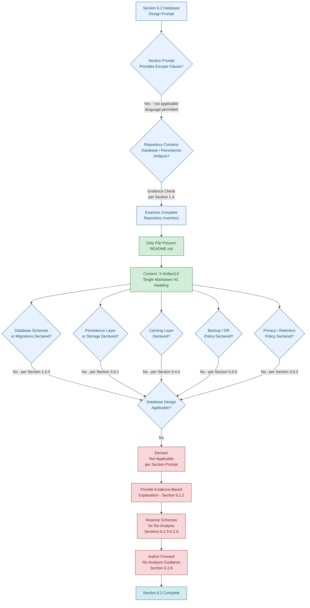

#### 6.2.7.3 Honest Diagram: Repository State vs. Required Database Categories

The following diagram restates the repository's actual structural state alongside the categories of database artifacts that would be required to populate Section 6.2. This diagram extends the precedent established in Sections 1.2.2.2, 5.2.1.3, and 6.1.6.3 to the Database Design domain.

```mermaid
graph TD
    Root["Repository Root (/)"] --> Readme["README.md"]
    Readme --> Content["Sole content:<br/>'# Artifact13'<br/>(single Markdown H1 heading)"]

    NoSchema["No database schemas /<br/>DDL / ERDs"] -.absent.-> Root
    NoMigration["No migration scripts /<br/>schema versioning"] -.absent.-> Root
    NoORM["No ORM mappings or<br/>entity classes"] -.absent.-> Root
    NoEngine["No database engine /<br/>connection strings"] -.absent.-> Root
    NoIndex["No index definitions or<br/>query plans"] -.absent.-> Root
    NoPartition["No partitioning /<br/>sharding configuration"] -.absent.-> Root
    NoReplication["No replication topology /<br/>read replicas"] -.absent.-> Root
    NoBackup["No backup / restore /<br/>RTO / RPO declarations"] -.absent.-> Root
    NoCache["No cache configuration /<br/>Redis / Memcached / CDN"] -.absent.-> Root
    NoRetention["No retention rules /<br/>archival policies"] -.absent.-> Root
    NoPrivacy["No PII catalog / consent /<br/>field encryption"] -.absent.-> Root
    NoAudit["No audit log / CDC /<br/>access logging"] -.absent.-> Root
    NoAccess["No DB roles / row-level<br/>security / IAM integration"] -.absent.-> Root
    NoPool["No connection pool /<br/>read-write splitting"] -.absent.-> Root

    classDef present fill:#d4edda,stroke:#155724,stroke-width:2px,color:#155724
    classDef absent fill:#f8d7da,stroke:#721c24,stroke-width:1px,stroke-dasharray: 5 5,color:#721c24

    class Root,Readme,Content present
    class NoSchema,NoMigration,NoORM,NoEngine,NoIndex,NoPartition,NoReplication,NoBackup,NoCache,NoRetention,NoPrivacy,NoAudit,NoAccess,NoPool absent
```

#### 6.2.7.4 Honest Diagram: Re-Analysis Workflow Upon Repository Evolution

The following methodological diagram depicts the **process by which Section 6.2 would be re-authored** once observable database evidence becomes available in the repository. It is the documentation-authoring workflow, not a runtime data topology. This pattern follows the precedent established in Sections 5.5.3 and 6.1.6.4 and the ADR re-analysis precedent established in Section 5.4.6.

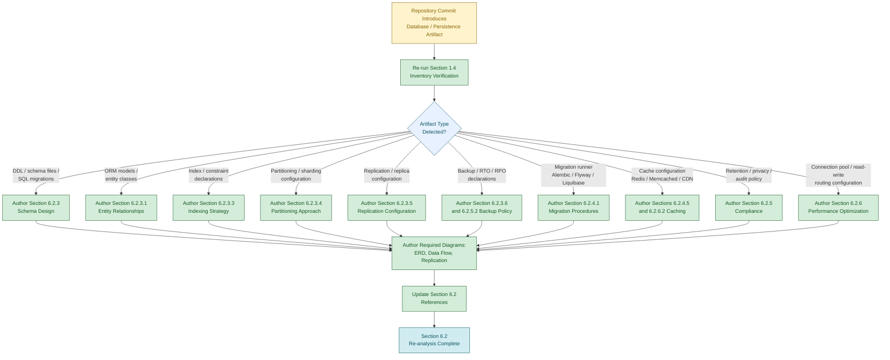

---

### 6.2.8 Assumptions, Constraints, and Forward Re-Analysis Guidance

#### 6.2.8.1 Documented Assumptions

The following assumptions govern the construction of this section. Each is consistent with the assumptions enumerated in Sections 2.7.1, 3.9.1, 4.6.1, 5.6.1, and 6.1.7.1 and is restated here in the Database Design context.

| Assumption ID | Assumption Statement |
|---------------|----------------------|
| A-6.2-001 | Only the contents of `README.md` and the absence of all other repository artifacts are observable as database-related evidence. |
| A-6.2-002 | The repository inventory captured in Section 1.4 is the authoritative basis for the absence determinations in this section. |
| A-6.2-003 | No external repositories, schema catalogs, migration archives, data dictionaries, ERD assets, or DBA runbooks exist within the scope of this specification (consistent with A-5-003, A-6-003). |
| A-6.2-004 | No `.blitzyignore` file or equivalent exclusion mechanism has filtered any database, schema, migration, cache, backup, retention, or audit artifact out of the inventory (consistent with A-5-004, A-6-004). |
| A-6.2-005 | The required-diagram categories enumerated in the section prompt (database schema diagrams, data flow diagrams, replication architecture) are reference inputs only and do not constitute observable repository evidence (consistent with A-5-005, A-6-005). |
| A-6.2-006 | The Default Technology Stack catalogued in Section 3.8.1 — including the **MongoDB** default database listing — is reserved for future re-analysis and does not constitute a database commitment within the scope of this specification (consistent with A-5-006, A-6-006). |

#### 6.2.8.2 Documented Constraints

The following constraints bound this section. Each is either inherited from Sections 2.7.2, 3.9.2, 4.6.2, 5.6.2, and 6.1.7.2 or specific to the Database Design domain.

| Constraint ID | Constraint Statement | Source Reference |
|---------------|----------------------|------------------|
| C-6.2-001 | No database schemas, DDL, ORM mappings, or migration scripts exist within the repository; no Entity Relationship Diagram (ERD) or table catalog can be populated against observable evidence. | Section 1.4.3; Section 5.6.3 |
| C-6.2-002 | No database engine, persistence layer, caching solution, object store, or message store is declared; no Storage Decision payload, Connection Pool, or Replication Topology can be documented against observable evidence. | Section 3.6.1; Section 3.6.2 |
| C-6.2-003 | No indexing, partitioning, replication, or backup configuration is observable; no associated table-level decision can be authored. | Sections 2.5.4, 5.5.6, 6.1.5.3 |
| C-6.2-004 | No migration procedure, versioning strategy, archival policy, storage-and-retrieval mechanism, or caching policy is observable; no Data Management content can be authored against observable evidence. | Section 5.4.3; Section 5.4.4 |
| C-6.2-005 | No data retention rules, backup/fault-tolerance policies, privacy controls, audit mechanisms, or access controls are observable; no Compliance Considerations content can be authored against observable evidence. | Sections 2.5.5, 3.6.3, 4.4.2, 5.5.6 |
| C-6.2-006 | No query optimization patterns, caching strategy, connection pooling, read/write splitting, or batch processing approach is observable; no Performance Optimization content can be authored against observable evidence. | Sections 1.2.1.3, 2.5.3, 5.4.4, 6.1.4.4 |
| C-6.2-007 | The strict factual grounding discipline prohibits inference, extrapolation, or fabrication of database content (inherited from C-2-002, C-3-002, C-4-002, C-5-002, C-6-007). | Section 1.5.1; Section 6.1.7.2 |
| C-6.2-008 | The required-diagram categories (database schema diagrams, data flow diagrams, replication architecture) and the required index/constraint catalog cannot be produced from observable evidence; only methodological diagrams depicting the documentation-authoring process are honestly producible (inherited from C-5-011, C-6-006). | Section 5.6.2; Section 6.1.7.2 |
| C-6.2-009 | The Default Technology Stack provided by the section prompt — including **MongoDB** as the listed default database engine — may not be adopted as a basis for Database Design decisions (inherited from C-3-006, C-5-010, C-6-009). | Section 3.8.2; Section 3.9.2 |
| C-6.2-010 | Zero persistence, caching, or storage artifacts are declared in the repository (inherited from C-5-006); this constraint is the proximate cause of the non-applicability determination for Section 6.2. | Section 5.6.2; Section 6.1.7.2 |

#### 6.2.8.3 Forward Re-Analysis Guidance

Should the repository evolve to include database specifications, schema definitions, migration files, ORM models, connection configurations, cache configurations, backup configurations, retention policies, audit configurations, or performance-tuning artifacts, this section should be re-analyzed in its entirety. The following structural elements are reserved for population at that time.

| Reserved Structural Element | Subsection |
|-----------------------------|------------|
| Entity relationships and ERD | Section 6.2.3.1 |
| Data models and structures | Section 6.2.3.2 |
| Indexing strategy and index catalog | Section 6.2.3.3 |
| Partitioning approach | Section 6.2.3.4 |
| Replication configuration | Section 6.2.3.5 |
| Backup architecture | Section 6.2.3.6 |
| Migration procedures | Section 6.2.4.1 |
| Versioning strategy | Section 6.2.4.2 |
| Archival policies | Section 6.2.4.3 |
| Data storage and retrieval mechanisms | Section 6.2.4.4 |
| Caching policies | Section 6.2.4.5 |
| Data retention rules | Section 6.2.5.1 |
| Backup and fault tolerance policies | Section 6.2.5.2 |
| Privacy controls | Section 6.2.5.3 |
| Audit mechanisms | Section 6.2.5.4 |
| Access controls | Section 6.2.5.5 |
| Query optimization patterns | Section 6.2.6.1 |
| Caching strategy (performance view) | Section 6.2.6.2 |
| Connection pooling | Section 6.2.6.3 |
| Read/write splitting | Section 6.2.6.4 |
| Batch processing approach | Section 6.2.6.5 |
| ERD, data flow, and replication architecture diagrams | Section 6.2.7 |

The triggers for re-analysis follow the pattern established in Sections 2.7.3, 3.9.4, 4.6.3, 5.6.3, and 6.1.7.3: **any subsequent commit, addition, or restructuring of the repository** invalidates the current absence determinations and obligates a fresh evaluation. Specifically, the introduction of any of the following artifact classes should trigger immediate re-analysis of Section 6.2.

| Trigger Artifact Class | Section 6.2 Subsections Affected |
|------------------------|----------------------------------|
| Database schemas, DDL files (`.sql`), or table definitions | 6.2.3.1, 6.2.3.2, 6.2.3.3 |
| Migration files (Alembic, Flyway, Liquibase, Prisma Migrate, Sequelize, TypeORM, knex, Goose, Atlas, sql-migrate) | 6.2.4.1, 6.2.4.2 |
| ORM models or entity-mapping classes (e.g., Hibernate, SQLAlchemy, ActiveRecord, Mongoose, GORM, Diesel) | 6.2.3.1, 6.2.3.2, 6.2.4.4 |
| Database connection configurations (connection strings, DSN, driver config) | 6.2.6.3, 6.2.6.4 |
| Cache configurations (Redis, Memcached, Hazelcast, CDN policies) | 6.2.4.5, 6.2.6.2 |
| Object / blob storage configurations (S3 bucket policies, GCS, Azure Blob, MinIO) | 6.2.3.6, 6.2.5.1 |
| Backup configurations, snapshot policies, or RTO/RPO declarations | 6.2.3.6, 6.2.5.2 |
| Replication topology declarations (primary-replica, multi-primary, cluster manifests) | 6.2.3.5, 6.2.6.4 |
| Partitioning / sharding configurations | 6.2.3.4 |
| Index / constraint declarations (DDL, schema-as-code, query-plan hints) | 6.2.3.3, 6.2.6.1 |
| Data retention or archival policy documents | 6.2.4.3, 6.2.5.1 |
| Privacy / GDPR / CCPA / HIPAA / PCI-DSS / SOX declarations or PII catalogs | 6.2.5.1, 6.2.5.3 |
| Audit logging configurations or change-data-capture (CDC) declarations | 6.2.5.4 |
| Database access control declarations (roles, row-level security, IAM integration) | 6.2.5.5 |
| Performance-tuning configurations (query hints, materialized views, plan caches, connection pool settings) | 6.2.6.1, 6.2.6.3 |
| Batch / ETL / ELT pipeline definitions | 6.2.6.5 |

#### 6.2.8.4 Specification Validity Window

Per Section 1.5.3, the findings documented here reflect the state of the repository at the time of analysis. The validity of this section is bounded as follows.

| Validity Dimension | Current State |
|--------------------|---------------|
| Specification basis | Single observation of `README.md` with content `# Artifact13` |
| Re-analysis trigger | Any subsequent commit, addition, or restructuring of the repository |
| Database design baseline | v0 — no database design issued; only methodological diagrams produced |
| Required-diagram baseline | v0 — none of the required diagram categories (database schema, data flow, replication architecture) is producible from observable evidence |
| Index / constraint catalog baseline | v0 — no index or constraint catalog is producible from observable evidence |
| Default Stack treatment | Reserved (MongoDB and all other default components remain unadopted per C-6.2-009) |
| Effective scope | The repository state at the time of analysis only |

---

### 6.2.9 References

#### 6.2.9.1 Files Examined

- `/README.md` — Confirmed sole repository file; contains only the single-line H1 heading `# Artifact13`; provides direct evidence of the repository's pre-implementation placeholder state and the absence of any database schema, migration script, ORM mapping, cache configuration, backup policy, retention rule, or audit declaration.

#### 6.2.9.2 Folders Explored

- `/` (repository root, depth 0) — Confirmed to contain exactly one file (`README.md`) and zero subdirectories; provides authoritative scope boundary for all absence determinations in this section regarding databases, persistence layers, caches, object stores, and message stores.

#### 6.2.9.3 Cross-Referenced Technical Specification Sections

- **Section 1.1 EXECUTIVE SUMMARY** — Established pre-implementation placeholder state of the Artifact13 repository.
- **Section 1.2 SYSTEM OVERVIEW** — Provided evidence of *"Database or persistence layer connections: None declared"* (1.2.1.3), zero components (1.2.2.2), no architectural pattern or deployment topology (1.2.2.3), no capabilities or runtime behaviors (1.2.2.1), and no KPIs/SLOs against which performance tuning could be anchored (1.2.3.3).
- **Section 1.3 SCOPE** — Established zero data domains in-scope (1.3.1.3) and that *"all data persistence concerns"* are out-of-scope (1.3.2.1).
- **Section 1.4 REPOSITORY ARTIFACT INVENTORY** — Authoritative complete file listing (1.4.1) and explicit absence confirmation for *"Database schemas or migrations"* (1.4.3).
- **Section 1.5 DOCUMENTATION POSTURE** — Established the factual grounding discipline (1.5.1) and the explicit directive that data-related sections document absence (1.5.2).
- **Section 2.5 IMPLEMENTATION CONSIDERATIONS** — Provided absence of performance targets (2.5.3), data partitioning posture (2.5.4), data protection design (2.5.5), and backup/recovery procedures (2.5.6).
- **Section 2.7 ASSUMPTIONS AND CONSTRAINTS** — Source of inherited constraints C-2-002 (factual grounding) and C-2-004 (no language/framework/runtime declared).
- **Section 3.6 DATABASES AND STORAGE** — **Primary evidence section** establishing that *"No database, persistence layer, caching solution, or storage service is declared"* (3.6.1); preserves the Storage Role schema with all rows as *"None declared"* (3.6.2); confirms no data protection design (3.6.3).
- **Section 3.7 DEVELOPMENT AND DEPLOYMENT** — Confirmed no development tooling, build configuration, or CI/CD artifacts that could host migration runners or backup orchestration.
- **Section 3.8 DEFAULT TECHNOLOGY STACK RESERVATION** — Establishes that **MongoDB** is the default database listed in the prompt (3.8.1) but is **not adopted** (3.8.2) and is reserved for re-analysis only (3.8.3); proximate source for constraint C-6.2-009.
- **Section 3.9 ASSUMPTIONS, CONSTRAINTS, AND FORWARD RE-ANALYSIS GUIDANCE** — Source of inherited constraints C-3-002 (factual grounding) and C-3-006 (no default stack adoption).
- **Section 4.4 TECHNICAL IMPLEMENTATION STATUS** — Established *"zero state management artifacts"* including no persistence layers, caches, transaction boundaries (4.4.1), no error-handling mechanisms relevant to DLQ / compensating transactions, and no observability hooks for audit (4.4.2).
- **Section 4.5 REQUIRED DIAGRAMS STATUS** — Established the methodological-diagram precedent under which only documentation-authoring process diagrams are honestly producible.
- **Section 5.2 HIGH-LEVEL ARCHITECTURE STATUS** — Established that *"no data flows exist within the repository"* (5.2.3) and *"no components exist"* against which to anchor persistence.
- **Section 5.3 COMPONENT DETAILS STATUS** — Established *"Data persistence requirements: No persistence declared"* (5.3.2).
- **Section 5.4 TECHNICAL DECISIONS STATUS** — Established that *"No data storage solution decision is recorded"* (5.4.3) and *"No caching strategy is declared"* (5.4.4); provided ADR methodological-diagram precedent (5.4.6).
- **Section 5.5 CROSS-CUTTING CONCERNS STATUS** — Established that *"no disaster recovery procedures are declared"* (5.5.6), including the Backup Strategy / RTO / RPO / Failover Topology rows as None present / Not defined.
- **Section 5.6 ASSUMPTIONS, CONSTRAINTS, AND FORWARD RE-ANALYSIS GUIDANCE** — Source of inherited constraints C-5-002 (factual grounding), C-5-003 (no language/runtime/topology), C-5-006 (zero persistence/caching/storage), C-5-010 (no default stack), and C-5-011 (no fabricated system-behavior diagrams); proximate source for constraints C-6.2-007, C-6.2-008, C-6.2-009, and C-6.2-010.
- **Section 6.1 CORE SERVICES ARCHITECTURE** — **Direct structural template** for this section, establishing the applicability-determination, formal-non-applicability-statement, schema-preservation, methodological-diagram-producibility, and forward-re-analysis-guidance pattern; constraints C-6-006, C-6-007, C-6-008, and C-6-009 inherited as C-6.2-008, C-6.2-007, and C-6.2-009 within this section.

## 6.3 Integration Architecture

### 6.3.1 Applicability Determination

#### 6.3.1.1 Section Prompt Escape Clause Recognition

The section prompt for Integration Architecture provides an explicit escape clause: *"If the system does not require integration with external systems or services, clearly state 'Integration Architecture is not applicable for this system' and explain why."* This provision exists precisely to prevent the fabrication of API designs, message processing architectures, and external system integration contracts for systems that contain no API surface, no protocol declarations, no message broker configurations, no third-party service bindings, and no integration manifests against which such patterns could be anchored.

In conjunction with the documentation posture established in Section 1.5.1 — under which *"every statement made about the artifact is derived from observable evidence within the repository"* — and the explicit directive in Section 1.5.2 that *"Sections addressing architecture, component design, data flow, deployment topology, and operational procedures will document the absence of corresponding artifacts where applicable"* — this escape clause is the governing path for this section against the current repository state. This determination also extends the methodological precedent established in Sections 6.1.1.1 (Core Services Architecture non-applicability) and 6.2.1.1 (Database Design non-applicability), in which the same factual grounding discipline drove the formal non-applicability of those architecture domains.

#### 6.3.1.2 Repository State Determination

The **Artifact13** repository exists in a pre-implementation placeholder state, as established exhaustively across Sections 1.1.1, 1.3.1, 1.4.1, 2.1.2, 3.1.2, 4.1.2, 5.1.2, 6.1.1.2, and 6.2.1.2. Per Section 1.4.1, the complete repository contents consist of exactly one file — `README.md` — at the repository root, with zero subdirectories. That file declares the project name `Artifact13` via a single H1 heading and contains no further content. Per Section 1.4.3, no source code, package manifests, build configurations, test files, **API definitions (OpenAPI, GraphQL, Protobuf)**, database schemas or migrations, front-end assets, or environment configurations exist.

The categorical absences directly relevant to Integration Architecture are summarized below:

| Evidentiary Dimension | Repository State | Source Reference |
|-----------------------|------------------|------------------|
| API definitions (OpenAPI / GraphQL / Protobuf / AsyncAPI) | Absent | Section 1.4.3 |
| External APIs consumed / services exposed externally | None declared | Section 1.2.1.3 |
| Message queues, event streams, or brokers | None declared | Section 1.2.1.3 |
| Third-party service integrations | None declared | Section 3.5.1 |

#### 6.3.1.3 Formal Statement of Non-Applicability

**Integration Architecture is not applicable for this system.**

The Artifact13 repository contains no APIs, no protocols, no interface definitions, no authentication mechanisms, no authorization frameworks, no rate limiting policies, no versioning strategies, no API documentation tooling, no message queues, no event streams, no stream processing topologies, no batch processing definitions, no error handling strategies, no third-party SDK integrations, no legacy system interfaces, no API gateway configurations, no service mesh definitions, no webhook configurations, and no external service contracts. There is therefore no observable basis on which to author protocol specifications, authentication methods, authorization frameworks, rate limiting strategies, versioning approaches, documentation standards, event processing patterns, message queue architectures, stream processing designs, batch processing flows, error handling strategies, third-party integration patterns, legacy system interfaces, API gateway configurations, or external service contracts.

The remainder of this section formally records the rationale for this determination, preserves the schemas required by the section prompt for re-analysis purposes, documents the producibility status of the required diagrams, and provides forward re-analysis guidance keyed to the artifact classes whose introduction would warrant a fresh evaluation.

---

### 6.3.2 Rationale for Non-Applicability

The determination above rests on five independent and mutually reinforcing evidentiary bases, each grounded in a primary cross-reference to earlier sections of this specification.

#### 6.3.2.1 Absence of APIs, Protocols, and Interface Definitions

Per Section 1.4.3, the absence-confirmation table explicitly records *"API definitions (OpenAPI, GraphQL, Protobuf): Absent."* Per Section 1.2.1.3, the Integration Concerns table documents *"External APIs consumed: None declared"* and *"Services exposed externally: None declared."* Per Section 1.3.2.3, *"all possible integration points are out-of-scope because none are declared. The repository contains no API specifications, client SDKs, webhook definitions, event schemas, or interface definition language (IDL) files."* Per Section 5.4.2, the Communication Pattern decision schema records *"No protocols declared (Section 1.2.1.3)"* and *"No message formats declared (Section 1.4.3 — no schemas)."* The most fundamental prerequisite of any Integration Architecture — the existence of an API surface, protocol, or interface contract — is therefore absent.

#### 6.3.2.2 Absence of Authentication, Authorization, and Security Frameworks

Per Section 2.5.5, the Authentication Mechanisms row is documented as *"No authentication artifacts present,"* and the Authorization Model row is documented as *"No authorization artifacts present."* Per Section 3.5.2, the Authentication Services row is documented as *"None declared."* Per Section 5.4.5, the Security Mechanism decision schema records *"None declared"* across authentication mechanism, authorization model, data protection, and threat model dimensions. Per Section 5.5.4, the Authentication and Authorization Framework status records *"None declared"* across identity provider, token format, session management, and policy enforcement point dimensions. Without any identity surface, token format, session model, or policy enforcement point, no API authentication or authorization framework can be authored.

#### 6.3.2.3 Absence of Message Processing, Event Streams, and Batch Processing

Per Section 1.2.1.3, the Integration Concerns table documents *"Message queues or event streams: None declared."* Per Section 4.2.2, the Integration Workflows status records *"zero integration workflows,"* with explicit absences across data flow between systems, API interactions, event processing flows, batch processing sequences, protocol selection, integration error semantics, inter-system contracts, and third-party service touchpoints. Per Section 5.5.3, the Error Handling Pattern status records *"None declared"* across retry policies, fallback strategies, circuit breaker logic, and dead-letter queue handling. Per Section 4.4.2, *"the repository declares zero error handling mechanisms."* Per Section 6.2.6.5, the Batch Processing Approach row is uniformly populated as *"Not applicable"* against the underlying absence of workload (Section 1.2.2.1), data flows (Section 5.2.3), and data plane (Section 3.6.1). No event processing pattern, message queue, stream processor, batch pipeline, or error-handling strategy can be authored against observable evidence.

#### 6.3.2.4 Absence of Third-Party Integrations, Gateways, and External Service Contracts

Per Section 3.5.1, *"No third-party service integrations are declared within the Artifact13 repository."* Per Section 3.5.2, the schema preservation table records *"None declared"* across external APIs and integrations, authentication services, monitoring and observability tools, cloud platform services, and message queues / event streams. Per Section 3.5.3, *"No cloud platform commitment (AWS, Azure, Google Cloud Platform, or any other provider) is declared within the repository."* Per Section 1.2.1.2, the repository *"does not represent the replacement, upgrade, or modernization of any pre-existing system. No references to legacy systems, deprecated platforms, migration timelines, or transition strategies are present in the artifact."* Per Section 5.2.4, the External Integration Points table is populated with *"None declared"* across system name, integration type, data exchange pattern, and protocol / format / SLA dimensions. Per Section 3.7.1 (as cited in the executive context), no development tooling, build system, containerization configuration, or CI/CD pipeline exists that could host an API gateway runtime; no reverse-proxy, ingress, or service-mesh configuration is observable.

#### 6.3.2.5 Prohibition on Default Stack Adoption

Per Section 3.8.2, *"Adopting any element of the Default Technology Stack as an actual selection for the Artifact13 system would therefore violate the factual grounding discipline established in Section 1.5.1 and the explicit constraints C-2-002 and C-2-004."* Constraint C-3-006 (Section 3.9.2), constraint C-5-010 (Section 5.6.2), constraint C-6-009 (Section 6.1.7.2), and constraint C-6.2-009 (Section 6.2.8.2) formally codify this prohibition and are inherited here as constraint C-6.3-009. The Default Technology Stack catalog typically includes identity providers (Auth0), cloud platforms (AWS), container orchestration platforms, API gateway services, and managed message brokers — none of which is available as a basis for fabricating Integration Architecture content, regardless of any prominence in the section prompt's reference list. Per Section 3.3.1, *"No framework or library is declared"* (no HTTP, REST, messaging, or integration frameworks). Per Section 3.4.1, *"No open-source or third-party dependencies are declared"* of any ecosystem.

---

### 6.3.3 API Design Status (Schema Preservation)

The section prompt enumerates six required API Design topics: protocol specifications, authentication methods, authorization framework, rate limiting strategy, versioning approach, and documentation standards. Each is documented below with its required content and current status, preserving the structural schema for re-analysis. Per the prompt's output-format guidance and the precedent established in Sections 6.1.3 and 6.2.3, all tables in this section are constrained to no more than four columns.

#### 6.3.3.1 Protocol Specifications

Per Section 1.2.1.3, no external APIs are consumed and no services are exposed externally. Per Section 1.4.3, no API definitions (OpenAPI, GraphQL, Protobuf) are present in the repository. Per Section 5.4.2, the protocol family row of the Communication Pattern decision schema records *"No protocols declared (Section 1.2.1.3),"* and the synchronous vs. asynchronous dimension records *"No runtime declared (Section 1.2.2.3)."* No REST, gRPC, GraphQL, WebSocket, SOAP, AMQP, or Kafka protocol surface is observable.

| Protocol Specification Dimension | Required Content | Current Status |
|----------------------------------|------------------|----------------|
| Protocol family | REST / gRPC / GraphQL / WebSocket / AMQP | None declared (Section 5.4.2) |
| Synchronous vs. asynchronous | Selected paradigm and rationale | Not applicable — no runtime (Section 1.2.2.3) |
| Message format / serialization | JSON / Protobuf / Avro / MessagePack | Not applicable — no schemas (Section 1.4.3) |
| Delivery semantics | At-most-once / at-least-once / exactly-once | Not applicable — no messaging (Section 1.2.1.3) |

#### 6.3.3.2 Authentication Methods

Per Section 2.5.5, the Authentication Mechanisms row is documented as *"No authentication artifacts present."* Per Section 3.5.2, the Authentication Services row is documented as *"None declared."* Per Section 4.3.2 (as referenced in Section 5.5.4), *"No authentication or authorization artifacts"* exist. Per Section 5.5.4, the identity provider, token format, session management, and policy enforcement point rows are each populated as *"None declared."* No OAuth2, OpenID Connect, SAML, JWT, API key, mTLS, or basic authentication design is observable.

| Authentication Method Dimension | Required Content | Current Status |
|--------------------------------|------------------|----------------|
| Identity provider | OIDC issuer / IdP integration | None declared (Section 3.5.2) |
| Token format | JWT / opaque / SAML / API key | None declared (Section 2.5.5) |
| Session management | Cookie / header / refresh-token model | None declared (Section 5.5.4) |
| Credential storage / rotation | Secret manager / key vault / rotation cadence | Not applicable — no credentials (Section 2.5.5) |

#### 6.3.3.3 Authorization Framework

Per Section 2.5.5, the Authorization Model row is documented as *"No authorization artifacts present."* Per Section 4.3.2 (validation rules), no authorization checkpoints exist. Per Section 5.4.5, the Authorization Model dimension of the Security Mechanism decision schema records *"None declared."* Per Section 5.5.4, the policy enforcement point row is populated as *"None declared — no runtime (Section 1.2.2.3)."* No Role-Based Access Control (RBAC), Attribute-Based Access Control (ABAC), Relationship-Based Access Control (ReBAC), or policy engine (Open Policy Agent, Cedar, Casbin) integration is observable.

| Authorization Framework Dimension | Required Content | Current Status |
|----------------------------------|------------------|----------------|
| Authorization model | RBAC / ABAC / ReBAC / policy engine | None declared (Section 2.5.5) |
| Policy enforcement point | API gateway / sidecar / in-process | None declared (Section 5.5.4) |
| Permission catalog | Roles, scopes, claims, attributes | Not applicable — no identity surface (Section 5.4.5) |
| Policy storage | Database / config file / policy-as-code | Not applicable — no policy artifacts (Section 4.3.2) |

#### 6.3.3.4 Rate Limiting Strategy

Per Section 1.2.2.3, no runtime, framework, architectural pattern, or deployment topology is declared. Per Section 1.2.1.3, no services exposed externally and no external APIs consumed — there is therefore no traffic surface to throttle. Per Section 6.1.5.5 (service degradation policies), the load-shedding policy row is populated as *"Not applicable — no runtime (Section 1.2.2.3)."* No token-bucket, leaky-bucket, fixed-window, sliding-window, or distributed rate limiting algorithm is observable.

| Rate Limiting Dimension | Required Content | Current Status |
|------------------------|------------------|----------------|
| Algorithm | Token bucket / leaky bucket / fixed / sliding window | Not applicable — no APIs (Section 1.2.1.3) |
| Scope / key | Per-user / per-IP / per-API-key / per-tenant | Not applicable — no identity surface (Section 5.4.5) |
| Quota tier policy | Free / paid / enterprise tiers | Not applicable — no business model (Section 1.2.1.1) |
| Throttle response | HTTP 429 / Retry-After / custom payload | Not applicable — no runtime (Section 1.2.2.3) |

#### 6.3.3.5 Versioning Approach

Per Section 1.4.3, no API definitions are present. Per Section 1.2.1.3, no services are exposed externally. Per Section 5.4.2, no communication patterns are declared. Without an evolving API surface, no versioning policy (URI versioning, header-based versioning, media-type versioning, semantic versioning of contracts) can be authored.

| Versioning Approach Dimension | Required Content | Current Status |
|------------------------------|------------------|----------------|
| Versioning scheme | URI path / header / media type / query parameter | Not applicable — no APIs (Section 1.4.3) |
| Compatibility window | Backward / forward compatibility rules | Not applicable — no API surface (Section 1.2.1.3) |
| Deprecation policy | Notice period and sunset cadence | Not applicable — no published contracts |
| Version negotiation | Content negotiation / version routing | Not applicable — no runtime (Section 1.2.2.3) |

#### 6.3.3.6 Documentation Standards

Per Section 1.4.3, no API definitions of any kind (OpenAPI/Swagger, GraphQL SDL, gRPC/Protobuf, AsyncAPI) are present. Per Section 5.5.2, no logging or tracing strategy is declared that could support API observability documentation. Per Section 2.5.6 (as cited via Section 5.5.1), no documentation tooling, dashboard definitions, or instrumentation artifacts exist. No Swagger UI, Redoc, GraphQL Playground, Postman collection, API blueprint, or generated reference documentation is observable.

| Documentation Standards Dimension | Required Content | Current Status |
|----------------------------------|------------------|----------------|
| Specification format | OpenAPI / GraphQL SDL / Protobuf / AsyncAPI | Absent (Section 1.4.3) |
| Documentation generator | Swagger UI / Redoc / GraphQL Playground | None declared (Section 3.5.2) |
| Reference / SDK distribution | Generated client SDKs / Postman collections | Not applicable — no IDL (Section 1.3.2.3) |
| Change log / release notes | Versioned change records | Not applicable — no published API (Section 1.2.1.3) |

---

### 6.3.4 Message Processing Status (Schema Preservation)

The section prompt enumerates five required Message Processing topics: event processing patterns, message queue architecture, stream processing design, batch processing flows, and error handling strategy. Each is documented below with the structural schema preserved for re-analysis.

#### 6.3.4.1 Event Processing Patterns

Per Section 1.2.1.3, the Message queues or event streams row is documented as *"None declared."* Per Section 5.2.3, *"no data flows exist within the repository,"* and *"no producer/consumer pairs, integration patterns, or data transformation points are documented."* Per Section 4.2.2, no event processing flows (producers, brokers, consumers) are present. No Publish/Subscribe, Event Sourcing, CQRS, Saga, Choreography, or Orchestration pattern is observable.

| Event Processing Dimension | Required Content | Current Status |
|---------------------------|------------------|----------------|
| Pattern selection | Pub/Sub / Event Sourcing / CQRS / Saga | None declared (Section 1.2.1.3) |
| Event taxonomy | Domain events, integration events, command events | Not applicable — no events (Section 5.2.3) |
| Event schema standard | CloudEvents / JSON Schema / Avro / Protobuf | Not applicable — no schemas (Section 1.4.3) |
| Ordering / partitioning guarantees | Per-key, per-partition, global ordering | Not applicable — no event plane (Section 5.4.2) |

#### 6.3.4.2 Message Queue Architecture

Per Section 1.2.1.3, no message queues or event streams are declared. Per Section 3.5.2, the Message queues / event streams row is populated as *"None declared"* / *"Not applicable."* Per Section 5.4.2, no asynchronous messaging paradigm is declared. No Kafka, RabbitMQ, NATS, Redis Streams, AWS SQS/SNS, Azure Service Bus, Google Pub/Sub, or in-memory queue is observable.

| Message Queue Architecture Dimension | Required Content | Current Status |
|--------------------------------------|------------------|----------------|
| Broker technology | Kafka / RabbitMQ / NATS / SQS / Service Bus | None declared (Section 3.5.2) |
| Topology | Single broker / cluster / federated / mesh | Not applicable — no broker (Section 1.2.1.3) |
| Topic / queue catalog | Named topics, partitions, retention windows | Not applicable — no broker |
| Consumer group / subscription model | Competing consumers / fan-out / work-queue | Not applicable — no messaging plane (Section 5.4.2) |

#### 6.3.4.3 Stream Processing Design

Per Section 5.2.3, no data flows exist within the repository. Per Section 1.2.2.1, *"the artifact cannot accept input, produce output, perform computation, or interact with external systems"* — no continuous data ingest or processing surface is observable. No Kafka Streams, Apache Flink, Apache Spark Streaming, AWS Kinesis Data Streams/Firehose/Analytics, Apache Storm, or Apache Beam topology is observable.

| Stream Processing Dimension | Required Content | Current Status |
|----------------------------|------------------|----------------|
| Stream processor technology | Kafka Streams / Flink / Spark / Kinesis | None declared (Section 1.2.1.3) |
| Topology design | Source → operators → sink graph | Not applicable — no data flows (Section 5.2.3) |
| State / windowing semantics | Tumbling / hopping / session / global windows | Not applicable — no state (Section 4.4.1) |
| Exactly-once / checkpointing | Checkpoint cadence and recovery semantics | Not applicable — no runtime (Section 1.2.2.3) |

#### 6.3.4.4 Batch Processing Flows

Per Section 4.2.2, no batch processing sequences exist (no source code, no schedulers, no CI/CD). Per Section 6.2.6.5, the Batch Processing Approach row is populated as *"Not applicable"* across batch window/scheduling, ETL/ELT topology, bulk-load technique, and checkpoint/restart strategy dimensions. No Apache Airflow DAG, AWS Batch job definition, Azure Data Factory pipeline, Google Cloud Composer DAG, Kubernetes CronJob, Quartz schedule, or cron-driven batch is observable.

| Batch Processing Dimension | Required Content | Current Status |
|---------------------------|------------------|----------------|
| Orchestration tool | Airflow / AWS Batch / Data Factory / cron | None declared (Section 4.2.2) |
| Schedule / trigger | Cron / event-driven / manual cadence | Not applicable — no workload (Section 1.2.2.1) |
| Job dependency graph | DAG topology and retry policy | Not applicable — no jobs (Section 4.2.2) |
| Bulk extract / load technique | COPY / BULK INSERT / parallel ingestion | Not applicable — no data plane (Section 3.6.1) |

#### 6.3.4.5 Error Handling Strategy

Per Section 4.4.2, *"the repository declares zero error handling mechanisms. No retry policies, fallback strategies, notification channels, or recovery procedures are documented."* Per Section 5.5.3, the Error Handling Pattern status records *"None declared"* across retry policies, fallback strategies, circuit breaker logic, and dead-letter queue handling (the latter explicitly noted as *"None declared — no event streams (Section 1.2.1.3)"*). Per Section 6.1.3.6 (retry and fallback mechanisms), the retry count, backoff schedule, idempotency requirement, and fallback response rows are all populated as *"None declared"* or *"Not applicable."* No Dead-Letter Queue (DLQ), poison-message handler, compensating transaction, retry-with-backoff middleware, or saga rollback strategy is observable.

| Error Handling Strategy Dimension | Required Content | Current Status |
|-----------------------------------|------------------|----------------|
| Retry policy | Count, backoff, jitter parameters | None declared (Section 5.5.3) |
| Dead-letter queue handling | Poison-message disposition strategy | None declared (Section 5.5.3) |
| Fallback / compensation | Degraded-mode or saga-rollback design | None declared (Section 4.4.2) |
| Notification / alerting | Operator / on-call escalation pathway | Not applicable — no observability (Section 5.5.1) |

---

### 6.3.5 External Systems Status (Schema Preservation)

The section prompt enumerates four required External Systems topics: third-party integration patterns, legacy system interfaces, API gateway configuration, and external service contracts. Each is documented below with the structural schema preserved for re-analysis.

#### 6.3.5.1 Third-Party Integration Patterns

Per Section 3.5.1, *"No third-party service integrations are declared within the Artifact13 repository."* Per Section 3.5.2, the External APIs and Integrations row is populated as *"None declared"* / *"Not applicable."* Per Section 3.4.1 (as referenced in the executive context), no open-source or third-party dependencies are declared. No Software Development Kit (SDK), webhook callback URL, OAuth client registration, payment gateway integration, identity-as-a-service binding, or platform integration (Stripe, Twilio, SendGrid, Slack, Salesforce, HubSpot, etc.) is observable.

| Third-Party Integration Dimension | Required Content | Current Status |
|----------------------------------|------------------|----------------|
| Integration pattern | SDK / REST callout / webhook / event subscription | None declared (Section 3.5.1) |
| Provider catalog | Named external SaaS / platform providers | None declared (Section 3.5.2) |
| Credential / API key management | Secret manager / vault / rotation policy | Not applicable — no credentials (Section 2.5.5) |
| Failure / retry semantics | Timeout, retry, circuit-breaker per provider | Not applicable — no integrations (Section 4.2.2) |

#### 6.3.5.2 Legacy System Interfaces

Per Section 1.2.1.2, *"The repository does not represent the replacement, upgrade, or modernization of any pre-existing system. No references to legacy systems, deprecated platforms, migration timelines, or transition strategies are present in the artifact."* Per Section 2.4.2, no integration points are declared. No anti-corruption layer, adapter pattern implementation, bridge interface, screen-scraping harness, file-drop integration, EDI gateway, mainframe interface, or strangler-fig migration is observable.

| Legacy Interface Dimension | Required Content | Current Status |
|---------------------------|------------------|----------------|
| Legacy system catalog | Named legacy systems and their roles | None declared (Section 1.2.1.2) |
| Interface pattern | Anti-corruption layer / adapter / bridge / strangler | Not applicable — no legacy systems (Section 1.2.1.2) |
| Protocol bridge | File / SOAP / EDI / mainframe / database-link | Not applicable — no legacy interfaces |
| Migration / coexistence strategy | Strangler / parallel-run / cutover plan | Not applicable — no migration path (Section 1.2.1.2) |

#### 6.3.5.3 API Gateway Configuration

Per Section 1.2.2.3, no deployment topology is declared. Per Section 3.7 (as referenced in the executive context), no development or deployment tooling, no container manifests, no infrastructure-as-code, and no CI/CD definitions exist that could host an API gateway runtime. Per Section 5.5.4, the policy enforcement point row records *"None declared — no runtime (Section 1.2.2.3)."* No Kong, AWS API Gateway, Azure API Management, Apigee, Google Cloud Endpoints, Tyk, Krakend, Ambassador/Emissary, or NGINX-based API gateway is observable. No service mesh control plane (Istio, Linkerd, Consul Connect, AWS App Mesh) is observable.

| API Gateway Configuration Dimension | Required Content | Current Status |
|------------------------------------|------------------|----------------|
| Gateway technology | Kong / AWS APIGW / Azure APIM / Apigee | None declared (Section 1.2.2.3) |
| Route / endpoint catalog | Path mappings, method allow-lists, backends | Not applicable — no APIs (Section 1.4.3) |
| Policy chain | Auth / rate-limit / transform / CORS / WAF | Not applicable — no policies (Section 5.4.5) |
| Service mesh integration | Istio / Linkerd / Consul Connect / App Mesh | None declared (Section 3.5.3) |

#### 6.3.5.4 External Service Contracts

Per Section 5.2.4, the External Integration Points table records *"None declared"* across system name, integration type, data exchange pattern, and protocol / format / SLA dimensions. Per Section 1.3.2.3, *"the repository contains no API specifications, client SDKs, webhook definitions, event schemas, or interface definition language (IDL) files."* Per Section 5.5.5, no performance requirements or service-level agreements are declared. No consumer-driven contract test, Pact specification, OpenAPI contract test, AsyncAPI contract, Avro schema registry binding, or SLA/OLA document is observable.

| External Service Contract Dimension | Required Content | Current Status |
|------------------------------------|------------------|----------------|
| Contract format | OpenAPI / AsyncAPI / Pact / Protobuf / Avro | Absent (Section 1.4.3) |
| Counter-party catalog | Named consumers and producers | None declared (Section 5.2.4) |
| SLA / OLA targets | Latency, availability, throughput targets | Not defined (Section 5.5.5) |
| Contract test / verification | CDC tests / schema registry checks | Not applicable — no contracts (Section 1.3.2.3) |

---

### 6.3.6 Required Diagrams Producibility Assessment

The section prompt requires three categories of Mermaid.js diagrams: **integration flow diagrams**, **API architecture diagrams**, and **message flow diagrams**, and additionally calls for *"sequence diagrams for key flows."* Per Section 5.6.2 constraint C-5-011, Section 6.1.7.2 constraint C-6-006, and Section 6.2.8.2 constraint C-6.2-008, *"no fabricated system-behavior Mermaid diagrams may be produced; only methodological diagrams depicting the documentation-authoring process are honestly producible."* This constraint extends naturally to the diagram categories required by this section. Per Section 4.5.1, *"Integration sequence diagrams: Not producible from observable evidence."*

#### 6.3.6.1 Producibility Summary

| Required Diagram (per Prompt) | Producibility | Reason |
|-------------------------------|---------------|--------|
| Integration flow diagrams | Not producible from observable evidence | Zero integration workflows (Section 4.2.2); zero integration points (Section 1.2.1.3) |
| API architecture diagrams | Not producible from observable evidence | Zero APIs, protocols, or interface definitions (Sections 1.4.3, 5.4.2) |
| Message flow diagrams | Not producible from observable evidence | Zero message queues, event streams, or brokers (Sections 1.2.1.3, 3.5.2) |
| Sequence diagrams for key flows | Not producible from observable evidence | Zero flows, zero integrations, zero components (Sections 5.2.2, 5.2.3) |

#### 6.3.6.2 Honest Diagram: Applicability Evaluation Flow

In conformance with the methodological-diagram precedent established in Sections 2.1.2, 3.1.2, 4.1.2, 5.1.2, 6.1.6.2, and 6.2.7.2, the following diagram depicts the **applicability evaluation flow** by which the non-applicability determination was reached for Section 6.3. This is a documentation-authoring process diagram, not a fabricated integration-architecture diagram.

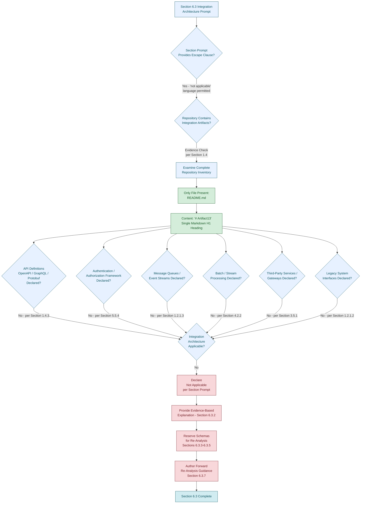

#### 6.3.6.3 Honest Diagram: Repository State vs. Required Integration Categories

The following diagram restates the repository's actual structural state alongside the categories of integration artifacts that would be required to populate Section 6.3. This diagram extends the precedent established in Sections 1.2.2.2, 5.2.1.3, 6.1.6.3, and 6.2.7.3 to the Integration Architecture domain.

```mermaid
graph TD
    Root["Repository Root (/)"] --> Readme["README.md"]
    Readme --> Content["Sole content:<br/>'# Artifact13'<br/>(single Markdown H1 heading)"]

    NoAPI["No APIs / protocols /<br/>OpenAPI / GraphQL / Protobuf"] -.absent.-> Root
    NoAuth["No authentication<br/>OAuth2 / OIDC / JWT / SAML / API keys"] -.absent.-> Root
    NoAuthz["No authorization framework<br/>RBAC / ABAC / ReBAC / policy engine"] -.absent.-> Root
    NoRateLimit["No rate limiting<br/>algorithms or quotas"] -.absent.-> Root
    NoVersioning["No API versioning<br/>strategy or conventions"] -.absent.-> Root
    NoDocs["No API documentation<br/>Swagger UI / Redoc / Postman"] -.absent.-> Root
    NoEvents["No event processing<br/>Pub/Sub / Event Sourcing / CQRS"] -.absent.-> Root
    NoQueues["No message queues<br/>Kafka / RabbitMQ / NATS / SQS"] -.absent.-> Root
    NoStreams["No stream processing<br/>Kafka Streams / Flink / Kinesis"] -.absent.-> Root
    NoBatch["No batch processing<br/>Airflow / AWS Batch / cron"] -.absent.-> Root
    NoError["No error handling<br/>DLQ / retry / circuit breaker"] -.absent.-> Root
    NoThirdParty["No third-party integrations<br/>SDKs / webhooks / SaaS callouts"] -.absent.-> Root
    NoGateway["No API gateway<br/>Kong / AWS APIGW / Apigee / APIM"] -.absent.-> Root
    NoMesh["No service mesh<br/>Istio / Linkerd / Consul Connect"] -.absent.-> Root
    NoLegacy["No legacy interfaces /<br/>anti-corruption layers"] -.absent.-> Root
    NoContracts["No external service contracts<br/>Pact / AsyncAPI / SLA documents"] -.absent.-> Root

    classDef present fill:#d4edda,stroke:#155724,stroke-width:2px,color:#155724
    classDef absent fill:#f8d7da,stroke:#721c24,stroke-width:1px,stroke-dasharray: 5 5,color:#721c24

    class Root,Readme,Content present
    class NoAPI,NoAuth,NoAuthz,NoRateLimit,NoVersioning,NoDocs,NoEvents,NoQueues,NoStreams,NoBatch,NoError,NoThirdParty,NoGateway,NoMesh,NoLegacy,NoContracts absent
```

#### 6.3.6.4 Honest Diagram: Re-Analysis Workflow Upon Repository Evolution

The following methodological diagram depicts the **process by which Section 6.3 would be re-authored** once observable integration evidence becomes available in the repository. It is the documentation-authoring workflow, not a runtime integration topology. This pattern follows the precedent established in Sections 5.5.3, 6.1.6.4, and 6.2.7.4.

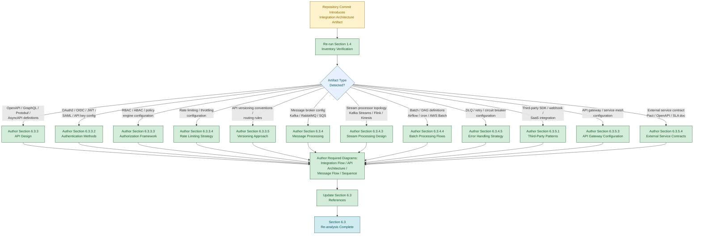

#### 6.3.6.5 Honest Diagram: Methodological Sequence Diagram (Documentation Workflow)

The section prompt requires *"sequence diagrams for key flows."* Because no integration flows exist (Sections 1.2.1.3, 4.2.2, 5.2.3, 5.2.4), no runtime integration sequence diagram is producible. In conformance with constraints C-5-011, C-6-006, and C-6.2-008 — and inherited as constraint C-6.3-008 below — the following Mermaid sequence diagram is restricted to depicting the **methodological key flow** that produced Section 6.3 itself: the interaction between the section prompt, the repository inventory, and the documentation author. It is the documentation-authoring sequence, not a runtime integration sequence (no such runtime exists).

```mermaid
sequenceDiagram
    autonumber
    participant Prompt as Section 6.3 Prompt
    participant Author as Documentation Author
    participant Inventory as Section 1.4 Inventory
    participant Repo as Repository Root (/)
    participant Spec as Section 6.3 Document

    Prompt->>Author: Required topics:<br/>API Design, Message Processing,<br/>External Systems
    Author->>Inventory: Request authoritative<br/>file listing
    Inventory-->>Author: README.md (sole file)<br/>+ explicit absences
    Author->>Repo: Verify content
    Repo-->>Author: "# Artifact13"<br/>(single H1 heading)
    Author->>Author: Apply factual grounding<br/>discipline (Section 1.5.1)
    Author->>Author: Recognize prompt<br/>escape clause
    Author->>Spec: Write Applicability<br/>Determination (6.3.1)
    Author->>Spec: Write Rationale (6.3.2)<br/>with cross-references
    Author->>Spec: Preserve Schemas<br/>(6.3.3 – 6.3.5)
    Author->>Spec: Author methodological<br/>diagrams only (6.3.6)
    Author->>Spec: Document assumptions,<br/>constraints, triggers (6.3.7)
    Spec-->>Author: Section 6.3 complete<br/>(v0 baseline)

    Note over Prompt,Spec: This is the documentation-authoring<br/>sequence, not a runtime integration<br/>sequence — no such runtime exists.
```

---

### 6.3.7 Assumptions, Constraints, and Forward Re-Analysis Guidance

#### 6.3.7.1 Documented Assumptions

The following assumptions govern the construction of this section. Each is consistent with the assumptions enumerated in Sections 2.7.1, 3.9.1, 4.6.1, 5.6.1, 6.1.7.1, and 6.2.8.1 and is restated here in the Integration Architecture context.

| Assumption ID | Assumption Statement |
|---------------|----------------------|
| A-6.3-001 | Only the contents of `README.md` and the absence of all other repository artifacts are observable as integration-architecture-related evidence. |
| A-6.3-002 | The repository inventory captured in Section 1.4 is the authoritative basis for the absence determinations in this section. |
| A-6.3-003 | No external repositories, API catalogs, integration platforms, broker administration consoles, gateway control planes, partner contracts, or runbooks exist within the scope of this specification (consistent with A-5-003, A-6-003, A-6.2-003). |
| A-6.3-004 | No `.blitzyignore` file or equivalent exclusion mechanism has filtered any API definition, authentication configuration, broker configuration, gateway configuration, integration manifest, or contract artifact out of the inventory (consistent with A-5-004, A-6-004, A-6.2-004). |
| A-6.3-005 | The required-diagram categories enumerated in the section prompt (integration flow diagrams, API architecture diagrams, message flow diagrams, sequence diagrams for key flows) are reference inputs only and do not constitute observable repository evidence (consistent with A-5-005, A-6-005, A-6.2-005). |
| A-6.3-006 | The Default Technology Stack catalogued in Section 3.8.1 — including default identity providers (e.g., Auth0), cloud platforms (e.g., AWS), and any default API gateway, message broker, or service mesh — is reserved for future re-analysis and does not constitute an integration-architecture commitment within the scope of this specification (consistent with A-5-006, A-6-006, A-6.2-006). |

#### 6.3.7.2 Documented Constraints

The following constraints bound this section. Each is either inherited from Sections 2.7.2, 3.9.2, 4.6.2, 5.6.2, 6.1.7.2, and 6.2.8.2 or specific to the Integration Architecture domain.

| Constraint ID | Constraint Statement | Source Reference |
|---------------|----------------------|------------------|
| C-6.3-001 | No API definitions (OpenAPI, GraphQL, Protobuf, AsyncAPI), no protocol specifications, no client SDKs, no webhook definitions, and no IDL files exist within the repository; no API Design payload can be populated against observable evidence. | Section 1.4.3; Section 1.3.2.3 |
| C-6.3-002 | No authentication mechanism, authorization framework, rate limiting strategy, versioning approach, or documentation standard is observable; no associated decision payload can be authored. | Sections 2.5.5, 5.4.5, 5.5.4 |
| C-6.3-003 | No event processing pattern, message queue, stream processor, batch pipeline, or error-handling strategy is observable; no Message Processing payload can be authored. | Sections 1.2.1.3, 4.2.2, 4.4.2, 5.5.3 |
| C-6.3-004 | No third-party integration, legacy system interface, API gateway configuration, or external service contract is observable; no External Systems payload can be authored. | Sections 1.2.1.2, 3.5.1, 5.2.4 |
| C-6.3-005 | Zero integration points are declared (inherited from C-4-005, C-5-005); this constraint is the proximate cause of the non-applicability determination for Section 6.3. | Section 2.4.2; Section 4.6.2; Section 5.6.2 |
| C-6.3-006 | Zero authentication, authorization, encryption, or threat-model artifacts are declared (inherited from C-5-009); no security mechanism selection can be justified against observable evidence in the API or integration context. | Section 5.6.2 |
| C-6.3-007 | The strict factual grounding discipline prohibits inference, extrapolation, or fabrication of integration-architecture content (inherited from C-2-002, C-3-002, C-4-002, C-5-002, C-6-007, C-6.2-007). | Section 1.5.1; Section 6.1.7.2; Section 6.2.8.2 |
| C-6.3-008 | The required-diagram categories (integration flow, API architecture, message flow, sequence diagrams for key flows) cannot be produced from observable evidence; only methodological diagrams depicting the documentation-authoring process are honestly producible (inherited from C-5-011, C-6-006, C-6.2-008). | Section 4.5.1; Section 5.6.2; Section 6.1.7.2; Section 6.2.8.2 |
| C-6.3-009 | The Default Technology Stack provided by the section prompt — including any default identity provider, cloud platform, API gateway, message broker, or service mesh — may not be adopted as a basis for Integration Architecture decisions (inherited from C-3-006, C-5-010, C-6-009, C-6.2-009). | Section 3.8.2; Section 6.1.7.2; Section 6.2.8.2 |
| C-6.3-010 | The repository declares no programming language, framework, runtime, architectural pattern, or deployment topology against which integration-architecture elements (APIs, brokers, gateways) could be anchored (inherited from C-2-004, C-5-003, C-6-008). | Section 1.2.2.3; Section 5.6.2; Section 6.1.7.2 |

#### 6.3.7.3 Forward Re-Analysis Guidance

Should the repository evolve to include integration specifications, API definitions, authentication configurations, authorization policies, rate limiting rules, versioning conventions, documentation generators, message broker configurations, event schema definitions, stream processing topologies, batch pipeline definitions, third-party SDK integrations, API gateway configurations, service mesh definitions, webhook configurations, or external service contracts, this section should be re-analyzed in its entirety. The following structural elements are reserved for population at that time.

| Reserved Structural Element | Subsection |
|-----------------------------|------------|
| Protocol specifications | Section 6.3.3.1 |
| Authentication methods | Section 6.3.3.2 |
| Authorization framework | Section 6.3.3.3 |
| Rate limiting strategy | Section 6.3.3.4 |
| Versioning approach | Section 6.3.3.5 |
| Documentation standards | Section 6.3.3.6 |
| Event processing patterns | Section 6.3.4.1 |
| Message queue architecture | Section 6.3.4.2 |
| Stream processing design | Section 6.3.4.3 |
| Batch processing flows | Section 6.3.4.4 |
| Error handling strategy | Section 6.3.4.5 |
| Third-party integration patterns | Section 6.3.5.1 |
| Legacy system interfaces | Section 6.3.5.2 |
| API gateway configuration | Section 6.3.5.3 |
| External service contracts | Section 6.3.5.4 |
| Integration flow, API architecture, message flow, and sequence diagrams | Section 6.3.6 |

The triggers for re-analysis follow the pattern established in Sections 2.7.3, 3.9.4, 4.6.3, 5.6.3, 6.1.7.3, and 6.2.8.3: **any subsequent commit, addition, or restructuring of the repository** invalidates the current absence determinations and obligates a fresh evaluation. Specifically, the introduction of any of the following artifact classes should trigger immediate re-analysis of Section 6.3.

| Trigger Artifact Class | Section 6.3 Subsections Affected |
|------------------------|----------------------------------|
| API definitions (OpenAPI/Swagger, GraphQL SDL, gRPC/Protobuf, AsyncAPI) | 6.3.3.1, 6.3.3.5, 6.3.3.6 |
| Authentication configurations (OAuth2, OIDC, JWT, SAML, API key middleware) | 6.3.3.2 |
| Authorization policies (RBAC, ABAC, ReBAC, OPA, Cedar, Casbin, policy-as-code) | 6.3.3.3 |
| Rate limiting / throttling configurations (token bucket, leaky bucket, sliding window) | 6.3.3.4 |
| API versioning conventions or routing rules (URI / header / media-type versioning) | 6.3.3.5 |
| API documentation generators (Swagger UI, Redoc, Postman collections, GraphQL Playground) | 6.3.3.6 |
| Message broker configurations (Kafka, RabbitMQ, NATS, Redis Streams, AWS SQS/SNS, Azure Service Bus, Google Pub/Sub) | 6.3.4.1, 6.3.4.2 |
| Event schema definitions (CloudEvents, JSON Schema, Avro, Protobuf, schema registry bindings) | 6.3.4.1, 6.3.5.4 |
| Stream processing topologies (Kafka Streams, Apache Flink, Apache Spark Streaming, AWS Kinesis, Apache Beam) | 6.3.4.3 |
| Batch processing definitions (Airflow DAGs, AWS Batch jobs, Azure Data Factory pipelines, Kubernetes CronJobs, cron) | 6.3.4.4 |
| DLQ configurations, poison-message handlers, retry middleware, compensating-transaction logic | 6.3.4.5 |
| Third-party SDK integrations (Stripe, Twilio, SendGrid, Slack, Salesforce, HubSpot, etc.) | 6.3.5.1 |
| Webhook configurations, callback URL declarations, or event subscription manifests | 6.3.5.1, 6.3.4.1 |
| Legacy system bridges (anti-corruption layers, EDI gateways, mainframe connectors, file-drop integrations) | 6.3.5.2 |
| API gateway configurations (Kong, AWS API Gateway, Azure APIM, Apigee, Google Cloud Endpoints, Tyk, Krakend) | 6.3.5.3 |
| Service mesh definitions (Istio, Linkerd, Consul Connect, AWS App Mesh, Kuma) | 6.3.5.3 |
| Reverse proxy / ingress configurations (NGINX, Envoy, HAProxy, Traefik, Kubernetes Ingress) | 6.3.5.3 |
| Integration platform manifests (MuleSoft, Zapier, Workato, Apache Camel, Boomi) | 6.3.5.1, 6.3.5.4 |
| External service contracts (Pact specifications, AsyncAPI, OpenAPI consumer-driven contracts, SLA/OLA documents) | 6.3.5.4 |

#### 6.3.7.4 Specification Validity Window

Per Section 1.5.3, the findings documented here reflect the state of the repository at the time of analysis. The validity of this section is bounded as follows.

| Validity Dimension | Current State |
|--------------------|---------------|
| Specification basis | Single observation of `README.md` with content `# Artifact13` |
| Re-analysis trigger | Any subsequent commit, addition, or restructuring of the repository |
| Integration architecture baseline | v0 — no integration architecture issued; only methodological diagrams produced |
| Required-diagram baseline | v0 — none of the required diagram categories (integration flow, API architecture, message flow, sequence) is producible from observable evidence |
| External dependency documentation baseline | v0 — no external dependencies exist to document (per Section 3.4.1 and Section 3.5.1) |
| Default Stack treatment | Reserved (all default identity providers, brokers, gateways, and meshes remain unadopted per C-6.3-009) |
| Effective scope | The repository state at the time of analysis only |

---

### 6.3.8 References

#### 6.3.8.1 Files Examined

- `/README.md` — Confirmed sole repository file; contains only the single-line H1 heading `# Artifact13`; provides direct evidence of the repository's pre-implementation placeholder state and the absence of any API definition, authentication configuration, authorization policy, rate limiting rule, message broker manifest, event schema, stream processing topology, batch pipeline definition, third-party integration, API gateway configuration, service mesh definition, webhook configuration, or external service contract.

#### 6.3.8.2 Folders Explored

- `/` (repository root, depth 0) — Confirmed to contain exactly one file (`README.md`) and zero subdirectories; provides the authoritative scope boundary for all absence determinations in this section regarding APIs, protocols, authentication, authorization, rate limiting, versioning, documentation, message queues, event streams, stream processors, batch pipelines, error handling, third-party integrations, legacy interfaces, API gateways, service meshes, and external service contracts.

#### 6.3.8.3 Cross-Referenced Technical Specification Sections

- **Section 1.1 EXECUTIVE SUMMARY** — Established the pre-implementation placeholder state of the Artifact13 repository, which is the antecedent condition for the Section 6.3 non-applicability determination.
- **Section 1.2 SYSTEM OVERVIEW** — Provided the primary integration evidence: the Integration Concerns table (1.2.1.3) declaring *"None declared"* across external APIs, services exposed, database connections, and message queues / event streams; the explicit statement that no legacy system references exist (1.2.1.2); the absence of system capabilities (1.2.2.1); the absence of architectural pattern, build strategy, and deployment topology (1.2.2.3); and the absence of KPIs/SLOs (1.2.3.3) against which integration SLA targets could be anchored.
- **Section 1.3 SCOPE** — Established that *"all possible integration points are out-of-scope because none are declared"* (1.3.2.3), and that the repository contains no API specifications, client SDKs, webhook definitions, event schemas, or IDL files.
- **Section 1.4 REPOSITORY ARTIFACT INVENTORY** — **Primary authoritative inventory**: confirmed the single-file repository structure (1.4.1) and the explicit absence of *"API definitions (OpenAPI, GraphQL, Protobuf)"* and *"Database schemas or migrations"* (1.4.3).
- **Section 1.5 DOCUMENTATION POSTURE** — Established the factual grounding discipline (1.5.1) and the explicit directive that architecture sections document absence (1.5.2); proximate source of constraint C-6.3-007.
- **Section 2.4 FEATURE RELATIONSHIPS** — Confirmed that *"no integration points are declared in the repository"* (2.4.2); proximate source of constraint C-6.3-005.
- **Section 2.5 IMPLEMENTATION CONSIDERATIONS** — Provided the absence of authentication and authorization artifacts (2.5.5), the absence of data protection design (2.5.5), and the absence of backup, monitoring, and instrumentation artifacts (2.5.6).
- **Section 2.7 ASSUMPTIONS AND CONSTRAINTS** — Source of inherited constraints C-2-002 (factual grounding) and C-2-004 (no language/framework/runtime/topology declared).
- **Section 3.3 FRAMEWORKS AND LIBRARIES** — Confirmed that no HTTP, REST, messaging, or integration frameworks are declared (3.3.1).
- **Section 3.4 OPEN SOURCE DEPENDENCIES** — Confirmed that no open-source or third-party dependencies are declared (3.4.1) — no SDK or client library is observable.
- **Section 3.5 THIRD-PARTY SERVICES** — **Primary external-systems evidence section**: confirmed that *"No third-party service integrations are declared"* (3.5.1); preserved schema with all service categories (External APIs, Authentication Services, Monitoring tools, Cloud platforms, Message queues) as *"None declared"* (3.5.2); confirmed no cloud platform commitment (3.5.3).
- **Section 3.6 DATABASES AND STORAGE** — Confirmed no databases, persistence layers, caches, or storage services that could be integrated with via APIs or message contracts.
- **Section 3.7 DEVELOPMENT AND DEPLOYMENT** — Confirmed no development tooling, build configuration, containerization, or CI/CD artifacts that could host an API gateway, message broker, or integration runtime.
- **Section 3.8 DEFAULT TECHNOLOGY STACK RESERVATION** — Established that the Default Technology Stack — including any default identity provider, message broker, or API gateway — is **not adopted** (3.8.2) and is reserved for re-analysis only; proximate source for constraint C-6.3-009.
- **Section 3.9 ASSUMPTIONS, CONSTRAINTS, AND FORWARD RE-ANALYSIS GUIDANCE** — Source of inherited constraints C-3-002 (factual grounding), C-3-003 (no language/framework/runtime), and C-3-006 (no default stack adoption).
- **Section 4.2 SYSTEM WORKFLOWS STATUS** — **Primary message-processing evidence section**: confirmed *"zero integration workflows"* (4.2.2) with explicit absences across data flow between systems, API interactions, event processing flows, batch processing sequences, protocol selection, integration error semantics, inter-system contracts, and third-party service touchpoints.
- **Section 4.3 FLOWCHART REQUIREMENTS STATUS** — Confirmed no authorization checkpoints or validation rules exist (4.3.2).
- **Section 4.4 TECHNICAL IMPLEMENTATION STATUS** — Confirmed *"zero error handling mechanisms"* (4.4.2) including retry, fallback, DLQ, and circuit breaker absences directly relevant to Section 6.3.4.5.
- **Section 4.5 REQUIRED DIAGRAMS STATUS** — Established the authoritative determination that *"Integration sequence diagrams: Not producible from observable evidence"* (4.5.1); proximate source for constraint C-6.3-008.
- **Section 4.6 ASSUMPTIONS, CONSTRAINTS, AND FORWARD RE-ANALYSIS GUIDANCE** — Source of inherited constraint C-4-005 (*"Zero integration points are declared … no integration sequence diagram or data-flow-between-systems diagram can be produced"*); proximate source for constraint C-6.3-005.
- **Section 5.2 HIGH-LEVEL ARCHITECTURE STATUS** — Established that *"no system boundaries or major interfaces are declared"* (5.2.1.3), that *"no data flows exist within the repository"* (5.2.3), and that the External Integration Points table is populated with *"None declared"* across system name, integration type, data exchange pattern, and protocol/format/SLA dimensions (5.2.4).
- **Section 5.3 COMPONENT DETAILS STATUS** — Confirmed zero components and zero APIs declared (no OpenAPI/GraphQL/Protobuf), reinforcing the absence of any API surface against which Integration Architecture content could be anchored.
- **Section 5.4 TECHNICAL DECISIONS STATUS** — Established the Communication Pattern Decision schema with all rows *"None declared"* / *"Not applicable"* (5.4.2) and the Security Mechanism Decision schema with all rows *"None declared"* (5.4.5).
- **Section 5.5 CROSS-CUTTING CONCERNS STATUS** — Established the Authentication and Authorization Framework status with all rows *"None declared"* (5.5.4) and the Error Handling Pattern status with all rows *"None declared"* including the *"Dead-letter queue handling: None declared — no event streams (Section 1.2.1.3)"* row (5.5.3).
- **Section 5.6 ASSUMPTIONS, CONSTRAINTS, AND FORWARD RE-ANALYSIS GUIDANCE** — Source of inherited constraints C-5-002 (factual grounding), C-5-003 (no language/runtime/topology), C-5-005 (zero integration points), C-5-009 (zero auth/encryption artifacts), C-5-010 (no default stack), and C-5-011 (no fabricated system-behavior diagrams); proximate source for constraints C-6.3-005, C-6.3-006, C-6.3-007, C-6.3-008, C-6.3-009, and C-6.3-010.
- **Section 6.1 CORE SERVICES ARCHITECTURE** — **Direct structural template** for this section, establishing the applicability-determination, formal-non-applicability-statement, schema-preservation, methodological-diagram-producibility, and forward-re-analysis-guidance pattern; constraints C-6-006, C-6-007, C-6-008, and C-6-009 inherited as C-6.3-008, C-6.3-007, C-6.3-010, and C-6.3-009 within this section.
- **Section 6.2 DATABASE DESIGN** — **Direct structural template** for this section, extending the Section 6.1 pattern with the constraint inheritance chain (C-6.2-007, C-6.2-008, C-6.2-009) inherited here as C-6.3-007, C-6.3-008, and C-6.3-009; precedent for the four-diagram methodological structure (applicability flow, repository-state, re-analysis workflow, and the methodological sequence diagram inspired by Sections 6.2.7.2 – 6.2.7.4).

## 6.4 Security Architecture

### 6.4.1 Applicability Determination

#### 6.4.1.1 Section Prompt Escape Clause Recognition

The section prompt for Security Architecture provides an explicit escape clause: *"If the system does not require specific security considerations beyond standard practices, clearly state 'Detailed Security Architecture is not applicable for this system' and explain which standard security practices will be followed instead."* This provision exists precisely to prevent the fabrication of authentication frameworks, authorization systems, encryption designs, key management bindings, audit logging configurations, and compliance control matrices for systems that contain no identity surface, no policy enforcement point, no data plane, no transport layer, no runtime, and no observable security artifacts of any kind against which such patterns could be anchored.

In conjunction with the documentation posture established in Section 1.5.1 — under which *"every statement made about the artifact is derived from observable evidence within the repository"* — and the explicit directive in Section 1.5.2 that *"Sections addressing architecture, component design, data flow, deployment topology, and operational procedures will document the absence of corresponding artifacts where applicable"* — this escape clause is the governing path for this section against the current repository state. This determination also extends the methodological precedent established in Sections 6.1.1.1 (Core Services Architecture non-applicability), 6.2.1.1 (Database Design non-applicability), and 6.3.1.1 (Integration Architecture non-applicability), in which the same factual grounding discipline drove the formal non-applicability of those architecture domains.

#### 6.4.1.2 Repository State Determination

The **Artifact13** repository exists in a pre-implementation placeholder state, as established exhaustively across Sections 1.1.1, 1.3.1, 1.4.1, 2.1.2, 3.1.2, 4.1.2, 5.1.2, 6.1.1.2, 6.2.1.2, and 6.3.1.2. Per Section 1.4.1, the complete repository contents consist of exactly one file — `README.md` — at the repository root, with zero subdirectories. That file declares the project name `Artifact13` via a single H1 heading and contains no further content. Per Section 1.4.3, no source code, package manifests, build configurations, test files, API definitions, database schemas, front-end assets, or **environment configurations** exist. No `.env` file, no secret manifest, no certificate, no key material, no security policy document, no threat model artifact, and no compliance record is present.

The categorical absences directly relevant to Security Architecture are summarized below:

| Evidentiary Dimension | Repository State | Source Reference |
|-----------------------|------------------|------------------|
| Authentication artifacts (OAuth2 / OIDC / JWT / SAML / API keys / mTLS) | None declared | Section 2.5.5 |
| Authorization artifacts (RBAC / ABAC / ReBAC / policy engines) | None declared | Section 2.5.5 |
| Data protection design (encryption at rest / in transit / key management) | None declared | Section 3.6.3 |
| Threat model, compliance documentation, audit logging | None declared | Sections 2.5.5, 2.3.5, 4.4.2 |

#### 6.4.1.3 Formal Statement of Non-Applicability

**Detailed Security Architecture is not applicable for this system.**

The Artifact13 repository contains no identity providers, no authentication mechanisms, no multi-factor authentication configurations, no session management infrastructure, no token issuance or validation logic, no password policies, no role-based or attribute-based access control systems, no permission catalogs, no resource authorization mappings, no policy enforcement points, no audit logging instrumentation, no encryption configurations (at rest or in transit), no key management bindings, no data masking or tokenization rules, no secure communication channels, no Transport Layer Security (TLS) configuration, no certificate material, no secret vault integrations, and no compliance documentation. There is therefore no observable basis on which to author identity management strategies, multi-factor authentication flows, session lifecycle policies, token handling protocols, password complexity rules, RBAC role catalogs, permission management procedures, resource authorization mappings, policy enforcement point placement, audit logging schemas, encryption standards, key management procedures, data masking rules, secure communication configurations, or compliance control matrices.

Because no executing system, runtime, data plane, or deployment topology exists (Sections 1.2.2.1, 1.2.2.3, 3.6.1, 3.7), even **standard security practices** — such as enforcement of Transport Layer Security on inbound traffic, encryption at rest for stored data, identity provider integration, role-based access control on protected resources, audit trail emission to a SIEM, secret management via a vault, and compliance attestation under recognized frameworks (GDPR, HIPAA, PCI-DSS, SOX, SOC 2, ISO 27001) — have no surface upon which to apply. The application of standard security practices is therefore reserved for forward re-analysis at the point when the repository introduces an executing surface, an identity surface, a data plane, an integration point, or any compliance scope obligation against which those practices can be anchored.

The remainder of this section formally records the rationale for this determination, preserves the schemas required by the section prompt for re-analysis purposes, documents the producibility status of the required diagrams, and provides forward re-analysis guidance keyed to the artifact classes whose introduction would warrant a fresh evaluation.

---

### 6.4.2 Rationale for Non-Applicability

The determination above rests on five independent and mutually reinforcing evidentiary bases, each grounded in a primary cross-reference to earlier sections of this specification.

#### 6.4.2.1 Absence of Authentication and Identity Surfaces

Per Section 2.5.5, the Authentication Mechanisms row of the Security Implications table is documented as *"No authentication artifacts present."* Per Section 3.5.2, the Authentication Services row of the Third-Party Services schema is documented as *"None declared."* Per Section 5.4.5, the authentication mechanism row of the Security Mechanism decision schema records *"None declared (Section 2.5.5)."* Per Section 5.5.4, the identity provider, token format, and session management rows of the Authentication and Authorization Framework status are each populated as *"None declared,"* and the policy enforcement point row is recorded as *"None declared — no runtime (Section 1.2.2.3)."* Per Section 6.3.3.2, the Authentication Methods schema is preserved with all rows populated as *"None declared"* / *"Not applicable"* against the underlying absences. No OAuth2, OpenID Connect, SAML, JSON Web Token (JWT), mutual TLS (mTLS), API key, basic authentication, FIDO2/WebAuthn, or multi-factor authentication design is observable. The most fundamental prerequisite of any Authentication Framework — the existence of an identity surface — is therefore absent.

#### 6.4.2.2 Absence of Authorization Framework and Policy Enforcement Points

Per Section 2.5.5, the Authorization Model row of the Security Implications table is documented as *"No authorization artifacts present."* Per Section 4.3.2, *"No authentication or authorization artifacts"* exist. Per Section 5.4.5, the Authorization Model dimension of the Security Mechanism decision schema records *"None declared (Section 2.5.5)."* Per Section 5.5.4, the policy enforcement point row records *"None declared — no runtime (Section 1.2.2.3)."* Per Section 6.3.3.3, the Authorization Framework schema is preserved with all rows populated as *"None declared"* / *"Not applicable"* — including the explicit observation that no Role-Based Access Control (RBAC), Attribute-Based Access Control (ABAC), Relationship-Based Access Control (ReBAC), or policy engine (Open Policy Agent, Cedar, Casbin) integration is observable. Authorization presupposes both an identity surface (absent per Section 6.4.2.1) and a resource surface (absent per Sections 1.2.1.3 and 1.2.2.1) — neither is present.

#### 6.4.2.3 Absence of Data Protection and Encryption Design

Per Section 2.5.5, the Data Protection (at rest / in transit) row is documented as *"No data artifacts present (Section 1.3.1.3)."* Per Section 3.6.3, *"No data protection design (encryption at rest, encryption in transit, key management) is documented because no data artifacts are present in the repository."* Per Section 5.4.5, the Data Protection (rest / transit) dimension of the Security Mechanism decision schema records *"None declared (Sections 2.5.5, 3.6.3)."* Per Section 6.2.5.3, the Privacy Controls schema (PII catalog, pseudonymization, field-level encryption, consent/right-to-erasure) is preserved with all rows populated as *"Not applicable"* against the underlying absence of data domains. No TLS configuration, no AES-GCM / ChaCha20-Poly1305 / RSA / ECDSA / Ed25519 algorithm selection, no envelope encryption design, no Key Management Service (KMS) binding (AWS KMS, Azure Key Vault, GCP KMS, HashiCorp Vault), no Hardware Security Module (HSM) integration, no data tokenization or masking configuration, and no Public Key Infrastructure (PKI) artifact is observable.

#### 6.4.2.4 Absence of Audit Logging, Threat Modeling, and Compliance Artifacts

Per Section 2.3.5, *"No business rules, data validation rules, security requirements, or compliance requirements documented anywhere in the repository."* Per Section 2.5.5, the Threat Model row is documented as *"No threat model documented."* Per Section 4.3.2, *"No compliance artifacts"* exist; *"No security or audit requirements are documented in the repository."* Per Section 4.4.2, the Observability Hooks row records *"No metric/log/trace definitions (Section 2.5.6),"* which precludes any audit trail emission pathway. Per Section 5.5.1, no metrics catalog, dashboards, service-level objectives, or health-check endpoints exist that could support security observability. Per Section 5.5.2, no structured log schema, log aggregation target, distributed tracing standard, or correlation ID propagation convention is declared. Per Section 6.2.5.4, the Audit Mechanisms schema (audited event taxonomy, audit log destination, retention of audit records, audit integrity / non-repudiation) is preserved with all rows populated as *"Not applicable"* / *"None declared."* No STRIDE / LINDDUN / OCTAVE / PASTA threat model, no SIEM connector (Splunk, ELK, Sumo Logic, Datadog Security Monitoring, AWS GuardDuty, Microsoft Sentinel), no append-only audit store, no GDPR data subject access request workflow, no HIPAA Business Associate Agreement reference, no PCI-DSS scope declaration, no SOX control narrative, no SOC 2 Trust Services Criteria mapping, and no ISO 27001 control catalog is observable.

#### 6.4.2.5 Prohibition on Default Stack Adoption

Per Section 3.8.1, the Default Technology Stack supplied by the section prompt lists **Auth0** as the default Authentication component. Per Section 3.8.2, *"Adopting any element of the Default Technology Stack as an actual selection for the Artifact13 system would therefore violate the factual grounding discipline established in Section 1.5.1 and the explicit constraints C-2-002 and C-2-004."* Constraint C-3-006 (Section 3.9.2), constraint C-5-010 (Section 5.6.2), constraint C-6-009 (Section 6.1.7.2), constraint C-6.2-009 (Section 6.2.8.2), and constraint C-6.3-009 (Section 6.3.7.2) formally codify this prohibition and are inherited here as constraint C-6.4-009. Auth0 — together with any default cloud-native key management service, identity provider, secrets vault, or compliance framework — is therefore unavailable as a basis for fabricating Security Architecture content, regardless of its prominence in the section prompt's Default Technology Stack reference. Per Section 3.3.1, no security middleware or framework is declared (no Spring Security, Passport.js, Django Auth, Devise, OmniAuth, NextAuth, Lucia, AuthLib, MSAL, or equivalent). Per Section 3.4.1, no open-source or third-party dependencies are declared (no `jsonwebtoken`, `bcrypt`, `argon2`, `scrypt`, `pyjwt`, `cryptography`, `openssl`, `libsodium`, `helmet`, `passport`, `oauth2-client`, or equivalent crypto / auth library is observable).

---

### 6.4.3 Authentication Framework Status (Schema Preservation)

The section prompt enumerates five required Authentication Framework topics: identity management, multi-factor authentication, session management, token handling, and password policies. Each is documented below with its required content and current status, preserving the structural schema for re-analysis. Per the prompt's output-format guidance and the precedent established in Sections 6.1.3, 6.2.3, and 6.3.3, all tables in this section are constrained to no more than four columns.

#### 6.4.3.1 Identity Management

Per Section 2.5.5, the Authentication Mechanisms row documents *"No authentication artifacts present."* Per Section 3.5.2, the Authentication Services row is populated as *"None declared,"* and per Section 5.5.4, the identity provider row records *"None declared."* No directory service (LDAP, Active Directory, Azure AD), no Identity-as-a-Service binding (Auth0, Okta, Amazon Cognito, Google Identity Platform, Keycloak, Ory, Authelia, Zitadel), no Single Sign-On (SSO) federation, no federated identity protocol (SAML, OpenID Connect, WS-Federation), no user provisioning standard (SCIM 2.0), and no identity lifecycle workflow is observable.

| Identity Management Dimension | Required Content | Current Status |
|-------------------------------|------------------|----------------|
| Identity provider / directory | Auth0 / Okta / Cognito / Keycloak / AD / LDAP | None declared (Section 3.5.2) |
| Federation protocol | SAML 2.0 / OIDC / WS-Federation | None declared (Section 5.5.4) |
| User lifecycle / provisioning | SCIM / just-in-time provisioning / IGA workflow | Not applicable — no identity store (Section 2.5.5) |
| Identity attribute schema | Claims, groups, custom attributes | Not applicable — no IdP (Section 5.5.4) |

#### 6.4.3.2 Multi-Factor Authentication

Per Section 2.5.5, no authentication artifacts are present. Per Section 4.3.2, no authentication or authorization artifacts exist. Per Section 3.5.2, no Authentication Services are declared and consequently no MFA provider, push-notification service, or one-time-password (OTP) delivery channel is bound. Multi-factor authentication presupposes both an identity surface (absent per Section 6.4.3.1) and a secondary verification channel — neither is present. No Time-based One-Time Password (TOTP) standard (RFC 6238), no HMAC-based One-Time Password (HOTP), no FIDO2 / WebAuthn registration, no hardware security key (YubiKey, Titan, SoloKey), no SMS / voice OTP integration (Twilio, AWS SNS, Vonage), no push authenticator (Auth0 Guardian, Okta Verify, Duo, Microsoft Authenticator, Google Authenticator), and no adaptive / risk-based step-up authentication policy is observable.

| Multi-Factor Authentication Dimension | Required Content | Current Status |
|--------------------------------------|------------------|----------------|
| Second-factor type | TOTP / HOTP / FIDO2 / SMS / push notification | Not applicable — no authentication (Section 2.5.5) |
| Enrollment / registration flow | Self-service / administrator-driven / mandatory | Not applicable — no identity surface (Section 6.4.3.1) |
| Recovery / fallback mechanism | Backup codes / hardware key / administrator reset | Not applicable — no users (Section 1.3.1.3) |
| Adaptive / step-up policy | Risk-based, location-based, transaction-based triggers | Not applicable — no policy engine (Section 5.4.5) |

#### 6.4.3.3 Session Management

Per Section 5.5.4, the session management row is documented as *"None declared."* Per Section 1.2.2.3, no runtime is declared against which session lifecycle could be hosted. Per Section 6.3.3.2, session management is recorded as *"None declared (Section 5.5.4)."* No cookie-based session (HttpOnly, Secure, SameSite policy), no server-side session store (Redis, Memcached, database-backed sessions), no signed/encrypted cookie design, no session-fixation defense, no concurrent-session policy, no idle-timeout policy, no absolute-timeout policy, no logout-everywhere mechanism, and no Cross-Site Request Forgery (CSRF) defense (synchronizer token, double-submit cookie, SameSite attribute) is observable.

| Session Management Dimension | Required Content | Current Status |
|------------------------------|------------------|----------------|
| Session storage model | Server-side / client-side / hybrid | None declared (Section 5.5.4) |
| Cookie security attributes | HttpOnly / Secure / SameSite / Domain / Path | Not applicable — no runtime (Section 1.2.2.3) |
| Idle / absolute timeout | Minutes / hours / re-authentication cadence | Not applicable — no session surface |
| CSRF / fixation defenses | Synchronizer token / double-submit / SameSite | Not applicable — no API surface (Section 6.3.3.1) |

#### 6.4.3.4 Token Handling

Per Section 5.5.4, the token format row records *"None declared."* Per Section 5.4.5, the authentication mechanism row records *"None declared (Section 2.5.5)."* No JWT (with RS256 / ES256 / HS256 signing), no opaque bearer token (introspection endpoint), no SAML assertion handling, no Personal Access Token (PAT) issuance, no API key generation/rotation policy, no refresh token rotation strategy, no token-revocation list, no token-binding (RFC 8471) design, no Proof-Key for Code Exchange (PKCE) flow, no Demonstrating Proof-of-Possession (DPoP) configuration, and no JSON Web Key Set (JWKS) endpoint exposure is observable.

| Token Handling Dimension | Required Content | Current Status |
|--------------------------|------------------|----------------|
| Token format | JWT (JWS / JWE) / opaque / SAML / PAT | None declared (Section 5.5.4) |
| Signing / encryption algorithm | RS256 / ES256 / HS256 / Ed25519 / AES-GCM | Not applicable — no crypto config (Section 3.6.3) |
| Lifetime / refresh strategy | Short-lived access + refresh-token rotation | Not applicable — no token issuer (Section 5.4.5) |
| Revocation / introspection | Revocation list / introspection endpoint / DPoP | Not applicable — no identity surface (Section 6.4.3.1) |

#### 6.4.3.5 Password Policies

Per Section 2.5.5, no authentication artifacts are present. Per Section 4.3.2, no authentication or authorization artifacts exist. Password policies presuppose a credential store and an authentication flow — neither is present. No password complexity rule (minimum length, character-class diversity, dictionary checks), no password-hashing algorithm selection (bcrypt, argon2id, scrypt, PBKDF2), no salt strategy, no peppering practice, no password history / reuse prevention, no maximum age / forced-rotation policy, no breached-password screening (HaveIBeenPwned API, k-anonymity), no rate-limiting of failed attempts, no account-lockout policy, and no NIST SP 800-63B Authenticator Assurance Level (AAL) alignment is observable.

| Password Policy Dimension | Required Content | Current Status |
|--------------------------|------------------|----------------|
| Complexity / length rule | Minimum length, character classes, dictionary checks | Not applicable — no credentials (Section 2.5.5) |
| Hashing algorithm | bcrypt / argon2id / scrypt / PBKDF2 + work factor | Not applicable — no credential store (Section 1.4.3) |
| Rotation / history policy | Max age / no-reuse window / forced rotation | Not applicable — no accounts (Section 1.3.1.3) |
| Lockout / breach screening | Failed-attempt threshold / breached-password check | Not applicable — no auth flow (Section 4.3.2) |

---

### 6.4.4 Authorization System Status (Schema Preservation)

The section prompt enumerates five required Authorization System topics: role-based access control, permission management, resource authorization, policy enforcement points, and audit logging. Each is documented below with the structural schema preserved for re-analysis.

#### 6.4.4.1 Role-Based Access Control

Per Section 2.5.5, the Authorization Model row records *"No authorization artifacts present."* Per Section 5.4.5, the Authorization Model dimension of the Security Mechanism decision schema records *"None declared."* Per Section 6.3.3.3, no RBAC, ABAC, ReBAC, or policy engine integration is observable. Role-Based Access Control presupposes a role catalog, a role-assignment mechanism, a permission-to-role binding, and an enforcement runtime — none of which is present. No role hierarchy, no role-inheritance graph, no role-mining analysis, no separation-of-duties (SoD) policy, no Just-In-Time (JIT) role elevation, no Privileged Access Management (PAM) integration, no `roles.yaml` declaration, no IAM policy document (AWS IAM, Azure RBAC, Google Cloud IAM), and no Kubernetes RBAC manifest is observable.

| Role-Based Access Control Dimension | Required Content | Current Status |
|------------------------------------|------------------|----------------|
| Role catalog | Named roles with descriptions | None declared (Section 2.5.5) |
| Role hierarchy / inheritance | Parent-child role relationships | Not applicable — no roles (Section 5.4.5) |
| Role-assignment mechanism | Group membership / claim / IGA workflow | Not applicable — no IdP (Section 3.5.2) |
| Separation of duties (SoD) | Mutually exclusive role constraints | Not applicable — no role set |

#### 6.4.4.2 Permission Management

Per Section 4.3.2, no authentication or authorization artifacts exist. Per Section 6.3.3.3, the permission catalog row records *"Not applicable — no identity surface (Section 5.4.5)."* Permission management presupposes a permission taxonomy (typically expressed as `<action>:<resource>` tuples or scope strings), an assignment layer, and a governance workflow — none is observable. No permission inventory, no scope catalog (e.g., OAuth2 scopes), no fine-grained permission service (Authzed/SpiceDB, AWS Verified Permissions, Permit.io, Oso), no permission-attribution audit trail, no entitlement review cadence, and no access-certification workflow is observable.

| Permission Management Dimension | Required Content | Current Status |
|--------------------------------|------------------|----------------|
| Permission taxonomy | `<action>:<resource>` tuples or scope strings | Not applicable — no resource model (Section 1.3.1.3) |
| Permission-to-role binding | Permission grants per role | Not applicable — no roles (Section 6.4.4.1) |
| Entitlement review / certification | Periodic review cadence and workflow | Not applicable — no governance artifacts (Section 2.5.6) |
| Fine-grained authorization service | Authzed / OPA / Cedar / Casbin integration | None declared (Section 6.3.3.3) |

#### 6.4.4.3 Resource Authorization

Per Section 1.2.1.3, no services, APIs, or data resources are declared. Per Section 5.2.3, no data flows or resource definitions exist. Per Section 6.3.5.4, the External Service Contracts schema records *"None declared"* across counter-party catalog and protocol/format/SLA dimensions. Resource authorization (object-level / row-level / column-level / attribute-level / field-level) presupposes both an enumerable resource catalog and a policy decision point — neither is present. No object-level access control (ACL) list, no row-level security (RLS) policy, no column-masking rule, no field-level redaction, no resource-relationship graph (Google Zanzibar-style ReBAC), no consent-driven access (GDPR / HIPAA right-to-restrict-processing), and no tenant-isolation policy is observable.

| Resource Authorization Dimension | Required Content | Current Status |
|---------------------------------|------------------|----------------|
| Resource catalog | Enumerated protected resources / endpoints | Not applicable — no resources (Section 1.2.1.3) |
| Authorization granularity | Object / row / column / field / attribute | Not applicable — no resource model (Section 5.2.3) |
| Multi-tenant isolation | Tenant-scoped predicates / namespace partitioning | Not applicable — no tenants (Section 1.2.1.1) |
| Consent / restriction-of-processing | Per-subject restriction policy | Not applicable — no data subjects (Section 1.3.1.3) |

#### 6.4.4.4 Policy Enforcement Points

Per Section 5.5.4, the policy enforcement point row records *"None declared — no runtime (Section 1.2.2.3)."* Per Section 6.3.5.3, the API gateway configuration row records *"None declared (Section 1.2.2.3),"* and the service mesh integration row records *"None declared (Section 3.5.3)."* Per Section 6.3.3.3, the policy enforcement point row records *"None declared (Section 5.5.4)."* No Policy Enforcement Point (PEP), Policy Decision Point (PDP), Policy Administration Point (PAP), or Policy Information Point (PIP) per the XACML reference model is observable. No in-process middleware enforcement (Spring Security filter chain, Django middleware, Express middleware, ASP.NET Core authorization middleware), no API gateway policy plug-in (Kong plug-ins, AWS API Gateway authorizer, Apigee policy), no sidecar enforcement (Istio AuthorizationPolicy, Linkerd policy controller, OPA sidecar), no service mesh authorization (mTLS-based service identity + AuthorizationPolicy), and no database-tier enforcement (PostgreSQL RLS, AWS Lake Formation) is observable.

| Policy Enforcement Point Dimension | Required Content | Current Status |
|-----------------------------------|------------------|----------------|
| PEP placement | API gateway / sidecar / in-process middleware / DB tier | None declared (Section 5.5.4) |
| PDP technology | OPA / Cedar / Casbin / custom service | None declared (Section 6.3.3.3) |
| Policy distribution | Bundle / pull / push synchronization | Not applicable — no policy artifacts (Section 4.3.2) |
| Decision logging | Per-decision audit trail with context | Not applicable — no observability (Section 5.5.1) |

#### 6.4.4.5 Audit Logging

Per Section 4.4.2, the Observability Hooks row records *"No metric/log/trace definitions (Section 2.5.6)."* Per Section 5.5.1, no metrics catalog, dashboards, SLOs, or health-check endpoints exist. Per Section 5.5.2, no structured log schema, log aggregation target, distributed tracing standard, or correlation ID propagation convention is declared. Per Section 6.2.5.4, the Audit Mechanisms schema is preserved with all rows populated as *"Not applicable"* / *"None declared."* No audit event taxonomy (authentication events, authorization decisions, privileged actions, data access, configuration changes), no audit log destination (SIEM, append-only object store, immutable database, blockchain-anchored ledger), no tamper-evidence mechanism (hash chaining, digital signature, write-once-read-many storage), no audit retention policy (SOX 7-year, HIPAA 6-year, PCI-DSS 1-year), and no audit-review cadence is observable.

| Audit Logging Dimension | Required Content | Current Status |
|------------------------|------------------|----------------|
| Audit event taxonomy | AuthN / AuthZ / data access / config change events | Not applicable — no events (Section 4.4.2) |
| Audit log destination | SIEM / append-only store / immutable ledger | None declared (Section 5.5.2) |
| Tamper-evidence mechanism | Hash chaining / signing / WORM storage | Not applicable — no audit surface (Section 6.2.5.4) |
| Retention / review cadence | Regulatory retention window / review workflow | Not applicable — no compliance scope (Section 2.3.5) |

---

### 6.4.5 Data Protection Status (Schema Preservation)

The section prompt enumerates five required Data Protection topics: encryption standards, key management, data masking rules, secure communication, and compliance controls. Each is documented below with the structural schema preserved for re-analysis.

#### 6.4.5.1 Encryption Standards

Per Section 3.6.3, *"No data protection design (encryption at rest, encryption in transit, key management) is documented because no data artifacts are present in the repository."* Per Section 5.4.5, the Data Protection (rest / transit) dimension of the Security Mechanism decision schema records *"None declared (Sections 2.5.5, 3.6.3)."* Per Section 2.5.5, the Data Protection (at rest / in transit) row records *"No data artifacts present."* No encryption algorithm selection (AES-128-GCM, AES-256-GCM, ChaCha20-Poly1305, AES-256-CBC + HMAC-SHA-256, RSA-OAEP-2048, RSA-PSS, ECDSA-P256, EdDSA / Ed25519), no FIPS 140-2 / 140-3 validation requirement, no Common Criteria assurance level, no envelope encryption scheme (data encryption keys wrapped by key encryption keys), no field-level encryption configuration, no client-side / server-side encryption split, and no homomorphic / confidential-computing posture is observable.

| Encryption Standards Dimension | Required Content | Current Status |
|-------------------------------|------------------|----------------|
| Encryption at rest algorithm | AES-256-GCM / AES-256-CBC + HMAC / ChaCha20-Poly1305 | None declared (Section 3.6.3) |
| Encryption in transit algorithm | TLS 1.2 / TLS 1.3 cipher suites | None declared (Section 5.4.5) |
| Envelope encryption design | DEK / KEK hierarchy with KMS integration | Not applicable — no data plane (Section 3.6.1) |
| FIPS 140-2/3 / Common Criteria posture | Validated modules and assurance level | Not applicable — no crypto modules (Section 3.4.1) |

#### 6.4.5.2 Key Management

Per Section 3.6.3, no key management design is documented. Per Section 5.4.5, the Data Protection (rest / transit) row records *"None declared."* Per Section 6.2.3.6, the Backup encryption / integrity row records *"Not applicable — no data protection (Section 3.6.3)."* No Key Management Service (KMS) binding (AWS KMS, Azure Key Vault, Google Cloud KMS, Oracle Cloud Vault, IBM Key Protect), no Hardware Security Module (HSM) integration (AWS CloudHSM, Azure Dedicated HSM, Thales Luna, Entrust nShield), no secrets vault declaration (HashiCorp Vault, AWS Secrets Manager, Azure Key Vault, Google Secret Manager, Doppler, Infisical, 1Password Connect), no key generation procedure, no key rotation cadence, no key escrow / split-knowledge design, no Bring-Your-Own-Key (BYOK) / Hold-Your-Own-Key (HYOK) posture, no certificate authority (private CA, Let's Encrypt, DigiCert, Sectigo), and no Public Key Infrastructure (PKI) hierarchy is observable.

| Key Management Dimension | Required Content | Current Status |
|--------------------------|------------------|----------------|
| KMS / HSM binding | AWS KMS / Azure Key Vault / GCP KMS / HashiCorp Vault | None declared (Section 3.5.2) |
| Key generation / rotation cadence | Algorithm strength, rotation frequency | Not applicable — no key material (Section 3.6.3) |
| Secrets vault | Vault / Secrets Manager / Doppler / Infisical | None declared (Section 3.5.2) |
| Certificate authority / PKI hierarchy | Public / private CA, root / intermediate / leaf | Not applicable — no certificates (Section 1.4.3) |

#### 6.4.5.3 Data Masking Rules

Per Section 1.3.1.3, zero data domains are in-scope. Per Section 6.2.5.3, the Privacy Controls schema (PII / sensitive-data catalog, pseudonymization / tokenization, field-level encryption, consent / right-to-erasure) is preserved with all rows populated as *"Not applicable"* against the underlying absence of data domains. Data masking presupposes the existence of sensitive data fields, a classification taxonomy, and an enforcement runtime — none of which is present. No Personally Identifiable Information (PII) catalog, no Protected Health Information (PHI) inventory, no Payment Card Industry (PCI) cardholder data scope, no dynamic data masking (Microsoft SQL Server DDM, Oracle Data Redaction, Snowflake masking policy), no static data masking (sanitized non-production datasets), no tokenization vault (Protegrity, Skyflow, Very Good Security), no format-preserving encryption (FPE), no differential-privacy configuration, no `<EmailField>` / `<PhoneNumber>` / `<CreditCard>` field-level redaction, and no consent-driven masking is observable.

| Data Masking Rules Dimension | Required Content | Current Status |
|------------------------------|------------------|----------------|
| PII / PHI / PCI catalog | Inventory of sensitive fields and classifications | Not applicable — no data domains (Section 1.3.1.3) |
| Masking technique | Dynamic / static / tokenization / format-preserving | Not applicable — no data plane (Section 3.6.1) |
| Masking enforcement point | Application / database / data-virtualization layer | Not applicable — no enforcement runtime (Section 5.5.4) |
| Consent / restriction-driven masking | Per-subject opt-out and selective redaction | Not applicable — no data subjects (Section 6.2.5.3) |

#### 6.4.5.4 Secure Communication

Per Section 1.2.1.3, no external APIs, services exposed, or message queues / event streams are declared — there is no transport layer to secure. Per Section 1.2.2.3, no runtime, framework, or deployment topology is declared. Per Section 5.4.2, the Communication Pattern decision schema records *"No protocols declared (Section 1.2.1.3)."* Per Section 6.3.3.1, the Protocol Specifications schema is preserved with all rows populated as *"None declared"* / *"Not applicable."* No TLS configuration (version pin to TLS 1.2 / 1.3, cipher suite allow-list, HSTS preload, OCSP stapling, certificate pinning), no mutual TLS (mTLS) between services, no service mesh transport encryption (Istio / Linkerd / Consul Connect automatic mTLS), no IPsec / WireGuard / OpenVPN tunnel, no VPN gateway, no SSH bastion, no Zero Trust Network Access (ZTNA) configuration, and no end-to-end encryption (E2EE) protocol is observable.

| Secure Communication Dimension | Required Content | Current Status |
|-------------------------------|------------------|----------------|
| Transport security version / suite | TLS 1.2 / TLS 1.3 with cipher allow-list | Not applicable — no protocols (Section 5.4.2) |
| Mutual authentication | mTLS / service-mesh identity / client certificates | Not applicable — no services (Section 6.4.4.4) |
| HTTP security headers | HSTS / CSP / X-Frame-Options / Referrer-Policy | Not applicable — no HTTP runtime (Section 1.2.2.3) |
| Network segmentation | VPC / subnet / security group / ZTNA | Not applicable — no topology (Section 1.2.2.3) |

#### 6.4.5.5 Compliance Controls

Per Section 2.3.5, *"No business rules, data validation rules, security requirements, or compliance requirements documented anywhere in the repository."* Per Section 4.3.2, no compliance artifacts exist; *"No security or audit requirements are documented in the repository."* Per Section 6.2.5.1, the Data Retention schema records *"None declared (Section 2.5.5)"* against the regulatory basis dimension. Compliance controls presuppose both an in-scope regulatory frame (e.g., a data subject population, a payment surface, a healthcare workflow, or a publicly traded reporting obligation) and a control-attestation mechanism — neither is present. No GDPR (EU 2016/679) lawful-basis declaration, no CCPA / CPRA (California) consumer-rights workflow, no HIPAA (US 45 CFR §164) Privacy / Security / Breach Notification Rule mapping, no PCI-DSS (v4.0) scope diagram or self-assessment questionnaire (SAQ), no SOX (Sarbanes-Oxley §404) internal-controls narrative, no SOC 2 Trust Services Criteria (Security / Availability / Confidentiality / Processing Integrity / Privacy) mapping, no ISO/IEC 27001:2022 Annex A control catalog, no NIST Cybersecurity Framework (CSF) profile, no FedRAMP authorization boundary, no FISMA system security plan, and no industry-specific framework (FFIEC, NERC CIP, IEC 62443) reference is observable.

| Compliance Controls Dimension | Required Content | Current Status |
|-------------------------------|------------------|----------------|
| Regulatory scope | GDPR / CCPA / HIPAA / PCI-DSS / SOX / SOC 2 / ISO 27001 | None declared (Section 2.3.5) |
| Control catalog mapping | Per-framework control IDs and implementation status | Not applicable — no controls (Section 4.3.2) |
| Evidence / attestation | Audit logs, runbooks, attestation reports | Not applicable — no evidence surface (Section 6.4.4.5) |
| Data-subject rights workflow | DSAR / access / portability / erasure procedure | Not applicable — no data subjects (Section 1.3.1.3) |

---

### 6.4.6 Required Diagrams Producibility Assessment

The section prompt requires three categories of Mermaid.js diagrams: **authentication flow diagrams**, **authorization flow diagrams**, and **security zone diagrams**. Per Section 5.6.2 constraint C-5-011, Section 6.1.7.2 constraint C-6-006, Section 6.2.8.2 constraint C-6.2-008, and Section 6.3.7.2 constraint C-6.3-008, *"no fabricated system-behavior Mermaid diagrams may be produced; only methodological diagrams depicting the documentation-authoring process are honestly producible."* This constraint extends naturally to the diagram categories required by this section. Per Section 4.5.1, no security flow diagrams or zone topologies are *"producible from observable evidence."*

#### 6.4.6.1 Producibility Summary

| Required Diagram (per Prompt) | Producibility | Reason |
|-------------------------------|---------------|--------|
| Authentication flow diagrams | Not producible from observable evidence | Zero authentication artifacts; no IdP, token format, session model, or PEP (Sections 2.5.5, 5.5.4) |
| Authorization flow diagrams | Not producible from observable evidence | Zero authorization artifacts; no RBAC, ABAC, ReBAC, or policy engine (Sections 2.5.5, 5.4.5, 6.3.3.3) |
| Security zone diagrams | Not producible from observable evidence | Zero deployment topology, zero network segmentation, zero trust boundaries (Sections 1.2.2.3, 6.4.5.4) |

#### 6.4.6.2 Honest Diagram: Applicability Evaluation Flow

In conformance with the methodological-diagram precedent established in Sections 2.1.2, 3.1.2, 4.1.2, 5.1.2, 6.1.6.2, 6.2.7.2, and 6.3.6.2, the following diagram depicts the **applicability evaluation flow** by which the non-applicability determination was reached for Section 6.4. This is a documentation-authoring process diagram, not a fabricated authentication, authorization, or security-zone diagram.

```mermaid
flowchart TD
    Start[Section 6.4 Security<br/>Architecture Prompt] --> Escape{Section Prompt<br/>Provides Escape Clause?}
    Escape -->|Yes - 'not applicable'<br/>language permitted| Evaluate{Repository Contains<br/>Security Artifacts?}
    Evaluate -->|Evidence Check<br/>per Section 1.4| FileScan[Examine Complete<br/>Repository Inventory]
    FileScan --> SoleFile["Only File Present:<br/>README.md"]
    SoleFile --> Content["Content: '# Artifact13'<br/>Single Markdown H1 Heading"]
    Content --> CheckAuthN{Authentication / Identity<br/>Provider Declared?}
    Content --> CheckAuthZ{Authorization Model /<br/>Policy Engine Declared?}
    Content --> CheckCrypto{Encryption / Key Management /<br/>TLS Config Declared?}
    Content --> CheckAudit{Audit Logging / SIEM /<br/>Threat Model Declared?}
    Content --> CheckCompliance{Compliance Framework /<br/>Data Subject Rights Declared?}
    Content --> CheckSecrets{Secrets / Certificates /<br/>Key Material Declared?}
    CheckAuthN -->|No - per Sections 2.5.5, 5.5.4| Determine{Detailed Security<br/>Architecture Applicable?}
    CheckAuthZ -->|No - per Sections 2.5.5, 6.3.3.3| Determine
    CheckCrypto -->|No - per Section 3.6.3| Determine
    CheckAudit -->|No - per Sections 4.4.2, 6.2.5.4| Determine
    CheckCompliance -->|No - per Sections 2.3.5, 4.3.2| Determine
    CheckSecrets -->|No - per Section 1.4.3| Determine
    Determine -->|No| NotApplicable[Declare<br/>Not Applicable<br/>per Section Prompt]
    NotApplicable --> Explanation[Provide Evidence-Based<br/>Explanation - Section 6.4.2]
    Explanation --> ReserveSchemas[Reserve Schemas<br/>for Re-Analysis<br/>Sections 6.4.3-6.4.5]
    ReserveSchemas --> Guidance[Author Forward<br/>Re-Analysis Guidance<br/>Section 6.4.7]
    Guidance --> Complete[Section 6.4 Complete]

    classDef evidence fill:#d4edda,stroke:#155724,color:#155724
    classDef absent fill:#f8d7da,stroke:#721c24,color:#721c24
    classDef process fill:#e7f1ff,stroke:#0c5460,color:#0c5460
    classDef terminal fill:#d1ecf1,stroke:#0c5460,color:#0c5460

    class SoleFile,Content evidence
    class NotApplicable,Explanation,ReserveSchemas,Guidance absent
    class Start,Escape,Evaluate,FileScan,CheckAuthN,CheckAuthZ,CheckCrypto,CheckAudit,CheckCompliance,CheckSecrets,Determine process
    class Complete terminal
```

#### 6.4.6.3 Honest Diagram: Repository State vs. Required Security Categories

The following diagram restates the repository's actual structural state alongside the categories of security artifacts that would be required to populate Section 6.4. This diagram extends the precedent established in Sections 1.2.2.2, 5.2.1.3, 6.1.6.3, 6.2.7.3, and 6.3.6.3 to the Security Architecture domain.

```mermaid
graph TD
    Root["Repository Root (/)"] --> Readme["README.md"]
    Readme --> Content["Sole content:<br/>'# Artifact13'<br/>(single Markdown H1 heading)"]

    NoIdP["No identity provider /<br/>Auth0 / Okta / Cognito / Keycloak"] -.absent.-> Root
    NoMFA["No multi-factor authentication /<br/>TOTP / FIDO2 / push / SMS"] -.absent.-> Root
    NoSession["No session management /<br/>cookies / refresh tokens / store"] -.absent.-> Root
    NoToken["No token handling /<br/>JWT / opaque / SAML / PAT"] -.absent.-> Root
    NoPassword["No password policy /<br/>bcrypt / argon2 / scrypt / lockout"] -.absent.-> Root
    NoRBAC["No RBAC / ABAC / ReBAC /<br/>role catalog / role hierarchy"] -.absent.-> Root
    NoPermissions["No permission catalog /<br/>scope strings / entitlements"] -.absent.-> Root
    NoResAuth["No resource authorization /<br/>row-level / column-level / field-level"] -.absent.-> Root
    NoPEP["No policy enforcement point /<br/>gateway / sidecar / middleware"] -.absent.-> Root
    NoAudit["No audit logging / SIEM /<br/>append-only store / hash chain"] -.absent.-> Root
    NoEncryption["No encryption standards /<br/>AES-GCM / ChaCha20 / RSA / ECDSA"] -.absent.-> Root
    NoKMS["No key management /<br/>KMS / HSM / Vault / Secrets Manager"] -.absent.-> Root
    NoMasking["No data masking / tokenization /<br/>PII catalog / FPE / redaction"] -.absent.-> Root
    NoTLS["No secure communication /<br/>TLS / mTLS / HSTS / CSP / VPN"] -.absent.-> Root
    NoCompliance["No compliance controls /<br/>GDPR / HIPAA / PCI-DSS / SOX / SOC 2"] -.absent.-> Root
    NoThreatModel["No threat model /<br/>STRIDE / LINDDUN / OCTAVE / PASTA"] -.absent.-> Root

    classDef present fill:#d4edda,stroke:#155724,stroke-width:2px,color:#155724
    classDef absent fill:#f8d7da,stroke:#721c24,stroke-width:1px,stroke-dasharray: 5 5,color:#721c24

    class Root,Readme,Content present
    class NoIdP,NoMFA,NoSession,NoToken,NoPassword,NoRBAC,NoPermissions,NoResAuth,NoPEP,NoAudit,NoEncryption,NoKMS,NoMasking,NoTLS,NoCompliance,NoThreatModel absent
```

#### 6.4.6.4 Honest Diagram: Re-Analysis Workflow Upon Repository Evolution

The following methodological diagram depicts the **process by which Section 6.4 would be re-authored** once observable security evidence becomes available in the repository. It is the documentation-authoring workflow, not a runtime authentication, authorization, or zoning topology. This pattern follows the precedent established in Sections 5.5.3, 6.1.6.4, 6.2.7.4, and 6.3.6.4.

```mermaid
flowchart TD
    Trigger[Repository Commit Introduces<br/>Security Architecture Artifact] --> Inventory[Re-run Section 1.4<br/>Inventory Verification]
    Inventory --> Detect{Artifact Type<br/>Detected?}
    Detect -->|Identity provider config<br/>Auth0 / Okta / Cognito / Keycloak| IdP[Author Section 6.4.3.1<br/>Identity Management]
    Detect -->|MFA / TOTP / FIDO2 /<br/>WebAuthn configuration| MFA[Author Section 6.4.3.2<br/>Multi-Factor Authentication]
    Detect -->|Session store / cookie /<br/>refresh token configuration| Session[Author Section 6.4.3.3<br/>Session Management]
    Detect -->|JWT / OIDC / OAuth2 /<br/>API key issuance config| Token[Author Section 6.4.3.4<br/>Token Handling]
    Detect -->|Password hashing / lockout /<br/>complexity policy| Password[Author Section 6.4.3.5<br/>Password Policies]
    Detect -->|RBAC / ABAC / ReBAC /<br/>role catalog declarations| RBAC[Author Section 6.4.4.1<br/>Role-Based Access Control]
    Detect -->|Permission catalog /<br/>scope / entitlement model| Perms[Author Section 6.4.4.2<br/>Permission Management]
    Detect -->|Object / row / column / field<br/>authorization rules| ResAuth[Author Section 6.4.4.3<br/>Resource Authorization]
    Detect -->|API gateway / sidecar / OPA /<br/>Cedar / Casbin policy| PEP[Author Section 6.4.4.4<br/>Policy Enforcement Points]
    Detect -->|Audit logging / SIEM /<br/>change-data-capture config| Audit[Author Section 6.4.4.5<br/>Audit Logging]
    Detect -->|TLS / encryption algorithm /<br/>envelope encryption design| Crypto[Author Section 6.4.5.1<br/>Encryption Standards]
    Detect -->|KMS / HSM / Vault /<br/>Secrets Manager binding| KMS[Author Section 6.4.5.2<br/>Key Management]
    Detect -->|PII catalog / tokenization /<br/>field-level redaction| Mask[Author Section 6.4.5.3<br/>Data Masking Rules]
    Detect -->|TLS / mTLS / service mesh /<br/>HSTS / CSP configuration| Comm[Author Section 6.4.5.4<br/>Secure Communication]
    Detect -->|GDPR / HIPAA / PCI-DSS /<br/>SOX / SOC 2 / ISO 27001 doc| Compl[Author Section 6.4.5.5<br/>Compliance Controls]
    IdP --> Diagrams[Author Required Diagrams:<br/>Authentication Flow /<br/>Authorization Flow /<br/>Security Zone]
    MFA --> Diagrams
    Session --> Diagrams
    Token --> Diagrams
    Password --> Diagrams
    RBAC --> Diagrams
    Perms --> Diagrams
    ResAuth --> Diagrams
    PEP --> Diagrams
    Audit --> Diagrams
    Crypto --> Diagrams
    KMS --> Diagrams
    Mask --> Diagrams
    Comm --> Diagrams
    Compl --> Diagrams
    Diagrams --> Refs[Update Section 6.4<br/>References]
    Refs --> Done[Section 6.4<br/>Re-analysis Complete]

    classDef trigger fill:#fff3cd,stroke:#856404,color:#856404
    classDef decision fill:#e7f1ff,stroke:#0c5460,color:#0c5460
    classDef action fill:#d4edda,stroke:#155724,color:#155724
    classDef terminal fill:#d1ecf1,stroke:#0c5460,color:#0c5460

    class Trigger trigger
    class Detect decision
    class Inventory,IdP,MFA,Session,Token,Password,RBAC,Perms,ResAuth,PEP,Audit,Crypto,KMS,Mask,Comm,Compl,Diagrams,Refs action
    class Done terminal
```

#### 6.4.6.5 Honest Diagram: Methodological Sequence Diagram (Documentation Workflow)

The section prompt requires authentication flow diagrams, authorization flow diagrams, and security zone diagrams. Because no authentication, authorization, or zoning surface exists (Sections 2.5.5, 5.4.5, 5.5.4, 6.4.5.4), no runtime security flow or zone diagram is producible. In conformance with constraints C-5-011, C-6-006, C-6.2-008, and C-6.3-008 — and inherited as constraint C-6.4-008 below — the following Mermaid sequence diagram is restricted to depicting the **methodological key flow** that produced Section 6.4 itself: the interaction between the section prompt, the repository inventory, and the documentation author. This follows the methodological-sequence precedent established in Section 6.3.6.5. It is the documentation-authoring sequence, not a runtime authentication / authorization / zoning sequence (no such runtime exists).

```mermaid
sequenceDiagram
    autonumber
    participant Prompt as Section 6.4 Prompt
    participant Author as Documentation Author
    participant Inventory as Section 1.4 Inventory
    participant Repo as Repository Root (/)
    participant Spec as Section 6.4 Document

    Prompt->>Author: Required topics:<br/>Authentication Framework,<br/>Authorization System,<br/>Data Protection
    Author->>Inventory: Request authoritative<br/>file listing
    Inventory-->>Author: README.md (sole file)<br/>+ explicit absences for all<br/>security artifact classes
    Author->>Repo: Verify content
    Repo-->>Author: "# Artifact13"<br/>(single H1 heading)
    Author->>Author: Apply factual grounding<br/>discipline (Section 1.5.1)
    Author->>Author: Recognize prompt<br/>escape clause
    Author->>Author: Confirm Auth0 (Default Stack)<br/>not adopted per C-6.4-009
    Author->>Spec: Write Applicability<br/>Determination (6.4.1)
    Author->>Spec: Write Rationale (6.4.2)<br/>with cross-references
    Author->>Spec: Preserve Schemas<br/>(6.4.3 – 6.4.5)
    Author->>Spec: Author methodological<br/>diagrams only (6.4.6)
    Author->>Spec: Document assumptions,<br/>constraints, triggers (6.4.7)
    Spec-->>Author: Section 6.4 complete<br/>(v0 baseline)

    Note over Prompt,Spec: This is the documentation-authoring<br/>sequence, not a runtime authentication,<br/>authorization, or zoning sequence —<br/>no such runtime exists.
```

---

### 6.4.7 Assumptions, Constraints, and Forward Re-Analysis Guidance

#### 6.4.7.1 Documented Assumptions

The following assumptions govern the construction of this section. Each is consistent with the assumptions enumerated in Sections 2.7.1, 3.9.1, 4.6.1, 5.6.1, 6.1.7.1, 6.2.8.1, and 6.3.7.1 and is restated here in the Security Architecture context.

| Assumption ID | Assumption Statement |
|---------------|----------------------|
| A-6.4-001 | Only the contents of `README.md` and the absence of all other repository artifacts are observable as security-architecture-related evidence. |
| A-6.4-002 | The repository inventory captured in Section 1.4 is the authoritative basis for the absence determinations in this section. |
| A-6.4-003 | No external repositories, identity provider tenants, IAM consoles, KMS / HSM consoles, secrets vaults, security policy documents, threat models, compliance attestations, or security runbooks exist within the scope of this specification (consistent with A-5-003, A-6-003, A-6.2-003, A-6.3-003). |
| A-6.4-004 | No `.blitzyignore` file or equivalent exclusion mechanism has filtered any authentication configuration, authorization policy, encryption setting, key material, certificate, secret manifest, audit-logging configuration, or compliance artifact out of the inventory (consistent with A-5-004, A-6-004, A-6.2-004, A-6.3-004). |
| A-6.4-005 | The required-diagram categories enumerated in the section prompt (authentication flow diagrams, authorization flow diagrams, security zone diagrams) are reference inputs only and do not constitute observable repository evidence (consistent with A-5-005, A-6-005, A-6.2-005, A-6.3-005). |
| A-6.4-006 | The Default Technology Stack catalogued in Section 3.8.1 — including the **Auth0** default authentication listing and any default cloud-native KMS, secrets vault, identity provider, or compliance framework — is reserved for future re-analysis and does not constitute a security-architecture commitment within the scope of this specification (consistent with A-5-006, A-6-006, A-6.2-006, A-6.3-006). |

#### 6.4.7.2 Documented Constraints

The following constraints bound this section. Each is either inherited from Sections 2.7.2, 3.9.2, 4.6.2, 5.6.2, 6.1.7.2, 6.2.8.2, and 6.3.7.2 or specific to the Security Architecture domain.

| Constraint ID | Constraint Statement | Source Reference |
|---------------|----------------------|------------------|
| C-6.4-001 | No identity provider, authentication mechanism, multi-factor authentication configuration, session model, token format, or password policy is observable; no Authentication Framework payload can be authored against observable evidence. | Sections 2.5.5, 3.5.2, 5.5.4 |
| C-6.4-002 | No role-based access control, permission catalog, resource authorization rule, policy enforcement point, or audit logging configuration is observable; no Authorization System payload can be authored against observable evidence. | Sections 2.5.5, 4.3.2, 5.4.5, 5.5.4, 6.3.3.3 |
| C-6.4-003 | No encryption standard, key management binding, data masking rule, secure-communication configuration, or compliance control is observable; no Data Protection payload can be authored against observable evidence. | Sections 2.5.5, 3.6.3, 5.4.5, 6.2.5.3 |
| C-6.4-004 | No audit-logging instrumentation, threat model, SIEM connector, or compliance attestation is observable; no audit / threat-model / compliance content can be authored against observable evidence. | Sections 2.3.5, 2.5.5, 4.3.2, 4.4.2, 5.5.2, 6.2.5.4 |
| C-6.4-005 | Zero integration points are declared (inherited from C-4-005, C-5-005, C-6.3-005); no API surface, message queue, or service exposure exists against which authentication, authorization, or transport security could be anchored. | Section 1.2.1.3; Section 5.6.2; Section 6.3.7.2 |
| C-6.4-006 | Zero authentication, authorization, encryption, or threat-model artifacts are declared (inherited from C-5-009, C-6.3-006); this constraint is the proximate cause of the non-applicability determination for Section 6.4. | Section 5.6.2; Section 6.3.7.2 |
| C-6.4-007 | The strict factual grounding discipline prohibits inference, extrapolation, or fabrication of security-architecture content (inherited from C-2-002, C-3-002, C-4-002, C-5-002, C-6-007, C-6.2-007, C-6.3-007). | Section 1.5.1; Section 6.1.7.2; Section 6.2.8.2; Section 6.3.7.2 |
| C-6.4-008 | The required-diagram categories (authentication flow diagrams, authorization flow diagrams, security zone diagrams) cannot be produced from observable evidence; only methodological diagrams depicting the documentation-authoring process are honestly producible (inherited from C-5-011, C-6-006, C-6.2-008, C-6.3-008). | Section 4.5.1; Section 5.6.2; Section 6.1.7.2; Section 6.2.8.2; Section 6.3.7.2 |
| C-6.4-009 | The Default Technology Stack provided by the section prompt — including **Auth0** as the listed default authentication component, and any default KMS, secrets vault, identity provider, or compliance framework — may not be adopted as a basis for Security Architecture decisions (inherited from C-3-006, C-5-010, C-6-009, C-6.2-009, C-6.3-009). | Section 3.8.2; Section 6.1.7.2; Section 6.2.8.2; Section 6.3.7.2 |
| C-6.4-010 | The repository declares no programming language, framework, runtime, architectural pattern, or deployment topology against which security-architecture elements (PEPs, identity surfaces, transport encryption, zone boundaries) could be anchored (inherited from C-2-004, C-5-003, C-6-008, C-6.3-010). | Section 1.2.2.3; Section 5.6.2; Section 6.1.7.2; Section 6.3.7.2 |

#### 6.4.7.3 Forward Re-Analysis Guidance

Should the repository evolve to include security specifications, authentication configurations, authorization policies, multi-factor authentication settings, session management implementations, token issuance/validation logic, password policies, role definitions, permission catalogs, resource authorization rules, policy enforcement point configurations, audit logging instrumentation, encryption configurations, key management bindings, data masking rules, secure communication settings, or compliance documentation, this section should be re-analyzed in its entirety. The following structural elements are reserved for population at that time.

| Reserved Structural Element | Subsection |
|-----------------------------|------------|
| Identity management | Section 6.4.3.1 |
| Multi-factor authentication | Section 6.4.3.2 |
| Session management | Section 6.4.3.3 |
| Token handling | Section 6.4.3.4 |
| Password policies | Section 6.4.3.5 |
| Role-based access control | Section 6.4.4.1 |
| Permission management | Section 6.4.4.2 |
| Resource authorization | Section 6.4.4.3 |
| Policy enforcement points | Section 6.4.4.4 |
| Audit logging | Section 6.4.4.5 |
| Encryption standards | Section 6.4.5.1 |
| Key management | Section 6.4.5.2 |
| Data masking rules | Section 6.4.5.3 |
| Secure communication | Section 6.4.5.4 |
| Compliance controls | Section 6.4.5.5 |
| Authentication flow, authorization flow, and security zone diagrams | Section 6.4.6 |

The triggers for re-analysis follow the pattern established in Sections 2.7.3, 3.9.4, 4.6.3, 5.6.3, 6.1.7.3, 6.2.8.3, and 6.3.7.3: **any subsequent commit, addition, or restructuring of the repository** invalidates the current absence determinations and obligates a fresh evaluation. Specifically, the introduction of any of the following artifact classes should trigger immediate re-analysis of Section 6.4.

| Trigger Artifact Class | Section 6.4 Subsections Affected |
|------------------------|----------------------------------|
| Identity provider integrations (Auth0, Okta, Amazon Cognito, Azure AD, Google Identity Platform, Keycloak, Ory, Authelia, Zitadel) | 6.4.3.1 |
| Authentication configurations (OAuth2, OpenID Connect, JWT, SAML 2.0, mTLS, API keys, basic auth, WS-Federation) | 6.4.3.1, 6.4.3.4 |
| Multi-factor authentication configurations (TOTP/HOTP per RFC 6238/4226, FIDO2/WebAuthn, hardware keys, push, SMS/voice OTP) | 6.4.3.2 |
| Session management code or configurations (cookie attributes, refresh-token rotation, session stores, CSRF tokens) | 6.4.3.3 |
| Token issuance/validation libraries (`jsonwebtoken`, `pyjwt`, `jose`, `oauthlib`, `msal`, `node-oidc-provider`, OAuth servers) | 6.4.3.4 |
| Password policy declarations (complexity rules, lockout policies) and hashing libraries (bcrypt, argon2id, scrypt, PBKDF2) | 6.4.3.5 |
| Authorization frameworks (RBAC role files, ABAC attribute policies, ReBAC relation graphs, OPA, Cedar, Casbin, Authzed/SpiceDB) | 6.4.4.1, 6.4.4.2, 6.4.4.3 |
| Policy enforcement code or configurations (Spring Security, Django middleware, Express middleware, ASP.NET Core auth, API gateway authorizers) | 6.4.4.4 |
| Service mesh authorization policies (Istio AuthorizationPolicy, Linkerd, Consul Connect intentions, AWS App Mesh) | 6.4.4.4, 6.4.5.4 |
| Audit logging configurations, SIEM connectors (Splunk, ELK, Sumo Logic, Datadog Security, Microsoft Sentinel), change-data-capture | 6.4.4.5 |
| Encryption configurations (TLS configs, OpenSSL/BoringSSL settings, cipher suite allow-lists, FIPS 140-2/3 module bindings) | 6.4.5.1, 6.4.5.4 |
| Key management declarations (AWS KMS, Azure Key Vault, GCP KMS, HashiCorp Vault, AWS Secrets Manager, HSM bindings) and key rotation policies | 6.4.5.2 |
| Certificate authority artifacts (private CA, Let's Encrypt cert-manager, ACME clients, mTLS leaf certs) and PKI hierarchies | 6.4.5.2, 6.4.5.4 |
| Data masking / tokenization configurations (Protegrity, Skyflow, Very Good Security, dynamic data masking, format-preserving encryption) | 6.4.5.3 |
| PII / PHI / PCI catalogs, classification taxonomies, data subject inventories | 6.4.5.3, 6.4.5.5 |
| Secure communication configurations (TLS version pin, HSTS, OCSP stapling, CSP, X-Frame-Options, Referrer-Policy, mTLS, ZTNA) | 6.4.5.4 |
| Network segmentation declarations (VPCs, subnets, security groups, NACLs, WAF rules, ZTNA policies) | 6.4.5.4 |
| Compliance documentation (GDPR, CCPA/CPRA, HIPAA, PCI-DSS v4.0, SOX §404, SOC 2 TSC, ISO/IEC 27001:2022, NIST CSF, FedRAMP, FISMA, FFIEC, NERC CIP, IEC 62443) | 6.4.5.5 |
| Threat models (STRIDE, LINDDUN, OCTAVE, PASTA, attack trees, MITRE ATT&CK mappings) | 6.4.4.5, 6.4.5.5 |
| Secrets manifests (`.env`, `secrets.yaml`, sealed secrets, SOPS-encrypted files, External Secrets Operator) | 6.4.5.2 |
| Security testing artifacts (SAST/DAST configs, SBOM, container scan reports, dependency-check reports) | 6.4.4.5, 6.4.5.5 |

#### 6.4.7.4 Specification Validity Window

Per Section 1.5.3, the findings documented here reflect the state of the repository at the time of analysis. The validity of this section is bounded as follows.

| Validity Dimension | Current State |
|--------------------|---------------|
| Specification basis | Single observation of `README.md` with content `# Artifact13` |
| Re-analysis trigger | Any subsequent commit, addition, or restructuring of the repository |
| Security architecture baseline | v0 — no security architecture issued; only methodological diagrams produced |
| Required-diagram baseline | v0 — none of the required diagram categories (authentication flow, authorization flow, security zone) is producible from observable evidence |
| Standard security practices baseline | v0 — no standard practices applicable; no executing surface, identity surface, data plane, or compliance scope exists |
| Default Stack treatment | Reserved (Auth0 and all other default components remain unadopted per C-6.4-009) |
| Effective scope | The repository state at the time of analysis only |

---

### 6.4.8 References

#### 6.4.8.1 Files Examined

- `/README.md` — Confirmed sole repository file; contains only the single-line H1 heading `# Artifact13`; provides direct evidence of the repository's pre-implementation placeholder state and the absence of any authentication configuration, authorization policy, multi-factor authentication setting, session management implementation, token issuance logic, password policy, role definition, permission catalog, resource authorization rule, policy enforcement point configuration, audit logging instrumentation, encryption configuration, key management binding, data masking rule, secure communication setting, threat model, or compliance documentation.

#### 6.4.8.2 Folders Explored

- `/` (repository root, depth 0) — Confirmed to contain exactly one file (`README.md`) and zero subdirectories; provides the authoritative scope boundary for all absence determinations in this section regarding authentication, authorization, audit logging, encryption, key management, data masking, secure communication, threat modeling, and compliance.

#### 6.4.8.3 Cross-Referenced Technical Specification Sections

- **Section 1.1 EXECUTIVE SUMMARY** — Established the pre-implementation placeholder state of the Artifact13 repository, which is the antecedent condition for the Section 6.4 non-applicability determination.
- **Section 1.2 SYSTEM OVERVIEW** — Provided the primary structural evidence: the Integration Concerns table (1.2.1.3) declaring *"None declared"* across external APIs, services exposed, database connections, and message queues / event streams (precluding any API surface to secure); the absence of system capabilities (1.2.2.1) (precluding any workload to authorize); and the absence of architectural pattern, build strategy, and deployment topology (1.2.2.3) (precluding any security zone, policy enforcement point, or transport layer).
- **Section 1.3 SCOPE** — Established that all functionality and persistence concerns are out-of-scope (1.3.2.1) and that zero data domains exist (1.3.1.3); proximate evidence for the absence of PII / PHI / PCI catalogs in Section 6.4.5.3 and compliance scope in Section 6.4.5.5.
- **Section 1.4 REPOSITORY ARTIFACT INVENTORY** — **Primary authoritative inventory**: confirmed the single-file repository structure (1.4.1) and the explicit absence of environment configurations, build configurations, source code, and API definitions (1.4.3), all of which would be required to host security artifacts.
- **Section 1.5 DOCUMENTATION POSTURE** — Established the factual grounding discipline (1.5.1) and the explicit directive that architecture sections document absence (1.5.2); proximate source of constraint C-6.4-007.
- **Section 2.3 FUNCTIONAL REQUIREMENTS TABLE** — Established at Section 2.3.5 that *"no business rules, data validation rules, security requirements, or compliance requirements"* are documented; proximate source for the compliance absence in Section 6.4.5.5.
- **Section 2.5 IMPLEMENTATION CONSIDERATIONS** — **Primary security-implications evidence section**: Section 2.5.5 documents all four security dimensions as absent (Authentication Mechanisms: *"No authentication artifacts present"*; Authorization Model: *"No authorization artifacts present"*; Data Protection: *"No data artifacts present"*; Threat Model: *"No threat model documented"*); Section 2.5.6 documents *"None present"* across monitoring, instrumentation, backup/recovery, and governance — proximate source for audit logging absence in Section 6.4.4.5.
- **Section 2.7 ASSUMPTIONS AND CONSTRAINTS** — Source of inherited constraints C-2-002 (factual grounding) and C-2-004 (no language/framework/runtime/topology declared).
- **Section 3.3 FRAMEWORKS AND LIBRARIES** — Confirmed that no security middleware or framework is declared (no Spring Security, Passport.js, Django Auth, NextAuth, Lucia, AuthLib, MSAL, or equivalent).
- **Section 3.4 OPEN SOURCE DEPENDENCIES** — Confirmed that no open-source dependencies are declared (no `jsonwebtoken`, `bcrypt`, `argon2`, `pyjwt`, `cryptography`, `helmet`, `passport`, or equivalent crypto / auth library is observable).
- **Section 3.5 THIRD-PARTY SERVICES** — Section 3.5.2 records the Authentication Services row as *"None declared,"* directly supporting Section 6.4.3.1 (Identity Management).
- **Section 3.6 DATABASES AND STORAGE** — **Primary data-protection evidence section**: Section 3.6.3 explicitly records *"No data protection design (encryption at rest, encryption in transit, key management) is documented because no data artifacts are present in the repository,"* directly supporting Sections 6.4.5.1 and 6.4.5.2.
- **Section 3.8 DEFAULT TECHNOLOGY STACK RESERVATION** — Establishes that **Auth0** is the default authentication component listed in the prompt (3.8.1) but is **not adopted** (3.8.2) and is reserved for re-analysis only (3.8.3); proximate source for constraint C-6.4-009.
- **Section 3.9 ASSUMPTIONS, CONSTRAINTS, AND FORWARD RE-ANALYSIS GUIDANCE** — Source of inherited constraints C-3-002 (factual grounding) and C-3-006 (no default stack adoption).
- **Section 4.3 FLOWCHART REQUIREMENTS STATUS** — Section 4.3.2 establishes that *"No authentication or authorization artifacts"* exist and that *"No compliance artifacts"* exist; proximate source for Sections 6.4.4 and 6.4.5.5.
- **Section 4.4 TECHNICAL IMPLEMENTATION STATUS** — Section 4.4.2 records *"No metric/log/trace definitions (Section 2.5.6)"* in the Observability Hooks row, precluding any audit trail emission pathway; proximate source for the audit logging absence in Section 6.4.4.5.
- **Section 4.5 REQUIRED DIAGRAMS STATUS** — Established the methodological-diagram precedent under which only documentation-authoring process diagrams are honestly producible; proximate source for constraint C-6.4-008.
- **Section 4.6 ASSUMPTIONS, CONSTRAINTS, AND FORWARD RE-ANALYSIS GUIDANCE** — Source of inherited constraints C-4-002 (factual grounding) and C-4-005 (zero integration points).
- **Section 5.4 TECHNICAL DECISIONS STATUS** — Section 5.4.5 records the Security Mechanism decision schema with all four dimensions (authentication mechanism, authorization model, data protection, threat model) as *"None declared,"* directly supporting Sections 6.4.3, 6.4.4, and 6.4.5.
- **Section 5.5 CROSS-CUTTING CONCERNS STATUS** — Section 5.5.4 records the Authentication and Authorization Framework status with identity provider, token format, session management, and policy enforcement point rows each as *"None declared,"* directly supporting Sections 6.4.3.1, 6.4.3.3, 6.4.3.4, and 6.4.4.4; Section 5.5.1 records the absence of monitoring/observability surface, precluding security telemetry; Section 5.5.2 records the absence of logging/tracing strategy, precluding audit log emission.
- **Section 5.6 ASSUMPTIONS, CONSTRAINTS, AND FORWARD RE-ANALYSIS GUIDANCE** — Source of inherited constraints C-5-002 (factual grounding), C-5-003 (no language/runtime/topology), C-5-005 (zero integration points), C-5-009 (zero auth/encryption/threat-model artifacts), C-5-010 (no default stack), and C-5-011 (no fabricated system-behavior diagrams); proximate source for constraints C-6.4-005, C-6.4-006, C-6.4-007, C-6.4-008, C-6.4-009, and C-6.4-010.
- **Section 6.1 CORE SERVICES ARCHITECTURE** — **Direct structural template** for this section, establishing the applicability-determination, formal-non-applicability-statement, schema-preservation, methodological-diagram-producibility, and forward-re-analysis-guidance pattern; constraints C-6-006, C-6-007, C-6-008, and C-6-009 inherited as C-6.4-008, C-6.4-007, C-6.4-010, and C-6.4-009 within this section.
- **Section 6.2 DATABASE DESIGN** — **Direct structural template** for this section: Section 6.2.5.3 already documents the Privacy Controls schema (PII catalog, pseudonymization, field-level encryption, consent) as *"Not applicable,"* directly cited in Section 6.4.5.3; Section 6.2.5.4 documents the Audit Mechanisms schema as *"Not applicable,"* directly cited in Section 6.4.4.5; Section 6.2.5.5 documents the Access Controls schema as *"Not applicable,"* directly supporting Section 6.4.4.
- **Section 6.3 INTEGRATION ARCHITECTURE** — **Most recent and most relevant precedent**: Section 6.3.3.2 (Authentication Methods) and Section 6.3.3.3 (Authorization Framework) already document the same authentication and authorization absences in the integration context, providing direct continuity with Sections 6.4.3 and 6.4.4; Section 6.3.5.3 (API Gateway Configuration) documents the absence of any policy enforcement point at the gateway tier, directly supporting Section 6.4.4.4; the four-diagram methodological structure (applicability flow, repository-state, re-analysis workflow, methodological sequence) established in Sections 6.3.6.2 – 6.3.6.5 is replicated in Sections 6.4.6.2 – 6.4.6.5; constraints C-6.3-005, C-6.3-006, C-6.3-007, C-6.3-008, C-6.3-009, and C-6.3-010 inherited as C-6.4-005, C-6.4-006, C-6.4-007, C-6.4-008, C-6.4-009, and C-6.4-010 within this section.

## 6.5 Monitoring and Observability

### 6.5.1 Applicability Determination

#### 6.5.1.1 Section Prompt Escape Clause Recognition

The section prompt for Monitoring and Observability provides an explicit escape clause: *"If the system does not require specific monitoring beyond basic health checks, clearly state 'Detailed Monitoring Architecture is not applicable for this system' and explain which basic monitoring practices will be followed instead."* This provision exists precisely to prevent the fabrication of metrics catalogs, log aggregation pipelines, distributed tracing topologies, alert management policies, dashboard layouts, health-check probes, SLA matrices, capacity-tracking plans, and incident-response runbooks for systems that contain no executing surface, no runtime, no traffic, no data plane, no integration points, and no observable monitoring or observability artifacts of any kind against which such patterns could be anchored.

In conjunction with the documentation posture established in Section 1.5.1 — under which *"every statement made about the artifact is derived from observable evidence within the repository"* — and the explicit directive in Section 1.5.2 that *"Sections addressing architecture, component design, data flow, deployment topology, and operational procedures will document the absence of corresponding artifacts where applicable"* — this escape clause is the governing path for this section against the current repository state. This determination also extends the methodological precedent established in Sections 6.1.1.1 (Core Services Architecture non-applicability), 6.2.1.1 (Database Design non-applicability), 6.3.1.1 (Integration Architecture non-applicability), and 6.4.1.1 (Security Architecture non-applicability), in which the same factual grounding discipline drove the formal non-applicability of those architecture domains.

#### 6.5.1.2 Repository State Determination

The **Artifact13** repository exists in a pre-implementation placeholder state, as established exhaustively across Sections 1.1.1, 1.3.1, 1.4.1, 2.1.2, 3.1.2, 4.1.2, 5.1.2, 6.1.1.2, 6.2.1.2, 6.3.1.2, and 6.4.1.2. Per Section 1.4.1, the complete repository contents consist of exactly one file — `README.md` — at the repository root, with zero subdirectories. That file declares the project name `Artifact13` via a single H1 heading and contains no further content. Per Section 1.4.3, no source code, package manifests, build configurations, test files, API definitions, database schemas, front-end assets, or environment configurations exist. No metrics manifest, no log shipper configuration, no tracer instrumentation, no alert rule file, no dashboard JSON, no health-check endpoint declaration, no SLO definition, no runbook, no on-call rotation, no post-mortem template, and no synthetic monitor configuration is present.

The categorical absences directly relevant to Monitoring and Observability are summarized below.

| Evidentiary Dimension | Repository State | Source Reference |
|-----------------------|------------------|------------------|
| Metrics catalog, dashboards, SLOs, health-check endpoints | None present / Not defined | Section 5.5.1 |
| Structured log schema, log aggregation target, distributed tracing standard, correlation ID propagation | None defined / None declared / Not applicable | Section 5.5.2 |
| Monitoring and instrumentation, operational runbooks, backup/recovery procedures, governance artifacts | None present | Section 2.5.6 |
| Monitoring and observability tools, third-party SaaS bindings | None declared | Section 3.5.2 |

#### 6.5.1.3 Formal Statement of Non-Applicability

**Detailed Monitoring Architecture is not applicable for this system.**

The Artifact13 repository contains no metrics collection agents, no counters, no gauges, no histograms, no log shippers, no log aggregation targets, no log schemas, no distributed tracing instrumentation, no trace exporters, no sampling configuration, no alert rules, no alert routing policies, no alert manager configurations, no notification channels, no dashboard definitions, no health-check endpoints, no liveness or readiness probes, no synthetic monitors, no real user monitoring (RUM) beacons, no application performance monitoring (APM) agents, no Service-Level Objectives (SLOs), no Service-Level Agreements (SLAs), no error budgets, no business metric definitions, no capacity-utilization forecasts, no on-call rotations, no escalation policies, no runbooks, no post-mortem templates, no incident-management platform integrations, and no improvement-tracking workflows. There is therefore no observable basis on which to author metrics collection topologies, log aggregation pipelines, distributed tracing architectures, alert management policies, dashboard designs, health-check semantics, performance-metric inventories, business-metric KPIs, SLA matrices, capacity-tracking projections, alert routing graphs, escalation procedures, runbook libraries, post-mortem processes, or improvement-tracking ledgers.

Because no executing system, runtime, data plane, integration surface, or deployment topology exists (Sections 1.2.1.3, 1.2.2.1, 1.2.2.3, 3.6.1, 3.7), even the **basic monitoring practices** referenced in the section prompt — such as a single HTTP `/health` endpoint, a periodic uptime ping, an emitted heartbeat log line, a structured `info`-level startup message, a default CPU/memory metric collected by the host operating system, or an automated alert on process exit — have no surface upon which to apply. There is no process to ping, no port to probe, no log stream to emit, no metric to scrape, no event to alert upon, and no operator to notify. The application of even basic monitoring practices is therefore reserved for forward re-analysis at the point when the repository introduces an executing surface, a service runtime, an HTTP listener, a database connection, an integration point, or any other observable behavior against which those practices can be anchored.

The remainder of this section formally records the rationale for this determination, preserves the schemas required by the section prompt for re-analysis purposes (including the metrics definition tables, alert threshold matrices, and SLA requirement documentation specifically called for in the output-format requirements), documents the producibility status of the required diagrams (monitoring architecture, alert flow diagrams, and dashboard layouts), and provides forward re-analysis guidance keyed to the artifact classes whose introduction would warrant a fresh evaluation.

---

### 6.5.2 Rationale for Non-Applicability

The determination above rests on five independent and mutually reinforcing evidentiary bases, each grounded in a primary cross-reference to earlier sections of this specification.

#### 6.5.2.1 Absence of Monitoring Infrastructure

Per Section 1.2.3.3, *"No KPIs are defined within the repository. There are no monitoring artifacts, instrumentation definitions, service-level objectives, or metric specifications."* Per Section 2.5.6, the Monitoring and Instrumentation row of the Maintenance Requirements table is documented as *"None present."* Per Section 4.4.2, the Observability Hooks row of the Error Handling Status table is documented as *"No metric/log/trace definitions (Section 2.5.6)."* Per Section 5.5.1, all four rows of the Monitoring and Observability Status table (metrics catalog, dashboards, service-level objectives, health-check endpoints) are populated as *"None present"* / *"Not defined"* / *"None declared."* Per Section 5.5.2, all four rows of the Logging and Tracing Status table (structured log schema, log aggregation target, distributed tracing standard, correlation ID propagation) are populated as *"None defined"* / *"None declared"* / *"Not applicable — no runtime."* No Prometheus scrape configuration, StatsD client, Graphite metric emitter, InfluxDB writer, OpenTelemetry SDK initialization, Micrometer registry, Datadog Agent binding, New Relic agent, Dynatrace OneAgent, AWS CloudWatch Agent, Azure Monitor agent, or GCP Cloud Monitoring agent is observable. No Fluentd / Fluent Bit / Logstash / Vector / Filebeat log shipper is observable. No Jaeger, Zipkin, AWS X-Ray, Tempo, Honeycomb, or Lightstep tracer is observable. The most fundamental prerequisites of any Monitoring Infrastructure — the existence of metrics, logs, traces, alerts, and dashboards — are therefore absent.

#### 6.5.2.2 Absence of Observability Patterns

Per Section 5.5.1, the Health-check Endpoints row is documented as *"None declared (Section 1.2.1.3),"* indicating that no HTTP `/health`, `/readyz`, `/livez`, gRPC `grpc.health.v1`, Spring Boot Actuator `/actuator/health`, Kubernetes `livenessProbe`/`readinessProbe`/`startupProbe`, TCP socket probe, or database-connectivity probe is observable. Per Section 2.5.3, the Throughput Targets, Latency Targets, Resource Utilization Targets, and Service-Level Objectives rows of the Performance Requirements table are each documented as *"Not defined (Section 1.2.3.3)."* Per Section 5.5.5, no performance requirements or service-level agreements are declared — no quantitative latency budget (p50/p95/p99), no throughput target (requests per second, events per second), no resource-utilization ceiling (CPU/memory/I/O), and no availability SLO is observable. Per Section 1.2.3.3, no Key Performance Indicators (KPIs) of any kind are defined, precluding the authoring of business-metric instrumentation. Per Section 6.1.4.5, the Capacity Planning Guidelines schema (baseline demand forecast, peak/burst multiplier, growth projection, cost/unit budget) is populated as *"Not applicable"* across all rows. Observability patterns presuppose the existence of an observable surface, a measurable workload, and quantitative targets against which to define error budgets and capacity headroom — none of which is present.

#### 6.5.2.3 Absence of Incident Response Artifacts

Per Section 2.5.6, the Operational Runbooks row is documented as *"None present,"* the Monitoring and Instrumentation row is documented as *"None present (Section 1.2.3.3),"* the Backup and Recovery Procedures row is documented as *"None present,"* and the Code Ownership and Governance row is documented as *"None present (Section 1.1.3)."* Per Section 4.4.2, the Error Notification Flows row of the Error Handling Status table is documented as *"No integrations declared (Section 1.2.1.3),"* and the Recovery Procedures row is documented as *"'None present' (Section 2.5.6)."* Per Section 5.5.3, the Retry Policies, Fallback Strategies, Circuit Breaker Logic, and Dead-Letter Queue Handling rows are each populated as *"None declared."* Per Section 5.5.6, no disaster recovery procedures are declared, and the Backup Strategy, RTO, RPO, and Failover Topology rows are each documented as *"None present"* or *"Not defined."* No PagerDuty configuration, no OpsGenie schedule, no VictorOps rotation, no Squadcast policy, no Splunk On-Call binding, no Statuspage integration, no Incident.io workflow, no FireHydrant playbook, no Jeli post-mortem template, no Google SRE blameless-RCA template, and no error-budget burn-down ledger is observable. Incident response presupposes both an alerting surface that can fire (absent per Section 6.5.2.1) and an on-call surface that can receive (absent per Section 4.4.2) — neither is present.

#### 6.5.2.4 Absence of Runtime, Services, and Workloads to Monitor

Per Section 1.2.2.1, *"the artifact cannot accept input, produce output, perform computation, or interact with external systems"* — no workload exists that could emit metrics, logs, or traces. Per Section 1.2.2.2, *"the repository contains zero modules, zero packages, zero services, zero libraries, and zero subsystems"* — no service exists that could be the subject of a health check. Per Section 1.2.2.3, the Programming Language(s), Framework or Runtime, Architectural Pattern, Build and Packaging Strategy, and Deployment Topology rows are each documented as *"None,"* eliminating any runtime context against which an observability agent, log appender, or metric registry could be anchored. Per Section 1.2.1.3, the Integration Concerns table declares *"None declared"* across external APIs consumed, services exposed externally, database or persistence-layer connections, and message queues or event streams — no integration surface exists across which correlation IDs could propagate or latency could be measured. Per Section 3.7 (as referenced in Section 6.1.4.3), no development tooling, build system, containerization configuration, or CI/CD pipeline exists that could host an observability sidecar, daemonset, or agent. The proximate consequence is that no telemetry source, no telemetry destination, and no telemetry transport is observable.

#### 6.5.2.5 Prohibition on Default Stack Adoption

Per Section 3.8.1, the Default Technology Stack supplied by the section prompt lists **AWS** as the default Cloud Platform — which would implicitly carry default observability tooling such as AWS CloudWatch (metrics, logs, alarms, dashboards), AWS X-Ray (distributed tracing), AWS CloudWatch Synthetics, AWS Personal Health Dashboard, and Amazon SNS / Amazon EventBridge for alert routing. The Default Stack also lists **Docker** as the default containerization technology and **GitHub Actions** as the default CI/CD technology, which would carry their own default observability surfaces (container runtime metrics, workflow run logs). Per Section 3.8.2, *"Adopting any element of the Default Technology Stack as an actual selection for the Artifact13 system would therefore violate the factual grounding discipline established in Section 1.5.1 and the explicit constraints C-2-002 and C-2-004."* Constraint C-3-006 (Section 3.9.2), constraint C-5-010 (Section 5.6.2), constraint C-6-009 (Section 6.1.7.2), constraint C-6.2-009 (Section 6.2.8.2), constraint C-6.3-009 (Section 6.3.7.2), and constraint C-6.4-009 (Section 6.4.7.2) formally codify this prohibition and are inherited here as constraint C-6.5-009. AWS CloudWatch, AWS X-Ray, and any other default cloud-native observability service — together with any vendor SaaS platforms (Datadog, New Relic, Splunk, Dynatrace, Sumo Logic, Honeycomb, Lightstep, Grafana Cloud, Elastic Cloud) — is therefore unavailable as a basis for fabricating Monitoring and Observability content, regardless of its implicit presence within the Default Technology Stack reference. Per Section 3.3.1, no observability framework or library is declared (no `opentelemetry-api`, `opentelemetry-sdk`, `micrometer-core`, `prometheus_client`, `statsd`, `winston`, `pino`, `bunyan`, `log4j`, `logback`, `serilog`, `nlog`, `zap`, or equivalent). Per Section 3.4.1, no open-source or third-party dependencies are declared (no telemetry-emitting library is observable).

---

### 6.5.3 Monitoring Infrastructure Status (Schema Preservation)

The section prompt enumerates five required Monitoring Infrastructure topics: metrics collection, log aggregation, distributed tracing, alert management, and dashboard design. Each is documented below with its required content and current status, preserving the structural schema for re-analysis. Per the prompt's output-format guidance (*"Use Markdown tables for metrics definitions"*, *"Tables should never have more than four columns"*, *"Include alert threshold matrices"*) and the precedent established in Sections 6.1.3, 6.2.3, 6.3.3, and 6.4.3, all tables in this section are constrained to no more than four columns.

#### 6.5.3.1 Metrics Collection

Per Section 1.2.3.3, no monitoring artifacts, instrumentation definitions, service-level objectives, or metric specifications are declared. Per Section 5.5.1, the metrics catalog row records *"None present (Section 2.5.6)."* No counters, gauges, histograms, or summaries are declared. No Prometheus scrape endpoint (`/metrics`), no StatsD UDP emitter, no OpenTelemetry Metrics SDK instrumentation, no Micrometer `MeterRegistry`, no Datadog `dogstatsd` client, no AWS CloudWatch `PutMetricData` call, no Azure Monitor metric publication, no GCP Cloud Monitoring time-series write, no Dynatrace OneAgent, and no New Relic Metric API submission is observable.

| Metrics Collection Dimension | Required Content | Current Status |
|------------------------------|------------------|----------------|
| Metric taxonomy | Counters / gauges / histograms / summaries with names and units | None present (Section 5.5.1) |
| Collection agent / SDK | Prometheus / StatsD / OpenTelemetry / Datadog / CloudWatch | None declared (Section 3.5.2) |
| Collection cadence / cardinality budget | Scrape interval / dimension limits | Not applicable — no metrics (Section 1.2.3.3) |
| Storage backend | TSDB / Cortex / Mimir / managed vendor service | None declared (Section 3.5.2) |

The section prompt requires *"Markdown tables for metrics definitions."* The following placeholder metrics-definition table preserves the four-column schema reserved for re-analysis. No row is populated because no metric is declared.

| Metric Name | Type (Counter / Gauge / Histogram) | Unit / Label Dimensions | Source / Emitter |
|-------------|------------------------------------|-------------------------|------------------|
| *(Reserved)* | Not applicable — no metrics (Section 5.5.1) | Not applicable — no instrumentation (Section 2.5.6) | Not applicable — no runtime (Section 1.2.2.3) |

#### 6.5.3.2 Log Aggregation

Per Section 5.5.2, the structured log schema row records *"None defined (Section 2.5.6),"* and the log aggregation target row records *"None declared (Section 3.5.1)."* Per Section 2.5.6, the Monitoring and Instrumentation row is documented as *"None present."* No JSON-structured log schema (severity taxonomy, correlation key list, tenant key, request-id propagation), no log shipper (Fluentd, Fluent Bit, Logstash, Vector, Filebeat, rsyslog, syslog-ng, NXLog), no aggregation backend (ELK / OpenSearch / Grafana Loki / Splunk Enterprise / Splunk Cloud / Sumo Logic / Datadog Logs / AWS CloudWatch Logs / Azure Monitor Logs / GCP Cloud Logging / Papertrail / Logz.io / Better Stack), and no log retention policy is observable. No `stdout`/`stderr` capture convention, no logfile rotation policy (logrotate), no Kubernetes container-log mount, and no Docker logging driver configuration is observable.

| Log Aggregation Dimension | Required Content | Current Status |
|---------------------------|------------------|----------------|
| Structured log schema | JSON keys / severity taxonomy / correlation fields | None defined (Section 5.5.2) |
| Log shipper / collector | Fluentd / Fluent Bit / Vector / Logstash / Filebeat | None declared (Section 3.5.2) |
| Aggregation backend | ELK / Loki / Splunk / CloudWatch Logs / Datadog Logs | None declared (Section 3.5.2) |
| Retention / archival policy | Hot / warm / cold tiers and retention window | Not applicable — no log surface (Section 5.5.2) |

#### 6.5.3.3 Distributed Tracing

Per Section 5.5.2, the distributed tracing standard row records *"None declared (Section 3.3.1),"* and the correlation ID propagation row records *"Not applicable — no runtime (Section 1.2.2.3)."* No OpenTelemetry (OTLP/HTTP, OTLP/gRPC), Jaeger client, Zipkin Brave/Reporter, AWS X-Ray SDK, Datadog APM tracer, New Relic APM tracer, Honeycomb Beeline, Lightstep tracer, Tempo backend, or Elastic APM agent is observable. No W3C Trace Context propagation, no Zipkin B3 propagation, no AWS X-Ray propagation, no Jaeger Uber-Trace-Id header, and no sampling configuration (head-based / tail-based / probabilistic / rate-limited / adaptive) is observable.

| Distributed Tracing Dimension | Required Content | Current Status |
|-------------------------------|------------------|----------------|
| Tracing standard / SDK | OpenTelemetry / Jaeger / Zipkin / X-Ray / Datadog APM | None declared (Section 5.5.2) |
| Context propagation | W3C Trace Context / B3 / X-Ray / Jaeger | Not applicable — no runtime (Section 1.2.2.3) |
| Sampling strategy | Head-based / tail-based / probabilistic / adaptive | Not applicable — no traces (Section 5.5.2) |
| Trace backend | Jaeger / Tempo / X-Ray / Datadog APM / Honeycomb | None declared (Section 3.5.2) |

#### 6.5.3.4 Alert Management

Per Section 4.4.2, the Error Notification Flows row is documented as *"No integrations declared (Section 1.2.1.3)."* Per Section 5.5.1, no SLOs or metrics exist against which alert thresholds could be expressed. No Prometheus Alertmanager configuration, no Grafana alert rule, no AWS CloudWatch alarm, no Azure Monitor alert rule, no GCP Alerting policy, no Datadog monitor, no New Relic alert condition, no Splunk Observability detector, no Sensu/Riemann/Bosun rule, and no anomaly-detection model (Datadog Watchdog, AWS DevOps Guru, Azure Smart Detection) is observable. No notification channel (PagerDuty, OpsGenie, VictorOps, Squadcast, Splunk On-Call, Slack, Microsoft Teams, email, SMS, voice) is observable. No alert deduplication, grouping, silencing, or inhibition policy is observable.

| Alert Management Dimension | Required Content | Current Status |
|---------------------------|------------------|----------------|
| Alerting engine | Alertmanager / Grafana / CloudWatch / Datadog / monitor | None declared (Section 4.4.2) |
| Alert rule expression | PromQL / KQL / Datadog query / threshold predicate | Not applicable — no metrics (Section 1.2.3.3) |
| Notification channel | PagerDuty / OpsGenie / Slack / email / SMS / webhook | None declared (Section 1.2.1.3) |
| Grouping / silencing / inhibition policy | De-duplication and suppression rules | Not applicable — no alerts (Section 5.5.1) |

The section prompt requires *"alert threshold matrices."* The following alert-threshold matrix preserves the four-column schema reserved for re-analysis. No row is populated because no alert is declared.

| Alert Name | Trigger Condition / Threshold | Severity (Sev-1 / Sev-2 / Sev-3) | Notification Target |
|------------|-------------------------------|-----------------------------------|---------------------|
| *(Reserved)* | Not applicable — no metrics (Section 5.5.1) | Not applicable — no severity taxonomy (Section 4.4.2) | Not applicable — no integrations (Section 1.2.1.3) |

#### 6.5.3.5 Dashboard Design

Per Section 5.5.1, the dashboards row is documented as *"None present (Section 1.4.3)."* No Grafana dashboard JSON, no Kibana saved search or visualization, no Datadog dashboard, no CloudWatch dashboard, no Azure Monitor workbook, no GCP Cloud Monitoring dashboard, no New Relic dashboard, no Splunk dashboard XML, no Sumo Logic dashboard, no Tableau workbook, no Looker dashboard, no Apache Superset chart, and no Metabase question is observable. No dashboard taxonomy (executive overview / service health / SLO burn-rate / RED / USE / golden signals), no dashboard-as-code workflow (Grafonnet, Jsonnet, Terraform `grafana_dashboard`, Datadog Terraform provider), and no dashboard layout convention is observable.

| Dashboard Design Dimension | Required Content | Current Status |
|---------------------------|------------------|----------------|
| Dashboard platform | Grafana / Kibana / Datadog / CloudWatch / Looker | None declared (Section 3.5.2) |
| Dashboard taxonomy | RED / USE / golden signals / SLO burn-rate | Not applicable — no metrics (Section 5.5.1) |
| Dashboard-as-code workflow | Grafonnet / Jsonnet / Terraform provider | Not applicable — no IaC (Section 1.4.3) |
| Layout / panel inventory | Per-dashboard panel catalog | Not applicable — no dashboards (Section 5.5.1) |

The section prompt requires *"dashboard layouts."* The following layout-inventory table preserves the four-column schema reserved for re-analysis. No row is populated because no dashboard is declared.

| Dashboard Name | Audience / Persona | Panel Inventory (Metrics / Logs / Traces) | Refresh Cadence |
|----------------|--------------------|-------------------------------------------|-----------------|
| *(Reserved)* | Not applicable — no operators (Section 2.5.6) | Not applicable — no telemetry (Section 5.5.1) | Not applicable — no runtime (Section 1.2.2.3) |

---

### 6.5.4 Observability Patterns Status (Schema Preservation)

The section prompt enumerates five required Observability Patterns topics: health checks, performance metrics, business metrics, SLA monitoring, and capacity tracking. Each is documented below with the structural schema preserved for re-analysis.

#### 6.5.4.1 Health Checks

Per Section 5.5.1, the Health-Check Endpoints row records *"None declared (Section 1.2.1.3)."* Per Section 6.1.3.3, the Health-Check Semantics row of the Service Discovery Mechanisms schema records *"None declared (Section 5.5.1)."* Per Section 1.2.2.3, no runtime is declared against which liveness, readiness, or startup probes could be hosted. No HTTP `/health`, `/healthz`, `/ready`, `/readyz`, `/live`, `/livez`, `/status`, or `/ping` endpoint is observable. No Kubernetes `livenessProbe`, `readinessProbe`, or `startupProbe` declaration is observable. No TCP-socket probe, no gRPC `grpc.health.v1.Health/Check` implementation, no Spring Boot Actuator `/actuator/health` indicator, no ASP.NET Core `IHealthCheck` implementation, no Express health endpoint, no Flask health view, no Django health check, no synthetic monitor (Pingdom, UptimeRobot, Datadog Synthetic, New Relic Synthetic, AWS CloudWatch Synthetics, Azure Application Insights Availability test, Checkly), and no Status-page health indicator is observable.

| Health Check Dimension | Required Content | Current Status |
|------------------------|------------------|----------------|
| Endpoint surface | HTTP `/health` / gRPC health / TCP probe | None declared (Section 5.5.1) |
| Probe semantics | Liveness / readiness / startup | Not applicable — no runtime (Section 1.2.2.3) |
| Dependency-aware checks | DB / cache / downstream-API connectivity | Not applicable — no integrations (Section 1.2.1.3) |
| Synthetic / external probe | Pingdom / UptimeRobot / Datadog Synthetic | None declared (Section 3.5.2) |

#### 6.5.4.2 Performance Metrics

Per Section 2.5.3, the Throughput Targets, Latency Targets, Resource Utilization Targets, and Service-Level Objectives rows are each documented as *"Not defined (Section 1.2.3.3)."* Per Section 5.5.5, all four rows of the Performance Requirements and SLA Status table are populated as *"Not defined."* Per Section 6.1.4.4, the Performance Optimization Techniques schema rows are populated as *"Not applicable"* across caching, connection pooling, asynchronous processing, and algorithmic dimensions. No request latency histogram (p50/p95/p99/p99.9), no requests-per-second (RPS) counter, no error-rate gauge, no CPU/memory/disk-I/O/network-I/O resource gauges, no event-loop lag metric, no garbage-collection metric, no thread-pool saturation metric, and no connection-pool utilization metric is observable.

| Performance Metric Dimension | Required Content | Current Status |
|------------------------------|------------------|----------------|
| Latency taxonomy | p50 / p95 / p99 / p99.9 histograms | Not defined (Section 2.5.3) |
| Throughput taxonomy | Requests per second / events per second | Not defined (Section 2.5.3) |
| Resource utilization | CPU / memory / disk-I/O / network-I/O | Not defined (Section 5.5.5) |
| Saturation / queue-depth signals | Event-loop lag / GC pause / pool saturation | Not applicable — no runtime (Section 1.2.2.3) |

#### 6.5.4.3 Business Metrics

Per Section 1.2.3.3, *"No KPIs are defined within the repository."* Per Section 2.2.1 (as referenced in Section 6.1.2.1), zero features are declared, and per Section 1.2.2.1, *"the artifact cannot accept input, produce output, perform computation, or interact with external systems"* — no business event exists that could be counted, no user exists that could be tracked, and no revenue/conversion signal exists that could be aggregated. No funnel analytics, no cohort analytics, no retention metric, no conversion-rate counter, no business KPI dashboard, no event-tracking SDK (Segment, Amplitude, Mixpanel, Heap, PostHog, Snowplow, Adobe Analytics, Google Analytics 4), and no real-time business monitoring is observable.

| Business Metric Dimension | Required Content | Current Status |
|---------------------------|------------------|----------------|
| Business event taxonomy | Domain events / commands / user actions | Not applicable — no features (Section 2.2.1) |
| KPI catalog | Conversion / retention / revenue / engagement metrics | Not defined (Section 1.2.3.3) |
| Event-tracking SDK | Segment / Amplitude / Mixpanel / PostHog / Snowplow | None declared (Section 3.5.2) |
| Real-time business dashboard | Looker / Tableau / Datadog / Grafana | None declared (Section 5.5.1) |

#### 6.5.4.4 SLA Monitoring

Per Section 5.5.5, no performance requirements or service-level agreements are declared. Per Section 1.2.3.3, no service-level objectives are defined. Per Section 6.3.5.4, the External Service Contracts schema records *"Not defined (Section 5.5.5)"* against the SLA / OLA targets dimension. SLA monitoring presupposes the existence of (a) a published SLA between provider and consumer, (b) an underlying SLO derived from the SLA, (c) a Service-Level Indicator (SLI) measurement pipeline, and (d) an error-budget accounting workflow — none of which is present. No SLA document, no Open SLO declaration, no Sloth manifest, no Pyrra rule, no Nobl9 binding, no SLO error-budget burn-rate alert, and no monthly/quarterly SLA report is observable.

The section prompt requires that this section *"Document SLA requirements."* The following SLA-requirement table preserves the four-column schema reserved for re-analysis. No row is populated because no SLA is declared.

| SLA Dimension | Target (Availability / Latency / Error Rate) | Measurement Window | Error Budget |
|---------------|------------------------------------------------|--------------------|--------------|
| *(Reserved)* | Not defined (Section 5.5.5) | Not applicable — no SLA (Section 1.2.3.3) | Not applicable — no SLO (Section 5.5.5) |

| SLA Monitoring Dimension | Required Content | Current Status |
|--------------------------|------------------|----------------|
| SLA / SLO / SLI definitions | Quantitative targets and measurement windows | Not defined (Section 5.5.5) |
| SLO toolchain | Sloth / Pyrra / Nobl9 / OpenSLO / Grafana SLO | None declared (Section 3.5.2) |
| Error-budget policy | Burn-rate alerts / freeze policy / review cadence | Not applicable — no SLO (Section 5.5.5) |
| SLA reporting cadence | Monthly / quarterly review and customer report | Not applicable — no consumers (Section 6.3.5.4) |

#### 6.5.4.5 Capacity Tracking

Per Section 6.1.4.5, the Capacity Planning Guidelines schema (baseline demand forecast, peak/burst multiplier, growth projection, cost/unit budget) is populated as *"Not applicable"* across all rows. Per Section 2.5.4, no scalability strategy is declared. Per Section 1.2.3.3, no KPIs or monitoring artifacts exist against which capacity could be tracked. Capacity tracking presupposes both quantitative demand signals (absent per Section 1.2.3.3) and quantitative supply signals (absent per Section 1.2.2.3) — neither is present. No utilization forecast, no growth projection (linear / exponential / seasonal / ARIMA / Prophet model), no capacity dashboard, no FinOps / cost-attribution platform binding (CloudHealth, Cloudability, Apptio, Vantage, Kubecost, OpenCost), and no headroom alert is observable.

| Capacity Tracking Dimension | Required Content | Current Status |
|-----------------------------|------------------|----------------|
| Utilization signal | CPU / memory / queue depth / request rate | Not applicable — no metrics (Section 1.2.3.3) |
| Growth forecast model | Linear / exponential / seasonal / ML-driven | Not applicable — no baseline (Section 6.1.4.5) |
| Headroom / saturation alert | Trigger threshold and lead-time policy | Not applicable — no alerts (Section 5.5.1) |
| FinOps / cost attribution | Kubecost / OpenCost / Cloudability / Vantage | None declared (Section 3.5.2) |

---

### 6.5.5 Incident Response Status (Schema Preservation)

The section prompt enumerates five required Incident Response topics: alert routing, escalation procedures, runbooks, post-mortem processes, and improvement tracking. Each is documented below with the structural schema preserved for re-analysis.

#### 6.5.5.1 Alert Routing

Per Section 4.4.2, the Error Notification Flows row is documented as *"No integrations declared (Section 1.2.1.3)."* Per Section 1.2.1.3, no external APIs, services exposed, or message queues / event streams are declared — no transport exists across which alerts could be routed. No Prometheus Alertmanager route tree, no PagerDuty Service / Escalation Policy mapping, no OpsGenie team routing rule, no VictorOps routing key, no Squadcast service binding, no Splunk On-Call team route, no Slack/Microsoft Teams webhook channel binding, no email distribution list, no SMS gateway (Twilio, AWS SNS, Vonage), and no voice-call notification (PagerDuty Phone, Twilio Voice) is observable.

| Alert Routing Dimension | Required Content | Current Status |
|------------------------|------------------|----------------|
| Routing engine | Alertmanager route tree / PagerDuty service map | None declared (Section 4.4.2) |
| Routing keys / labels | Severity / service / team / region tags | Not applicable — no alerts (Section 5.5.1) |
| Notification transport | PagerDuty / OpsGenie / Slack / SMS / email / voice | None declared (Section 1.2.1.3) |
| Deduplication / grouping policy | Group-by labels and group-wait / interval | Not applicable — no alert engine (Section 6.5.3.4) |

#### 6.5.5.2 Escalation Procedures

Per Section 2.5.6, the Operational Runbooks row is documented as *"None present,"* and the Code Ownership and Governance row is documented as *"None present (Section 1.1.3)."* Per Section 4.4.2, no notification or escalation flows exist (no integrations declared). Escalation procedures presuppose (a) a defined on-call rotation, (b) a multi-tier escalation policy (primary → secondary → manager → executive), and (c) a documented response-time SLA per tier — none of which is present. No PagerDuty Escalation Policy, no OpsGenie Escalation, no VictorOps escalation chain, no Squadcast escalation policy, no on-call rotation schedule, no follow-the-sun rotation, no manager-on-call assignment, no executive-sponsor matrix, and no severity-based escalation contract is observable.

| Escalation Procedure Dimension | Required Content | Current Status |
|--------------------------------|------------------|----------------|
| On-call rotation | Schedule / rotation cadence / handoff protocol | None present (Section 2.5.6) |
| Escalation tier policy | Primary / secondary / manager / executive | Not applicable — no rotation (Section 2.5.6) |
| Per-tier response-time SLA | Acknowledgement / engagement / resolution targets | Not applicable — no SLA (Section 5.5.5) |
| Severity-based escalation contract | Sev-1 / Sev-2 / Sev-3 / Sev-4 routing rules | Not applicable — no severity taxonomy (Section 4.4.2) |

#### 6.5.5.3 Runbooks

Per Section 2.5.6, the Operational Runbooks row is documented as *"None present,"* the Backup and Recovery Procedures row is documented as *"None present,"* and the Code Ownership and Governance row is documented as *"None present (Section 1.1.3)."* Per Section 4.4.2, the Recovery Procedures row of the Error Handling Status table is documented as *"'None present' (Section 2.5.6)."* Per Section 5.5.6, no disaster recovery procedures are declared, and the Backup Strategy, RTO, RPO, and Failover Topology rows are documented as *"None present"* or *"Not defined."* No per-alert remediation runbook, no incident-classification triage guide, no rollback playbook, no database-recovery procedure, no disaster-failover runbook, no chaos-engineering scenario library, and no game-day exercise log is observable in any format (Markdown, Confluence, Notion, Google Docs, Atlassian Service Management, ServiceNow KB, GitLab Wiki).

| Runbook Dimension | Required Content | Current Status |
|-------------------|------------------|----------------|
| Per-alert remediation runbook | Diagnostic steps and mitigation actions | None present (Section 2.5.6) |
| Rollback / recovery procedure | Step-by-step restoration playbook | None present (Section 5.5.6) |
| Runbook repository | Confluence / Notion / Markdown / wiki | None declared (Section 1.4.3) |
| Runbook validation cadence | Game-day / tabletop / chaos exercise frequency | Not applicable — no runbooks (Section 2.5.6) |

#### 6.5.5.4 Post-mortem Processes

Per Section 2.5.6, no governance artifacts (Code Ownership and Governance row populated as *"None present"*) are declared. No blameless post-mortem template (Google SRE template, PagerDuty blameless RCA, Atlassian post-mortem template, Etsy debriefing facilitation guide), no post-mortem repository (Jeli, Incident.io Insights, FireHydrant Retro, Confluence post-mortem space, GitLab Issues with `incident` label), no Root Cause Analysis (RCA) framework (5-Whys, Fishbone/Ishikawa, Causal Loop, Apollo RCA), no contributing-factor taxonomy, no action-item tracker, and no post-mortem review cadence is observable.

| Post-mortem Process Dimension | Required Content | Current Status |
|-------------------------------|------------------|----------------|
| Post-mortem template | Blameless RCA / Google SRE / PagerDuty template | Not declared (Section 2.5.6) |
| Post-mortem repository | Jeli / Incident.io / FireHydrant / Confluence | None declared (Section 3.5.2) |
| RCA methodology | 5-Whys / Fishbone / Causal Loop / Apollo RCA | Not applicable — no incidents (Section 4.4.2) |
| Review cadence | Weekly / monthly / quarterly retrospective | Not applicable — no process (Section 2.5.6) |

#### 6.5.5.5 Improvement Tracking

Per Section 1.2.3.3, no KPIs or SLOs are defined that could anchor error-budget burn-down or improvement velocity. Per Section 5.5.5, no performance requirements or service-level agreements are declared. Per Section 2.5.6, no governance or code-ownership artifacts are declared that could host an improvement backlog. Improvement tracking presupposes both an incident history (absent per Section 6.5.5.4) and a target-state declaration (absent per Section 5.5.5) — neither is present. No action-item ledger (Jira project for post-mortem actions, Linear cycle, Asana board, Trello "post-mortem" list, GitHub Project tracking incidents), no SLO error-budget burn-down dashboard, no MTTR / MTTA / MTBF trend chart, no DORA metrics tracker (deployment frequency, lead time, change failure rate, MTTR), and no continuous-improvement ceremony (incident review, operational review, ops standup) is observable.

| Improvement Tracking Dimension | Required Content | Current Status |
|--------------------------------|------------------|----------------|
| Action-item tracker | Jira / Linear / GitHub Project for retro items | None declared (Section 2.5.6) |
| Error-budget burn-down | SLO error-budget consumption dashboard | Not applicable — no SLO (Section 5.5.5) |
| Operational health trend | MTTR / MTTA / MTBF / DORA metrics | Not applicable — no incidents (Section 4.4.2) |
| Continuous-improvement cadence | Incident review / ops review / retrospective | Not applicable — no process (Section 2.5.6) |

---

### 6.5.6 Required Diagrams Producibility Assessment

The section prompt requires three categories of Mermaid.js diagrams: **monitoring architecture**, **alert flow diagrams**, and **dashboard layouts**. Per Section 5.6.2 constraint C-5-011, Section 6.1.7.2 constraint C-6-006, Section 6.2.8.2 constraint C-6.2-008, Section 6.3.7.2 constraint C-6.3-008, and Section 6.4.7.2 constraint C-6.4-008, *"no fabricated system-behavior Mermaid diagrams may be produced; only methodological diagrams depicting the documentation-authoring process are honestly producible."* This constraint extends naturally to the diagram categories required by this section. Per Section 4.5.1, no monitoring architecture, alert flow, or dashboard-layout diagrams are *"producible from observable evidence."*

#### 6.5.6.1 Producibility Summary

| Required Diagram (per Prompt) | Producibility | Reason |
|-------------------------------|---------------|--------|
| Monitoring architecture diagram | Not producible from observable evidence | Zero metrics, logs, traces, alerts, dashboards (Sections 5.5.1, 5.5.2); no agents or backends (Section 3.5.2) |
| Alert flow diagrams | Not producible from observable evidence | Zero alert rules, no notification flows, no integrations (Section 4.4.2); no on-call rotation (Section 2.5.6) |
| Dashboard layouts | Not producible from observable evidence | Zero dashboard definitions (Section 5.5.1); no metric/log/trace sources to visualize (Sections 5.5.1, 5.5.2) |

#### 6.5.6.2 Honest Diagram: Applicability Evaluation Flow

In conformance with the methodological-diagram precedent established in Sections 2.1.2, 3.1.2, 4.1.2, 5.1.2, 6.1.6.2, 6.2.7.2, 6.3.6.2, and 6.4.6.2, the following diagram depicts the **applicability evaluation flow** by which the non-applicability determination was reached for Section 6.5. This is a documentation-authoring process diagram, not a fabricated monitoring-architecture, alert-flow, or dashboard-layout diagram.

```mermaid
flowchart TD
    Start[Section 6.5 Monitoring &<br/>Observability Prompt] --> Escape{Section Prompt<br/>Provides Escape Clause?}
    Escape -->|Yes - 'not applicable'<br/>language permitted| Evaluate{Repository Contains<br/>Observability Artifacts?}
    Evaluate -->|Evidence Check<br/>per Section 1.4| FileScan[Examine Complete<br/>Repository Inventory]
    FileScan --> SoleFile["Only File Present:<br/>README.md"]
    SoleFile --> Content["Content: '# Artifact13'<br/>Single Markdown H1 Heading"]
    Content --> CheckMetrics{Metrics Collection /<br/>Prometheus / StatsD / OTel /<br/>CloudWatch Agent Declared?}
    Content --> CheckLogs{Log Aggregation /<br/>Fluentd / ELK / Loki /<br/>Splunk Declared?}
    Content --> CheckTraces{Distributed Tracing /<br/>OpenTelemetry / Jaeger /<br/>X-Ray Declared?}
    Content --> CheckAlerts{Alert Rules / Alertmanager /<br/>PagerDuty / OpsGenie<br/>Declared?}
    Content --> CheckDash{Dashboard Definitions /<br/>Grafana / Kibana /<br/>Datadog Declared?}
    Content --> CheckHealth{Health-Check Endpoints /<br/>Liveness / Readiness<br/>Probes Declared?}
    Content --> CheckSLO{SLO / SLA / KPI /<br/>Error Budget Declared?}
    Content --> CheckRunbook{Runbooks / Post-mortem /<br/>On-call Rotation Declared?}
    CheckMetrics -->|No - per Sections 5.5.1, 2.5.6| Determine{Detailed Monitoring<br/>Architecture Applicable?}
    CheckLogs -->|No - per Section 5.5.2| Determine
    CheckTraces -->|No - per Section 5.5.2| Determine
    CheckAlerts -->|No - per Section 4.4.2| Determine
    CheckDash -->|No - per Section 5.5.1| Determine
    CheckHealth -->|No - per Section 5.5.1| Determine
    CheckSLO -->|No - per Sections 1.2.3.3, 5.5.5| Determine
    CheckRunbook -->|No - per Section 2.5.6| Determine
    Determine -->|No| NotApplicable[Declare<br/>Not Applicable<br/>per Section Prompt]
    NotApplicable --> Explanation[Provide Evidence-Based<br/>Explanation - Section 6.5.2]
    Explanation --> ReserveSchemas[Reserve Schemas<br/>for Re-Analysis<br/>Sections 6.5.3-6.5.5]
    ReserveSchemas --> Guidance[Author Forward<br/>Re-Analysis Guidance<br/>Section 6.5.7]
    Guidance --> Complete[Section 6.5 Complete]

    classDef evidence fill:#d4edda,stroke:#155724,color:#155724
    classDef absent fill:#f8d7da,stroke:#721c24,color:#721c24
    classDef process fill:#e7f1ff,stroke:#0c5460,color:#0c5460
    classDef terminal fill:#d1ecf1,stroke:#0c5460,color:#0c5460

    class SoleFile,Content evidence
    class NotApplicable,Explanation,ReserveSchemas,Guidance absent
    class Start,Escape,Evaluate,FileScan,CheckMetrics,CheckLogs,CheckTraces,CheckAlerts,CheckDash,CheckHealth,CheckSLO,CheckRunbook,Determine process
    class Complete terminal
```

#### 6.5.6.3 Honest Diagram: Repository State vs. Required Observability Categories

The following diagram restates the repository's actual structural state alongside the categories of monitoring and observability artifacts that would be required to populate Section 6.5. This diagram extends the precedent established in Sections 1.2.2.2, 5.2.1.3, 6.1.6.3, 6.2.7.3, 6.3.6.3, and 6.4.6.3 to the Monitoring and Observability domain.

```mermaid
graph TD
    Root["Repository Root (/)"] --> Readme["README.md"]
    Readme --> Content["Sole content:<br/>'# Artifact13'<br/>(single Markdown H1 heading)"]

    NoMetrics["No metrics collection /<br/>Prometheus / StatsD / OTel SDK"] -.absent.-> Root
    NoLogs["No log aggregation /<br/>ELK / Loki / Splunk / CloudWatch Logs"] -.absent.-> Root
    NoTraces["No distributed tracing /<br/>OpenTelemetry / Jaeger / X-Ray"] -.absent.-> Root
    NoAlerts["No alert management /<br/>Alertmanager / PagerDuty / OpsGenie"] -.absent.-> Root
    NoDashboards["No dashboards /<br/>Grafana / Kibana / Datadog"] -.absent.-> Root
    NoHealth["No health checks /<br/>HTTP /health / probes / synthetic"] -.absent.-> Root
    NoPerf["No performance metrics /<br/>p50 / p95 / p99 / RPS / utilization"] -.absent.-> Root
    NoBiz["No business metrics /<br/>KPIs / funnel / conversion / retention"] -.absent.-> Root
    NoSLA["No SLA / SLO / SLI /<br/>error budget / Sloth / OpenSLO"] -.absent.-> Root
    NoCapacity["No capacity tracking /<br/>forecast / headroom / FinOps"] -.absent.-> Root
    NoRouting["No alert routing /<br/>route tree / notification transport"] -.absent.-> Root
    NoEscalation["No escalation procedures /<br/>on-call rotation / tier policy"] -.absent.-> Root
    NoRunbook["No runbooks /<br/>per-alert remediation / playbook"] -.absent.-> Root
    NoPostMortem["No post-mortem processes /<br/>blameless RCA / Jeli / FireHydrant"] -.absent.-> Root
    NoImprovement["No improvement tracking /<br/>action items / DORA / burn-down"] -.absent.-> Root
    NoAPM["No APM / RUM /<br/>New Relic / Dynatrace / Sentry"] -.absent.-> Root

    classDef present fill:#d4edda,stroke:#155724,stroke-width:2px,color:#155724
    classDef absent fill:#f8d7da,stroke:#721c24,stroke-width:1px,stroke-dasharray: 5 5,color:#721c24

    class Root,Readme,Content present
    class NoMetrics,NoLogs,NoTraces,NoAlerts,NoDashboards,NoHealth,NoPerf,NoBiz,NoSLA,NoCapacity,NoRouting,NoEscalation,NoRunbook,NoPostMortem,NoImprovement,NoAPM absent
```

#### 6.5.6.4 Honest Diagram: Re-Analysis Workflow Upon Repository Evolution

The following methodological diagram depicts the **process by which Section 6.5 would be re-authored** once observable monitoring and observability evidence becomes available in the repository. It is the documentation-authoring workflow, not a runtime monitoring topology, alert flow, or dashboard rendering. This pattern follows the precedent established in Sections 5.5.3, 6.1.6.4, 6.2.7.4, 6.3.6.4, and 6.4.6.4.

```mermaid
flowchart TD
    Trigger[Repository Commit Introduces<br/>Observability Architecture Artifact] --> Inventory[Re-run Section 1.4<br/>Inventory Verification]
    Inventory --> Detect{Artifact Type<br/>Detected?}
    Detect -->|Metrics collection<br/>Prometheus / StatsD / OTel SDK| Metrics[Author Section 6.5.3.1<br/>Metrics Collection]
    Detect -->|Log shipper / aggregator<br/>Fluentd / ELK / Loki / Splunk| Logs[Author Section 6.5.3.2<br/>Log Aggregation]
    Detect -->|Tracer / exporter<br/>OpenTelemetry / Jaeger / X-Ray| Traces[Author Section 6.5.3.3<br/>Distributed Tracing]
    Detect -->|Alert rule / engine<br/>Alertmanager / CloudWatch alarm| Alerts[Author Section 6.5.3.4<br/>Alert Management]
    Detect -->|Dashboard definition<br/>Grafana / Kibana / Datadog| Dash[Author Section 6.5.3.5<br/>Dashboard Design]
    Detect -->|Health-check endpoint<br/>/health / probes / synthetic| Health[Author Section 6.5.4.1<br/>Health Checks]
    Detect -->|Performance metric<br/>latency / throughput / utilization| Perf[Author Section 6.5.4.2<br/>Performance Metrics]
    Detect -->|Business event / KPI<br/>conversion / retention / revenue| Biz[Author Section 6.5.4.3<br/>Business Metrics]
    Detect -->|SLO / SLA / SLI declaration<br/>Sloth / OpenSLO / Pyrra / Nobl9| SLA[Author Section 6.5.4.4<br/>SLA Monitoring]
    Detect -->|Capacity forecast / FinOps<br/>Kubecost / OpenCost / Vantage| Cap[Author Section 6.5.4.5<br/>Capacity Tracking]
    Detect -->|Alert routing / notification<br/>PagerDuty / OpsGenie / Slack| Routing[Author Section 6.5.5.1<br/>Alert Routing]
    Detect -->|On-call rotation / escalation<br/>tier policy / response-time SLA| Esc[Author Section 6.5.5.2<br/>Escalation Procedures]
    Detect -->|Runbook repository<br/>Confluence / Notion / Markdown| Run[Author Section 6.5.5.3<br/>Runbooks]
    Detect -->|Post-mortem template<br/>Jeli / Incident.io / FireHydrant| Post[Author Section 6.5.5.4<br/>Post-mortem Processes]
    Detect -->|Action-item tracker / DORA<br/>Jira / Linear / burn-down| Imp[Author Section 6.5.5.5<br/>Improvement Tracking]
    Metrics --> Diagrams[Author Required Diagrams:<br/>Monitoring Architecture /<br/>Alert Flow / Dashboard Layouts]
    Logs --> Diagrams
    Traces --> Diagrams
    Alerts --> Diagrams
    Dash --> Diagrams
    Health --> Diagrams
    Perf --> Diagrams
    Biz --> Diagrams
    SLA --> Diagrams
    Cap --> Diagrams
    Routing --> Diagrams
    Esc --> Diagrams
    Run --> Diagrams
    Post --> Diagrams
    Imp --> Diagrams
    Diagrams --> Refs[Update Section 6.5<br/>References]
    Refs --> Done[Section 6.5<br/>Re-analysis Complete]

    classDef trigger fill:#fff3cd,stroke:#856404,color:#856404
    classDef decision fill:#e7f1ff,stroke:#0c5460,color:#0c5460
    classDef action fill:#d4edda,stroke:#155724,color:#155724
    classDef terminal fill:#d1ecf1,stroke:#0c5460,color:#0c5460

    class Trigger trigger
    class Detect decision
    class Inventory,Metrics,Logs,Traces,Alerts,Dash,Health,Perf,Biz,SLA,Cap,Routing,Esc,Run,Post,Imp,Diagrams,Refs action
    class Done terminal
```

#### 6.5.6.5 Honest Diagram: Methodological Sequence Diagram (Documentation Workflow)

The section prompt requires monitoring architecture diagrams, alert flow diagrams, and dashboard layouts. Because no metrics, logs, traces, alerts, dashboards, or runtime exist (Sections 1.2.2.3, 5.5.1, 5.5.2, 4.4.2), no runtime monitoring topology, alert flow, or dashboard rendering is producible. In conformance with constraints C-5-011, C-6-006, C-6.2-008, C-6.3-008, and C-6.4-008 — and inherited as constraint C-6.5-008 below — the following Mermaid sequence diagram is restricted to depicting the **methodological key flow** that produced Section 6.5 itself: the interaction between the section prompt, the repository inventory, and the documentation author. This follows the methodological-sequence precedent established in Sections 6.3.6.5 and 6.4.6.5. It is the documentation-authoring sequence, not a runtime telemetry, alerting, or dashboard-render sequence (no such runtime exists).

```mermaid
sequenceDiagram
    autonumber
    participant Prompt as Section 6.5 Prompt
    participant Author as Documentation Author
    participant Inventory as Section 1.4 Inventory
    participant Repo as Repository Root (/)
    participant Spec as Section 6.5 Document

    Prompt->>Author: Required topics:<br/>Monitoring Infrastructure,<br/>Observability Patterns,<br/>Incident Response
    Author->>Inventory: Request authoritative<br/>file listing
    Inventory-->>Author: README.md (sole file)<br/>+ explicit absences for all<br/>observability artifact classes
    Author->>Repo: Verify content
    Repo-->>Author: "# Artifact13"<br/>(single H1 heading)
    Author->>Author: Apply factual grounding<br/>discipline (Section 1.5.1)
    Author->>Author: Recognize prompt<br/>escape clause
    Author->>Author: Confirm AWS CloudWatch and<br/>any other Default Stack tooling<br/>not adopted per C-6.5-009
    Author->>Spec: Write Applicability<br/>Determination (6.5.1)
    Author->>Spec: Write Rationale (6.5.2)<br/>with cross-references
    Author->>Spec: Preserve Schemas<br/>(6.5.3 – 6.5.5) including<br/>metrics, alert threshold,<br/>and SLA tables
    Author->>Spec: Author methodological<br/>diagrams only (6.5.6)
    Author->>Spec: Document assumptions,<br/>constraints, triggers (6.5.7)
    Spec-->>Author: Section 6.5 complete<br/>(v0 baseline)

    Note over Prompt,Spec: This is the documentation-authoring<br/>sequence, not a runtime monitoring,<br/>alerting, or dashboard-render sequence —<br/>no such runtime exists.
```

---

### 6.5.7 Assumptions, Constraints, and Forward Re-Analysis Guidance

#### 6.5.7.1 Documented Assumptions

The following assumptions govern the construction of this section. Each is consistent with the assumptions enumerated in Sections 2.7.1, 3.9.1, 4.6.1, 5.6.1, 6.1.7.1, 6.2.8.1, 6.3.7.1, and 6.4.7.1 and is restated here in the Monitoring and Observability context.

| Assumption ID | Assumption Statement |
|---------------|----------------------|
| A-6.5-001 | Only the contents of `README.md` and the absence of all other repository artifacts are observable as monitoring-and-observability-related evidence. |
| A-6.5-002 | The repository inventory captured in Section 1.4 is the authoritative basis for the absence determinations in this section. |
| A-6.5-003 | No external repositories, observability backends, metrics stores, log archives, trace stores, alert engines, on-call rotation tools, runbook libraries, or post-mortem repositories exist within the scope of this specification (consistent with A-5-003, A-6-003, A-6.2-003, A-6.3-003, A-6.4-003). |
| A-6.5-004 | No `.blitzyignore` file or equivalent exclusion mechanism has filtered any metrics manifest, log shipper configuration, tracer instrumentation, alert rule, dashboard definition, health-check endpoint, SLO declaration, runbook, on-call rotation, or post-mortem template out of the inventory (consistent with A-5-004, A-6-004, A-6.2-004, A-6.3-004, A-6.4-004). |
| A-6.5-005 | The required-diagram categories enumerated in the section prompt (monitoring architecture, alert flow diagrams, dashboard layouts) are reference inputs only and do not constitute observable repository evidence (consistent with A-5-005, A-6-005, A-6.2-005, A-6.3-005, A-6.4-005). |
| A-6.5-006 | The Default Technology Stack catalogued in Section 3.8.1 — including the **AWS** default cloud platform listing (with its implicit AWS CloudWatch metrics/logs/alarms/dashboards and AWS X-Ray tracing surface), the **Docker** containerization listing (with its implicit Docker logging driver / container runtime metric surface), the **GitHub Actions** CI/CD listing (with its implicit workflow telemetry surface), and any third-party observability SaaS (Datadog, New Relic, Splunk, Dynatrace) — is reserved for future re-analysis and does not constitute a monitoring-and-observability commitment within the scope of this specification (consistent with A-5-006, A-6-006, A-6.2-006, A-6.3-006, A-6.4-006). |

#### 6.5.7.2 Documented Constraints

The following constraints bound this section. Each is either inherited from Sections 2.7.2, 3.9.2, 4.6.2, 5.6.2, 6.1.7.2, 6.2.8.2, 6.3.7.2, and 6.4.7.2 or specific to the Monitoring and Observability domain.

| Constraint ID | Constraint Statement | Source Reference |
|---------------|----------------------|------------------|
| C-6.5-001 | No metrics collection agent, log aggregation pipeline, distributed tracing instrumentation, alert rule engine, or dashboard definition is observable; no Monitoring Infrastructure payload can be authored against observable evidence. | Sections 1.2.3.3, 2.5.6, 5.5.1, 5.5.2 |
| C-6.5-002 | No health-check endpoint, performance metric, business metric, SLA / SLO declaration, or capacity-tracking artifact is observable; no Observability Patterns payload can be authored against observable evidence. | Sections 1.2.3.3, 2.5.3, 5.5.1, 5.5.5, 6.1.4.5 |
| C-6.5-003 | No alert routing rule, on-call rotation, escalation policy, runbook, post-mortem template, or improvement-tracking ledger is observable; no Incident Response payload can be authored against observable evidence. | Sections 2.5.6, 4.4.2, 5.5.6 |
| C-6.5-004 | No executing surface, runtime, service, integration point, data plane, or workload is observable against which monitoring instrumentation, alerting logic, or operational telemetry could be anchored; even the basic monitoring practices referenced in the section prompt cannot be applied. | Sections 1.2.1.3, 1.2.2.1, 1.2.2.2, 1.2.2.3 |
| C-6.5-005 | Zero integration points are declared (inherited from C-4-005, C-5-005, C-6.3-005, C-6.4-005); no notification channel, alert routing transport, on-call binding, or external incident-management integration can be authored. | Section 1.2.1.3; Section 5.6.2; Section 6.3.7.2; Section 6.4.7.2 |
| C-6.5-006 | Zero performance, throughput, latency, or SLO targets are defined (inherited from C-5-008); no alert threshold matrix, SLA requirement matrix, error-budget burn-rate definition, or capacity-forecast model can be authored against observable evidence. | Section 1.2.3.3; Section 2.5.3; Section 5.5.5; Section 5.6.2 |
| C-6.5-007 | The strict factual grounding discipline prohibits inference, extrapolation, or fabrication of monitoring-and-observability content (inherited from C-2-002, C-3-002, C-4-002, C-5-002, C-6-007, C-6.2-007, C-6.3-007, C-6.4-007). | Section 1.5.1; Section 6.1.7.2; Section 6.2.8.2; Section 6.3.7.2; Section 6.4.7.2 |
| C-6.5-008 | The required-diagram categories (monitoring architecture, alert flow diagrams, dashboard layouts) cannot be produced from observable evidence; only methodological diagrams depicting the documentation-authoring process are honestly producible (inherited from C-5-011, C-6-006, C-6.2-008, C-6.3-008, C-6.4-008). | Section 4.5.1; Section 5.6.2; Section 6.1.7.2; Section 6.2.8.2; Section 6.3.7.2; Section 6.4.7.2 |
| C-6.5-009 | The Default Technology Stack provided by the section prompt — including **AWS** (with implicit AWS CloudWatch metrics/logs/alarms/dashboards and AWS X-Ray tracing), **Docker** (with implicit container runtime telemetry), **GitHub Actions** (with implicit workflow telemetry), and any default observability vendor — may not be adopted as a basis for Monitoring and Observability decisions (inherited from C-3-006, C-5-010, C-6-009, C-6.2-009, C-6.3-009, C-6.4-009). | Section 3.8.2; Section 6.1.7.2; Section 6.2.8.2; Section 6.3.7.2; Section 6.4.7.2 |
| C-6.5-010 | The repository declares no programming language, framework, runtime, architectural pattern, or deployment topology against which observability instrumentation, telemetry SDKs, agents, or sidecars could be anchored (inherited from C-2-004, C-5-003, C-6-008, C-6.3-010, C-6.4-010). | Section 1.2.2.3; Section 5.6.2; Section 6.1.7.2; Section 6.3.7.2; Section 6.4.7.2 |

#### 6.5.7.3 Forward Re-Analysis Guidance

Should the repository evolve to include metrics collection configurations, log shipper definitions, distributed tracing instrumentation, alert rules, dashboard manifests, health-check endpoints, performance instrumentation, business-event tracking SDKs, SLO/SLA declarations, capacity-tracking artifacts, alert routing policies, on-call rotation schedules, escalation procedures, runbook libraries, post-mortem templates, or improvement-tracking ledgers, this section should be re-analyzed in its entirety. The following structural elements are reserved for population at that time.

| Reserved Structural Element | Subsection |
|-----------------------------|------------|
| Metrics collection | Section 6.5.3.1 |
| Log aggregation | Section 6.5.3.2 |
| Distributed tracing | Section 6.5.3.3 |
| Alert management | Section 6.5.3.4 |
| Dashboard design | Section 6.5.3.5 |
| Health checks | Section 6.5.4.1 |
| Performance metrics | Section 6.5.4.2 |
| Business metrics | Section 6.5.4.3 |
| SLA monitoring | Section 6.5.4.4 |
| Capacity tracking | Section 6.5.4.5 |
| Alert routing | Section 6.5.5.1 |
| Escalation procedures | Section 6.5.5.2 |
| Runbooks | Section 6.5.5.3 |
| Post-mortem processes | Section 6.5.5.4 |
| Improvement tracking | Section 6.5.5.5 |
| Monitoring architecture, alert flow, and dashboard-layout diagrams | Section 6.5.6 |

The triggers for re-analysis follow the pattern established in Sections 2.7.3, 3.9.4, 4.6.3, 5.6.3, 6.1.7.3, 6.2.8.3, 6.3.7.3, and 6.4.7.3: **any subsequent commit, addition, or restructuring of the repository** invalidates the current absence determinations and obligates a fresh evaluation. Specifically, the introduction of any of the following artifact classes should trigger immediate re-analysis of Section 6.5.

| Trigger Artifact Class | Section 6.5 Subsections Affected |
|------------------------|----------------------------------|
| Metrics collection configurations (Prometheus scrape configs, StatsD client init, OpenTelemetry SDK setup, Micrometer registries, Datadog Agent, CloudWatch Agent, Azure Monitor agent, GCP Cloud Monitoring agent, Dynatrace OneAgent, New Relic agent) | 6.5.3.1, 6.5.4.2 |
| Log shipper / aggregation configurations (Fluentd, Fluent Bit, Logstash, Vector, Filebeat, rsyslog, ELK, Loki, Splunk, CloudWatch Logs, Azure Monitor Logs, GCP Cloud Logging, Sumo Logic, Datadog Logs, Papertrail) | 6.5.3.2 |
| Distributed tracing instrumentation (OpenTelemetry, Jaeger, Zipkin, AWS X-Ray, Datadog APM, New Relic APM, Honeycomb, Lightstep, Tempo, Elastic APM) | 6.5.3.3 |
| Alert rule declarations (Prometheus AlertManager rules, Grafana alert rules, CloudWatch alarms, Azure Monitor alert rules, GCP Alerting policies, Datadog monitors, New Relic alert conditions, Splunk Observability detectors) | 6.5.3.4, 6.5.5.1 |
| Dashboard definitions (Grafana JSON, Kibana saved searches, Datadog dashboards, CloudWatch dashboards, Azure Monitor workbooks, GCP dashboards, Tableau workbooks, Looker dashboards, Superset charts) | 6.5.3.5 |
| Dashboard-as-code workflows (Grafonnet, Jsonnet, Terraform Grafana / Datadog providers) | 6.5.3.5 |
| Health-check endpoint definitions (HTTP `/health`, `/readyz`, `/livez`, gRPC `grpc.health.v1`, Spring Boot Actuator `/actuator/health`, Kubernetes `livenessProbe` / `readinessProbe` / `startupProbe`) | 6.5.4.1 |
| Synthetic monitoring configurations (Pingdom, UptimeRobot, Datadog Synthetic, New Relic Synthetic, CloudWatch Synthetics, Checkly) | 6.5.4.1 |
| Real User Monitoring (RUM) instrumentation (Datadog RUM, New Relic Browser, Sentry, LogRocket, FullStory) | 6.5.4.2, 6.5.4.3 |
| Application Performance Monitoring (APM) agents (New Relic APM, Datadog APM, Dynatrace, AppDynamics, Elastic APM, Instana) | 6.5.4.2 |
| Business-event tracking SDKs (Segment, Amplitude, Mixpanel, Heap, PostHog, Snowplow, Adobe Analytics, Google Analytics 4) | 6.5.4.3 |
| SLO / SLA / SLI declarations (Sloth manifests, OpenSLO YAML, Pyrra rules, Nobl9 bindings, Grafana SLO definitions, manually authored SLA documents) | 6.5.4.4 |
| Error-budget burn-rate alerts and policy declarations | 6.5.4.4, 6.5.5.5 |
| Capacity-planning artifacts (utilization forecasts, growth-projection models, headroom dashboards) | 6.5.4.5 |
| FinOps / cost-attribution platform integrations (CloudHealth, Cloudability, Apptio, Vantage, Kubecost, OpenCost) | 6.5.4.5 |
| Alert routing configurations (Prometheus Alertmanager route trees, PagerDuty Services / Escalation Policies, OpsGenie teams, VictorOps routing keys, Squadcast services, Splunk On-Call teams) | 6.5.5.1 |
| Notification channel bindings (Slack webhooks, Microsoft Teams connectors, email distribution lists, SMS gateways, Twilio Voice, AWS SNS, Vonage) | 6.5.5.1 |
| On-call rotation schedules (PagerDuty schedules, OpsGenie rotations, VictorOps rotations, Squadcast on-call) | 6.5.5.2 |
| Escalation policy declarations (multi-tier escalation chains, per-tier response-time SLAs, severity-based routing contracts) | 6.5.5.2 |
| Runbook repositories (Markdown / Confluence / Notion / Google Docs / GitLab Wiki / ServiceNow KB / Atlassian Service Management runbook libraries) | 6.5.5.3 |
| Chaos engineering / game-day artifacts (Chaos Mesh, Litmus, Gremlin scenarios, Chaos Monkey configurations) | 6.5.5.3 |
| Post-mortem templates (Google SRE template, PagerDuty blameless RCA, Atlassian post-mortem, Etsy debriefing guide) | 6.5.5.4 |
| Incident-management platform integrations (Jeli, Incident.io, FireHydrant, Rootly, Statuspage, Atlassian Opsgenie Incident, ServiceNow Major Incident Management) | 6.5.5.4 |
| Action-item / improvement trackers (Jira post-mortem projects, Linear cycles, Asana boards, GitHub Projects with incident labels) | 6.5.5.5 |
| DORA / operational health metric trackers (MTTR / MTTA / MTBF / deployment frequency / change failure rate dashboards) | 6.5.5.5 |

#### 6.5.7.4 Specification Validity Window

Per Section 1.5.3, the findings documented here reflect the state of the repository at the time of analysis. The validity of this section is bounded as follows.

| Validity Dimension | Current State |
|--------------------|---------------|
| Specification basis | Single observation of `README.md` with content `# Artifact13` |
| Re-analysis trigger | Any subsequent commit, addition, or restructuring of the repository |
| Monitoring and observability baseline | v0 — no monitoring architecture issued; only methodological diagrams produced |
| Required-diagram baseline | v0 — none of the required diagram categories (monitoring architecture, alert flow, dashboard layouts) is producible from observable evidence |
| Basic monitoring practices baseline | v0 — no basic practices applicable; no executing surface, runtime, integration point, or workload exists |
| Metrics / alert threshold / SLA table baseline | v0 — all preserved-schema tables populated with reserved placeholder rows only |
| Default Stack treatment | Reserved (AWS CloudWatch, AWS X-Ray, Docker container telemetry, GitHub Actions workflow telemetry, and all other Default Stack components remain unadopted per C-6.5-009) |
| Effective scope | The repository state at the time of analysis only |

---

### 6.5.8 References

#### 6.5.8.1 Files Examined

- `/README.md` — Confirmed sole repository file; contains only the single-line H1 heading `# Artifact13`; provides direct evidence of the repository's pre-implementation placeholder state and the absence of any metrics collection configuration, log shipper definition, distributed tracing instrumentation, alert rule, dashboard manifest, health-check endpoint declaration, SLO / SLA declaration, capacity-tracking artifact, alert routing policy, on-call rotation schedule, escalation procedure, runbook, post-mortem template, or improvement-tracking ledger.

#### 6.5.8.2 Folders Explored

- `/` (repository root, depth 0) — Confirmed to contain exactly one file (`README.md`) and zero subdirectories; provides the authoritative scope boundary for all absence determinations in this section regarding metrics, logs, traces, alerts, dashboards, health checks, performance metrics, business metrics, SLA monitoring, capacity tracking, alert routing, escalation procedures, runbooks, post-mortem processes, and improvement tracking.

#### 6.5.8.3 Cross-Referenced Technical Specification Sections

- **Section 1.1 EXECUTIVE SUMMARY** — Established the pre-implementation placeholder state of the Artifact13 repository, which is the antecedent condition for the Section 6.5 non-applicability determination.
- **Section 1.2 SYSTEM OVERVIEW** — Provided the primary structural evidence: the Integration Concerns table (1.2.1.3) declaring *"None declared"* across external APIs, services exposed, database connections, and message queues / event streams (precluding any telemetry transport surface); the absence of system capabilities (1.2.2.1) (precluding any workload to monitor); the absence of system components (1.2.2.2) (precluding any service to health-check); the absence of architectural pattern, build strategy, and deployment topology (1.2.2.3) (precluding any runtime to instrument); and the **primary KPI/SLO absence statement** at Section 1.2.3.3: *"No KPIs are defined within the repository. There are no monitoring artifacts, instrumentation definitions, service-level objectives, or metric specifications."*
- **Section 1.3 SCOPE** — Established that all functionality and persistence concerns are out-of-scope (1.3.2.1) and that zero data domains exist (1.3.1.3); proximate evidence for the absence of business-metric instrumentation in Section 6.5.4.3.
- **Section 1.4 REPOSITORY ARTIFACT INVENTORY** — **Primary authoritative inventory**: confirmed the single-file repository structure (1.4.1) and the explicit absence of environment configurations, build configurations, source code, and API definitions (1.4.3), all of which would be required to host monitoring/observability artifacts.
- **Section 1.5 DOCUMENTATION POSTURE** — Established the factual grounding discipline (1.5.1) and the explicit directive that architecture sections document absence (1.5.2); proximate source of constraint C-6.5-007.
- **Section 2.5 IMPLEMENTATION CONSIDERATIONS** — **Primary maintenance-and-performance evidence section**: Section 2.5.3 documents all four performance dimensions (Throughput Targets, Latency Targets, Resource Utilization Targets, Service-Level Objectives) as *"Not defined,"* directly supporting Section 6.5.4.2 and Section 6.5.4.4; Section 2.5.5 documents the absence of authentication, authorization, data protection, and threat-model artifacts (precluding security observability); Section 2.5.6 documents *"None present"* across operational runbooks, monitoring and instrumentation, backup and recovery procedures, and code ownership and governance — proximate source for Section 6.5.3 (Monitoring Infrastructure) and Section 6.5.5 (Incident Response).
- **Section 2.7 ASSUMPTIONS AND CONSTRAINTS** — Source of inherited constraints C-2-002 (factual grounding) and C-2-004 (no language/framework/runtime/topology declared).
- **Section 3.3 FRAMEWORKS AND LIBRARIES** — Confirmed that no observability framework or library is declared (no `opentelemetry-api`, `opentelemetry-sdk`, `micrometer-core`, `prometheus_client`, `statsd`, `winston`, `pino`, `bunyan`, `log4j`, `logback`, `serilog`, `nlog`, `zap`, or equivalent).
- **Section 3.4 OPEN SOURCE DEPENDENCIES** — Confirmed that no open-source or third-party dependencies are declared (no telemetry-emitting library is observable).
- **Section 3.5 THIRD-PARTY SERVICES** — **Primary observability-vendor evidence section**: Section 3.5.2 records the Monitoring and Observability Tools row as *"None declared. Section 1.2.3.3; Section 2.5.6,"* directly supporting Sections 6.5.3.1 – 6.5.3.5.
- **Section 3.6 DATABASES AND STORAGE** — Confirmed no databases, persistence layers, caches, or storage services that could be monitored or whose health could be probed (precluding dependency-aware health checks in Section 6.5.4.1).
- **Section 3.7 DEVELOPMENT AND DEPLOYMENT** — Confirmed no development tooling, build configuration, containerization, or CI/CD artifacts that could host an observability agent, sidecar, or daemonset.
- **Section 3.8 DEFAULT TECHNOLOGY STACK RESERVATION** — Establishes that **AWS** is the default Cloud Platform listed in the prompt (3.8.1), implicitly carrying AWS CloudWatch (metrics, logs, alarms, dashboards) and AWS X-Ray (distributed tracing), but is **not adopted** (3.8.2) and is reserved for re-analysis only (3.8.3); proximate source for constraint C-6.5-009.
- **Section 3.9 ASSUMPTIONS, CONSTRAINTS, AND FORWARD RE-ANALYSIS GUIDANCE** — Source of inherited constraints C-3-002 (factual grounding) and C-3-006 (no default stack adoption).
- **Section 4.4 TECHNICAL IMPLEMENTATION STATUS** — **Primary observability-hooks evidence section**: Section 4.4.2 records the Observability Hooks row as *"No metric/log/trace definitions (Section 2.5.6),"* the Error Notification Flows row as *"No integrations declared (Section 1.2.1.3),"* and the Recovery Procedures row as *"'None present' (Section 2.5.6)"* — directly supporting Sections 6.5.3.4, 6.5.5.1, and 6.5.5.3.
- **Section 4.5 REQUIRED DIAGRAMS STATUS** — Established the methodological-diagram precedent under which only documentation-authoring process diagrams are honestly producible; proximate source for constraint C-6.5-008.
- **Section 4.6 ASSUMPTIONS, CONSTRAINTS, AND FORWARD RE-ANALYSIS GUIDANCE** — Source of inherited constraints C-4-002 (factual grounding), C-4-005 (zero integration points), C-4-007 (zero error-handling artifacts), and C-4-008 (zero performance/SLO targets).
- **Section 5.4 TECHNICAL DECISIONS STATUS** — Source of evidence that no architectural decision payloads (style, communication, storage, caching, security) are populated against observable evidence; precludes monitoring-architecture-decision authoring.
- **Section 5.5 CROSS-CUTTING CONCERNS STATUS** — **Most authoritative direct precedent**: Section 5.5.1 documents the Monitoring and Observability Status table with all four rows (metrics catalog, dashboards, SLOs, health-check endpoints) populated as *"None present"* / *"Not defined"* / *"None declared,"* directly supporting Sections 6.5.3.1, 6.5.3.5, 6.5.4.1, and 6.5.4.4; Section 5.5.2 documents the Logging and Tracing Status table with all four rows (structured log schema, log aggregation target, distributed tracing standard, correlation ID propagation) populated as *"None defined"* / *"None declared"* / *"Not applicable — no runtime,"* directly supporting Sections 6.5.3.2 and 6.5.3.3; Section 5.5.5 documents the Performance Requirements and SLA Status table with all four rows (throughput, latency, resource utilization, SLOs) populated as *"Not defined,"* directly supporting Sections 6.5.4.2 and 6.5.4.4; Section 5.5.6 documents the Disaster Recovery Procedures Status table with all four rows (backup, RTO, RPO, failover) populated as *"None present"* / *"Not defined"* / *"Not declared,"* directly supporting Section 6.5.5.3.
- **Section 5.6 ASSUMPTIONS, CONSTRAINTS, AND FORWARD RE-ANALYSIS GUIDANCE** — Source of inherited constraints C-5-002 (factual grounding), C-5-003 (no language/runtime/topology), C-5-005 (zero integration points), C-5-008 (zero performance/SLO targets), C-5-010 (no default stack), and C-5-011 (no fabricated system-behavior diagrams); proximate source for constraints C-6.5-005, C-6.5-006, C-6.5-007, C-6.5-008, C-6.5-009, and C-6.5-010.
- **Section 6.1 CORE SERVICES ARCHITECTURE** — **Direct structural template** for this section, establishing the applicability-determination, formal-non-applicability-statement, schema-preservation, methodological-diagram-producibility, and forward-re-analysis-guidance pattern; constraints C-6-006, C-6-007, C-6-008, and C-6-009 inherited as C-6.5-008, C-6.5-007, C-6.5-010, and C-6.5-009 within this section; Section 6.1.3.3 (Service Discovery Mechanisms) already records *"Health-check Semantics: None declared (Section 5.5.1),"* directly cited in Section 6.5.4.1; Section 6.1.4.5 (Capacity Planning Guidelines) already records the capacity-planning absence schema, directly cited in Section 6.5.4.5; Section 6.1.5.2 (Disaster Recovery Procedures) already records the runbook / RTO / RPO absence, directly cited in Sections 6.5.5.2 and 6.5.5.3.
- **Section 6.2 DATABASE DESIGN** — **Direct structural template** for this section, contributing the four-diagram methodological pattern (applicability flow, repository-state, re-analysis workflow, methodological sequence) and the constraint-inheritance chain (C-6.2-007, C-6.2-008, C-6.2-009) inherited here as C-6.5-007, C-6.5-008, and C-6.5-009.
- **Section 6.3 INTEGRATION ARCHITECTURE** — **Direct structural precedent**: Section 6.3.5.4 (External Service Contracts) already records *"SLA / OLA targets: Not defined (Section 5.5.5),"* directly cited in Section 6.5.4.4; the four-diagram methodological structure (applicability flow, repository-state, re-analysis workflow, methodological sequence) established in Sections 6.3.6.2 – 6.3.6.5 is replicated in Sections 6.5.6.2 – 6.5.6.5; constraints C-6.3-005, C-6.3-007, C-6.3-008, C-6.3-009, and C-6.3-010 inherited as C-6.5-005, C-6.5-007, C-6.5-008, C-6.5-009, and C-6.5-010 within this section.
- **Section 6.4 SECURITY ARCHITECTURE** — **Most recent and most similar precedent**: also invokes the section-prompt escape clause for "standard / basic practices" framing, providing the closest stylistic template for the formal non-applicability declaration in Section 6.5.1.3 and the discussion of basic-practices inapplicability; Section 6.4.4.5 (Audit Logging) already records the SIEM / audit-trail absence, directly relevant to the observability surface absence in Section 6.5.3; constraints C-6.4-005, C-6.4-007, C-6.4-008, C-6.4-009, and C-6.4-010 inherited as C-6.5-005, C-6.5-007, C-6.5-008, C-6.5-009, and C-6.5-010 within this section.

## 6.6 Testing Strategy

### 6.6.1 Applicability Determination

#### 6.6.1.1 Section Prompt Escape Clause Recognition

The section prompt for Testing Strategy provides an explicit escape clause: *"If the system is a simple library, tool, or does not require comprehensive testing, clearly state 'Detailed Testing Strategy is not applicable for this system' and explain why, then document only the basic unit testing approach that will be used."* This provision exists precisely to prevent the fabrication of unit testing frameworks, mocking strategies, integration testing topologies, API contract test suites, database integration harnesses, end-to-end (E2E) automation scaffolds, UI test runners, performance load profiles, cross-browser test matrices, CI/CD test automation pipelines, code coverage targets, quality gates, and documentation requirements for systems that contain no source code, no executing surface, no runtime, no integration points, no data plane, no user interface, and no testable artifacts of any kind against which such patterns could be anchored.

In conjunction with the documentation posture established in Section 1.5.1 — under which *"every statement made about the artifact is derived from observable evidence within the repository"* — and the explicit directive in Section 1.5.2 that *"Sections addressing architecture, component design, data flow, deployment topology, and operational procedures will document the absence of corresponding artifacts where applicable"* — this escape clause is the governing path for this section against the current repository state. This determination also extends the methodological precedent established in Sections 6.1.1.1 (Core Services Architecture non-applicability), 6.2.1.1 (Database Design non-applicability), 6.3.1.1 (Integration Architecture non-applicability), 6.4.1.1 (Security Architecture non-applicability), and 6.5.1.1 (Monitoring and Observability non-applicability), in which the same factual grounding discipline drove the formal non-applicability of those architecture domains.

#### 6.6.1.2 Repository State Determination

The **Artifact13** repository exists in a pre-implementation placeholder state, as established exhaustively across Sections 1.1.1, 1.3.1, 1.4.1, 2.1.2, 3.1.2, 4.1.2, 5.1.2, 6.1.1.2, 6.2.1.2, 6.3.1.2, 6.4.1.2, and 6.5.1.2. Per Section 1.4.1, the complete repository contents consist of exactly one file — `README.md` — at the repository root, with zero subdirectories. That file declares the project name `Artifact13` via a single H1 heading and contains no further content. Per Section 1.4.3, no source code, package manifests, build configurations, test files, API definitions, database schemas, front-end assets, or environment configurations exist. The absence of test files is explicitly recorded in the absence-confirmations table of Section 1.4.3, where the row "Test files or test directories" is populated as "Absent" — the most directly relevant single piece of evidence for the Section 6.6 determination.

The categorical absences directly relevant to Testing Strategy are summarized below.

| Evidentiary Dimension | Repository State | Source Reference |
|-----------------------|------------------|------------------|
| Test files or test directories (`tests/`, `__tests__/`, `*_test.py`, `*.spec.ts`) | Absent | Section 1.4.3 |
| Package manifests declaring test frameworks (`package.json`, `requirements.txt`, `pyproject.toml`, `pom.xml`) | Absent | Sections 1.4.3, 3.4.1 |
| Build / CI configurations (`Makefile`, `.github/workflows/`, `.gitlab-ci.yml`, `Jenkinsfile`) | Absent | Sections 1.4.3, 3.7.1 |
| Source code (any language) to test | Absent | Sections 1.4.3, 1.2.2.1, 1.2.2.2 |

#### 6.6.1.3 Formal Statement of Non-Applicability

**Detailed Testing Strategy is not applicable for this system.**

The Artifact13 repository contains no source files, no test files, no test directories, no test fixtures, no test data, no mock objects, no stubs, no spies, no fakes, no unit test framework declarations, no integration test harnesses, no API contract test suites, no database integration test scaffolds, no end-to-end (E2E) automation scripts, no UI automation drivers, no performance load scripts, no cross-browser test matrices, no CI/CD test automation pipelines, no test trigger configurations, no parallel-execution shard configurations, no test reporting integrations, no failed-test retry policies, no flaky-test quarantine catalogues, no code coverage tool configurations, no coverage thresholds, no test success-rate targets, no performance test thresholds, no quality gate definitions, and no test documentation conventions. There is therefore no observable basis on which to author unit testing strategies, integration testing topologies, E2E test scenarios, test automation pipelines, or quality-metrics regimes.

Because no source code, runtime, integration surface, data plane, user interface, or deployment topology exists (Sections 1.2.1.3, 1.2.2.1, 1.2.2.2, 1.2.2.3, 1.4.3), even the **basic unit testing approach** referenced in the section prompt — such as a single `test_smoke.py` invocation of `assert True`, a Jest sanity test confirming the module exports, a JUnit test verifying the package compiles, or a Go `TestMain` returning success — has no surface upon which to apply. There is no function to call, no class to instantiate, no module to import, no API to exercise, no endpoint to invoke, and no UI element to interact with. The application of even a basic unit testing approach is therefore reserved for forward re-analysis at the point when the repository introduces source files, an entry point, a callable interface, or any other testable behavior against which those practices can be anchored. This is the same logic applied in Section 6.5.1.3 for "basic monitoring practices."

The remainder of this section formally records the rationale for this determination, preserves the schemas required by the section prompt for re-analysis purposes (including the unit testing matrix, integration testing matrix, E2E testing matrix, test automation matrix, and quality metrics matrix specifically called for in the output-format requirements), documents the producibility status of the required diagrams (test execution flow, test environment architecture, test data flow), and provides forward re-analysis guidance keyed to the artifact classes whose introduction would warrant a fresh evaluation.

---

### 6.6.2 Rationale for Non-Applicability

The determination above rests on five independent and mutually reinforcing evidentiary bases, each grounded in a primary cross-reference to earlier sections of this specification.

#### 6.6.2.1 Absence of Source Code and Testable Surface

Per Section 1.4.3, the absence-confirmations table records "Source code (any language): Absent" — there is no production code under test. Per Section 1.2.2.1, *"the artifact cannot accept input, produce output, perform computation, or interact with external systems"* — no behavior exists that could be exercised by a test. Per Section 1.2.2.2, *"the repository contains zero modules, zero packages, zero services, zero libraries, and zero subsystems"* — no compilation unit exists that could host a test target. Per Section 1.2.2.3, the Programming Language(s), Framework or Runtime, Architectural Pattern, Build and Packaging Strategy, and Deployment Topology rows are each documented as "None," eliminating any language ecosystem against which test files could be located by convention (e.g., `tests/` for Python, `__tests__/` for JavaScript, `src/test/java/` for Maven, `spec/` for Ruby, `test/` for Go). Per Section 4.4.1, no state management is declared, and per Section 4.4.2, no error handling is declared — there are no positive paths, negative paths, edge cases, or error-recovery branches that tests could cover. The most fundamental prerequisite of any Testing Strategy — the existence of code to test — is therefore absent.

#### 6.6.2.2 Absence of Test Frameworks, Libraries, and Manifests

Per Section 3.3.1, *"no framework or library is declared within the Artifact13 repository,"* and *"no package manifests (e.g., `package.json`, `requirements.txt`, `pom.xml`, `go.mod`, `Gemfile`, `Cargo.toml`, `pyproject.toml`) through which framework or library selections could be expressed"* are present. Per Section 3.4.1, *"no open-source or third-party dependencies are declared within the Artifact13 repository,"* eliminating the conventional declaration surface through which test frameworks would be introduced. The following testing-tool ecosystems are therefore each absent: pytest, unittest, nose2, doctest, behave, hypothesis (Python); Jest, Mocha, Jasmine, Vitest, AVA, Tape, Cucumber.js (JavaScript / TypeScript); JUnit 4, JUnit 5, TestNG, Spock, AssertJ, Hamcrest (Java); NUnit, xUnit.net, MSTest, FluentAssertions (.NET); RSpec, Minitest, Test::Unit, Cucumber (Ruby); Go `testing`, Ginkgo, Testify, gocheck, gomega (Go); PHPUnit, Pest, Codeception, Behat (PHP); `cargo test`, proptest, criterion (Rust); XCTest, Quick, Nimble (Swift); Kotest, Spek (Kotlin). No mocking framework (unittest.mock, pytest-mock, Sinon.JS, Jest mocks, MSW, Mockito, EasyMock, PowerMock, Moq, NSubstitute, FakeItEasy, FlexMock) is observable. No assertion library, no property-based testing tool, and no snapshot testing framework is observable. The most fundamental tooling prerequisite of any Testing Strategy — the declaration of a test framework — is therefore absent.

#### 6.6.2.3 Absence of CI/CD Pipelines and Test Automation Infrastructure

Per Section 3.7.1, *"no development tooling, build system, containerization configuration, or continuous-integration / continuous-delivery (CI/CD) pipeline is declared."* Per Section 3.7.2, the CI/CD pipeline row of the Schema Preservation Table records "None declared" with the explicit elaboration "No GitHub Actions / GitLab CI / Jenkins / Circle CI definitions"; the Build system row records "No `Makefile`, `Gradle`, `Maven`, `Bazel`, or equivalent"; and the Containerization row records "No `Dockerfile` or container manifest." No `.github/workflows/*.yml` workflow file, no `.gitlab-ci.yml` pipeline definition, no `Jenkinsfile`, no `.circleci/config.yml`, no `azure-pipelines.yml`, no Buildkite `pipeline.yml`, no Drone CI `.drone.yml`, no Travis CI `.travis.yml`, no TeamCity `.teamcity/` directory, no AWS CodeBuild `buildspec.yml`, and no Google Cloud Build `cloudbuild.yaml` is observable. No test runner orchestration (test sharding, parallelization across runners, matrix builds across language versions), no automated trigger declaration (on `push`, on `pull_request`, on `schedule`, on `release`), no test reporting integration (JUnit XML upload, Allure publish, TestRail sync), no failed-test retry policy, and no flaky-test management binding (BuildPulse, Trunk Flaky Tests, Datadog Test Visibility) is observable. The most fundamental automation prerequisite of any Testing Strategy — the existence of a CI/CD platform on which tests would execute — is therefore absent.

#### 6.6.2.4 Absence of Performance Targets, Quality Metrics, and Coverage Tooling

Per Section 2.5.3, the Throughput Targets, Latency Targets, Resource Utilization Targets, and Service-Level Objectives rows of the Performance Requirements table are each documented as "Not defined (Section 1.2.3.3)." Per Section 5.5.5, all four rows of the Performance Requirements and SLA Status table (throughput, latency, resource utilization, SLOs) are populated as "Not defined." Per Section 1.2.3.3, *"No KPIs are defined within the repository. There are no monitoring artifacts, instrumentation definitions, service-level objectives, or metric specifications."* Performance test thresholds presuppose the existence of quantitative latency budgets (p50/p95/p99), throughput targets (requests per second), and resource-utilization ceilings (CPU/memory/I/O) — none of which is observable. No code coverage tool (coverage.py, pytest-cov, Istanbul/nyc, c8, JaCoCo, Cobertura, Coverlet, dotCover, SimpleCov, `go test -cover`) is configured. No coverage aggregation service (Codecov, Coveralls, SonarQube / SonarCloud, Code Climate) is bound. No quality gate definition (SonarQube quality gate, Codecov status check, Coveralls minimum coverage, Snyk severity threshold) is observable. Per Section 2.5.6, all four Maintenance Requirements rows (Operational Runbooks, Monitoring and Instrumentation, Backup and Recovery Procedures, Code Ownership and Governance) are populated as "None present" — the documentation and ownership surfaces that would govern test result triage are absent.

#### 6.6.2.5 Prohibition on Default Stack Adoption

Per Section 3.8.1, the Default Technology Stack supplied by the section prompt lists components that implicitly carry testing implications: **GitHub Actions** (default CI/CD, implicitly hosting test workflow runners), **Python** (default backend primary language, implicitly carrying pytest / unittest), **Flask** (default backend framework, implicitly carrying the Flask test client / pytest-flask), **React with TypeScript** (default web frontend, implicitly carrying Jest / React Testing Library / Vitest), **React Native with TypeScript** (default mobile / cross-platform, implicitly carrying Jest / Detox), **Docker** (default containerization, implicitly carrying container-based test environments and testcontainers), and **AWS** (default cloud platform, implicitly carrying AWS CodeBuild / CodePipeline test infrastructure). Per Section 3.8.2, *"Adopting any element of the Default Technology Stack as an actual selection for the Artifact13 system would therefore violate the factual grounding discipline established in Section 1.5.1 and the explicit constraints C-2-002 and C-2-004."* Constraint C-3-006 (Section 3.9.2), constraint C-5-010 (Section 5.6.2), constraint C-6-009 (Section 6.1.7.2), constraint C-6.2-009 (Section 6.2.8.2), constraint C-6.3-009 (Section 6.3.7.2), constraint C-6.4-009 (Section 6.4.7.2), and constraint C-6.5-009 (Section 6.5.7.2) formally codify this prohibition and are inherited here as constraint C-6.6-009. GitHub Actions, pytest, the Flask test client, Jest, React Testing Library, Detox, Docker testcontainers, AWS CodeBuild, AWS CodePipeline, and any other default-stack-implied testing tool is therefore unavailable as a basis for fabricating Testing Strategy content, regardless of its implicit presence within the Default Technology Stack reference.

---

### 6.6.3 Testing Approach Status (Schema Preservation)

The section prompt enumerates three required Testing Approach topics: **Unit Testing**, **Integration Testing**, and **End-to-End Testing**. Each is documented below with its required content and current status, preserving the structural schema for re-analysis. Per the prompt's output-format guidance (*"Use Markdown tables for test requirements"*, *"Tables should never have more than four columns"*, *"Include test strategy matrices"*) and the precedent established in Sections 6.1.3, 6.2.3, 6.3.3, 6.4.3, and 6.5.3, all tables in this section are constrained to no more than four columns.

#### 6.6.3.1 Unit Testing

Per Section 1.4.3, no test files or test directories are present. Per Section 3.3.1, no test framework is declared. Per Section 1.2.2.1, no behavior exists to exercise. No unit test runner (pytest, unittest, Jest, Mocha, Vitest, JUnit, NUnit, RSpec, Go `testing`, PHPUnit, `cargo test`, XCTest, Kotest), no mocking library (unittest.mock, pytest-mock, Sinon.JS, Jest mocks, MSW, Mockito, Moq, NSubstitute, FlexMock), no code coverage tool (coverage.py, pytest-cov, Istanbul/nyc, c8, JaCoCo, Cobertura, Coverlet, SimpleCov), no test naming convention enforcement (PyTest auto-discovery, Jest filename patterns), and no test data fixture mechanism (factory_boy, FactoryBot, Faker, fishery, pytest fixtures) is observable.

| Unit Testing Dimension | Required Content | Current Status |
|------------------------|------------------|----------------|
| Testing framework / tools | pytest / Jest / JUnit / NUnit / RSpec / Go testing | None declared (Section 3.3.1) |
| Test organization structure | Conventional `tests/` or co-located test files | Not applicable — no source code (Section 1.4.3) |
| Mocking strategy | unittest.mock / Sinon.JS / Mockito / Moq / MSW | None declared (Section 3.4.1) |
| Code coverage requirements | Branch / line / function / statement coverage targets | Not defined (Section 1.2.3.3) |

The section prompt requires *"test strategy matrices."* The following unit-testing strategy matrix preserves the four-column schema reserved for re-analysis. No row is populated because no unit testing surface is declared.

| Unit Test Target | Framework / Runner | Mocking Approach | Coverage Threshold |
|------------------|--------------------|------------------|--------------------|
| *(Reserved)* | Not applicable — no framework (Section 3.3.1) | Not applicable — no library (Section 3.4.1) | Not defined (Section 1.2.3.3) |

Additional unit-testing dimensions (test naming conventions, test data management) preserve the same schema and remain unpopulated for re-analysis.

| Auxiliary Unit Testing Dimension | Required Content | Current Status |
|----------------------------------|------------------|----------------|
| Test naming conventions | `test_*` / `*_test` / `*Spec` / `*Test` patterns | Not applicable — no tests (Section 1.4.3) |
| Test data management | Fixtures / factories / Faker / VCR / Polly.js | None declared (Section 3.4.1) |

#### 6.6.3.2 Integration Testing

Per Section 1.2.1.3, the Integration Concerns table declares "None declared" across external APIs consumed, services exposed externally, database or persistence-layer connections, and message queues or event streams — no integration surface exists across which integration tests could be authored. Per Section 6.3.1.3, *"Integration Architecture is not applicable for this system."* Per Section 6.2.1.3, *"Database Design is not applicable to this system,"* eliminating any database integration testing surface. No API testing tool (Postman / Newman, REST Assured, Karate, Insomnia, Bruno, HTTPie), no contract testing tool (Pact, Spring Cloud Contract, Dredd, OpenAPI validators), no schema validator (JSON Schema, AJV, Zod, Yup), no database integration harness (pytest-postgresql, testcontainers, in-memory H2, SQLite test database), and no external service mocking tool (WireMock, Mountebank, Hoverfly, MSW for HTTP, LocalStack for AWS, Azurite for Azure) is observable. No test environment management framework (Docker Compose for test environments, Kubernetes test namespaces, ephemeral test environments via Vagrant, Terraform-provisioned test sandboxes) is observable.

| Integration Testing Dimension | Required Content | Current Status |
|-------------------------------|------------------|----------------|
| Service integration test approach | Inter-service contract / handshake / negotiation tests | Not applicable — no services (Section 1.2.2.2) |
| API testing strategy | Postman / REST Assured / Karate / Pact contracts | Not applicable — no APIs (Section 1.2.1.3) |
| Database integration testing | testcontainers / pytest-postgresql / in-memory DB | Not applicable — no database (Section 6.2.1.3) |
| External service mocking | WireMock / Mountebank / Hoverfly / MSW / LocalStack | Not applicable — no integrations (Section 1.2.1.3) |

The section prompt requires *"test strategy matrices."* The following integration-testing strategy matrix preserves the four-column schema reserved for re-analysis. No row is populated because no integration surface is declared.

| Integration Test Scenario | Tool / Framework | Mocking / Stubbing Approach | Test Environment |
|---------------------------|------------------|----------------------------|------------------|
| *(Reserved)* | Not applicable — no integrations (Section 1.2.1.3) | Not applicable — no boundaries (Section 6.3.1.3) | Not applicable — no topology (Section 1.2.2.3) |

The test environment management dimension preserves the same schema.

| Test Environment Management Aspect | Required Content | Current Status |
|------------------------------------|------------------|----------------|
| Environment provisioning | Docker Compose / Kubernetes / Vagrant / Terraform | Not applicable — no topology (Section 1.2.2.3) |
| Environment isolation | Per-PR sandboxes / namespace isolation / ephemeral DBs | Not applicable — no CI/CD (Section 3.7.1) |
| Environment teardown | Automated cleanup hooks / GC schedules | Not applicable — no environments (Section 1.2.2.3) |
| Configuration management | `.env` test profiles / secrets injection / config maps | None declared (Section 1.4.3) |

#### 6.6.3.3 End-to-End Testing

Per Section 1.4.3, the absence-confirmations table records "Front-end assets (HTML, CSS, JavaScript, images): Absent" — no user interface exists to drive end-to-end. Per Section 1.2.2.1, no executing surface exists to exercise. Per Section 1.2.2.3, no deployment topology exists in which an end-to-end test could be staged. No browser automation framework (Selenium WebDriver, Cypress, Playwright, Puppeteer, TestCafe, WebdriverIO), no mobile automation framework (Appium, Detox, Espresso for Android, XCUITest for iOS, Maestro), no cross-browser cloud platform (BrowserStack, Sauce Labs, LambdaTest, CrossBrowserTesting), no visual regression tool (Percy, Chromatic, Applitools, BackstopJS, Loki), no performance testing tool (JMeter, k6, Gatling, Locust, Artillery, Tsung, Vegeta), and no E2E test data setup/teardown harness is observable.

| End-to-End Testing Dimension | Required Content | Current Status |
|------------------------------|------------------|----------------|
| E2E test scenarios | User journeys / critical paths / smoke flows | Not applicable — no features (Section 2.2.1) |
| UI automation approach | Selenium / Cypress / Playwright / Puppeteer / WebdriverIO | Not applicable — no UI (Section 1.4.3) |
| Test data setup / teardown | Seed scripts / fixture loaders / cleanup hooks | Not applicable — no data plane (Section 6.2.1.3) |
| Cross-browser testing strategy | BrowserStack / Sauce Labs / LambdaTest matrix | Not applicable — no UI (Section 1.4.3) |

The section prompt requires *"test strategy matrices."* The following E2E-testing strategy matrix preserves the four-column schema reserved for re-analysis. No row is populated because no E2E surface is declared.

| E2E Scenario | Automation Tool | Target Platform / Browser | Pass Criteria |
|--------------|-----------------|---------------------------|---------------|
| *(Reserved)* | Not applicable — no UI (Section 1.4.3) | Not applicable — no platform (Section 1.2.2.3) | Not defined (Section 2.5.3) |

Performance testing requirements preserve the same schema.

| Performance Testing Dimension | Required Content | Current Status |
|-------------------------------|------------------|----------------|
| Load testing tool | JMeter / k6 / Gatling / Locust / Artillery | None declared (Section 3.4.1) |
| Throughput target | RPS / events per second target | Not defined (Section 2.5.3) |
| Latency threshold | p50 / p95 / p99 budget | Not defined (Section 2.5.3) |
| Resource-saturation ceiling | CPU / memory / network / disk-I/O limit | Not defined (Section 5.5.5) |

---

### 6.6.4 Test Automation Status (Schema Preservation)

The section prompt enumerates six required Test Automation topics: CI/CD integration, automated test triggers, parallel test execution, test reporting requirements, failed test handling, and flaky test management. Each is documented below with the structural schema preserved for re-analysis.

#### 6.6.4.1 CI/CD Integration

Per Section 3.7.1, no CI/CD pipeline is declared. Per Section 3.7.2, the CI/CD pipeline row of the Schema Preservation Table records "None declared" with the explicit elaboration "No GitHub Actions / GitLab CI / Jenkins / Circle CI definitions." No workflow file, no pipeline definition, no build agent configuration, no runner pool registration, no test job specification, no test artifact upload step, and no test result publication step is observable. CI/CD integration presupposes both the existence of a CI/CD platform (absent per Section 3.7.1) and the existence of tests to integrate (absent per Section 1.4.3) — neither is present.

| CI/CD Integration Dimension | Required Content | Current Status |
|-----------------------------|------------------|----------------|
| CI/CD platform | GitHub Actions / GitLab CI / Jenkins / CircleCI / Azure DevOps | None declared (Section 3.7.2) |
| Test job definition | Workflow / pipeline / stage / step specification | Not applicable — no platform (Section 3.7.1) |
| Test artifact handling | Upload / cache / publish test outputs | Not applicable — no tests (Section 1.4.3) |
| Build-status integration | Required check / branch protection / commit status | Not applicable — no CI (Section 3.7.1) |

#### 6.6.4.2 Automated Test Triggers

Per Section 3.7.1, no CI/CD pipeline is declared — no trigger surface exists. No `on: push`, `on: pull_request`, `on: schedule`, `on: release`, `on: workflow_dispatch`, `on: workflow_call`, branch-pattern filter, path-filter, label-trigger, or commit-message-trigger declaration is observable. No webhook integration (GitHub webhook, GitLab webhook, Bitbucket webhook), no scheduled trigger (cron expression), and no event-driven trigger (deployment event, issue event, comment event) is observable.

| Test Trigger Dimension | Required Content | Current Status |
|------------------------|------------------|----------------|
| Push / commit trigger | Branch-pattern filter / path-filter / event filter | Not applicable — no pipeline (Section 3.7.1) |
| Pull-request trigger | Required-check enforcement / label triggers | Not applicable — no pipeline (Section 3.7.1) |
| Scheduled trigger | Cron expression / nightly / weekly cadence | Not applicable — no pipeline (Section 3.7.1) |
| Manual / event trigger | `workflow_dispatch` / `repository_dispatch` / webhook | Not applicable — no pipeline (Section 3.7.1) |

#### 6.6.4.3 Parallel Test Execution

Per Section 3.7.1, no CI/CD pipeline is declared — no execution surface exists. No test sharding strategy (pytest-xdist, Jest `--maxWorkers`, Maven Surefire `forkCount`, Gradle `maxParallelForks`, JUnit 5 parallel execution, Go `-parallel`), no matrix build (language version × OS × dependency-version permutation), no runner pool scaling (self-hosted runners, ephemeral runners, autoscaling agents), and no test orchestration platform (Knapsack Pro, CircleCI Test Splitting, Buildkite Test Engine) is observable.

| Parallel Execution Dimension | Required Content | Current Status |
|------------------------------|------------------|----------------|
| Test sharding | pytest-xdist / Jest workers / Maven forks / Go parallel | Not applicable — no tests (Section 1.4.3) |
| Matrix build | Language / OS / dependency version permutations | Not applicable — no pipeline (Section 3.7.1) |
| Runner pool / capacity | Self-hosted / ephemeral / autoscaling agents | Not applicable — no pipeline (Section 3.7.1) |
| Test orchestration | Knapsack Pro / CircleCI Test Splitting / Buildkite Test Engine | None declared (Section 3.7.2) |

#### 6.6.4.4 Test Reporting Requirements

Per Section 1.4.3, no test files exist — no test output exists to report. No JUnit XML reporter, no TAP reporter, no Allure reporter, no test result aggregation platform (TestRail, Xray, qTest, Zephyr, ReportPortal.io, Cucumber Reports), no coverage report publisher (Codecov, Coveralls, SonarQube / SonarCloud, Code Climate), no test trend dashboard, and no historical test result store is observable.

| Test Reporting Dimension | Required Content | Current Status |
|--------------------------|------------------|----------------|
| Result format | JUnit XML / TAP / Allure / NUnit XML / TRX | Not applicable — no tests (Section 1.4.3) |
| Report aggregation platform | TestRail / Xray / qTest / Zephyr / ReportPortal | None declared (Section 3.5.2) |
| Coverage publishing | Codecov / Coveralls / SonarQube / Code Climate | None declared (Section 3.5.2) |
| Trend / historical dashboards | Test trend charts / flake rate / duration trend | Not applicable — no history (Section 1.4.3) |

#### 6.6.4.5 Failed Test Handling

Per Section 4.4.2, no error handling is declared. Per Section 5.5.3, the Retry Policies, Fallback Strategies, Circuit Breaker Logic, and Dead-Letter Queue Handling rows are each populated as "None declared." No failed-test retry policy (Jest `jest.retryTimes`, pytest-rerunfailures, JUnit 5 `@RepeatedTest`, NUnit `[Retry]`, Cypress `retries`), no test isolation policy (rollback per test, transactional fixtures), no automatic-bisection workflow, no blame-attribution integration (CODEOWNERS-driven notification), and no failure-routing rule (alert on critical-path failure, ignore on flaky-quarantine list) is observable.

| Failed Test Handling Dimension | Required Content | Current Status |
|--------------------------------|------------------|----------------|
| Retry policy | Per-test retries / max-attempt budget / backoff | None declared (Section 5.5.3) |
| Isolation / cleanup on failure | Transactional rollback / fixture reset | Not applicable — no tests (Section 1.4.3) |
| Blame / ownership routing | CODEOWNERS / Slack mention / email | Not applicable — no governance (Section 2.5.6) |
| Auto-bisection | `git bisect` automation / regression-search workflow | Not applicable — no CI (Section 3.7.1) |

#### 6.6.4.6 Flaky Test Management

Per Section 1.4.3, no test files exist — no flakiness can be observed or managed. No flaky-test quarantine mechanism (Jest `test.skip` decorator, pytest `@pytest.mark.flaky`, JUnit `@Disabled`), no flake-detection service (BuildPulse, Trunk Flaky Tests, Datadog Test Visibility, Flaky.io), no flake-rate threshold policy, no automatic re-run on flake, and no flaky-test triage workflow is observable.

| Flaky Test Management Dimension | Required Content | Current Status |
|---------------------------------|------------------|----------------|
| Flake-detection service | BuildPulse / Trunk Flaky Tests / Datadog Test Visibility | None declared (Section 3.5.2) |
| Quarantine mechanism | `@pytest.mark.flaky` / `test.skip` / `@Disabled` | Not applicable — no tests (Section 1.4.3) |
| Flake-rate threshold | Per-test / per-suite stability target | Not defined (Section 1.2.3.3) |
| Triage workflow | Quarantine → root-cause → fix-or-delete | Not applicable — no tests (Section 1.4.3) |

---

### 6.6.5 Quality Metrics Status (Schema Preservation)

The section prompt enumerates five required Quality Metrics topics: code coverage targets, test success rate requirements, performance test thresholds, quality gates, and documentation requirements. Each is documented below with the structural schema preserved for re-analysis.

#### 6.6.5.1 Code Coverage Targets

Per Section 1.4.3, no source code exists — no coverage can be measured. Per Section 1.2.3.3, no KPIs are defined — no coverage target is established. No coverage tool (coverage.py, pytest-cov, Istanbul/nyc, c8, JaCoCo, Cobertura, Coverlet, dotCover, NCover, SimpleCov, `go test -cover`, go-cover-treemap), no coverage type declaration (line / branch / statement / function / condition / path), and no coverage threshold (per-file minimum, project-wide minimum, delta coverage on PR) is observable.

| Coverage Dimension | Required Content | Current Status |
|--------------------|------------------|----------------|
| Coverage tool | coverage.py / Istanbul / JaCoCo / Coverlet / SimpleCov | None declared (Section 3.4.1) |
| Coverage type | Line / branch / statement / function / condition | Not applicable — no code (Section 1.4.3) |
| Per-component coverage target | Per-package / per-file / per-module minimum | Not defined (Section 1.2.3.3) |
| Project-wide coverage target | Aggregate minimum / delta coverage on PR | Not defined (Section 1.2.3.3) |

#### 6.6.5.2 Test Success Rate Requirements

Per Section 1.4.3, no tests exist — no success rate can be measured. Per Section 1.2.3.3, no success-rate KPI is defined. No green-build gate (100% pass to merge), no flake-tolerance budget, no test-suite reliability SLO, and no historical success-rate dashboard is observable.

| Success Rate Dimension | Required Content | Current Status |
|------------------------|------------------|----------------|
| Per-build pass requirement | 100% green / N-failed-tolerance threshold | Not defined (Section 1.2.3.3) |
| Suite-stability SLO | Long-running suite reliability target | Not defined (Section 5.5.5) |
| Flake-rate budget | Max tolerable flake rate per suite / per release | Not defined (Section 1.2.3.3) |
| Historical trend dashboard | Pass-rate over time / regression detection | Not applicable — no history (Section 1.4.3) |

#### 6.6.5.3 Performance Test Thresholds

Per Section 2.5.3, the Throughput Targets, Latency Targets, Resource Utilization Targets, and Service-Level Objectives rows of the Performance Requirements table are each documented as "Not defined (Section 1.2.3.3)." Per Section 5.5.5, all four rows of the Performance Requirements and SLA Status table are populated as "Not defined." No load profile (smoke / load / stress / soak / spike), no quantitative threshold (p50 / p95 / p99 latency budgets, RPS targets, CPU/memory ceilings), and no regression-detection threshold (% slowdown allowance) is observable.

| Performance Threshold Dimension | Required Content | Current Status |
|---------------------------------|------------------|----------------|
| Load profile | Smoke / load / stress / soak / spike | Not defined (Section 2.5.3) |
| Latency threshold | p50 / p95 / p99 / p99.9 budget | Not defined (Section 5.5.5) |
| Throughput target | RPS / events per second target | Not defined (Section 2.5.3) |
| Resource ceiling | CPU / memory / network / disk-I/O limit | Not defined (Section 5.5.5) |

#### 6.6.5.4 Quality Gates

Per Section 3.7.1, no CI/CD pipeline is declared — no gate-enforcement surface exists. No required status check, no branch protection rule, no minimum coverage threshold gate (Codecov status, Coveralls minimum, SonarQube quality gate), no static analysis gate (SonarQube, CodeQL, Semgrep, ESLint, Pylint, RuboCop, StyleCop), no security scan gate (Snyk, Dependabot, OWASP Dependency-Check, Trivy), and no manual approval gate (deployment approval, release approval) is observable.

| Quality Gate Dimension | Required Content | Current Status |
|------------------------|------------------|----------------|
| Required status check | Per-PR test pass / coverage / lint enforcement | Not applicable — no CI (Section 3.7.1) |
| Coverage gate | SonarQube QG / Codecov status / Coveralls minimum | None declared (Section 3.5.2) |
| Static-analysis gate | SonarQube / CodeQL / Semgrep / lint rules | None declared (Section 3.4.1) |
| Security-scan gate | Snyk / Dependabot / OWASP DC / Trivy | None declared (Section 3.5.2) |

#### 6.6.5.5 Documentation Requirements

Per Section 2.5.6, the Code Ownership and Governance row is documented as "None present (Section 1.1.3)." Per Section 1.4.3, no documentation artifact beyond `README.md` exists. No test plan, no test strategy document, no test-case catalog, no test-charter (exploratory testing), no acceptance-criteria documentation (Gherkin / Cucumber `.feature` files, given-when-then specs), no test-result archival policy, and no test-evidence retention policy is observable.

| Documentation Dimension | Required Content | Current Status |
|-------------------------|------------------|----------------|
| Test plan / strategy document | Per-release test plan / risk-based strategy | None present (Section 2.5.6) |
| Test-case catalog | TestRail / qTest / Xray / Markdown catalog | None declared (Section 3.5.2) |
| Acceptance-criteria specs | Gherkin / Cucumber `.feature` / given-when-then | None present (Section 1.4.3) |
| Test-evidence retention | Result archival / audit-trail / compliance retention | Not applicable — no governance (Section 2.5.6) |

The section prompt also references the need for **security testing requirements**. Per Section 6.4.1.3, *"Detailed Security Architecture is not applicable for this system,"* and per Section 2.5.5, no authentication, authorization, data protection, or threat-model artifacts are declared. The security testing dimensions enumerated below preserve the schema for re-analysis but contain no populated rows because no security surface is observable.

| Security Testing Dimension | Required Content | Current Status |
|----------------------------|------------------|----------------|
| Static Application Security Testing (SAST) | SonarQube / Semgrep / Snyk Code / Checkmarx / CodeQL | None declared (Section 6.4.1.3) |
| Dynamic Application Security Testing (DAST) | OWASP ZAP / Burp Suite / Nikto | Not applicable — no runtime (Section 6.4.1.3) |
| Software Composition Analysis (SCA) | Snyk Open Source / Dependabot / Renovate / OWASP DC | Not applicable — no dependencies (Section 3.4.1) |
| Container / SBOM scanning | Trivy / Grype / Clair / Syft / CycloneDX | Not applicable — no containers (Section 3.7.2) |

The section prompt also references **resource requirements for test execution**. Per Section 1.2.2.3, no deployment topology is declared. Per Section 5.5.5, no resource utilization targets are defined. No CPU / memory / disk / network resource specification, no concurrency limit, and no test-runner sizing recommendation is observable.

| Resource Requirement Dimension | Required Content | Current Status |
|--------------------------------|------------------|----------------|
| Compute requirement | CPU / memory per runner / per test job | Not defined (Section 5.5.5) |
| Storage requirement | Workspace / cache / artifact storage allocation | Not defined (Section 1.2.2.3) |
| Network requirement | Bandwidth / egress / intra-runner connectivity | Not defined (Section 1.2.1.3) |
| Concurrency budget | Parallel runners / matrix permutations / shard count | Not applicable — no pipeline (Section 3.7.1) |

---

### 6.6.6 Required Diagrams Producibility Assessment

The section prompt requires three categories of Mermaid.js diagrams: **test execution flow**, **test environment architecture**, and **test data flow diagrams**. Per Section 5.6.2 constraint C-5-011, Section 6.1.7.2 constraint C-6-006, Section 6.2.8.2 constraint C-6.2-008, Section 6.3.7.2 constraint C-6.3-008, Section 6.4.7.2 constraint C-6.4-008, and Section 6.5.7.2 constraint C-6.5-008, *"no fabricated system-behavior Mermaid diagrams may be produced; only methodological diagrams depicting the documentation-authoring process are honestly producible."* This constraint extends naturally to the diagram categories required by this section. Per Section 4.5.1, no test execution flow, test environment architecture, or test data flow diagrams are *"producible from observable evidence."*

#### 6.6.6.1 Producibility Summary

| Required Diagram (per Prompt) | Producibility | Reason |
|-------------------------------|---------------|--------|
| Test execution flow | Not producible from observable evidence | Zero source code, zero tests, no runtime (Sections 1.4.3, 1.2.2.3) |
| Test environment architecture | Not producible from observable evidence | No deployment topology, no CI/CD, no infrastructure (Sections 1.2.2.3, 3.7.1) |
| Test data flow diagrams | Not producible from observable evidence | No data flows, no data plane, no fixtures (Sections 5.2.3, 3.6.1, 6.2.1.3) |

#### 6.6.6.2 Honest Diagram: Applicability Evaluation Flow

In conformance with the methodological-diagram precedent established in Sections 2.1.2, 3.1.2, 4.1.2, 5.1.2, 6.1.6.2, 6.2.7.2, 6.3.6.2, 6.4.6.2, and 6.5.6.2, the following diagram depicts the **applicability evaluation flow** by which the non-applicability determination was reached for Section 6.6. This is a documentation-authoring process diagram, not a fabricated test-execution-flow, test-environment-architecture, or test-data-flow diagram.

```mermaid
flowchart TD
    Start[Section 6.6 Testing<br/>Strategy Prompt] --> Escape{Section Prompt<br/>Provides Escape Clause?}
    Escape -->|Yes - 'not applicable'<br/>language permitted| Evaluate{Repository Contains<br/>Testable Artifacts?}
    Evaluate -->|Evidence Check<br/>per Section 1.4| FileScan[Examine Complete<br/>Repository Inventory]
    FileScan --> SoleFile["Only File Present:<br/>README.md"]
    SoleFile --> Content["Content: '# Artifact13'<br/>Single Markdown H1 Heading"]
    Content --> CheckCode{Source Code Files<br/>Declared?}
    Content --> CheckTestFiles{Test Files or<br/>Test Directories Declared?}
    Content --> CheckFramework{Test Framework / Runner<br/>pytest / Jest / JUnit<br/>Declared?}
    Content --> CheckMock{Mocking Library<br/>unittest.mock / Sinon /<br/>Mockito Declared?}
    Content --> CheckCoverage{Code Coverage Tool<br/>coverage.py / Istanbul /<br/>JaCoCo Declared?}
    Content --> CheckCI{CI/CD Pipeline<br/>GitHub Actions / GitLab CI /<br/>Jenkins Declared?}
    Content --> CheckAPI{API / Integration<br/>Surface Declared?}
    Content --> CheckUI{UI / Front-end<br/>Assets Declared?}
    Content --> CheckPerf{Performance Targets /<br/>Load Profiles<br/>Declared?}
    Content --> CheckQG{Quality Gates /<br/>Coverage Thresholds<br/>Declared?}
    CheckCode -->|No - per Section 1.4.3| Determine{Detailed Testing<br/>Strategy Applicable?}
    CheckTestFiles -->|No - per Section 1.4.3| Determine
    CheckFramework -->|No - per Section 3.3.1| Determine
    CheckMock -->|No - per Section 3.4.1| Determine
    CheckCoverage -->|No - per Section 3.4.1| Determine
    CheckCI -->|No - per Section 3.7.1| Determine
    CheckAPI -->|No - per Sections 1.2.1.3, 6.3.1.3| Determine
    CheckUI -->|No - per Section 1.4.3| Determine
    CheckPerf -->|No - per Sections 2.5.3, 5.5.5| Determine
    CheckQG -->|No - per Sections 1.2.3.3, 3.7.1| Determine
    Determine -->|No| NotApplicable[Declare<br/>Not Applicable<br/>per Section Prompt]
    NotApplicable --> Explanation[Provide Evidence-Based<br/>Explanation - Section 6.6.2]
    Explanation --> ReserveSchemas[Reserve Schemas<br/>for Re-Analysis<br/>Sections 6.6.3-6.6.5]
    ReserveSchemas --> Guidance[Author Forward<br/>Re-Analysis Guidance<br/>Section 6.6.7]
    Guidance --> Complete[Section 6.6 Complete]

    classDef evidence fill:#d4edda,stroke:#155724,color:#155724
    classDef absent fill:#f8d7da,stroke:#721c24,color:#721c24
    classDef process fill:#e7f1ff,stroke:#0c5460,color:#0c5460
    classDef terminal fill:#d1ecf1,stroke:#0c5460,color:#0c5460

    class SoleFile,Content evidence
    class NotApplicable,Explanation,ReserveSchemas,Guidance absent
    class Start,Escape,Evaluate,FileScan,CheckCode,CheckTestFiles,CheckFramework,CheckMock,CheckCoverage,CheckCI,CheckAPI,CheckUI,CheckPerf,CheckQG,Determine process
    class Complete terminal
```

#### 6.6.6.3 Honest Diagram: Repository State vs. Required Testing Categories

The following diagram restates the repository's actual structural state alongside the categories of testing artifacts that would be required to populate Section 6.6. This diagram extends the precedent established in Sections 1.2.2.2, 5.2.1.3, 6.1.6.3, 6.2.7.3, 6.3.6.3, 6.4.6.3, and 6.5.6.3 to the Testing Strategy domain.

```mermaid
graph TD
    Root["Repository Root (/)"] --> Readme["README.md"]
    Readme --> Content["Sole content:<br/>'# Artifact13'<br/>(single Markdown H1 heading)"]

    NoSource["No source code /<br/>no compilation units / no modules"] -.absent.-> Root
    NoTests["No test files /<br/>tests/ __tests__/ spec/ *.test.* *.spec.*"] -.absent.-> Root
    NoUnitFW["No unit framework /<br/>pytest / Jest / JUnit / NUnit / RSpec"] -.absent.-> Root
    NoMock["No mocking library /<br/>unittest.mock / Sinon / Mockito / Moq"] -.absent.-> Root
    NoCoverage["No coverage tool /<br/>coverage.py / Istanbul / JaCoCo / Coverlet"] -.absent.-> Root
    NoIntegration["No integration tests /<br/>Postman / REST Assured / Pact / Karate"] -.absent.-> Root
    NoDBTest["No DB integration /<br/>testcontainers / pytest-postgresql / H2"] -.absent.-> Root
    NoExtMock["No external service mocks /<br/>WireMock / Mountebank / MSW / LocalStack"] -.absent.-> Root
    NoE2E["No E2E automation /<br/>Selenium / Cypress / Playwright / Puppeteer"] -.absent.-> Root
    NoMobile["No mobile automation /<br/>Appium / Detox / Espresso / XCUITest"] -.absent.-> Root
    NoXBrowser["No cross-browser cloud /<br/>BrowserStack / Sauce Labs / LambdaTest"] -.absent.-> Root
    NoPerfTest["No performance test /<br/>JMeter / k6 / Gatling / Locust / Artillery"] -.absent.-> Root
    NoSecTest["No security test /<br/>SAST / DAST / SCA / Snyk / OWASP ZAP"] -.absent.-> Root
    NoCI["No CI/CD pipeline /<br/>GitHub Actions / GitLab CI / Jenkins"] -.absent.-> Root
    NoTrigger["No test triggers /<br/>push / pull_request / schedule"] -.absent.-> Root
    NoParallel["No parallel execution /<br/>pytest-xdist / Jest workers / matrix builds"] -.absent.-> Root
    NoReporting["No test reporting /<br/>Allure / JUnit XML / TestRail / ReportPortal"] -.absent.-> Root
    NoFlaky["No flaky-test management /<br/>BuildPulse / Trunk / Datadog Test Visibility"] -.absent.-> Root
    NoCoverageTarget["No coverage targets /<br/>line / branch / project-wide minimum"] -.absent.-> Root
    NoQG["No quality gates /<br/>SonarQube QG / Codecov / branch protection"] -.absent.-> Root
    NoTestPlan["No test plan /<br/>strategy / test cases / acceptance criteria"] -.absent.-> Root

    classDef present fill:#d4edda,stroke:#155724,stroke-width:2px,color:#155724
    classDef absent fill:#f8d7da,stroke:#721c24,stroke-width:1px,stroke-dasharray: 5 5,color:#721c24

    class Root,Readme,Content present
    class NoSource,NoTests,NoUnitFW,NoMock,NoCoverage,NoIntegration,NoDBTest,NoExtMock,NoE2E,NoMobile,NoXBrowser,NoPerfTest,NoSecTest,NoCI,NoTrigger,NoParallel,NoReporting,NoFlaky,NoCoverageTarget,NoQG,NoTestPlan absent
```

#### 6.6.6.4 Honest Diagram: Re-Analysis Workflow Upon Repository Evolution

The following methodological diagram depicts the **process by which Section 6.6 would be re-authored** once observable testing evidence becomes available in the repository. It is the documentation-authoring workflow, not a runtime test execution topology, test environment architecture, or test data flow. This pattern follows the precedent established in Sections 5.5.3, 6.1.6.4, 6.2.7.4, 6.3.6.4, 6.4.6.4, and 6.5.6.4.

```mermaid
flowchart TD
    Trigger[Repository Commit Introduces<br/>Testing Artifact] --> Inventory[Re-run Section 1.4<br/>Inventory Verification]
    Inventory --> Detect{Artifact Type<br/>Detected?}
    Detect -->|Test files<br/>tests/ __tests__/ *_test.py *.spec.ts| UT[Author Section 6.6.3.1<br/>Unit Testing]
    Detect -->|Test framework declaration<br/>pytest / Jest / JUnit in manifest| UT
    Detect -->|Mocking library<br/>unittest.mock / Sinon / Mockito| UT
    Detect -->|Coverage tool config<br/>.coveragerc / istanbul / jacoco.xml| Cov[Author Section 6.6.5.1<br/>Code Coverage Targets]
    Detect -->|API / contract test<br/>Postman / Pact / REST Assured| IT[Author Section 6.6.3.2<br/>Integration Testing]
    Detect -->|DB integration harness<br/>testcontainers / pytest-postgresql| IT
    Detect -->|External service mock<br/>WireMock / Mountebank / MSW| IT
    Detect -->|E2E / UI automation<br/>Cypress / Playwright / Selenium| E2E[Author Section 6.6.3.3<br/>End-to-End Testing]
    Detect -->|Mobile automation<br/>Appium / Detox / Espresso| E2E
    Detect -->|Cross-browser config<br/>BrowserStack / Sauce Labs / LambdaTest| E2E
    Detect -->|Performance script<br/>JMeter / k6 / Gatling / Locust| Perf[Author Section 6.6.5.3<br/>Performance Thresholds]
    Detect -->|Security testing config<br/>Semgrep / CodeQL / Snyk / OWASP ZAP| Sec[Author Section 6.6.5.5<br/>Security Testing]
    Detect -->|CI/CD workflow file<br/>.github/workflows / .gitlab-ci.yml| CICD[Author Section 6.6.4.1<br/>CI/CD Integration]
    Detect -->|Test trigger declaration<br/>on push / pull_request / schedule| Trig[Author Section 6.6.4.2<br/>Test Triggers]
    Detect -->|Parallel execution<br/>pytest-xdist / matrix / shard config| Par[Author Section 6.6.4.3<br/>Parallel Execution]
    Detect -->|Test reporting<br/>Allure / JUnit XML / TestRail| Rep[Author Section 6.6.4.4<br/>Test Reporting]
    Detect -->|Retry / isolation policy<br/>pytest-rerunfailures / Cypress retries| Fail[Author Section 6.6.4.5<br/>Failed Test Handling]
    Detect -->|Flaky-test management<br/>BuildPulse / Trunk / Datadog Test Visibility| Flake[Author Section 6.6.4.6<br/>Flaky Test Management]
    Detect -->|Quality gate config<br/>SonarQube QG / Codecov status / branch rule| QG[Author Section 6.6.5.4<br/>Quality Gates]
    Detect -->|Test plan / strategy doc<br/>TESTING.md / test catalog / Gherkin| Doc[Author Section 6.6.5.5<br/>Documentation]
    UT --> Diagrams[Author Required Diagrams:<br/>Test Execution Flow /<br/>Test Environment Architecture /<br/>Test Data Flow]
    Cov --> Diagrams
    IT --> Diagrams
    E2E --> Diagrams
    Perf --> Diagrams
    Sec --> Diagrams
    CICD --> Diagrams
    Trig --> Diagrams
    Par --> Diagrams
    Rep --> Diagrams
    Fail --> Diagrams
    Flake --> Diagrams
    QG --> Diagrams
    Doc --> Diagrams
    Diagrams --> Refs[Update Section 6.6<br/>References]
    Refs --> Done[Section 6.6<br/>Re-analysis Complete]

    classDef trigger fill:#fff3cd,stroke:#856404,color:#856404
    classDef decision fill:#e7f1ff,stroke:#0c5460,color:#0c5460
    classDef action fill:#d4edda,stroke:#155724,color:#155724
    classDef terminal fill:#d1ecf1,stroke:#0c5460,color:#0c5460

    class Trigger trigger
    class Detect decision
    class Inventory,UT,Cov,IT,E2E,Perf,Sec,CICD,Trig,Par,Rep,Fail,Flake,QG,Doc,Diagrams,Refs action
    class Done terminal
```

#### 6.6.6.5 Honest Diagram: Methodological Sequence Diagram (Documentation Workflow)

The section prompt requires test execution flow diagrams, test environment architecture diagrams, and test data flow diagrams. Because no source code, no tests, no test framework, no CI/CD platform, no test data plane, and no runtime exist (Sections 1.2.2.3, 1.4.3, 3.3.1, 3.7.1), no runtime test-execution topology, test-environment architecture, or test-data-flow rendering is producible. In conformance with constraints C-5-011, C-6-006, C-6.2-008, C-6.3-008, C-6.4-008, and C-6.5-008 — and inherited as constraint C-6.6-008 below — the following Mermaid sequence diagram is restricted to depicting the **methodological key flow** that produced Section 6.6 itself: the interaction between the section prompt, the repository inventory, and the documentation author. This follows the methodological-sequence precedent established in Sections 6.3.6.5, 6.4.6.5, and 6.5.6.5. It is the documentation-authoring sequence, not a runtime test-execution, test-environment-provisioning, or test-data-flow sequence (no such runtime exists).

```mermaid
sequenceDiagram
    autonumber
    participant Prompt as Section 6.6 Prompt
    participant Author as Documentation Author
    participant Inventory as Section 1.4 Inventory
    participant Repo as Repository Root (/)
    participant Spec as Section 6.6 Document

    Prompt->>Author: Required topics:<br/>Testing Approach,<br/>Test Automation,<br/>Quality Metrics
    Author->>Inventory: Request authoritative<br/>file listing
    Inventory-->>Author: README.md (sole file)<br/>+ explicit absence:<br/>"Test files or test directories: Absent"<br/>"Source code (any language): Absent"
    Author->>Repo: Verify content
    Repo-->>Author: "# Artifact13"<br/>(single H1 heading)
    Author->>Author: Apply factual grounding<br/>discipline (Section 1.5.1)
    Author->>Author: Recognize prompt<br/>escape clause
    Author->>Author: Confirm GitHub Actions, pytest,<br/>Jest, Flask test client, Detox,<br/>and any other Default Stack tooling<br/>not adopted per C-6.6-009
    Author->>Spec: Write Applicability<br/>Determination (6.6.1)
    Author->>Spec: Write Rationale (6.6.2)<br/>with cross-references
    Author->>Spec: Preserve Schemas<br/>(6.6.3 – 6.6.5) including<br/>unit / integration / E2E,<br/>test automation, quality metrics
    Author->>Spec: Author methodological<br/>diagrams only (6.6.6)
    Author->>Spec: Document assumptions,<br/>constraints, triggers (6.6.7)
    Spec-->>Author: Section 6.6 complete<br/>(v0 baseline)

    Note over Prompt,Spec: This is the documentation-authoring<br/>sequence, not a runtime test-execution,<br/>test-environment-provisioning, or<br/>test-data-flow sequence — no such runtime exists.
```

---

### 6.6.7 Assumptions, Constraints, and Forward Re-Analysis Guidance

#### 6.6.7.1 Documented Assumptions

The following assumptions govern the construction of this section. Each is consistent with the assumptions enumerated in Sections 2.7.1, 3.9.1, 4.6.1, 5.6.1, 6.1.7.1, 6.2.8.1, 6.3.7.1, 6.4.7.1, and 6.5.7.1 and is restated here in the Testing Strategy context.

| Assumption ID | Assumption Statement |
|---------------|----------------------|
| A-6.6-001 | Only the contents of `README.md` and the absence of all other repository artifacts are observable as testing-related evidence. |
| A-6.6-002 | The repository inventory captured in Section 1.4 — particularly the explicit "Test files or test directories: Absent" entry in the absence-confirmations table of Section 1.4.3 — is the authoritative basis for the absence determinations in this section. |
| A-6.6-003 | No external repositories, test management platforms, test result archives, coverage aggregation services, flake-detection databases, or test-evidence retention systems exist within the scope of this specification (consistent with A-5-003, A-6-003, A-6.2-003, A-6.3-003, A-6.4-003, A-6.5-003). |
| A-6.6-004 | No `.blitzyignore` file or equivalent exclusion mechanism has filtered any test files, test framework manifests, CI/CD workflow files, coverage configurations, performance test scripts, or test data fixtures out of the inventory (consistent with A-5-004, A-6-004, A-6.2-004, A-6.3-004, A-6.4-004, A-6.5-004). |
| A-6.6-005 | The required-diagram categories enumerated in the section prompt (test execution flow, test environment architecture, test data flow diagrams) are reference inputs only and do not constitute observable repository evidence (consistent with A-5-005, A-6-005, A-6.2-005, A-6.3-005, A-6.4-005, A-6.5-005). |
| A-6.6-006 | The Default Technology Stack catalogued in Section 3.8.1 — including the **GitHub Actions** default CI/CD listing (with its implicit test workflow runner surface), the **Python** default backend language listing (with its implicit pytest / unittest test framework surface), the **Flask** default backend framework listing (with its implicit Flask test client / pytest-flask surface), the **React with TypeScript** default web frontend listing (with its implicit Jest / React Testing Library / Vitest surface), the **React Native with TypeScript** default mobile listing (with its implicit Jest / Detox surface), the **Docker** default containerization listing (with its implicit testcontainers surface), and the **AWS** default cloud platform listing (with its implicit AWS CodeBuild / CodePipeline test infrastructure surface) — is reserved for future re-analysis and does not constitute a testing-strategy commitment within the scope of this specification (consistent with A-5-006, A-6-006, A-6.2-006, A-6.3-006, A-6.4-006, A-6.5-006). |

#### 6.6.7.2 Documented Constraints

The following constraints bound this section. Each is either inherited from Sections 2.7.2, 3.9.2, 4.6.2, 5.6.2, 6.1.7.2, 6.2.8.2, 6.3.7.2, 6.4.7.2, and 6.5.7.2 or specific to the Testing Strategy domain.

| Constraint ID | Constraint Statement | Source Reference |
|---------------|----------------------|------------------|
| C-6.6-001 | No source code, test files, test directories, test fixtures, mocks, or testable artifacts of any kind are observable; no unit, integration, or end-to-end test catalog can be authored against observable evidence. | Sections 1.2.2.1, 1.2.2.2, 1.4.3 |
| C-6.6-002 | No test frameworks, mocking libraries, code coverage tools, assertion libraries, or test data fixture mechanisms are declared; no package manifest through which such declarations would exist is present. | Sections 3.3.1, 3.4.1 |
| C-6.6-003 | No CI/CD pipeline, build system, containerization configuration, or test automation infrastructure is declared; no automated test triggers, parallel execution shards, test reporting integrations, failed-test retry policies, or flaky-test management bindings can be authored against observable evidence. | Sections 3.7.1, 3.7.2 |
| C-6.6-004 | No performance targets, code coverage thresholds, test success-rate KPIs, quality gates, or documentation requirements are declared; no quality-metrics regime can be authored against observable evidence. | Sections 1.2.3.3, 2.5.3, 5.5.5 |
| C-6.6-005 | Zero integration points are declared (inherited from C-4-005, C-5-005, C-6.3-005, C-6.4-005, C-6.5-005); no integration testing surface, API contract test suite, external service mock harness, or end-to-end integration test scenario can be authored. | Section 1.2.1.3; Section 6.3.7.2; Section 6.4.7.2; Section 6.5.7.2 |
| C-6.6-006 | No runtime, framework, deployment topology, user interface, or data plane is observable against which test environments could be staged, test fixtures could be loaded, or test data flows could be measured (inherited from C-2-004, C-5-003, C-6-008, C-6.3-010, C-6.4-010, C-6.5-010). | Section 1.2.2.3; Section 6.1.7.2; Section 6.5.7.2 |
| C-6.6-007 | The strict factual grounding discipline prohibits inference, extrapolation, or fabrication of testing-strategy content (inherited from C-2-002, C-3-002, C-4-002, C-5-002, C-6-007, C-6.2-007, C-6.3-007, C-6.4-007, C-6.5-007). | Section 1.5.1; Section 6.1.7.2; Section 6.2.8.2; Section 6.3.7.2; Section 6.4.7.2; Section 6.5.7.2 |
| C-6.6-008 | The required-diagram categories (test execution flow, test environment architecture, test data flow) cannot be produced from observable evidence; only methodological diagrams depicting the documentation-authoring process are honestly producible (inherited from C-5-011, C-6-006, C-6.2-008, C-6.3-008, C-6.4-008, C-6.5-008). | Section 4.5.1; Section 5.6.2; Section 6.1.7.2; Section 6.2.8.2; Section 6.3.7.2; Section 6.4.7.2; Section 6.5.7.2 |
| C-6.6-009 | The Default Technology Stack provided by the section prompt — including **GitHub Actions** (with implicit test workflow runner), **Python** (with implicit pytest / unittest), **Flask** (with implicit Flask test client), **React with TypeScript** (with implicit Jest / React Testing Library), **React Native with TypeScript** (with implicit Detox), **Docker** (with implicit testcontainers), **AWS** (with implicit CodeBuild / CodePipeline), and any default test-tooling vendor — may not be adopted as a basis for Testing Strategy decisions (inherited from C-3-006, C-5-010, C-6-009, C-6.2-009, C-6.3-009, C-6.4-009, C-6.5-009). | Section 3.8.2; Section 6.1.7.2; Section 6.2.8.2; Section 6.3.7.2; Section 6.4.7.2; Section 6.5.7.2 |
| C-6.6-010 | Zero security, integration, database, or monitoring artifacts exist against which security testing, integration testing, database integration testing, or test telemetry could be anchored. | Sections 6.2.1.3, 6.3.1.3, 6.4.1.3, 6.5.1.3 |

#### 6.6.7.3 Forward Re-Analysis Guidance

Should the repository evolve to include source code, test files, test framework declarations, mocking libraries, code coverage configurations, CI/CD workflow definitions, automated test trigger declarations, parallel-execution configurations, test reporting integrations, retry / flaky-test management bindings, quality gate configurations, performance test scripts, security testing configurations, or test documentation artifacts, this section should be re-analyzed in its entirety. The following structural elements are reserved for population at that time.

| Reserved Structural Element | Subsection |
|-----------------------------|------------|
| Unit Testing (framework, organization, mocking, coverage, naming, test data) | Section 6.6.3.1 |
| Integration Testing (service integration, API testing, DB testing, external mocking, environments) | Section 6.6.3.2 |
| End-to-End Testing (E2E scenarios, UI automation, data setup/teardown, performance, cross-browser) | Section 6.6.3.3 |
| CI/CD Integration | Section 6.6.4.1 |
| Automated Test Triggers | Section 6.6.4.2 |
| Parallel Test Execution | Section 6.6.4.3 |
| Test Reporting Requirements | Section 6.6.4.4 |
| Failed Test Handling | Section 6.6.4.5 |
| Flaky Test Management | Section 6.6.4.6 |
| Code Coverage Targets | Section 6.6.5.1 |
| Test Success Rate Requirements | Section 6.6.5.2 |
| Performance Test Thresholds | Section 6.6.5.3 |
| Quality Gates | Section 6.6.5.4 |
| Documentation Requirements (including security testing and resource requirements) | Section 6.6.5.5 |
| Test execution flow, test environment architecture, and test data flow diagrams | Section 6.6.6 |

The triggers for re-analysis follow the pattern established in Sections 2.7.3, 3.9.4, 4.6.3, 5.6.3, 6.1.7.3, 6.2.8.3, 6.3.7.3, 6.4.7.3, and 6.5.7.3: **any subsequent commit, addition, or restructuring of the repository** invalidates the current absence determinations and obligates a fresh evaluation. Specifically, the introduction of any of the following artifact classes should trigger immediate re-analysis of Section 6.6.

| Trigger Artifact Class | Section 6.6 Subsections Affected |
|------------------------|----------------------------------|
| Test files (e.g., `*_test.py`, `*.test.js`, `*.spec.ts`, `*Test.java`, `*Spec.rb`, `*_test.go`, `*_spec.cr`) or test directories (`tests/`, `__tests__/`, `spec/`, `src/test/`) | 6.6.3.1, 6.6.3.2, 6.6.3.3 |
| Test framework declarations in package manifests (pytest / hypothesis in `requirements.txt` / `pyproject.toml`, Jest / Mocha / Vitest in `package.json`, JUnit / TestNG in `pom.xml` / `build.gradle`, RSpec in `Gemfile`, Go testing imports in `go.mod`) | 6.6.3.1 |
| Mocking library declarations (unittest.mock, pytest-mock, Sinon.JS, Jest mocks, MSW, Mockito, EasyMock, PowerMock, Moq, NSubstitute, FlexMock) | 6.6.3.1 |
| Code coverage tool configurations (`.coveragerc`, `pytest-cov` settings, Istanbul / nyc config, JaCoCo XML, Coverlet settings, SimpleCov `.simplecov`) | 6.6.5.1 |
| CI/CD workflow files (`.github/workflows/*.yml`, `.gitlab-ci.yml`, `Jenkinsfile`, `.circleci/config.yml`, `azure-pipelines.yml`, `buildspec.yml`, `cloudbuild.yaml`, `.travis.yml`, `bitbucket-pipelines.yml`, Drone CI `.drone.yml`, Buildkite `pipeline.yml`) | 6.6.4.1, 6.6.4.2, 6.6.4.3 |
| API testing tools (Postman collections, REST Assured tests, Pact contracts, Karate `.feature` files, Insomnia / Bruno / HTTPie test scripts, Dredd configurations) | 6.6.3.2 |
| Contract testing tools (Pact broker bindings, Spring Cloud Contract, OpenAPI validators, JSON Schema validators) | 6.6.3.2 |
| Database integration testing harnesses (testcontainers usage, pytest-postgresql, in-memory SQLite/H2 configurations, docker-compose test stacks) | 6.6.3.2 |
| External service mocking tools (WireMock, Mountebank, Hoverfly, MSW for HTTP, LocalStack for AWS, Azurite for Azure, Firebase Emulator Suite) | 6.6.3.2 |
| E2E / UI automation configurations (Cypress `cypress.config.*`, Playwright `playwright.config.*`, Selenium WebDriver scripts, WebdriverIO `wdio.conf.*`, Puppeteer scripts, TestCafe configurations) | 6.6.3.3 |
| Mobile automation configurations (Appium `wd.io` / `capabilities`, Detox `.detoxrc`, Espresso AndroidTest, XCUITest UI Tests, Maestro `.yaml` flows) | 6.6.3.3 |
| Cross-browser cloud platform credentials / configurations (BrowserStack, Sauce Labs, LambdaTest credentials and capability matrices) | 6.6.3.3 |
| Visual regression configurations (Percy, Chromatic, Applitools, BackstopJS, Loki) | 6.6.3.3 |
| Performance testing scripts (JMeter `.jmx`, k6 `*.js`, Gatling `*.scala`, Locust `locustfile.py`, Artillery `*.yml`, Tsung `*.xml`, Vegeta targets) | 6.6.3.3, 6.6.5.3 |
| Security testing configurations (SAST: SonarQube, Semgrep rules, Snyk Code, Checkmarx, CodeQL; DAST: OWASP ZAP scripts, Burp Suite configurations; SCA: Snyk Open Source, Dependabot, OWASP Dependency-Check; Container/SBOM: Trivy, Grype, Syft, CycloneDX) | 6.6.5.5 |
| Test data fixtures (factory_boy / FactoryBot factories, Faker scripts, fishery factories, JSON fixture files, pytest fixtures, VCR / Polly.js cassettes) | 6.6.3.1 |
| Test reporting integrations (Allure adapters, JUnit XML aggregation, TestRail bindings, Xray integrations, qTest, Zephyr, ReportPortal.io, Cucumber Reports) | 6.6.4.4 |
| Failed-test retry policies (pytest-rerunfailures, Jest `retryTimes`, Cypress `retries`, JUnit `@RepeatedTest`, NUnit `[Retry]`) | 6.6.4.5 |
| Flaky-test management bindings (BuildPulse, Trunk Flaky Tests, Datadog Test Visibility, Flaky.io, CircleCI flaky test detection) | 6.6.4.6 |
| Quality gate configurations (SonarQube quality gates, Codecov status checks, Coveralls minimum coverage, Snyk severity thresholds, branch protection rules with required checks) | 6.6.5.4 |
| Test plan / strategy documents (`TESTING.md`, test catalog Markdown, Gherkin / Cucumber `.feature` files, given-when-then specifications) | 6.6.5.5 |
| Test environment manifests (docker-compose `*.test.yml` for test environments, Kubernetes test namespaces, Terraform-provisioned test sandboxes, ephemeral PR environments) | 6.6.3.2 |
| Parallel execution declarations (pytest-xdist `-n auto`, Jest `maxWorkers`, Maven Surefire `forkCount`, Gradle `maxParallelForks`, JUnit 5 `junit.jupiter.execution.parallel.enabled`, Go `-parallel`) | 6.6.4.3 |
| Test orchestration platform bindings (Knapsack Pro, CircleCI Test Splitting, Buildkite Test Engine) | 6.6.4.3 |

#### 6.6.7.4 Specification Validity Window

Per Section 1.5.3, the findings documented here reflect the state of the repository at the time of analysis. The validity of this section is bounded as follows.

| Validity Dimension | Current State |
|--------------------|---------------|
| Specification basis | Single observation of `README.md` with content `# Artifact13` |
| Re-analysis trigger | Any subsequent commit, addition, or restructuring of the repository |
| Testing strategy baseline | v0 — no testing strategy issued; only methodological diagrams produced |
| Required-diagram baseline | v0 — none of the required diagram categories (test execution flow, test environment architecture, test data flow) is producible from observable evidence |
| Basic unit testing approach baseline | v0 — no basic approach applicable; no source code, no executing surface, no callable interface exists |
| Test strategy matrix baseline | v0 — all preserved-schema tables populated with reserved placeholder rows only |
| Default Stack treatment | Reserved (GitHub Actions, pytest, Jest, Flask test client, Detox, Docker testcontainers, AWS CodeBuild / CodePipeline, and all other Default Stack components remain unadopted per C-6.6-009) |
| Effective scope | The repository state at the time of analysis only |

---

### 6.6.8 References

#### 6.6.8.1 Files Examined

- `/README.md` — Confirmed sole repository file; contains only the single-line H1 heading `# Artifact13`; provides direct evidence of the repository's pre-implementation placeholder state and the absence of any source code, test files, test directories, test framework declarations, mocking libraries, code coverage configurations, CI/CD workflow definitions, automated test triggers, parallel-execution declarations, test reporting integrations, retry / flaky-test management bindings, quality gate configurations, performance test scripts, security testing configurations, or test documentation artifacts.

#### 6.6.8.2 Folders Explored

- `/` (repository root, depth 0) — Confirmed to contain exactly one file (`README.md`) and zero subdirectories; provides the authoritative scope boundary for all absence determinations in this section regarding unit testing, integration testing, end-to-end testing, test automation, and quality metrics.

#### 6.6.8.3 Cross-Referenced Technical Specification Sections

- **Section 1.1 EXECUTIVE SUMMARY** — Established the pre-implementation placeholder state of the Artifact13 repository, which is the antecedent condition for the Section 6.6 non-applicability determination.
- **Section 1.2 SYSTEM OVERVIEW** — Provided the primary structural evidence: the Integration Concerns table (1.2.1.3) declaring "None declared" across external APIs, services exposed, database connections, and message queues / event streams (precluding any integration-test surface); the absence of system capabilities (1.2.2.1) (precluding any behavior to test); the absence of system components (1.2.2.2) (precluding any compilation unit to host tests); the absence of architectural pattern, build strategy, and deployment topology (1.2.2.3) (precluding any test environment); and the **primary KPI absence statement** at Section 1.2.3.3: *"No KPIs are defined within the repository. There are no monitoring artifacts, instrumentation definitions, service-level objectives, or metric specifications."*
- **Section 1.3 SCOPE** — Established that all functionality and persistence concerns are out-of-scope (1.3.2.1); proximate evidence for the inapplicability of integration / E2E / performance testing scopes.
- **Section 1.4 REPOSITORY ARTIFACT INVENTORY** — **Primary authoritative inventory and most directly relevant evidence**: confirmed the single-file repository structure (1.4.1), the verification methodology (1.4.2), and the explicit absence-confirmations table (1.4.3) where "Test files or test directories: Absent" is recorded — the most directly relevant single piece of evidence for Section 6.6 — along with corollary absences of source code, package manifests, build configurations, API definitions, front-end assets, and environment configurations.
- **Section 1.5 DOCUMENTATION POSTURE** — Established the factual grounding discipline (1.5.1) and the explicit directive that architecture sections document absence (1.5.2); proximate source of constraint C-6.6-007. Section 1.5.3 establishes the validity-window framework restated in Section 6.6.7.4.
- **Section 2.5 IMPLEMENTATION CONSIDERATIONS** — **Primary performance-and-governance evidence section**: Section 2.5.3 documents all four performance dimensions (Throughput Targets, Latency Targets, Resource Utilization Targets, Service-Level Objectives) as "Not defined," directly supporting Sections 6.6.3.3, 6.6.5.3, and 6.6.7.2 (constraint C-6.6-004); Section 2.5.5 documents the absence of authentication, authorization, data protection, and threat-model artifacts (precluding security testing scope in Section 6.6.5.5); Section 2.5.6 documents "None present" across operational runbooks, monitoring and instrumentation, backup and recovery procedures, and code ownership and governance — proximate source for Section 6.6.5.5 (documentation requirements).
- **Section 2.7 ASSUMPTIONS AND CONSTRAINTS** — Source of inherited constraints C-2-002 (factual grounding) and C-2-004 (no language/framework/runtime/topology declared); proximate basis for constraints C-6.6-007 and C-6.6-006.
- **Section 3.3 FRAMEWORKS AND LIBRARIES** — Confirmed that no test framework or library is declared (no pytest, Jest, JUnit, NUnit, RSpec, Go testing, PHPUnit, `cargo test`, XCTest, Kotest, mocking framework, assertion library, property-based testing tool, or snapshot testing framework); directly supporting Section 6.6.3.1 and Section 6.6.7.2 (constraint C-6.6-002).
- **Section 3.4 OPEN SOURCE DEPENDENCIES** — Confirmed that no open-source or third-party dependencies are declared and that no package manifests (`package.json`, `requirements.txt`, `pyproject.toml`, `pom.xml`, `Gemfile`, `go.mod`, `Cargo.toml`) exist through which test framework declarations could be expressed; directly supporting Section 6.6.7.2 (constraint C-6.6-002).
- **Section 3.5 THIRD-PARTY SERVICES** — Confirmed that no test management platforms, coverage aggregation services, flake-detection services, or cross-browser cloud platforms are declared; proximate evidence for Sections 6.6.4.4, 6.6.4.6, and 6.6.5.4.
- **Section 3.6 DATABASES AND STORAGE** — Confirmed no databases, persistence layers, caches, or storage services that could host test data or be the target of database integration tests; directly supporting Section 6.6.3.2.
- **Section 3.7 DEVELOPMENT AND DEPLOYMENT** — **Primary CI/CD evidence section**: Section 3.7.1 records that no development tooling, build system, containerization, or CI/CD pipeline is declared; Section 3.7.2 (Schema Preservation Table) records "No GitHub Actions / GitLab CI / Jenkins / Circle CI definitions," "No `Makefile`, `Gradle`, `Maven`, `Bazel`, or equivalent," and "No `Dockerfile` or container manifest" — directly supporting Sections 6.6.4.1 through 6.6.4.6 and Section 6.6.7.2 (constraint C-6.6-003).
- **Section 3.8 DEFAULT TECHNOLOGY STACK RESERVATION** — Establishes that **GitHub Actions**, **Python**, **Flask**, **React with TypeScript**, **React Native with TypeScript**, **Docker**, and **AWS** are the default-stack components listed in the prompt (3.8.1), each implicitly carrying default test tooling (pytest, Jest, Detox, testcontainers, CodeBuild / CodePipeline), but are **not adopted** (3.8.2) and are reserved for re-analysis only (3.8.3); proximate source for constraint C-6.6-009.
- **Section 3.9 ASSUMPTIONS, CONSTRAINTS, AND FORWARD RE-ANALYSIS GUIDANCE** — Source of inherited constraints C-3-002 (factual grounding) and C-3-006 (no default stack adoption); proximate basis for constraints C-6.6-007 and C-6.6-009.
- **Section 4.4 TECHNICAL IMPLEMENTATION STATUS** — Section 4.4.1 records that no state management is declared (precluding state-coverage tests); Section 4.4.2 records that no error handling is declared (precluding error-path tests), directly supporting Section 6.6.4.5.
- **Section 4.5 REQUIRED DIAGRAMS STATUS** — Established the methodological-diagram precedent under which only documentation-authoring process diagrams are honestly producible; proximate source for constraint C-6.6-008.
- **Section 4.6 ASSUMPTIONS, CONSTRAINTS, AND FORWARD RE-ANALYSIS GUIDANCE** — Source of inherited constraints C-4-002 (factual grounding), C-4-005 (zero integration points), and C-4-008 (zero performance/SLO targets); proximate basis for constraints C-6.6-005 and C-6.6-007.
- **Section 5.4 TECHNICAL DECISIONS STATUS** — Source of evidence that no architectural decision payloads are populated against observable evidence; precludes test-strategy-decision authoring.
- **Section 5.5 CROSS-CUTTING CONCERNS STATUS** — **Authoritative cross-cutting absence evidence**: Section 5.5.1 (Monitoring and Observability) documents no metrics catalog, dashboards, SLOs, or health checks (precluding test-telemetry); Section 5.5.2 (Logging and Tracing) documents no log schema or tracing (precluding test-log capture); Section 5.5.3 (Error Handling Patterns) documents no retry / fallback / circuit-breaker / DLQ (directly supporting Section 6.6.4.5 — Failed Test Handling); Section 5.5.5 (Performance Requirements and SLA Status) documents all four rows (throughput, latency, resource utilization, SLOs) as "Not defined," directly supporting Section 6.6.5.3.
- **Section 5.6 ASSUMPTIONS, CONSTRAINTS, AND FORWARD RE-ANALYSIS GUIDANCE** — Source of inherited constraints C-5-002 (factual grounding), C-5-003 (no language/runtime/topology), C-5-005 (zero integration points), C-5-008 (zero performance/SLO targets), C-5-010 (no default stack), and C-5-011 (no fabricated system-behavior diagrams); proximate source for constraints C-6.6-005, C-6.6-006, C-6.6-007, C-6.6-008, and C-6.6-009.
- **Section 6.1 CORE SERVICES ARCHITECTURE** — **Direct structural template** for this section, establishing the applicability-determination, formal-non-applicability-statement, schema-preservation, methodological-diagram-producibility, and forward-re-analysis-guidance pattern; constraints C-6-006, C-6-007, C-6-008, and C-6-009 inherited as C-6.6-008, C-6.6-007, C-6.6-006, and C-6.6-009 within this section.
- **Section 6.2 DATABASE DESIGN** — **Direct structural template** for this section; Section 6.2.1.3's *"Database Design is not applicable to this system"* directly supports Section 6.6.3.2 (database integration testing not applicable); constraints C-6.2-007, C-6.2-008, and C-6.2-009 inherited as C-6.6-007, C-6.6-008, and C-6.6-009 within this section.
- **Section 6.3 INTEGRATION ARCHITECTURE** — **Direct structural template** for this section; Section 6.3.1.3's *"Integration Architecture is not applicable for this system"* directly supports Section 6.6.3.2 (service integration testing not applicable); the four-diagram methodological structure (applicability flow, repository-state, re-analysis workflow, methodological sequence) is replicated here; constraints C-6.3-005, C-6.3-007, C-6.3-008, C-6.3-009, and C-6.3-010 inherited as C-6.6-005, C-6.6-007, C-6.6-008, C-6.6-009, and C-6.6-006 within this section.
- **Section 6.4 SECURITY ARCHITECTURE** — **Closest stylistic precedent for "basic practices" framing**: Section 6.4 also invokes the section-prompt escape clause for standard / basic practices, providing the template for the formal non-applicability declaration in Section 6.6.1.3 and the discussion of basic-unit-testing-approach inapplicability; Section 6.4.1.3's *"Detailed Security Architecture is not applicable for this system"* directly supports Section 6.6.5.5 (security testing scope absence); constraints C-6.4-005, C-6.4-007, C-6.4-008, C-6.4-009, and C-6.4-010 inherited as C-6.6-005, C-6.6-007, C-6.6-008, C-6.6-009, and C-6.6-006 within this section.
- **Section 6.5 MONITORING AND OBSERVABILITY** — **Most recent direct precedent**: Section 6.5 also invokes the section-prompt escape clause and concludes that "basic monitoring practices" cannot be applied without an executing surface — the exact same logic applies to Section 6.6's "basic unit testing approach"; Section 6.5.1.3's *"Detailed Monitoring Architecture is not applicable for this system"* establishes that no test telemetry surface exists, directly supporting the test-reporting absence in Section 6.6.4.4; the four-diagram methodological structure (applicability flow, repository-state, re-analysis workflow, methodological sequence) established in Sections 6.5.6.2 – 6.5.6.5 is replicated in Sections 6.6.6.2 – 6.6.6.5; constraints C-6.5-005, C-6.5-007, C-6.5-008, C-6.5-009, and C-6.5-010 inherited as C-6.6-005, C-6.6-007, C-6.6-008, C-6.6-009, and C-6.6-006 within this section.

# 7. User Interface Design

> **No user interface required.**

## 7.1 APPLICABILITY ASSESSMENT

### 7.1.1 Determination

The **Artifact13** repository does not define, require, or imply a user interface. This section is intentionally documented as inapplicable in conformance with the section prompt's explicit instruction that, when a project does not define a user interface, the section must record this disposition with the note above.

The determination is categorical rather than provisional: there is no UI scaffolding, no UI roadmap, no design artifacts, and no underlying system functionality that a UI could surface. No screens exist in the repository to reference, no UI/backend interaction boundaries can be drawn, and no visual design considerations have been declared.

### 7.1.2 Evidence Basis for the Determination

The determination is grounded in multiple, independently verified evidentiary findings drawn from the repository inventory and earlier sections of this Technical Specification:

| Evidence Source | Finding | Implication for UI |
|-----------------|---------|--------------------|
| Section 1.4.1 — Complete File Listing | Repository contains exactly one file (`README.md`) and zero subdirectories | No UI files of any kind exist |
| Section 1.4.3 — Absence Confirmations | "Front-end assets (HTML, CSS, JavaScript, images)" explicitly recorded as **Absent** | No client-side rendering artifacts to document |
| Section 1.4.3 — Absence Confirmations | "Source code (any language)" explicitly recorded as **Absent** | No view layer, controller, presenter, or interaction code exists |
| Section 1.4.3 — Absence Confirmations | "API definitions (OpenAPI, GraphQL, Protobuf)" explicitly recorded as **Absent** | No backend contracts exist for a UI to consume |
| Section 1.2.2.1 — Primary System Capabilities | "No system capabilities have been implemented... The artifact cannot accept input, produce output, perform computation, or interact with external systems" | No system behaviors exist for a UI to expose |
| Section 1.2.2.2 — Major System Components | "The repository contains zero modules, zero packages, zero services, zero libraries, and zero subsystems" | No backend exists with which a UI could interact |
| Section 1.2.2.3 — Core Technical Approach | No programming language, framework, runtime, or architectural pattern declared | No technology base from which a UI stack could be selected |
| Section 2.2.1 — Feature Catalog Status | "The repository declares **zero features**" | No user-facing feature exists to surface through a UI |
| Section 3.3.1 — Frameworks and Libraries Status | "No framework or library is declared" — no `package.json`, no manifests through which UI frameworks (React, Vue, Angular, Svelte, etc.) could be expressed | No UI framework commitment is observable |
| Section 5.3.1 — Component Catalogue Status | "The repository contains zero components of any kind" | No presentational or container components to describe |

The convergence of these independent findings — at the artifact-inventory level, the capability level, the feature level, the framework level, and the component level — provides exhaustive support for the conclusion that no user interface exists or is required.

### 7.1.3 Scope of the Determination

The determination applies to every facet of UI design that the section prompt enumerates. Each enumerated concern is dispositioned in Section 7.2 below, with the schema preserved to support honest re-analysis if the repository later evolves to define a UI.

## 7.2 PROMPT SUB-ITEM DISPOSITION

The section prompt enumerates seven concerns that a populated UI Design section would address. Each is dispositioned below against observable evidence. No content is fabricated for any concern; the structural schema is preserved so that future re-analysis can populate each row when (and if) UI-bearing artifacts appear in the repository.

### 7.2.1 Disposition Matrix

| Prompt Sub-Item | Required Content | Current Status |
|-----------------|------------------|----------------|
| Core UI technologies involved | Declared framework, runtime, styling system, build tooling | Not applicable — no framework or library declared (Section 3.3.1); no front-end assets present (Section 1.4.3) |
| UI use cases | Enumerated user-facing scenarios | Not applicable — zero features declared (Section 2.2.1); no system capabilities (Section 1.2.2.1) |
| UI / backend interaction boundaries | API contracts, request/response shapes, authentication flows | Not applicable — no API definitions present (Section 1.4.3); no components or services exist (Section 5.3.1) |
| UI schemas | Data models, view models, form schemas, validation rules | Not applicable — no source files, no schemas, no data models declared (Section 1.4.3) |
| Screens required | Named screens, layouts, navigation graphs | Not applicable — no screens, views, pages, or templates exist in the repository (Section 1.4.1) |
| User interactions | Event handling, state transitions, user flows | Not applicable — no executable code or interaction handlers exist (Section 1.4.3); no workflows are documented |
| Visual design considerations | Style guide, color palette, typography, accessibility targets | Not applicable — no design artifacts, mockups, wireframes, or style assets are present (Section 1.4.3) |

### 7.2.2 Rationale for Schema Preservation

In keeping with the documentation discipline established in Section 1.5 (Documentation Posture), this section explicitly states the absence of UI-related information rather than inferring, extrapolating, or fabricating content. Preserving the schema (rather than omitting the section entirely) serves two purposes:

1. **Reviewer transparency** — every prompt sub-item is shown to have been evaluated against the evidence, not silently skipped.
2. **Forward re-analysis readiness** — the row structure is ready to be populated as soon as UI artifacts (framework manifests, source files, design assets, or specification documents) appear in the repository.

## 7.3 SCREEN INVENTORY

### 7.3.1 Repository Screen Search Outcome

A direct search of the repository for UI screens, views, pages, components, templates, and layouts returned no matches. The complete repository inventory enumerated in Section 1.4.1 contains exactly the following entries:

| Path | Artifact Type | UI Content? |
|------|---------------|-------------|
| `/` (repository root) | Directory | No — contains exactly one file and zero subdirectories |
| `/README.md` | Markdown document | No — contains only the single H1 heading `# Artifact13` |

No HTML files, no template files (e.g., `.jsx`, `.tsx`, `.vue`, `.svelte`, `.hbs`, `.ejs`, `.pug`, `.erb`, `.html.twig`), no CSS or styling files, no JavaScript/TypeScript modules, and no image or icon assets are present. Consequently, **no actual UI screens can be referenced from the repository**, satisfying the prompt's requirement to "find and reference actual UI screens in the repository" with the only honest answer available: none exist.

### 7.3.2 Visual Representation of the Empty UI Surface

```mermaid
flowchart TD
    Root["Repository Root (/)"] --> Readme["README.md<br/>(single H1: '# Artifact13')"]

    subgraph UIArtifactsAbsent["UI Artifact Categories — All Absent"]
        NoHTML["No HTML / template files"]
        NoStyles["No CSS / styling files"]
        NoScripts["No JS / TS / WASM modules"]
        NoAssets["No images / icons / fonts"]
        NoScreens["No screens / views / pages"]
        NoFramework["No UI framework manifest"]
        NoDesign["No design artifacts / mockups"]
    end

    Root -. absent .-> NoHTML
    Root -. absent .-> NoStyles
    Root -. absent .-> NoScripts
    Root -. absent .-> NoAssets
    Root -. absent .-> NoScreens
    Root -. absent .-> NoFramework
    Root -. absent .-> NoDesign

    classDef present fill:#d4edda,stroke:#155724,stroke-width:2px,color:#155724
    classDef absent fill:#f8d7da,stroke:#721c24,stroke-width:1px,stroke-dasharray:5 5,color:#721c24

    class Root,Readme present
    class NoHTML,NoStyles,NoScripts,NoAssets,NoScreens,NoFramework,NoDesign absent
```

The diagram is a methodological illustration of repository state, not a fabricated UI architecture. It depicts what is actually present (the root directory and `README.md`) versus the UI artifact categories that were specifically searched for and not found.

## 7.4 FORWARD RE-ANALYSIS GUIDANCE

### 7.4.1 Triggers for Re-Analysis

This section should be revisited and populated when any of the following triggering artifacts first appear in the repository. Each trigger corresponds to one or more of the prompt sub-items dispositioned in Section 7.2.1.

| Trigger Artifact | Re-Analyzes Which Sub-Items |
|------------------|-----------------------------|
| A package manifest declaring a UI framework (e.g., `package.json` listing `react`, `vue`, `@angular/core`, `svelte`, `solid-js`, or a meta-framework such as `next`, `nuxt`, `remix`, `sveltekit`) | Core UI technologies; UI/backend interaction boundaries |
| Source files implementing components, views, pages, or routes | Screens required; User interactions |
| Template files (`.html`, `.jsx`, `.tsx`, `.vue`, `.svelte`, server-side templates) | Screens required; UI schemas |
| Stylesheets (`.css`, `.scss`, `.less`, CSS-in-JS configurations, design tokens) | Visual design considerations |
| Design assets (Figma exports, Sketch files, mockup images, wireframes, style-guide documents) | Visual design considerations |
| Static assets directories (e.g., `public/`, `assets/`, `static/`) containing images, icons, or fonts | Visual design considerations |
| API or contract definitions (OpenAPI, GraphQL SDL, Protobuf, tRPC routers) | UI/backend interaction boundaries; UI schemas |
| Product documentation defining user-facing features, personas, or use cases | UI use cases |
| Accessibility, internationalization, or theming configurations | Visual design considerations |

### 7.4.2 Re-Analysis Procedure

When any trigger above is observed, the re-analysis procedure for this section is:

1. **Re-run repository enumeration** to confirm the new artifact's presence and full path, updating Section 1.4.1 accordingly.
2. **Re-evaluate Section 3.3** (Frameworks and Libraries) to record any newly declared UI framework, version, and role.
3. **Re-evaluate Section 5.3** (Component Details Status) to enumerate any presentational components introduced.
4. **Populate Section 7.2.1** by replacing the "Not applicable" entries with evidence-grounded content for each newly addressable sub-item, citing the specific files that constitute the evidence.
5. **Populate Section 7.3.1** by enumerating each discovered screen with its route/URL, source file path, and primary purpose.
6. **Add new third-order subsections under Section 7** as needed to document use cases, interaction flows, schemas, and visual design considerations — each grounded in observable artifacts.

### 7.4.3 Constraints on Re-Analysis

All future re-analysis must adhere to the same evidence-grounded discipline applied here:

- No UI technology, screen, schema, or interaction shall be documented unless an observable artifact in the repository supports it.
- Conjectural "default UI" stacks (e.g., assuming React because it is popular) shall not be introduced; the absence of an explicit selection must be recorded as such until evidence appears.
- Diagrams in this section shall depict only artifacts actually present in the repository or methodological illustrations of absence — never fabricated component interactions or screen flows.

## 7.5 REFERENCES

### 7.5.1 Repository Artifacts Examined

- `/` (repository root) — Enumerated to confirm exactly one child file and zero subdirectories; basis for asserting that no UI directory structure exists.
- `/README.md` — Read in full; content consists of the single line `# Artifact13`, with no UI-related references, imports, links, or embedded assets.

### 7.5.2 Technical Specification Sections Cross-Referenced

- **Section 1.2.1.3 — Integration with Existing Enterprise Landscape**: Confirms no external APIs, services, or integration points exist that a UI would mediate.
- **Section 1.2.2.1 — Primary System Capabilities**: Confirms the artifact cannot accept input, produce output, or interact with external systems — there is no system behavior for a UI to surface.
- **Section 1.2.2.2 — Major System Components**: Confirms zero components, modules, services, or subsystems exist.
- **Section 1.2.2.3 — Core Technical Approach**: Confirms no programming language, framework, runtime, or architectural pattern is declared.
- **Section 1.4.1 — Complete File Listing**: Establishes that `README.md` is the sole file in the repository.
- **Section 1.4.3 — Absence Confirmations**: Provides the definitive entry "Front-end assets (HTML, CSS, JavaScript, images) | Absent," along with confirmed absence of source code, package manifests, and API definitions.
- **Section 1.5 — Documentation Posture**: Establishes the discipline of explicitly stating absence rather than fabricating content, which governs the form of this section.
- **Section 2.2.1 — Feature Catalog Status**: Confirms zero features are declared — no user-facing functionality exists for a UI to expose.
- **Section 3.3.1 — Frameworks and Libraries Status**: Confirms no framework or library (including no UI framework) is declared in the repository.
- **Section 5.3.1 — Component Catalogue Status**: Confirms zero components of any kind exist for which UI interfaces could be designed.

### 7.5.3 Searches Performed

- Semantic search for UI-related terms ("user interface frontend HTML CSS JavaScript React Vue Angular components") — returned an empty result set, corroborating the absence of UI source artifacts.
- Semantic search for UI structural concepts ("frontend UI components screens views pages") — returned an empty result set, corroborating the absence of UI organizational structure.
- Repository file-system enumeration — confirmed `README.md` as the sole artifact present.

# 8. Infrastructure

## 8.1 APPLICABILITY DETERMINATION

### 8.1.1 Section Prompt Escape Clause Recognition

The section prompt for Infrastructure provides an explicit escape clause: *"If the system is a standalone application or library that does not require deployment infrastructure, clearly state 'Detailed Infrastructure Architecture is not applicable for this system' and explain why, then document only the minimal build and distribution requirements."* This provision exists precisely to prevent the fabrication of deployment-environment topologies, cloud-provider selections, containerization strategies, orchestration platforms, build pipelines, deployment pipelines, blue/green or canary rollout schemes, environment-promotion workflows, rollback procedures, infrastructure-monitoring agents, cost-optimization plans, security-monitoring stacks, compliance-auditing frameworks, network architectures, capacity-planning forecasts, and disaster-recovery topologies for systems that contain no executing surface, no runtime, no build artifact, no deployable image, no infrastructure manifest, and no observable infrastructure artifacts of any kind against which such patterns could be anchored.

In conjunction with the documentation posture established in Section 1.5.1 — under which every statement made about the artifact is derived from observable evidence within the repository — and the explicit directive in Section 1.5.2 that sections addressing architecture, component design, data flow, deployment topology, and operational procedures will document the absence of corresponding artifacts where applicable — this escape clause is the governing path for this section against the current repository state. This determination also extends the methodological precedent established in Sections 6.1.1.1 (Core Services Architecture non-applicability), 6.2.1.1 (Database Design non-applicability), 6.3.1.1 (Integration Architecture non-applicability), 6.4.1.1 (Security Architecture non-applicability), 6.5.1.1 (Monitoring and Observability non-applicability), and 6.6.1.1 (Testing Strategy non-applicability), in which the same factual grounding discipline drove the formal non-applicability of those architecture domains.

### 8.1.2 Repository State Determination

The **Artifact13** repository exists in a pre-implementation placeholder state, as established exhaustively across Sections 1.1.1, 1.3.1, 1.4.1, 2.1.2, 3.1.2, 4.1.2, 5.1.2, 6.1.1.2, 6.2.1.2, 6.3.1.2, 6.4.1.2, 6.5.1.2, and 6.6.1.2. Per Section 1.4.1, the complete repository contents consist of exactly one file — `README.md` — at the repository root, with zero subdirectories. That file declares the project name `Artifact13` via a single H1 heading and contains no further content. Per Section 1.4.3, no source code, package manifests, build configurations, test files, API definitions, database schemas, front-end assets, or environment configurations exist. The most directly relevant single pieces of evidence for the Section 8 determination are the explicit absence-confirmation entries: "Build configurations (e.g., `Makefile`, `Dockerfile`, CI definitions): **Absent**" and "Environment configurations (`.env`, `.yaml`, `.toml`): **Absent**." Per Section 3.7.1, *"no development tooling, build system, containerization configuration, or continuous-integration / continuous-delivery (CI/CD) pipeline is declared within the Artifact13 repository."* Per Section 3.7.2, all nine rows of the Schema Preservation Table — including the Infrastructure as Code, CI/CD pipeline, Containerization, Container orchestration, Build system, and Artifact registry rows — are populated as "Not defined."

The categorical absences directly relevant to Infrastructure are summarized below.

| Evidentiary Dimension | Repository State | Source Reference |
|-----------------------|------------------|------------------|
| Build configurations (`Makefile`, `Dockerfile`, CI definitions) | Absent | Section 1.4.3 |
| Environment configurations (`.env`, `.yaml`, `.toml`) | Absent | Section 1.4.3 |
| Infrastructure as Code / CI/CD / Containerization / Orchestration | Not defined | Section 3.7.2 |
| Deployment topology / build & packaging strategy / runtime | None declared | Section 1.2.2.3 |
| Backup, RTO, RPO, failover topology | None present / Not defined | Section 5.5.6 |

### 8.1.3 Formal Statement of Non-Applicability

**Detailed Infrastructure Architecture is not applicable for this system.**

The Artifact13 repository contains no source files, no build artifacts, no deployment manifests, no `Dockerfile`, no `Containerfile`, no OCI image build descriptor, no `docker-compose.yml`, no Kubernetes manifests (no `Deployment`, `Service`, `Ingress`, `ConfigMap`, `Secret`, `HorizontalPodAutoscaler`, `VerticalPodAutoscaler`, or `Namespace` declarations), no Helm charts, no Kustomize overlays, no Terraform `.tf` files, no Terragrunt configurations, no Pulumi programs, no AWS CloudFormation templates, no Azure ARM / Bicep templates, no AWS CDK applications, no GitHub Actions workflows, no GitLab CI `.gitlab-ci.yml`, no `Jenkinsfile`, no `.circleci/config.yml`, no `azure-pipelines.yml`, no AWS CodeBuild `buildspec.yml`, no GCP `cloudbuild.yaml`, no Buildkite `pipeline.yml`, no Drone CI `.drone.yml`, no Travis CI `.travis.yml`, no TeamCity `.teamcity/` directory, no artifact registry declaration, no cloud provider account or project binding, no service-mesh configuration, no VPC / subnet / security-group / NACL / WAF declaration, no environment-specific configuration file, no backup or snapshot policy, no disaster-recovery runbook, no RTO / RPO declaration, no failover script, no infrastructure-monitoring agent configuration, no cost-management or FinOps platform integration, no security-monitoring or SIEM binding, and no compliance-scanning or audit-trail manifest. There is therefore no observable basis on which to author a deployment environment, a cloud-services design, a containerization strategy, an orchestration topology, a CI/CD pipeline, an infrastructure-monitoring regime, an environment-promotion workflow, a rollback procedure, an infrastructure cost estimate, a resource-sizing guideline, or a network architecture.

Because no executing system, runtime, data plane, integration surface, build artifact, packaged distribution, or deployment topology exists (Sections 1.2.1.3, 1.2.2.1, 1.2.2.3, 3.6.1, 3.7.1, 5.5.6), the prompt's "standalone application or library that does not require deployment infrastructure" condition is met — and is in fact met more strongly than the escape clause anticipates: there is no application, no library, no source code, no compilation unit, no packaged module, no binary, no archive, and no distributable artifact of any kind. Even the **minimal build and distribution requirements** referenced as the residual obligation in the escape clause have no surface upon which to apply, because no source artifact exists to build, no library exists to distribute, no module exists to package, no entry point exists to invoke, and no consumer-facing surface exists to which a distribution channel could be bound. This is the same logic applied in Section 6.5.1.3 for "basic monitoring practices" and Section 6.6.1.3 for the "basic unit testing approach" — the practice has no surface upon which to anchor.

The remainder of this section formally records the rationale for this determination, preserves the schemas required by the section prompt for re-analysis purposes (including deployment-environment, cloud-services, containerization, orchestration, CI/CD pipeline, and infrastructure-monitoring tables; cost-estimate placeholders; resource-sizing placeholders; and external-dependency declarations), documents the producibility status of the required diagrams (infrastructure architecture, deployment workflow, environment promotion flow, network architecture), and provides forward re-analysis guidance keyed to the artifact classes whose introduction would warrant a fresh evaluation.

### 8.1.4 Minimal Build and Distribution Requirements

The section prompt directs that where the escape clause applies, the section should "document only the minimal build and distribution requirements." Applied to the Artifact13 repository state, this residual obligation resolves as follows.

| Minimal Requirement Class | Required Content | Current Applicability |
|----------------------------|------------------|------------------------|
| Source-artifact build step | Compile / transpile / bundle a source artifact | Not applicable — no source code exists (Section 1.4.3) |
| Packaging step | Produce a distributable archive, image, or module | Not applicable — no package manifest exists (Sections 1.4.3, 3.3.1, 3.4.1) |
| Distribution channel | Publish to registry, package index, or download surface | Not applicable — no artifact registry declared (Section 3.7.2) |
| Consumer install / invocation surface | CLI, library import path, runtime invocation | Not applicable — no entry point, no runtime (Section 1.2.2.3) |

The escape clause's residual obligation is therefore satisfied by the formal recognition that, in the current repository state, no build step, packaging step, distribution channel, or consumer install surface is applicable. The residual obligation is reserved for re-evaluation at the point when a source artifact, package manifest, build configuration, or distribution declaration is introduced into the repository (see Section 8.11.3).

---

## 8.2 RATIONALE FOR NON-APPLICABILITY

The determination above rests on five independent and mutually reinforcing evidentiary bases, each grounded in a primary cross-reference to earlier sections of this specification.

### 8.2.1 Absence of Deployment Environments and Infrastructure Topology

Per Section 1.2.2.3, the Deployment Topology row is documented as "None" — no on-premises, cloud, hybrid, or multi-cloud deployment topology is declared. Per Section 1.4.3, environment configurations (`.env`, `.yaml`, `.toml`) are explicitly recorded as "Absent." Per Section 1.3.2.1, all deployment automation is out-of-scope because no build, packaging, or deployment artifacts exist. Per Section 5.5.6, the Disaster Recovery Procedures Status table records "None present" or "Not defined" across Backup Strategy, RTO, RPO, and Failover Topology dimensions — and notes specifically that the Failover Topology cannot be declared because *"no topology"* exists (Section 1.2.2.3). Per Section 2.5.4 (referenced through Section 6.1), no horizontal scaling strategy, vertical scaling strategy, data partitioning / sharding, or load-balancing strategy is declared. No development, staging, production, QA, UAT, or sandbox environment is declared. No geographic-region declaration (single-region, multi-region, multi-AZ, multi-zone), no edge / CDN tier, no on-premises data center binding, and no hybrid-connectivity declaration (Direct Connect, ExpressRoute, Cloud Interconnect, VPN gateway) is observable. The most fundamental prerequisite of any Infrastructure section — the existence of at least one deployment environment — is therefore absent.

### 8.2.2 Absence of Cloud, Containerization, and Orchestration Artifacts

Per Section 3.5.1 (as cross-referenced in the inventory document), no third-party services are declared — no cloud provider, no SaaS service, no managed service, and no Platform-as-a-Service binding is observable. Per Section 3.7.2, the Containerization row records "None declared — No `Dockerfile` or container manifest," and the Container orchestration row records "None declared — No Kubernetes / Helm / Compose manifests." Per Section 3.7.2, the Infrastructure as Code row records "None declared — No Terraform / CloudFormation / Pulumi configurations." No Docker image build (no `Dockerfile`, no `Containerfile`, no Buildah recipe, no Kaniko build context), no container registry binding (Docker Hub, Amazon ECR, Google Artifact Registry, Azure Container Registry, GitHub Container Registry, Harbor, JFrog Artifactory, Quay.io), no Kubernetes-native resource declaration (`Deployment`, `StatefulSet`, `DaemonSet`, `Job`, `CronJob`, `Service`, `Ingress`, `NetworkPolicy`, `PersistentVolumeClaim`), no Helm chart (no `Chart.yaml`, `values.yaml`, or `templates/` directory), no Kustomize overlay (no `kustomization.yaml`), no service-mesh manifest (Istio `VirtualService` / `DestinationRule`, Linkerd `ServiceProfile`, Consul Connect intentions), no Pulumi program (Python / TypeScript / Go / .NET / Java), no AWS CDK app, no Crossplane composition, no Argo CD `Application`, and no Flux CD `Kustomization` is observable. The most fundamental prerequisite of any Cloud Services, Containerization, or Orchestration sub-section — the existence of a cloud account, an image, or a workload manifest — is therefore absent.

### 8.2.3 Absence of CI/CD Pipelines and Build Automation

Per Section 3.7.1, *"no development tooling, build system, containerization configuration, or continuous-integration / continuous-delivery (CI/CD) pipeline is declared."* Per Section 3.7.2, the Build system row records "None declared — No `Makefile`, `Gradle`, `Maven`, `Bazel`, or equivalent"; the CI/CD pipeline row records "None declared — No GitHub Actions / GitLab CI / Jenkins / Circle CI definitions"; and the Artifact registry row records "None declared — None present." No `.github/workflows/*.yml` workflow definition, no `.gitlab-ci.yml` pipeline file, no `Jenkinsfile`, no `.circleci/config.yml`, no `azure-pipelines.yml`, no Buildkite `pipeline.yml`, no Drone CI `.drone.yml`, no Travis CI `.travis.yml`, no TeamCity `.teamcity/` directory, no AWS CodeBuild `buildspec.yml`, no GCP `cloudbuild.yaml`, no Bitbucket `bitbucket-pipelines.yml`, no Tekton `Pipeline` / `Task` / `PipelineRun`, no Argo Workflows declaration, no Spinnaker pipeline JSON, no Harness pipeline YAML, no source-control trigger declaration, no build-environment specification, no dependency-management lockfile (no `package-lock.json`, `yarn.lock`, `Pipfile.lock`, `poetry.lock`, `Gemfile.lock`, `go.sum`, `Cargo.lock`, `pnpm-lock.yaml`), no artifact-publish step, no quality-gate definition, no deployment-strategy declaration (blue-green, canary, rolling, recreate), no environment-promotion workflow, no rollback playbook, no post-deployment validation hook, and no release-management workflow (semantic-release, GitHub Releases, GitLab Releases) is observable. The most fundamental prerequisite of any CI/CD Pipeline sub-section — the existence of a pipeline definition — is therefore absent.

### 8.2.4 Absence of Infrastructure Monitoring, Disaster Recovery, and Compliance Surfaces

Per Section 5.5.1, all four rows of the Monitoring and Observability Status table (metrics catalog, dashboards, SLOs, health-check endpoints) are populated as "None present" / "Not defined" / "None declared." Per Section 5.5.2, all four rows of the Logging and Tracing Status table are populated as "None defined" / "None declared" / "Not applicable — no runtime." Per Section 5.5.5, all four rows of the Performance Requirements and SLA Status table (throughput, latency, resource utilization, SLOs) are populated as "Not defined." Per Section 5.5.6, all four rows of the Disaster Recovery Procedures Status table (Backup Strategy, RTO, RPO, Failover Topology) are populated as "None present" / "Not defined" / "Not declared — no topology." Per Section 2.5.6, the Maintenance Requirements table records "None present" across Operational Runbooks, Monitoring and Instrumentation, Backup and Recovery Procedures, and Code Ownership and Governance. Per Section 6.1.4.5 (Capacity Planning Guidelines, as cross-referenced from prior sections), all rows are populated as "Not applicable." No infrastructure-monitoring agent (Prometheus Node Exporter, CloudWatch Agent, Azure Monitor agent, GCP Ops Agent, Datadog Agent, Dynatrace OneAgent, New Relic infrastructure agent), no cost-management platform (AWS Cost Explorer / Budgets, Azure Cost Management, GCP Billing, CloudHealth, Cloudability, Apptio, Vantage, Kubecost, OpenCost, Finout), no security-monitoring platform (AWS GuardDuty, Azure Defender, GCP Security Command Center, Datadog Security, Splunk Enterprise Security, IBM QRadar, Microsoft Sentinel, Sumo Logic Cloud SIEM, Elastic Security), no compliance-scanning tool (Checkov, tfsec, Trivy IaC, Snyk IaC, kube-bench, Polaris, Falco, AWS Config, Azure Policy, GCP Forseti, Open Policy Agent / Gatekeeper), and no audit-trail destination (AWS CloudTrail, Azure Activity Log, GCP Audit Logs, Cloud Audit Logs sink) is observable. Per the user-context-declared compliance scope, no GDPR / CCPA / HIPAA / PCI-DSS / SOX / SOC 2 / ISO 27001 / NIST CSF / FedRAMP / FISMA scope is declared. The most fundamental prerequisite of any Infrastructure Monitoring sub-section — the existence of an infrastructure surface to monitor — is therefore absent.

### 8.2.5 Prohibition on Default Stack Adoption

Per Section 3.8.1, the Default Technology Stack supplied by the section prompt lists components that are precisely the infrastructure components Section 8 would otherwise document: **AWS** (default Cloud Platform), **Docker** (default Containerization technology), **Terraform** (default Infrastructure as Code), and **GitHub Actions** (default CI/CD). The stack also implicitly carries AWS-native infrastructure-monitoring services (Amazon CloudWatch metrics / logs / alarms / dashboards, AWS X-Ray distributed tracing, AWS Config compliance scanning, AWS CloudTrail audit logging, AWS Cost Explorer / Budgets cost monitoring, AWS GuardDuty / Security Hub / Inspector security monitoring), AWS deployment-pipeline services (AWS CodePipeline, AWS CodeDeploy, AWS CodeBuild, AWS CodeArtifact), AWS orchestration services (Amazon EKS, Amazon ECS, AWS Fargate), Docker-native orchestration (Docker Swarm, Docker Compose), and GitHub-native deployment surfaces (GitHub Environments, GitHub Deployments, GitHub Container Registry, GitHub Packages). Per Section 3.8.2, *"Adopting any element of the Default Technology Stack as an actual selection for the Artifact13 system would therefore violate the factual grounding discipline established in Section 1.5.1 and the explicit constraints C-2-002 and C-2-004."* Constraint C-3-006 (Section 3.9.2), constraint C-5-010 (Section 5.6.2), constraint C-6-009 (Section 6.1.7.2), constraint C-6.2-009 (Section 6.2.8.2), constraint C-6.3-009 (Section 6.3.7.2), constraint C-6.4-009 (Section 6.4.7.2), constraint C-6.5-009 (Section 6.5.7.2), and constraint C-6.6-009 (Section 6.6.7.2) formally codify this prohibition and are inherited here as constraint C-8-009. AWS, Docker, Terraform, GitHub Actions, Amazon EKS, Amazon ECS, AWS Fargate, AWS CodePipeline, AWS CloudWatch, AWS CloudTrail, AWS Config, AWS GuardDuty, AWS Cost Explorer, and any other Default Stack component — together with any vendor SaaS infrastructure platform (Datadog, New Relic, Splunk, Dynatrace, Sumo Logic, Snyk, HashiCorp Cloud Platform, Pulumi Cloud, Spinnaker Armory, Harness, Octopus Deploy) — is therefore unavailable as a basis for fabricating Infrastructure content, regardless of its implicit presence within the Default Technology Stack reference. Per Section 3.3.1, no framework or runtime is declared against which an infrastructure footprint could be sized. Per Section 3.4.1, no open-source or third-party dependencies are declared against which a packaging or distribution footprint could be sized.

---

## 8.3 DEPLOYMENT ENVIRONMENT STATUS (SCHEMA PRESERVATION)

The section prompt enumerates two required Deployment Environment topics: **Target Environment Assessment** and **Environment Management**. Each is documented below with its required content and current status, preserving the structural schema for re-analysis. Per the prompt's output-format guidance (*"Use Markdown tables for configuration details"*, *"Tables should never have more than four columns"*) and the precedent established in Sections 6.1.3, 6.2.3, 6.3.3, 6.4.3, 6.5.3, and 6.6.3, all tables in this section are constrained to no more than four columns.

### 8.3.1 Target Environment Assessment

Per Section 1.2.2.3, no deployment topology is declared — no environment type (on-premises, cloud, hybrid, multi-cloud) is observable. Per Section 1.2.1.1 (as cross-referenced from System Overview), no geographic distribution requirement is declared. Per Section 2.5.3, no resource requirements (compute, memory, storage, network) are defined. Per Section 6.4.5.5 (as cross-referenced from Security Architecture), no compliance or regulatory scope (GDPR, CCPA, HIPAA, PCI-DSS, SOX, SOC 2, ISO 27001, NIST CSF, FedRAMP, FISMA) is declared. The Target Environment Assessment dimensions enumerated in the section prompt are preserved as follows.

| Target Environment Dimension | Required Content | Current Status |
|------------------------------|------------------|----------------|
| Environment type | On-premises / cloud / hybrid / multi-cloud | None declared (Section 1.2.2.3) |
| Geographic distribution | Single-region / multi-region / global / edge | None declared (Section 1.2.1.1) |
| Resource requirements | CPU / memory / storage / network sizing | Not defined (Sections 2.5.3, 5.5.5) |
| Compliance / regulatory scope | GDPR / HIPAA / PCI-DSS / SOC 2 / FedRAMP | None declared (Section 6.4.5.5) |

### 8.3.2 Environment Management

Per Section 3.7.2, the Infrastructure as Code row records "None declared — No Terraform / CloudFormation / Pulumi configurations" — no IaC approach is observable. Per Section 1.4.3, environment configurations (`.env`, `.yaml`, `.toml`) are explicitly "Absent" — no configuration-management strategy is observable. Per Section 1.2.2.3, no dev / staging / production environment topology is declared — no environment-promotion strategy is observable. Per Section 5.5.6, no backup-strategy, RTO, RPO, or failover-topology declaration exists — no backup or disaster-recovery plan is observable.

| Environment Management Dimension | Required Content | Current Status |
|----------------------------------|------------------|----------------|
| Infrastructure as Code (IaC) approach | Terraform / Pulumi / CloudFormation / Bicep / CDK | None declared (Section 3.7.2) |
| Configuration management strategy | Ansible / Chef / Puppet / SaltStack / `.env` profiles | None declared (Section 1.4.3) |
| Environment promotion strategy | dev → staging → prod gating and gates | Not applicable — no environments (Section 1.2.2.3) |
| Backup and disaster-recovery plan | Backup cadence / RTO / RPO / failover topology | None present (Section 5.5.6) |

The section prompt's output-format requirements state *"Use Markdown tables for configuration details."* The following deployment-environment configuration matrix preserves the four-column schema reserved for re-analysis. No row is populated because no environment is declared.

| Environment Name (dev / staging / prod) | Hosting Target (Cloud / On-Prem / Hybrid) | Resource Allocation (CPU / Memory / Storage) | Promotion Gate |
|------------------------------------------|--------------------------------------------|-----------------------------------------------|----------------|
| *(Reserved)* | Not applicable — no topology (Section 1.2.2.3) | Not defined (Sections 2.5.3, 5.5.5) | Not applicable — no pipeline (Section 3.7.2) |

---

## 8.4 CLOUD SERVICES STATUS (SCHEMA PRESERVATION)

### 8.4.1 Applicability Determination

The section prompt for the Cloud Services sub-area states: *"If the system does not use cloud services, clearly state why and skip this section."* The Artifact13 repository does not use cloud services. Per Section 1.2.2.3, no deployment topology is declared. Per Section 3.5.1 / 3.5.2 (as cross-referenced from Third-Party Services), no third-party cloud provider, managed service, or PaaS binding is declared. Per Section 3.8.2, the Default Technology Stack's **AWS** Cloud Platform listing may not be adopted (inherited as constraint C-8-009). No AWS account ID, no Azure subscription ID, no GCP project ID, no OCI tenancy OCID, no IBM Cloud account, no Alibaba Cloud RAM principal, no DigitalOcean droplet, no Linode instance, no Vultr instance, no Hetzner Cloud project, no Cloudflare account, no Vercel team, no Netlify site, no Fly.io app, no Render service, and no Heroku app declaration is observable. **The Cloud Services sub-section is therefore skipped per the section prompt's explicit instruction.**

### 8.4.2 Cloud Services Schemas (Reserved for Re-Analysis)

Notwithstanding the skip, the following schemas are preserved at four columns each to enable seamless re-analysis when cloud-service artifacts are introduced. No row is populated.

| Cloud Services Dimension | Required Content | Current Status |
|--------------------------|------------------|----------------|
| Cloud provider selection | AWS / Azure / GCP / OCI / Alibaba / multi-cloud | None declared (Section 3.5.2) |
| Core services with versions | Compute / storage / database / messaging service catalog | Not applicable — no provider (Section 3.5.2) |
| High-availability design | Multi-AZ / multi-region / active-active / active-passive | Not applicable — no topology (Section 1.2.2.3) |
| Cost optimization strategy | Reserved instances / savings plans / spot / right-sizing | Not applicable — no spend (Section 6.1.4.5) |
| Security and compliance considerations | Shared-responsibility / encryption / IAM / KMS / WAF | None declared (Section 6.4.5.5) |

| Cloud Service Name | Service Tier / SKU | Region / Availability Zone | Monthly Cost Estimate |
|--------------------|---------------------|-----------------------------|------------------------|
| *(Reserved)* | Not applicable — no services (Section 3.5.2) | Not applicable — no regions (Section 1.2.1.1) | Not applicable — no spend (Section 6.1.4.5) |

---

## 8.5 CONTAINERIZATION STATUS (SCHEMA PRESERVATION)

### 8.5.1 Applicability Determination

The section prompt for the Containerization sub-area states: *"If the system does not use containers, clearly state why and skip this section."* The Artifact13 repository does not use containers. Per Section 3.7.2, the Containerization row records "None declared — No `Dockerfile` or container manifest." Per Section 1.4.3, build configurations (which would include a `Dockerfile`) are explicitly "Absent." Per Section 3.8.2, the Default Technology Stack's **Docker** containerization listing may not be adopted (inherited as constraint C-8-009). No `Dockerfile`, `Containerfile`, `Earthfile`, Nix derivation, Bazel `oci_image` rule, BuildKit `LLB` definition, Buildah recipe, Kaniko build context, Podman `Containerfile`, OCI image manifest, base-image pin, multi-stage build, or container registry credential is observable. **The Containerization sub-section is therefore skipped per the section prompt's explicit instruction.**

### 8.5.2 Containerization Schemas (Reserved for Re-Analysis)

The following schemas are preserved at four columns each to enable re-analysis when containerization artifacts are introduced. No row is populated.

| Containerization Dimension | Required Content | Current Status |
|----------------------------|------------------|----------------|
| Container platform selection | Docker / Podman / containerd / CRI-O / nerdctl | None declared (Section 3.7.2) |
| Base image strategy | Distroless / Alpine / Ubuntu / UBI / scratch / Wolfi | Not applicable — no images (Section 3.7.2) |
| Image versioning approach | Semantic tag / commit SHA / immutable digest | Not applicable — no images (Section 3.7.2) |
| Build optimization techniques | Multi-stage / layer caching / BuildKit / Earthly | Not applicable — no build (Section 3.7.2) |
| Security scanning requirements | Trivy / Grype / Clair / Snyk / Anchore / SBOM | None declared (Section 6.4.5.5) |

| Image Name | Base Image / Distro | Tag / Digest Strategy | Vulnerability-Scan Tool |
|------------|---------------------|------------------------|--------------------------|
| *(Reserved)* | Not applicable — no `Dockerfile` (Section 1.4.3) | Not applicable — no registry (Section 3.7.2) | None declared (Section 6.4.5.5) |

---

## 8.6 ORCHESTRATION STATUS (SCHEMA PRESERVATION)

### 8.6.1 Applicability Determination

The section prompt for the Orchestration sub-area states: *"If the system does not require orchestration, clearly state why and skip this section."* The Artifact13 repository does not require orchestration. Per Section 3.7.2, the Container orchestration row records "None declared — No Kubernetes / Helm / Compose manifests." Per Section 1.2.2.2, the repository contains zero modules, zero packages, zero services, zero libraries, and zero subsystems — no workload exists to orchestrate. Per Section 1.2.2.3, no deployment topology, no runtime, and no architectural pattern is declared. Per Section 3.8.2, no Default Stack orchestration surface (Amazon EKS, ECS, Fargate; Docker Swarm; Azure AKS; GCP GKE) may be adopted. No Kubernetes `Deployment`, `StatefulSet`, `DaemonSet`, `Job`, `CronJob`, `Service`, `Ingress`, `ConfigMap`, `Secret`, `NetworkPolicy`, `HorizontalPodAutoscaler`, `VerticalPodAutoscaler`, `PodDisruptionBudget`, or `Namespace` manifest, no Helm chart, no Kustomize overlay, no Docker Compose `docker-compose.yml`, no Nomad job spec, no Mesos / Marathon application, no Argo CD `Application`, no Flux CD `Kustomization`, no Tekton `Pipeline`, no Spinnaker pipeline, no service-mesh manifest (Istio, Linkerd, Consul Connect, AWS App Mesh), no operator (Operator SDK, KubeBuilder, Metacontroller), and no autoscaler (Cluster Autoscaler, Karpenter, KEDA) is observable. **The Orchestration sub-section is therefore skipped per the section prompt's explicit instruction.**

### 8.6.2 Orchestration Schemas (Reserved for Re-Analysis)

The following schemas are preserved at four columns each to enable re-analysis when orchestration artifacts are introduced. No row is populated.

| Orchestration Dimension | Required Content | Current Status |
|-------------------------|------------------|----------------|
| Orchestration platform | Kubernetes / Nomad / ECS / Swarm / Mesos | None declared (Section 3.7.2) |
| Cluster architecture | Single-cluster / multi-cluster / federated / regional | Not applicable — no clusters (Section 1.2.2.3) |
| Service deployment strategy | Rolling / blue-green / canary / recreate / shadow | Not applicable — no services (Section 1.2.2.2) |
| Auto-scaling configuration | HPA / VPA / Cluster Autoscaler / Karpenter / KEDA | Not applicable — no workloads (Section 2.5.4) |
| Resource allocation policies | Requests / limits / quotas / priority classes | Not defined (Section 5.5.5) |

| Workload Name | Replica / Scale Target | Resource Requests (CPU / Memory) | Scaling Trigger |
|---------------|-------------------------|-----------------------------------|------------------|
| *(Reserved)* | Not applicable — no workloads (Section 1.2.2.2) | Not defined (Section 5.5.5) | Not applicable — no autoscaler (Section 2.5.4) |

---

## 8.7 CI/CD PIPELINE STATUS (SCHEMA PRESERVATION)

The section prompt enumerates two required CI/CD Pipeline topics: **Build Pipeline** and **Deployment Pipeline**. Each is documented below with the structural schema preserved for re-analysis. Per Section 3.7.1, no CI/CD pipeline is declared. Per Section 3.7.2, the CI/CD pipeline row records "None declared — No GitHub Actions / GitLab CI / Jenkins / Circle CI definitions" and the Build system row records "None declared — No `Makefile`, `Gradle`, `Maven`, `Bazel`, or equivalent."

### 8.7.1 Build Pipeline

Per Section 1.4.3, build configurations are explicitly "Absent." Per Section 3.4.1, no open-source or third-party dependencies are declared — no dependency lockfile (`package-lock.json`, `yarn.lock`, `pnpm-lock.yaml`, `Pipfile.lock`, `poetry.lock`, `Gemfile.lock`, `go.sum`, `Cargo.lock`, `composer.lock`) exists against which a build pipeline could resolve. Per Section 3.7.2, no artifact registry is declared. No source-control trigger declaration (`on: push`, `on: pull_request`, `on: schedule`, `on: workflow_dispatch`, `on: release`, branch-pattern filter, path filter), no build-environment specification (runner OS, runtime version matrix, hosted vs. self-hosted), no dependency-management approach (lockfile-based, vendored, repository-cache), no artifact-generation step (zip, tarball, OCI image, JAR, wheel, gem, crate), no artifact-storage destination (Amazon S3, Azure Blob, GCS, GitHub Packages, GitHub Container Registry, JFrog Artifactory, Nexus, MyGet, npm registry, PyPI, RubyGems, crates.io), and no quality gate (lint pass, unit-test pass, coverage threshold, SAST clean, SCA clean, license compliance) is observable.

| Build Pipeline Dimension | Required Content | Current Status |
|--------------------------|------------------|----------------|
| Source-control triggers | `push` / `pull_request` / `schedule` / `workflow_dispatch` | None declared (Section 3.7.2) |
| Build environment requirements | Runner OS / runtime matrix / hosted vs. self-hosted | Not applicable — no pipeline (Section 3.7.1) |
| Dependency management | Lockfile / vendored / cache strategy | None declared (Section 3.4.1) |
| Artifact generation and storage | Image / archive / package + registry destination | None declared (Section 3.7.2) |
| Quality gates | Lint / unit-test / coverage / SAST / SCA / license | None declared (Section 3.7.2) |

The section prompt requires Markdown tables for configuration details; the following placeholder build-pipeline matrix preserves the four-column schema reserved for re-analysis. No row is populated because no pipeline is declared.

| Build Stage Name | Trigger Condition | Build Tool / Runner | Artifact Output |
|------------------|-------------------|----------------------|------------------|
| *(Reserved)* | Not applicable — no pipeline (Section 3.7.1) | Not applicable — no build system (Section 3.7.2) | Not applicable — no registry (Section 3.7.2) |

### 8.7.2 Deployment Pipeline

Per Section 1.2.2.3, no deployment topology, no runtime, and no environments are declared. Per Section 3.7.2, no CI/CD pipeline definition is observable. Per Section 5.5.6, no failover topology or DR runbook exists — no rollback or recovery procedure can be authored. No deployment strategy declaration (blue-green, canary, rolling, recreate, shadow, dark launch), no environment-promotion workflow (dev → staging → prod, feature-flag gating, GitOps `Application` chaining), no rollback procedure (revert-commit, redeploy-prior-tag, database rollback migration, Argo CD `rollback`, Spinnaker `Manual Judgment`), no post-deployment validation (smoke-test, synthetic monitor, RUM canary, k6 burst test), and no release-management process (semantic-release, GitHub Releases / GitLab Releases automation, ReleaseNotesPlease, change-log generation) is observable.

| Deployment Pipeline Dimension | Required Content | Current Status |
|-------------------------------|------------------|----------------|
| Deployment strategy | Blue-green / canary / rolling / recreate / shadow | Not applicable — no pipeline (Section 3.7.2) |
| Environment promotion workflow | dev → staging → prod gating / GitOps chaining | Not applicable — no environments (Section 1.2.2.3) |
| Rollback procedures | Revert-tag / DB-rollback / Argo rollback / Spinnaker | None present (Section 5.5.6) |
| Post-deployment validation | Smoke-test / synthetic monitor / RUM canary | None declared (Section 5.5.1) |
| Release-management process | Semantic-release / Releases automation / change-log | None declared (Section 3.7.2) |

| Deployment Stage Name | Target Environment | Deployment Strategy | Rollback Mechanism |
|------------------------|---------------------|----------------------|---------------------|
| *(Reserved)* | Not applicable — no environments (Section 1.2.2.3) | Not applicable — no pipeline (Section 3.7.2) | None present (Section 5.5.6) |

---

## 8.8 INFRASTRUCTURE MONITORING STATUS (SCHEMA PRESERVATION)

The section prompt enumerates five required Infrastructure Monitoring topics: **Resource monitoring**, **Performance metrics collection**, **Cost monitoring and optimization**, **Security monitoring**, and **Compliance auditing**. Each is documented below with the structural schema preserved for re-analysis. Per Section 5.5.1, no monitoring, observability, or dashboard artifacts exist. Per Section 5.5.2, no logging or tracing artifacts exist. Per Section 5.5.5, no performance or SLA targets exist.

### 8.8.1 Resource Monitoring

Per Section 5.5.1, all four rows of the Monitoring and Observability Status table are populated as "None present" / "Not defined" / "None declared." No infrastructure-monitoring agent (Prometheus Node Exporter, cAdvisor, CloudWatch Agent, Azure Monitor agent, GCP Ops Agent, Datadog Agent, Dynatrace OneAgent, New Relic infrastructure agent, Telegraf), no host-metric collector (CPU, memory, disk, network, IOPS, swap, file-descriptor utilization), no container-metric scrape (kubelet `/metrics/cadvisor`, kube-state-metrics, container runtime metrics), no cloud-provider metric integration (CloudWatch metrics, Azure Monitor metrics, GCP Cloud Monitoring metrics), and no infrastructure dashboard (Grafana node dashboard, AWS CloudWatch dashboard, Azure workbook, Datadog Infrastructure List) is observable.

| Resource Monitoring Dimension | Required Content | Current Status |
|-------------------------------|------------------|----------------|
| Host metric collection | CPU / memory / disk / network / file-descriptor | None declared (Section 5.5.1) |
| Container metric collection | cAdvisor / kube-state-metrics / runtime metrics | Not applicable — no containers (Section 3.7.2) |
| Cloud-resource metric ingestion | CloudWatch / Azure Monitor / GCP Cloud Monitoring | None declared (Section 3.5.2) |
| Infrastructure dashboards | Grafana / Datadog / CloudWatch / Azure workbook | None present (Section 5.5.1) |

### 8.8.2 Performance Metrics Collection

Per Section 5.5.5, all four rows of the Performance Requirements and SLA Status table (throughput, latency, resource utilization, SLOs) are populated as "Not defined." Per Section 1.2.3.3 (as cross-referenced), no KPIs, monitoring artifacts, instrumentation definitions, service-level objectives, or metric specifications exist. No throughput counter (requests / second, events / second), no latency histogram (p50 / p95 / p99 / p99.9), no resource-utilization gauge (CPU %, memory %, disk %, network %), no saturation signal (queue depth, GC pause, event-loop lag), and no SLO/SLI calculation pipeline (Sloth, Pyrra, Nobl9, OpenSLO) is observable.

| Performance Metric Dimension | Required Content | Current Status |
|------------------------------|------------------|----------------|
| Throughput counters | RPS / events per second | Not defined (Section 5.5.5) |
| Latency histograms | p50 / p95 / p99 / p99.9 budgets | Not defined (Section 5.5.5) |
| Resource utilization gauges | CPU % / memory % / disk % / network % | Not defined (Section 5.5.5) |
| SLO / SLI calculation pipeline | Sloth / Pyrra / Nobl9 / OpenSLO | Not applicable — no SLO (Section 5.5.5) |

### 8.8.3 Cost Monitoring and Optimization

Per Section 3.5.2 (Third-Party Services), no cost-management or FinOps platform is declared. Per Section 6.1.4.5 (Capacity Planning Guidelines), all rows (baseline demand forecast, peak/burst multiplier, growth projection, cost/unit budget) are populated as "Not applicable." No native cloud-cost dashboard (AWS Cost Explorer, AWS Budgets, Azure Cost Management, GCP Billing, OCI Cost Analysis), no third-party FinOps platform (CloudHealth, Cloudability, Apptio, Vantage, Finout, Kubecost, OpenCost), no chargeback / showback tagging strategy, no Reserved Instance / Savings Plan / Committed Use Discount declaration, no Spot / Preemptible / low-priority usage policy, and no right-sizing / scheduling automation (AWS Compute Optimizer, Azure Advisor, GCP Recommender, Spot.io, Cast.ai) is observable.

| Cost Monitoring Dimension | Required Content | Current Status |
|---------------------------|------------------|----------------|
| Native cloud-cost dashboard | Cost Explorer / Cost Management / GCP Billing | Not applicable — no provider (Section 3.5.2) |
| Third-party FinOps platform | CloudHealth / Cloudability / Vantage / Kubecost | None declared (Section 3.5.2) |
| Chargeback / showback tagging | Cost-allocation tag taxonomy / business unit mapping | Not applicable — no resources (Section 1.2.2.3) |
| Optimization commitments | Reserved / Savings Plan / Spot / Right-sizing | Not applicable — no spend (Section 6.1.4.5) |

### 8.8.4 Security Monitoring

Per Section 6.4 (Security Architecture) as cross-referenced through the inventory, no security architecture, security monitoring, or SIEM binding is declared. Per Section 6.4.5.4 (Secure Communication), no TLS, mTLS, HSTS, CSP, VPC, subnet, security-group, NACL, WAF, or ZTNA configuration is declared. No infrastructure-security monitoring platform (AWS GuardDuty, AWS Security Hub, AWS Inspector, Azure Defender for Cloud, Azure Sentinel, GCP Security Command Center, GCP Chronicle, Wiz, Lacework, Orca Security, Prisma Cloud, Sysdig Secure, Falco, Aqua Security, Snyk Cloud), no SIEM integration (Splunk Enterprise Security, IBM QRadar, Microsoft Sentinel, Sumo Logic Cloud SIEM, Elastic Security, LogRhythm, Rapid7 InsightIDR, Securonix), no audit-trail destination (AWS CloudTrail, Azure Activity Log, GCP Audit Logs, GCP Access Transparency, Cloud Audit Logs sink, Splunk audit feed), no network-detection-and-response tool (ExtraHop, Vectra, Darktrace, Corelight, AWS VPC Flow Logs analyzer), and no runtime threat-detection agent (Falco, Sysdig, Aqua Runtime, Crowdstrike Container Sensor) is observable.

| Security Monitoring Dimension | Required Content | Current Status |
|-------------------------------|------------------|----------------|
| Infrastructure threat detection | GuardDuty / Defender / SCC / Wiz / Lacework / Orca | None declared (Section 6.4.5.5) |
| SIEM integration | Splunk ES / QRadar / Sentinel / Elastic Security | None declared (Section 3.5.2) |
| Audit-trail destination | CloudTrail / Activity Log / GCP Audit Logs | Not applicable — no provider (Section 3.5.2) |
| Runtime threat-detection agent | Falco / Sysdig / Aqua / Crowdstrike Container | Not applicable — no containers (Section 3.7.2) |

### 8.8.5 Compliance Auditing

Per Section 6.4.5.5 (Compliance Controls), no GDPR / CCPA / HIPAA / PCI-DSS / SOX / SOC 2 / ISO 27001 / NIST CSF / FedRAMP / FISMA scope is declared. No infrastructure-compliance scanning tool (Checkov, tfsec, KICS, Snyk IaC, Trivy IaC, Bridgecrew, Scout Suite, Prowler, CloudSploit), no policy-as-code framework (Open Policy Agent / Gatekeeper, Sentinel for Terraform, Conftest, Kyverno, Pulumi CrossGuard), no Kubernetes benchmark scanner (kube-bench CIS, Polaris, Kubescape, Trivy Operator), no AWS Config / Azure Policy / GCP Forseti / GCP Policy Controller deployment, no PCI-DSS attestation workflow, no SOC 2 evidence-collection automation (Vanta, Drata, Secureframe, Tugboat Logic, Sprinto), and no audit-log retention manifest is observable.

| Compliance Auditing Dimension | Required Content | Current Status |
|-------------------------------|------------------|----------------|
| IaC compliance scanning | Checkov / tfsec / KICS / Snyk IaC / Trivy IaC | None declared (Section 3.4.1) |
| Policy-as-code framework | OPA Gatekeeper / Sentinel / Conftest / Kyverno | Not applicable — no IaC (Section 3.7.2) |
| Kubernetes benchmark scanning | kube-bench / Polaris / Kubescape / Trivy Operator | Not applicable — no clusters (Section 3.7.2) |
| Compliance attestation automation | Vanta / Drata / Secureframe / Tugboat Logic | None declared (Section 6.4.5.5) |

---

## 8.9 RESOURCE SIZING, COST ESTIMATES, AND EXTERNAL DEPENDENCIES

The section prompt's output-format requirements direct that this section *"Include infrastructure cost estimates,"* *"Document all external dependencies,"* and *"Provide resource sizing guidelines."* Each obligation is addressed below.

### 8.9.1 Infrastructure Cost Estimates

| Cost Dimension | Required Content | Current Status |
|----------------|------------------|----------------|
| Compute monthly cost | Per-instance / per-pod / per-function cost projection | Not applicable — no compute (Section 1.2.2.3) |
| Storage monthly cost | Per-GB-month / per-IOPS / per-egress cost projection | Not applicable — no storage (Section 3.6.1) |
| Network monthly cost | Egress / inter-AZ / data-transfer cost projection | Not applicable — no traffic (Section 1.2.1.3) |
| Managed-service monthly cost | DB / messaging / cache / CDN subscription cost | Not applicable — no services (Section 3.5.2) |

The total infrastructure cost estimate for the Artifact13 system in its current state is **$0.00 USD per month**. This figure is exact, not an estimate: no infrastructure exists to incur cost, no compute is provisioned, no storage is allocated, no network traffic is consumed, and no managed-service subscription is active. The repository hosting cost (e.g., Git provider storage for the 12-byte `README.md`) is outside the scope of this section, as no Git provider, hosting platform, or repository service contract is observable within the repository itself.

### 8.9.2 Resource Sizing Guidelines

| Resource Sizing Dimension | Required Content | Current Status |
|----------------------------|------------------|----------------|
| Compute sizing (CPU, memory) | Per-workload baseline / peak / burst envelope | Not applicable — no workload (Section 1.2.2.2) |
| Storage sizing (capacity, IOPS) | Per-data-set baseline / growth projection | Not applicable — no data plane (Section 3.6.1) |
| Network sizing (bandwidth, throughput) | Per-flow baseline / peak / burst envelope | Not applicable — no traffic (Section 1.2.1.3) |
| Concurrency sizing (connections, threads) | Per-process / per-pod connection / thread budget | Not applicable — no runtime (Section 1.2.2.3) |

No resource sizing guideline can be authored because no workload, no data plane, no traffic profile, and no runtime exists against which sizing could be calibrated. Per Section 6.1.4.5, the Capacity Planning Guidelines (baseline demand forecast, peak/burst multiplier, growth projection, cost/unit budget) are populated as "Not applicable" across all rows. Per Section 5.5.5, no throughput, latency, resource-utilization, or SLO target exists to anchor a sizing recommendation.

### 8.9.3 External Dependencies

| External Dependency Class | Declared Dependencies | Source Reference |
|---------------------------|------------------------|-------------------|
| Cloud providers | None declared | Section 3.5.2 |
| SaaS / managed services | None declared | Section 3.5.2 |
| Open-source / third-party libraries | None declared | Section 3.4.1 |
| External APIs / databases / queues | None declared | Section 1.2.1.3 |

No external dependencies are declared. The Artifact13 repository has zero external integration points and zero declared dependencies of any class. This finding is consistent with the absence determinations recorded across Section 1.2.1.3 (Integration Concerns: *"None declared"*), Section 3.4.1 (no open-source or third-party dependencies declared), and Section 3.5.2 (no third-party services declared).

### 8.9.4 Maintenance Procedures

The section prompt's Notes direct that the section *"Include maintenance procedures."* Per Section 2.5.6, the Maintenance Requirements table records "None present" across Operational Runbooks, Monitoring and Instrumentation, Backup and Recovery Procedures, and Code Ownership and Governance. No infrastructure maintenance procedure (patch-management policy, OS-update cadence, certificate-rotation schedule, secret-rotation schedule, image-rebuild cadence, dependency-update cadence, capacity-review cadence, DR-drill cadence, chaos-engineering schedule, game-day plan) is observable.

| Maintenance Procedure Dimension | Required Content | Current Status |
|---------------------------------|------------------|----------------|
| Patch / OS-update cadence | Per-environment patch window / SLA | Not applicable — no environments (Section 1.2.2.3) |
| Certificate / secret rotation | Rotation schedule / automation tooling | Not applicable — no secrets (Section 1.4.3) |
| Image / dependency rebuild cadence | Base-image refresh / dependency-update cadence | Not applicable — no images (Section 3.7.2) |
| DR drill / chaos schedule | Failover-test / game-day / chaos-experiment cadence | None present (Section 2.5.6) |

---

## 8.10 REQUIRED DIAGRAMS PRODUCIBILITY ASSESSMENT

The section prompt requires four categories of Mermaid.js diagrams: **Infrastructure architecture diagram**, **Deployment workflow diagram**, **Environment promotion flow**, and **Network architecture**. Per Section 5.6.2 constraint C-5-011, Section 6.1.7.2 constraint C-6-006, Section 6.2.8.2 constraint C-6.2-008, Section 6.3.7.2 constraint C-6.3-008, Section 6.4.7.2 constraint C-6.4-008, Section 6.5.7.2 constraint C-6.5-008, and Section 6.6.7.2 constraint C-6.6-008, no fabricated system-behavior Mermaid diagrams may be produced; only methodological diagrams depicting the documentation-authoring process are honestly producible. This constraint extends naturally to the diagram categories required by this section. Per Section 4.5.1, no infrastructure architecture, deployment workflow, environment promotion, or network architecture diagrams are producible from observable evidence.

### 8.10.1 Producibility Summary

| Required Diagram (per Prompt) | Producibility | Reason |
|-------------------------------|---------------|--------|
| Infrastructure architecture diagram | Not producible from observable evidence | No deployment topology, no IaC, no cloud provider (Sections 1.2.2.3, 3.7.2, 3.5.2) |
| Deployment workflow diagram | Not producible from observable evidence | No CI/CD pipeline (Section 3.7.1); no source artifact to deploy (Section 1.4.3) |
| Environment promotion flow | Not producible from observable evidence | No environments (dev / staging / prod) declared (Sections 1.2.2.3, 1.4.3) |
| Network architecture | Not producible from observable evidence | No deployment topology (Section 1.2.2.3); no VPC / subnet / segmentation artifacts (Section 6.4.5.4) |

### 8.10.2 Honest Diagram: Applicability Evaluation Flow

In conformance with the methodological-diagram precedent established in Sections 2.1.2, 3.1.2, 4.1.2, 5.1.2, 6.1.6.2, 6.2.7.2, 6.3.6.2, 6.4.6.2, 6.5.6.2, and 6.6.6.2, the following diagram depicts the **applicability evaluation flow** by which the non-applicability determination was reached for Section 8. This is a documentation-authoring process diagram, not a fabricated infrastructure-architecture, deployment-workflow, environment-promotion-flow, or network-architecture diagram.

```mermaid
flowchart TD
    Start[Section 8 Infrastructure<br/>Prompt] --> Escape{Section Prompt<br/>Provides Escape Clause?}
    Escape -->|Yes - 'not applicable'<br/>language permitted| Evaluate{Repository Contains<br/>Infrastructure Artifacts?}
    Evaluate -->|Evidence Check<br/>per Section 1.4| FileScan[Examine Complete<br/>Repository Inventory]
    FileScan --> SoleFile["Only File Present:<br/>README.md"]
    SoleFile --> Content["Content: '# Artifact13'<br/>Single Markdown H1 Heading"]
    Content --> CheckIaC{IaC Manifests /<br/>Terraform / CloudFormation /<br/>Pulumi / CDK Declared?}
    Content --> CheckContainer{Containerization /<br/>Dockerfile / Containerfile /<br/>OCI Image Declared?}
    Content --> CheckOrch{Orchestration /<br/>Kubernetes / Helm /<br/>Compose Declared?}
    Content --> CheckCloud{Cloud Provider /<br/>AWS / Azure / GCP /<br/>OCI Declared?}
    Content --> CheckCICD{CI/CD Pipeline /<br/>GitHub Actions / GitLab CI /<br/>Jenkins Declared?}
    Content --> CheckEnv{Environment Configs /<br/>.env / dev / staging /<br/>prod Declared?}
    Content --> CheckMon{Infrastructure Monitoring /<br/>Prometheus / CloudWatch /<br/>Datadog Declared?}
    Content --> CheckCost{Cost Monitoring /<br/>FinOps / Kubecost /<br/>Vantage Declared?}
    Content --> CheckSec{Security Monitoring /<br/>SIEM / GuardDuty /<br/>Wiz Declared?}
    Content --> CheckComp{Compliance Scanning /<br/>Checkov / OPA /<br/>kube-bench Declared?}
    Content --> CheckDR{Backup / RTO / RPO /<br/>Failover Topology<br/>Declared?}
    CheckIaC -->|No - per Section 3.7.2| Determine{Detailed Infrastructure<br/>Architecture Applicable?}
    CheckContainer -->|No - per Section 3.7.2| Determine
    CheckOrch -->|No - per Section 3.7.2| Determine
    CheckCloud -->|No - per Section 3.5.2| Determine
    CheckCICD -->|No - per Section 3.7.1| Determine
    CheckEnv -->|No - per Section 1.4.3| Determine
    CheckMon -->|No - per Section 5.5.1| Determine
    CheckCost -->|No - per Section 6.1.4.5| Determine
    CheckSec -->|No - per Section 6.4.5.5| Determine
    CheckComp -->|No - per Section 6.4.5.5| Determine
    CheckDR -->|No - per Section 5.5.6| Determine
    Determine -->|No| NotApplicable[Declare<br/>Not Applicable<br/>per Section Prompt]
    NotApplicable --> Minimal[Evaluate Minimal Build /<br/>Distribution Requirements<br/>Section 8.1.4]
    Minimal --> Explanation[Provide Evidence-Based<br/>Explanation - Section 8.2]
    Explanation --> ReserveSchemas[Reserve Schemas<br/>for Re-Analysis<br/>Sections 8.3-8.9]
    ReserveSchemas --> Guidance[Author Forward<br/>Re-Analysis Guidance<br/>Section 8.11]
    Guidance --> Complete[Section 8 Complete]

    classDef evidence fill:#d4edda,stroke:#155724,color:#155724
    classDef absent fill:#f8d7da,stroke:#721c24,color:#721c24
    classDef process fill:#e7f1ff,stroke:#0c5460,color:#0c5460
    classDef terminal fill:#d1ecf1,stroke:#0c5460,color:#0c5460

    class SoleFile,Content evidence
    class NotApplicable,Minimal,Explanation,ReserveSchemas,Guidance absent
    class Start,Escape,Evaluate,FileScan,CheckIaC,CheckContainer,CheckOrch,CheckCloud,CheckCICD,CheckEnv,CheckMon,CheckCost,CheckSec,CheckComp,CheckDR,Determine process
    class Complete terminal
```

### 8.10.3 Honest Diagram: Repository State vs. Required Infrastructure Categories

The following diagram restates the repository's actual structural state alongside the categories of infrastructure artifacts that would be required to populate Section 8. This diagram extends the precedent established in Sections 1.2.2.2, 5.2.1.3, 6.1.6.3, 6.2.7.3, 6.3.6.3, 6.4.6.3, 6.5.6.3, and 6.6.6.3 to the Infrastructure domain.

```mermaid
graph TD
    Root["Repository Root (/)"] --> Readme["README.md"]
    Readme --> Content["Sole content:<br/>'# Artifact13'<br/>(single Markdown H1 heading)"]

    NoEnv["No deployment environments /<br/>dev / staging / prod / sandbox"] -.absent.-> Root
    NoGeo["No geographic distribution /<br/>region / AZ / edge / CDN"] -.absent.-> Root
    NoSize["No resource sizing /<br/>CPU / memory / storage / network"] -.absent.-> Root
    NoCompliance["No compliance scope /<br/>GDPR / HIPAA / PCI / SOC 2 / FedRAMP"] -.absent.-> Root
    NoIaC["No Infrastructure as Code /<br/>Terraform / CloudFormation / Pulumi / CDK"] -.absent.-> Root
    NoConfig["No configuration management /<br/>Ansible / Chef / Puppet / SaltStack"] -.absent.-> Root
    NoPromotion["No environment promotion /<br/>dev to staging to prod gating"] -.absent.-> Root
    NoBackup["No backup / RTO / RPO /<br/>failover topology / DR runbook"] -.absent.-> Root
    NoCloud["No cloud provider /<br/>AWS / Azure / GCP / OCI / Alibaba"] -.absent.-> Root
    NoManaged["No managed services /<br/>RDS / SQS / Pub-Sub / S3 / Blob"] -.absent.-> Root
    NoContainer["No containers /<br/>Dockerfile / Containerfile / OCI image"] -.absent.-> Root
    NoRegistry["No container registry /<br/>ECR / ACR / Artifact Registry / Docker Hub"] -.absent.-> Root
    NoK8s["No Kubernetes / orchestration /<br/>Deployment / Service / Helm / Kustomize"] -.absent.-> Root
    NoAuto["No auto-scaling /<br/>HPA / VPA / Cluster Autoscaler / Karpenter / KEDA"] -.absent.-> Root
    NoBuild["No build system /<br/>Makefile / Gradle / Maven / Bazel"] -.absent.-> Root
    NoCICD["No CI/CD pipeline /<br/>GitHub Actions / GitLab CI / Jenkins"] -.absent.-> Root
    NoDeploy["No deployment strategy /<br/>blue-green / canary / rolling / shadow"] -.absent.-> Root
    NoRollback["No rollback procedure /<br/>revert / redeploy / DB rollback"] -.absent.-> Root
    NoArtifact["No artifact registry /<br/>S3 / npm / PyPI / Maven Central / Artifactory"] -.absent.-> Root
    NoMonAgent["No infrastructure monitoring agent /<br/>Prometheus / CloudWatch / Datadog / Dynatrace"] -.absent.-> Root
    NoCost["No cost monitoring /<br/>Cost Explorer / Kubecost / CloudHealth / Vantage"] -.absent.-> Root
    NoSIEM["No security monitoring / SIEM /<br/>GuardDuty / Sentinel / Splunk ES / Wiz"] -.absent.-> Root
    NoAudit["No compliance auditing /<br/>Checkov / OPA / kube-bench / Vanta / Drata"] -.absent.-> Root
    NoNetwork["No network architecture /<br/>VPC / subnet / security group / WAF / CDN"] -.absent.-> Root

    classDef present fill:#d4edda,stroke:#155724,stroke-width:2px,color:#155724
    classDef absent fill:#f8d7da,stroke:#721c24,stroke-width:1px,stroke-dasharray: 5 5,color:#721c24

    class Root,Readme,Content present
    class NoEnv,NoGeo,NoSize,NoCompliance,NoIaC,NoConfig,NoPromotion,NoBackup,NoCloud,NoManaged,NoContainer,NoRegistry,NoK8s,NoAuto,NoBuild,NoCICD,NoDeploy,NoRollback,NoArtifact,NoMonAgent,NoCost,NoSIEM,NoAudit,NoNetwork absent
```

### 8.10.4 Honest Diagram: Re-Analysis Workflow Upon Repository Evolution

The following methodological diagram depicts the **process by which Section 8 would be re-authored** once observable infrastructure evidence becomes available in the repository. It is the documentation-authoring workflow, not a runtime infrastructure topology, deployment pipeline, environment-promotion automation, or network design. This pattern follows the precedent established in Sections 5.5.3, 6.1.6.4, 6.2.7.4, 6.3.6.4, 6.4.6.4, 6.5.6.4, and 6.6.6.4.

```mermaid
flowchart TD
    Trigger[Repository Commit Introduces<br/>Infrastructure Artifact] --> Inventory[Re-run Section 1.4<br/>Inventory Verification]
    Inventory --> Detect{Artifact Type<br/>Detected?}
    Detect -->|Dockerfile / Containerfile<br/>OCI image build| Container[Author Section 8.5<br/>Containerization]
    Detect -->|docker-compose.yml<br/>Compose manifest| Container
    Detect -->|Kubernetes manifest<br/>Helm / Kustomize / Argo CD| Orch[Author Section 8.6<br/>Orchestration]
    Detect -->|Terraform / Pulumi / CDK<br/>CloudFormation / Bicep / ARM| IaC[Author Section 8.3.2<br/>Environment Management - IaC]
    Detect -->|Cloud provider account binding<br/>AWS / Azure / GCP / OCI| Cloud[Author Section 8.4<br/>Cloud Services]
    Detect -->|Service-mesh manifest<br/>Istio / Linkerd / Consul Connect| Orch
    Detect -->|Network manifest<br/>VPC / subnet / security group / WAF| Net[Author Section 8.10<br/>Network Architecture]
    Detect -->|Environment config<br/>.env / config/prod.yaml / .env.production| Env[Author Section 8.3<br/>Deployment Environment]
    Detect -->|GitHub Actions / GitLab CI<br/>Jenkins / CircleCI / Buildkite| CICD[Author Section 8.7<br/>CI/CD Pipeline]
    Detect -->|Build system<br/>Makefile / Gradle / Maven / Bazel| Build[Author Section 8.7.1<br/>Build Pipeline]
    Detect -->|Artifact registry binding<br/>ECR / ACR / Artifactory / npm / PyPI| Build
    Detect -->|Deployment strategy<br/>blue-green / canary / rolling| Deploy[Author Section 8.7.2<br/>Deployment Pipeline]
    Detect -->|Backup / snapshot policy<br/>Velero / restic / S3 lifecycle| DR[Author Section 8.3.2<br/>Backup and DR]
    Detect -->|RTO / RPO / failover script<br/>DR runbook| DR
    Detect -->|Infrastructure monitoring agent<br/>Prometheus / CloudWatch / Datadog| Mon[Author Section 8.8.1<br/>Resource Monitoring]
    Detect -->|Cost monitoring / FinOps<br/>Kubecost / Vantage / Cloudability| Cost[Author Section 8.8.3<br/>Cost Monitoring]
    Detect -->|Security monitoring / SIEM<br/>GuardDuty / Sentinel / Wiz / Splunk ES| Sec[Author Section 8.8.4<br/>Security Monitoring]
    Detect -->|Compliance scanning<br/>Checkov / tfsec / OPA / kube-bench| Comp[Author Section 8.8.5<br/>Compliance Auditing]
    Detect -->|Resource sizing file<br/>limits.yaml / k8s requests / JVM heap| Size[Author Section 8.9.2<br/>Resource Sizing]
    Container --> Diagrams[Author Required Diagrams:<br/>Infrastructure Architecture /<br/>Deployment Workflow /<br/>Environment Promotion /<br/>Network Architecture]
    Orch --> Diagrams
    IaC --> Diagrams
    Cloud --> Diagrams
    Net --> Diagrams
    Env --> Diagrams
    CICD --> Diagrams
    Build --> Diagrams
    Deploy --> Diagrams
    DR --> Diagrams
    Mon --> Diagrams
    Cost --> Diagrams
    Sec --> Diagrams
    Comp --> Diagrams
    Size --> Diagrams
    Diagrams --> Refs[Update Section 8<br/>References]
    Refs --> Done[Section 8<br/>Re-analysis Complete]

    classDef trigger fill:#fff3cd,stroke:#856404,color:#856404
    classDef decision fill:#e7f1ff,stroke:#0c5460,color:#0c5460
    classDef action fill:#d4edda,stroke:#155724,color:#155724
    classDef terminal fill:#d1ecf1,stroke:#0c5460,color:#0c5460

    class Trigger trigger
    class Detect decision
    class Inventory,Container,Orch,IaC,Cloud,Net,Env,CICD,Build,Deploy,DR,Mon,Cost,Sec,Comp,Size,Diagrams,Refs action
    class Done terminal
```

### 8.10.5 Honest Diagram: Methodological Sequence Diagram

The section prompt requires infrastructure architecture diagrams, deployment workflow diagrams, environment promotion flows, and network architecture diagrams. Because no infrastructure, deployment topology, environment, network, or runtime exists (Sections 1.2.2.3, 3.5.2, 3.7.1, 3.7.2, 5.5.6), no runtime infrastructure topology, deployment workflow, environment-promotion flow, or network rendering is producible. In conformance with constraints C-5-011, C-6-006, C-6.2-008, C-6.3-008, C-6.4-008, C-6.5-008, and C-6.6-008 — and inherited as constraint C-8-008 below — the following Mermaid sequence diagram is restricted to depicting the **methodological key flow** that produced Section 8 itself: the interaction between the section prompt, the repository inventory, and the documentation author. This follows the methodological-sequence precedent established in Sections 6.3.6.5, 6.4.6.5, 6.5.6.5, and 6.6.6.5. It is the documentation-authoring sequence, not a runtime infrastructure-deployment, environment-promotion, or network-traversal sequence (no such runtime exists).

```mermaid
sequenceDiagram
    autonumber
    participant Prompt as Section 8 Prompt
    participant Author as Documentation Author
    participant Inventory as Section 1.4 Inventory
    participant Repo as Repository Root (/)
    participant Spec as Section 8 Document

    Prompt->>Author: Required topics:<br/>Deployment Environment,<br/>Cloud Services, Containerization,<br/>Orchestration, CI/CD Pipeline,<br/>Infrastructure Monitoring
    Author->>Inventory: Request authoritative<br/>file listing
    Inventory-->>Author: README.md (sole file)<br/>+ explicit absences:<br/>"Build configurations: Absent"<br/>"Environment configurations: Absent"
    Author->>Repo: Verify content
    Repo-->>Author: "# Artifact13"<br/>(single H1 heading)
    Author->>Author: Apply factual grounding<br/>discipline (Section 1.5.1)
    Author->>Author: Recognize prompt<br/>escape clause for systems<br/>not requiring deployment infrastructure
    Author->>Author: Confirm AWS, Docker, Terraform,<br/>GitHub Actions, and any other<br/>Default Stack tooling<br/>not adopted per C-8-009
    Author->>Author: Evaluate minimal build /<br/>distribution requirements -<br/>none applicable (no source artifact)
    Author->>Spec: Write Applicability<br/>Determination (8.1)
    Author->>Spec: Write Rationale (8.2)<br/>with cross-references
    Author->>Spec: Skip Cloud Services,<br/>Containerization, Orchestration<br/>per prompt instruction (8.4-8.6)
    Author->>Spec: Preserve Schemas (8.3, 8.7-8.9)<br/>incl. cost estimates,<br/>resource sizing, external deps
    Author->>Spec: Author methodological<br/>diagrams only (8.10)
    Author->>Spec: Document assumptions,<br/>constraints, triggers (8.11)
    Spec-->>Author: Section 8 complete<br/>(v0 baseline)

    Note over Prompt,Spec: This is the documentation-authoring<br/>sequence, not a runtime infrastructure-<br/>deployment, environment-promotion, or<br/>network-traversal sequence — no such runtime exists.
```

---

## 8.11 ASSUMPTIONS, CONSTRAINTS, AND FORWARD RE-ANALYSIS GUIDANCE

### 8.11.1 Documented Assumptions

The following assumptions govern the construction of this section. Each is consistent with the assumptions enumerated in Sections 2.7.1, 3.9.1, 4.6.1, 5.6.1, 6.1.7.1, 6.2.8.1, 6.3.7.1, 6.4.7.1, 6.5.7.1, and 6.6.7.1 and is restated here in the Infrastructure context.

| Assumption ID | Assumption Statement |
|---------------|----------------------|
| A-8-001 | Only the contents of `README.md` and the absence of all other repository artifacts are observable as infrastructure-related evidence. |
| A-8-002 | The repository inventory captured in Section 1.4 — particularly the explicit "Build configurations (e.g., `Makefile`, `Dockerfile`, CI definitions): Absent" and "Environment configurations (`.env`, `.yaml`, `.toml`): Absent" entries in the absence-confirmations table of Section 1.4.3 — is the authoritative basis for the absence determinations in this section. |
| A-8-003 | No external repositories, cloud consoles, deployment dashboards, IaC state files (e.g., Terraform Cloud workspaces, S3 backend state, Azure Storage state, GCS state), CI/CD pipeline histories, artifact registries, secret vaults, or operational runbooks exist within the scope of this specification (consistent with A-5-003, A-6-003, A-6.2-003, A-6.3-003, A-6.4-003, A-6.5-003, A-6.6-003). |
| A-8-004 | No `.blitzyignore` file or equivalent exclusion mechanism has filtered any IaC manifest, CI/CD workflow file, container build descriptor, orchestration manifest, deployment manifest, environment configuration, secret vault binding, infrastructure-monitoring agent configuration, cost-management binding, security-monitoring binding, or compliance-scanning configuration out of the inventory (consistent with A-2-004 and A-5-004 through A-6.6-004). |
| A-8-005 | The required-diagram categories enumerated in the section prompt (infrastructure architecture, deployment workflow, environment promotion flow, network architecture) are reference inputs only and do not constitute observable repository evidence (consistent with A-5-005 through A-6.6-005). |
| A-8-006 | The Default Technology Stack catalogued in Section 3.8.1 — including the **AWS** default cloud platform listing (with its implicit AWS-native compute, storage, database, monitoring, security, cost-management, and deployment surfaces), the **Docker** default containerization listing (with its implicit Docker Hub registry surface), the **Terraform** default Infrastructure as Code listing (with its implicit HashiCorp Cloud Platform / Terraform Cloud surface), and the **GitHub Actions** default CI/CD listing (with its implicit GitHub-hosted runner / GitHub Container Registry / GitHub Environments / GitHub Deployments surface) — is reserved for future re-analysis and does not constitute an infrastructure commitment within the scope of this specification (consistent with A-5-006 through A-6.6-006). |

### 8.11.2 Documented Constraints

The following constraints bound this section. Each is either inherited from Sections 2.7.2, 3.9.2, 4.6.2, 5.6.2, 6.1.7.2, 6.2.8.2, 6.3.7.2, 6.4.7.2, 6.5.7.2, and 6.6.7.2 or specific to the Infrastructure domain.

| Constraint ID | Constraint Statement | Source Reference |
|---------------|----------------------|------------------|
| C-8-001 | No build, packaging, deployment, IaC, CI/CD, containerization, or orchestration artifact is observable; no Infrastructure payload (Deployment Environment, CI/CD Pipeline, build/distribution requirements) can be authored against observable evidence. | Sections 1.4.3, 3.7.1, 3.7.2 |
| C-8-002 | No cloud provider, cloud service, or managed service is declared; no Cloud Services payload can be authored against observable evidence. | Section 3.5.2 |
| C-8-003 | No deployment environments (dev / staging / prod / sandbox), geographic distribution, or environment-promotion topology is declared; no Deployment Environment payload can be authored against observable evidence. | Sections 1.2.2.3, 1.4.3 |
| C-8-004 | No infrastructure monitoring, cost monitoring, security monitoring, or compliance auditing artifact is observable; no Infrastructure Monitoring payload can be authored against observable evidence. | Sections 5.5.1, 5.5.2, 6.4.5.5 |
| C-8-005 | No backup strategy, recovery time objective (RTO), recovery point objective (RPO), or failover topology is declared (inherited from C-5-008 and C-6.1-005); no DR or backup payload can be authored against observable evidence. | Sections 2.5.6, 5.5.6 |
| C-8-006 | No source code, executing surface, runtime, framework, deployment topology, or workload is observable upon which to anchor any build, deployment, or operational practice; the residual escape-clause obligation to document "minimal build and distribution requirements" cannot be satisfied because no source artifact exists to build, no library exists to distribute, and no module exists to package. | Sections 1.2.2.1, 1.2.2.2, 1.2.2.3, 1.4.3 |
| C-8-007 | The strict factual grounding discipline prohibits inference, extrapolation, or fabrication of infrastructure content (inherited from C-2-002, C-3-002, C-4-002, C-5-002, C-6-007, C-6.2-007, C-6.3-007, C-6.4-007, C-6.5-007, C-6.6-007). | Section 1.5.1; Sections 6.5.7.2, 6.6.7.2 |
| C-8-008 | The required-diagram categories (infrastructure architecture, deployment workflow, environment promotion flow, network architecture) cannot be produced from observable evidence; only methodological diagrams depicting the documentation-authoring process are honestly producible (inherited from C-5-011, C-6-006, C-6.2-008, C-6.3-008, C-6.4-008, C-6.5-008, C-6.6-008). | Section 4.5.1; Sections 6.5.7.2, 6.6.7.2 |
| C-8-009 | The Default Technology Stack provided by the section prompt — including **AWS** (with implicit cloud-platform, monitoring, cost, security, and deployment surfaces), **Docker** (with implicit registry surface), **Terraform** (with implicit HashiCorp Cloud Platform surface), **GitHub Actions** (with implicit hosted-runner / container-registry / environments / deployments surface), and any default infrastructure vendor — may not be adopted as a basis for Infrastructure decisions (inherited from C-3-006, C-5-010, C-6-009, C-6.2-009, C-6.3-009, C-6.4-009, C-6.5-009, C-6.6-009). | Section 3.8.2; Sections 6.5.7.2, 6.6.7.2 |
| C-8-010 | The repository declares no programming language, framework, runtime, architectural pattern, or deployment topology against which infrastructure sizing, packaging, containerization, or runtime hosting could be anchored (inherited from C-2-004, C-5-003, C-6-008, C-6.3-010, C-6.4-010, C-6.5-010, C-6.6-006). | Section 1.2.2.3; Sections 6.5.7.2, 6.6.7.2 |

### 8.11.3 Forward Re-Analysis Guidance

Should the repository evolve to include any infrastructure artifact class enumerated below, this section should be re-analyzed in its entirety. The following structural elements are reserved for population at that time.

| Reserved Structural Element | Subsection |
|-----------------------------|------------|
| Target Environment Assessment (environment type, geographic distribution, resource requirements, compliance) | Section 8.3.1 |
| Environment Management (IaC, configuration management, promotion, backup/DR) | Section 8.3.2 |
| Cloud Services (provider selection, services, HA, cost optimization, security/compliance) | Section 8.4 |
| Containerization (platform, base image, versioning, build optimization, security scanning) | Section 8.5 |
| Orchestration (platform, cluster architecture, service deployment, auto-scaling, resource allocation) | Section 8.6 |
| Build Pipeline (triggers, environment, dependency management, artifact generation, quality gates) | Section 8.7.1 |
| Deployment Pipeline (strategy, promotion, rollback, post-deploy validation, release management) | Section 8.7.2 |
| Resource Monitoring | Section 8.8.1 |
| Performance Metrics Collection | Section 8.8.2 |
| Cost Monitoring and Optimization | Section 8.8.3 |
| Security Monitoring | Section 8.8.4 |
| Compliance Auditing | Section 8.8.5 |
| Infrastructure Cost Estimates, Resource Sizing Guidelines, External Dependencies, Maintenance Procedures | Section 8.9 |
| Infrastructure architecture, deployment workflow, environment promotion, network architecture diagrams | Section 8.10 |

The triggers for re-analysis follow the pattern established in Sections 2.7.3, 3.9.4, 4.6.3, 5.6.3, 6.1.7.3, 6.2.8.3, 6.3.7.3, 6.4.7.3, 6.5.7.3, and 6.6.7.3: **any subsequent commit, addition, or restructuring of the repository** invalidates the current absence determinations and obligates a fresh evaluation. Specifically, the introduction of any of the following artifact classes should trigger immediate re-analysis of Section 8.

| Trigger Artifact Class | Section 8 Subsections Affected |
|------------------------|--------------------------------|
| Dockerfile / Containerfile / OCI image build files (BuildKit `LLB`, Buildah recipe, Kaniko build context, Podman `Containerfile`, Nix derivation, Bazel `oci_image` rule) | 8.5 (Containerization) |
| `docker-compose.yml` / Compose manifests / `compose.yaml` | 8.5, 8.6 |
| Kubernetes manifests (`Deployment`, `StatefulSet`, `DaemonSet`, `Job`, `CronJob`, `Service`, `Ingress`, `ConfigMap`, `Secret`, `NetworkPolicy`, `HorizontalPodAutoscaler`, `VerticalPodAutoscaler`, `PodDisruptionBudget`, `Namespace`) / Helm charts (`Chart.yaml`, `values.yaml`, `templates/`) / Kustomize (`kustomization.yaml`) | 8.6 (Orchestration) |
| Terraform `.tf` / Terragrunt / Pulumi (Python / TypeScript / Go / .NET / Java) / AWS CDK / CloudFormation YAML/JSON / Azure ARM templates / Bicep / Crossplane Compositions | 8.3.2 (IaC), 8.4 (Cloud Services) |
| GitHub Actions workflows (`.github/workflows/*.yml`) | 8.7 (CI/CD Pipeline) |
| GitLab CI (`.gitlab-ci.yml`) / Jenkinsfile / `.circleci/config.yml` / `azure-pipelines.yml` / Buildkite `pipeline.yml` / Drone CI `.drone.yml` / Travis CI `.travis.yml` / TeamCity `.teamcity/` / AWS CodeBuild `buildspec.yml` / GCP `cloudbuild.yaml` / Bitbucket `bitbucket-pipelines.yml` / Tekton `Pipeline` / Argo Workflows / Spinnaker / Harness | 8.7 (CI/CD Pipeline) |
| Cloud provider configurations (AWS account IDs, Azure subscription IDs, GCP project IDs, OCI tenancy OCIDs, IBM Cloud accounts, Alibaba RAM principals, Cloudflare accounts, Vercel teams, Netlify sites, Fly.io apps, Render services, Heroku apps) | 8.4 (Cloud Services) |
| Service-mesh configurations (Istio `VirtualService` / `DestinationRule`, Linkerd `ServiceProfile`, Consul Connect intentions, AWS App Mesh, Cilium Service Mesh) | 8.6, 8.10 (Network) |
| Network configurations (VPC manifests, subnet declarations, security groups, NACLs, Network ACLs, WAF rules, CloudFront / CDN distributions, Cloud Armor policies, Azure Front Door, Cloudflare WAF) | 8.10 (Network Architecture) |
| GitOps controllers (Argo CD `Application`, Flux CD `Kustomization` / `HelmRelease`) | 8.7.2 (Deployment Pipeline) |
| Environment-specific configurations (`config/dev.yaml`, `config/staging.yaml`, `config/prod.yaml`, `.env.development`, `.env.staging`, `.env.production`) | 8.3, 8.7.2 (Environment Promotion) |
| Backup configurations (snapshot policies, S3 lifecycle rules, Velero `Schedule`, restic backups, AWS Backup plans, Azure Backup vaults, GCP Backup and DR) | 8.3.2 (Backup), 8.8.1 |
| DR runbooks, RTO / RPO declarations, failover scripts, multi-region active-active / active-passive declarations | 8.3.2 (DR), 8.8.1 |
| Infrastructure monitoring agents (Prometheus Node Exporter, cAdvisor, CloudWatch Agent, Azure Monitor agent, GCP Ops Agent, Datadog Agent, Dynatrace OneAgent, New Relic infrastructure agent, Telegraf, collectd) | 8.8.1 (Resource Monitoring) |
| Cost monitoring / FinOps tools (AWS Cost Explorer / Budgets, Azure Cost Management, GCP Billing, Kubecost, OpenCost, CloudHealth, Cloudability, Apptio, Vantage, Finout) | 8.8.3 (Cost Monitoring) |
| Security monitoring / SIEM (AWS GuardDuty / Security Hub / Inspector, Azure Defender / Sentinel, GCP Security Command Center / Chronicle, Wiz, Lacework, Orca, Prisma Cloud, Sysdig Secure, Falco, Aqua Security, Snyk Cloud, Splunk ES, IBM QRadar, Sumo Logic Cloud SIEM, Elastic Security, LogRhythm, Securonix) | 8.8.4 (Security Monitoring) |
| Compliance scanning / policy-as-code (Checkov, tfsec, KICS, Snyk IaC, Trivy IaC, Bridgecrew, Scout Suite, Prowler, CloudSploit, OPA Gatekeeper, Sentinel, Conftest, Kyverno, Pulumi CrossGuard, kube-bench, Polaris, Kubescape, AWS Config, Azure Policy, GCP Forseti) | 8.8.5 (Compliance Auditing) |
| Compliance attestation automation (Vanta, Drata, Secureframe, Tugboat Logic, Sprinto) | 8.8.5 |
| Resource sizing files (`limits.yaml`, JVM heap settings `-Xmx` / `-Xms`, Kubernetes resource `requests` / `limits`, `cpu` / `memory` declarations) | 8.6 (Orchestration), 8.9.2 (Resource Sizing) |
| Artifact registry declarations (Amazon ECR, Azure Container Registry, Google Artifact Registry, GitHub Container Registry, Harbor, JFrog Artifactory, Nexus, Docker Hub, Quay.io, npm registry, PyPI, RubyGems, crates.io, Maven Central, NuGet) | 8.7.1 (Build Pipeline) |
| Secrets management (HashiCorp Vault, AWS Secrets Manager, Azure Key Vault, GCP Secret Manager, External Secrets Operator, Sealed Secrets, SOPS, Doppler, 1Password Connect) | 8.3.2 (Environment Management) |
| Repository metadata (`.gitignore`, `.dockerignore`, `.editorconfig`, `LICENSE`, `CODEOWNERS`) | 8.7 (Build Pipeline gate) |

### 8.11.4 Specification Validity Window

Per Section 1.5.3, the findings documented here reflect the state of the repository at the time of analysis. The validity of this section is bounded as follows.

| Validity Dimension | Current State |
|--------------------|---------------|
| Specification basis | Single observation of `README.md` with content `# Artifact13` |
| Re-analysis trigger | Any subsequent commit, addition, or restructuring of the repository |
| Infrastructure architecture baseline | v0 — no infrastructure issued; only methodological diagrams produced |
| Required-diagram baseline | v0 — none of the required diagram categories (infrastructure architecture, deployment workflow, environment promotion, network architecture) is producible from observable evidence |
| Minimal build / distribution requirements baseline | v0 — no minimal requirements applicable; no source artifact, package manifest, or distribution channel exists |
| Infrastructure cost estimate baseline | v0 — total infrastructure cost is exactly $0.00 USD/month; no resources are provisioned |
| Resource sizing baseline | v0 — no sizing guidelines applicable; no workload, data plane, or runtime exists |
| External dependencies baseline | v0 — zero external dependencies declared across cloud providers, SaaS, libraries, and APIs |
| Default Stack treatment | Reserved (AWS, Docker, Terraform, GitHub Actions, and all other Default Stack components remain unadopted per C-8-009) |
| Effective scope | The repository state at the time of analysis only |

---

## 8.12 REFERENCES

### 8.12.1 Files Examined

- `/README.md` — Confirmed sole repository file; contains only the single-line H1 heading `# Artifact13`; provides direct evidence of the repository's pre-implementation placeholder state and the absence of any IaC manifest (`Terraform` / `CloudFormation` / `Pulumi` / `Bicep` / `ARM` / `CDK`), container build descriptor (`Dockerfile` / `Containerfile` / `OCI` image), orchestration manifest (Kubernetes / Helm / Kustomize / Docker Compose), cloud-provider account binding, CI/CD workflow file (GitHub Actions / GitLab CI / Jenkins / CircleCI / Buildkite / Drone / Travis / TeamCity / AWS CodeBuild / GCP Cloud Build), build system manifest (`Makefile` / `Gradle` / `Maven` / `Bazel`), artifact-registry declaration, environment configuration (`.env` / `dev.yaml` / `staging.yaml` / `prod.yaml`), secret-vault binding, infrastructure-monitoring agent configuration, cost-management binding, security-monitoring or SIEM binding, or compliance-scanning configuration.

### 8.12.2 Folders Explored

- `/` (repository root, depth 0) — Confirmed to contain exactly one file (`README.md`) and zero subdirectories; provides the authoritative scope boundary for all absence determinations in this section regarding deployment environments, cloud services, containerization, orchestration, CI/CD pipelines, infrastructure monitoring, network architecture, cost management, and compliance auditing.

### 8.12.3 Cross-Referenced Technical Specification Sections

- **Section 1.1 EXECUTIVE SUMMARY** — Established the pre-implementation placeholder state of the Artifact13 repository, which is the antecedent condition for the Section 8 non-applicability determination.
- **Section 1.2 SYSTEM OVERVIEW** — Provided the primary structural evidence: the Integration Concerns table (1.2.1.3) declaring *"None declared"* across external APIs, services exposed, database connections, and message queues / event streams (precluding any infrastructure-facing integration surface); the absence of system capabilities (1.2.2.1) and components (1.2.2.2) (precluding any workload to host); the absence of architectural pattern, build strategy, and **deployment topology** (1.2.2.3) (the single most directly relevant declaration for Section 8); and the absence of KPIs / monitoring / SLOs (1.2.3.3) (precluding any infrastructure-monitoring scope).
- **Section 1.3 SCOPE** — Established that all deployment automation is out-of-scope (1.3.2.1) and that zero data domains exist (1.3.1.3); proximate evidence for the inapplicability of cloud-services / containerization / orchestration scopes.
- **Section 1.4 REPOSITORY ARTIFACT INVENTORY** — **Primary authoritative inventory and most directly relevant evidence**: confirmed the single-file repository structure (1.4.1), the verification methodology (1.4.2), and the explicit absence-confirmations table (1.4.3) where "Build configurations (e.g., `Makefile`, `Dockerfile`, CI definitions): Absent" and "Environment configurations (`.env`, `.yaml`, `.toml`): Absent" are recorded — the two most directly relevant single pieces of evidence for Section 8 — along with corollary absences of source code, package manifests, license file, and repository metadata.
- **Section 1.5 DOCUMENTATION POSTURE** — Established the factual grounding discipline (1.5.1) and the explicit directive that architecture sections document absence (1.5.2); proximate source of constraint C-8-007. Section 1.5.3 establishes the validity-window framework restated in Section 8.11.4.
- **Section 2.5 IMPLEMENTATION CONSIDERATIONS** — **Primary maintenance, performance, and scalability evidence section**: Section 2.5.3 documents all four performance dimensions as "Not defined" (precluding resource sizing in Section 8.9.2); Section 2.5.4 documents all scalability strategies as "No architecture/topology declared" (precluding auto-scaling in Section 8.6); Section 2.5.6 documents "None present" across operational runbooks, monitoring and instrumentation, backup and recovery procedures, and code ownership and governance — proximate source for Sections 8.8 (Infrastructure Monitoring) and 8.9.4 (Maintenance Procedures).
- **Section 2.7 ASSUMPTIONS AND CONSTRAINTS** — Source of inherited constraints C-2-002 (factual grounding) and C-2-004 (no language/framework/runtime/topology declared); proximate basis for constraints C-8-007 and C-8-010.
- **Section 3.3 FRAMEWORKS AND LIBRARIES** — Confirmed that no framework or runtime is declared against which an infrastructure footprint could be sized; proximate evidence for Section 8.9.2 (Resource Sizing).
- **Section 3.4 OPEN SOURCE DEPENDENCIES** — Confirmed that no open-source or third-party dependencies are declared and that no package manifest exists through which build / packaging / distribution requirements could be inferred; directly supports Section 8.7.1 (dependency-management dimension) and Section 8.9.3 (external dependencies).
- **Section 3.5 THIRD-PARTY SERVICES** — **Primary cloud-provider and SaaS evidence section**: Section 3.5.2 records all third-party service rows as "None declared" — proximate source for Section 8.4 (Cloud Services skip) and Section 8.8 (no monitoring vendor, no FinOps platform, no SIEM, no compliance attestation).
- **Section 3.6 DATABASES AND STORAGE** — Confirmed no databases, persistence layers, caches, or storage services that could be sized, backed up, or hosted on infrastructure; directly supporting Sections 8.4 and 8.9.
- **Section 3.7 DEVELOPMENT AND DEPLOYMENT** — **Most directly relevant prior section**: Section 3.7.1 records that no development tooling, build system, containerization, or CI/CD pipeline is declared; Section 3.7.2 (Schema Preservation Table) records all nine rows — including Build system, Containerization, Container orchestration, Infrastructure as Code, CI/CD pipeline, and Artifact registry — as "None declared" with explicit elaboration of the absent technology categories; Section 3.7.3 records repository metadata absences (`.gitignore`, `.editorconfig`, `LICENSE`, `CODEOWNERS`). This section is the single most directly relevant prior section and provides the proximate source for constraints C-8-001 and C-8-009.
- **Section 3.8 DEFAULT TECHNOLOGY STACK RESERVATION** — Establishes that **AWS**, **Docker**, **Terraform**, and **GitHub Actions** are the infrastructure-relevant default-stack components listed in the prompt (3.8.1), but are **not adopted** (3.8.2) and are reserved for re-analysis only (3.8.3); proximate source for constraint C-8-009.
- **Section 3.9 ASSUMPTIONS, CONSTRAINTS, AND FORWARD RE-ANALYSIS GUIDANCE** — Source of inherited constraints C-3-002 (factual grounding) and C-3-006 (no default stack adoption); proximate basis for constraints C-8-007 and C-8-009.
- **Section 4.5 REQUIRED DIAGRAMS STATUS** — Established the methodological-diagram precedent under which only documentation-authoring process diagrams are honestly producible; proximate source for constraint C-8-008.
- **Section 4.6 ASSUMPTIONS, CONSTRAINTS, AND FORWARD RE-ANALYSIS GUIDANCE** — Source of inherited constraints C-4-002 (factual grounding), C-4-005 (zero integration points), and C-4-008 (zero performance/SLO targets); proximate basis for constraints C-8-005, C-8-007, and C-8-008.
- **Section 5.4 TECHNICAL DECISIONS STATUS** — Source of evidence that no architectural decision payloads are populated against observable evidence; precludes infrastructure-decision authoring.
- **Section 5.5 CROSS-CUTTING CONCERNS STATUS** — **Authoritative cross-cutting absence evidence**: Section 5.5.1 (Monitoring and Observability) documents no metrics, dashboards, SLOs, or health checks (directly supporting Section 8.8.1 and 8.8.2); Section 5.5.2 (Logging and Tracing) documents no log schema, log aggregation, tracing, or correlation IDs (directly supporting Section 8.8.1); Section 5.5.5 (Performance Requirements and SLA Status) documents all four rows (throughput, latency, resource utilization, SLOs) as "Not defined" (directly supporting Section 8.9.2 — Resource Sizing); Section 5.5.6 (Disaster Recovery Procedures Status) documents all four rows (Backup Strategy, RTO, RPO, Failover Topology) as "None present" / "Not defined" / "Not declared — no topology" (directly supporting Section 8.3.2 — Environment Management Backup/DR and Section 8.11.2 constraint C-8-005).
- **Section 5.6 ASSUMPTIONS, CONSTRAINTS, AND FORWARD RE-ANALYSIS GUIDANCE** — Source of inherited constraints C-5-002 (factual grounding), C-5-003 (no language/runtime/topology), C-5-005 (zero integration points), C-5-008 (zero performance/SLO targets), C-5-010 (no default stack), and C-5-011 (no fabricated system-behavior diagrams); proximate source for constraints C-8-005, C-8-006, C-8-007, C-8-008, C-8-009, and C-8-010.
- **Section 6.1 CORE SERVICES ARCHITECTURE** — **Direct structural template** for this section, establishing the applicability-determination, formal-non-applicability-statement, schema-preservation, methodological-diagram-producibility, and forward-re-analysis-guidance pattern; Section 6.1.4.5 (Capacity Planning Guidelines) records all rows as "Not applicable" (directly supporting Section 8.9.2 — Resource Sizing and Section 8.8.3 — Cost Monitoring); constraints C-6-006, C-6-007, C-6-008, and C-6-009 inherited as C-8-008, C-8-007, C-8-010, and C-8-009 within this section.
- **Section 6.2 DATABASE DESIGN** — Structural template for this section; *"Database Design is not applicable to this system"* directly supports Section 8.4 (no managed-database service to host) and Section 8.9.1 (no database cost component).
- **Section 6.3 INTEGRATION ARCHITECTURE** — Structural template for this section; *"Integration Architecture is not applicable for this system"* directly supports the network-architecture absence in Section 8.10.
- **Section 6.4 SECURITY ARCHITECTURE** — Structural precedent and **primary source for security and compliance absences**: Section 6.4.5.4 (Secure Communication) records no TLS / mTLS / HSTS / CSP / VPC / subnet / security-group / NACL / WAF / ZTNA — directly supporting Section 8.10 (Network Architecture not producible); Section 6.4.5.5 (Compliance Controls) records no GDPR / HIPAA / PCI-DSS / SOC 2 / FedRAMP scope — directly supporting Sections 8.3.1 (Compliance), 8.8.4 (Security Monitoring), and 8.8.5 (Compliance Auditing); constraints C-6.4-007, C-6.4-008, C-6.4-009, and C-6.4-010 inherited as C-8-007, C-8-008, C-8-009, and C-8-010 within this section.
- **Section 6.5 MONITORING AND OBSERVABILITY** — **Most directly applicable structural precedent**: Section 6.5 also invokes the section-prompt escape clause and concludes that "basic monitoring practices" cannot be applied without an executing surface — the exact same logic applies to Section 8's "minimal build and distribution requirements"; the four-diagram methodological structure (applicability flow, repository-state, re-analysis workflow, methodological sequence) established in Sections 6.5.6.2 – 6.5.6.5 is replicated in Sections 8.10.2 – 8.10.5; constraints C-6.5-007, C-6.5-008, C-6.5-009, and C-6.5-010 inherited as C-8-007, C-8-008, C-8-009, and C-8-010 within this section.
- **Section 6.6 TESTING STRATEGY** — **Most recent structural precedent**: Section 6.6 also invokes the section-prompt escape clause and concludes that the "basic unit testing approach" residual obligation cannot be satisfied without source code — the exact same logic applies to Section 8's residual "minimal build and distribution requirements" obligation; the four-diagram methodological structure established in Sections 6.6.6.2 – 6.6.6.5 is replicated in Sections 8.10.2 – 8.10.5; constraints C-6.6-007, C-6.6-008, C-6.6-009, and C-6.6-006 inherited as C-8-007, C-8-008, C-8-009, and C-8-010 within this section.

# 9. Appendices

This Appendices section consolidates auxiliary technical information referenced throughout the Technical Specification, defines specialized terminology used in the preceding sections, and expands the acronyms that appear within the document. In strict conformance with the factual grounding discipline established in Section 1.5.1, this section does not introduce any adopted technology, service, or commitment beyond what is observable within the Artifact13 repository (a single `README.md` file containing the text `# Artifact13`, per Section 1.4.1). All catalogued items below are presented as references for document interpretation and forward re-analysis, not as endorsements or adoptions.

## 9.1 ADDITIONAL TECHNICAL INFORMATION

This subsection captures supplementary technical details that appear across multiple sections of the specification but are not concentrated in any single earlier section. Each item below is cross-referenced to its authoritative source section and inherits all governing constraints established in Sections 1.5, 2.7, 3.9, 4.6, 5.6, 6.1.7, 6.2.8, 6.3.7, 6.4.7, 6.5.7, 6.6.7, and 8.11.

### 9.1.1 Repository State Quantitative Baselines

The following quantitative baselines characterize the repository state at the time of analysis. Each value is **v0** (the initial baseline established by this specification) and remains valid only within the Specification Validity Window defined in Section 1.5.3.

| Baseline Dimension | Observed Value | Authoritative Source |
|--------------------|----------------|----------------------|
| Total files in repository | 1 (`/README.md`) | Section 1.4.1 |
| Total subdirectories | 0 | Section 1.4.1 |
| `README.md` content size | 12 bytes (`# Artifact13`) | Section 8.9.1 |
| Features declared | 0 | Section 2.2.1 |
| Components / modules / packages / services / libraries / subsystems | 0 | Section 1.2.2.2 |
| Programming languages declared | 0 (None) | Section 1.2.2.3 |
| Frameworks declared | 0 (None declared) | Section 3.3.1 |
| Open-source dependencies declared | 0 | Section 3.4.1 |
| Third-party services declared | 0 | Section 3.5.2 |
| Databases declared | 0 | Section 3.6.1 |
| CI/CD pipelines declared | 0 | Section 3.7.1 |
| Test files | Absent | Section 1.4.3 |
| KPIs / SLOs / monitoring artifacts | 0 | Section 1.2.3.3 |
| Total infrastructure cost | $0.00 USD per month | Section 8.9.1 |
| External dependencies | 0 | Section 8.9.3 |

### 9.1.2 Default Technology Stack Reservation Catalogue

The Default Technology Stack supplied by the section prompt is preserved verbatim in Section 3.8.1 and is referenced across the specification (Sections 3.8, 5.6, 6.1.7, 6.2.8, 6.3.7, 6.4.7, 6.5.7, 6.6.7, 8.11). The catalogue below is reproduced here as an Appendix reference only; per constraints C-3-006, C-5-010, C-6-009, C-6.2-009, C-6.3-009, C-6.4-009, C-6.5-009, C-6.6-009, and C-8-009, **no element is adopted** as an actual technology selection for Artifact13.

| Layer | Default Component (Reserved, Not Adopted) | Authoritative Source |
|-------|--------------------------------------------|----------------------|
| Cloud Platform | AWS | Section 3.8.1 |
| Containerization | Docker | Section 3.8.1 |
| Infrastructure as Code | Terraform | Section 3.8.1 |
| CI/CD | GitHub Actions | Section 3.8.1 |
| Backend Primary Language | Python | Section 3.8.1 |
| Backend Framework | Flask | Section 3.8.1 |
| Authentication | Auth0 | Section 3.8.1 |
| Database | MongoDB | Section 3.8.1 |
| AI Framework | Langchain | Section 3.8.1 |
| Web Frontend | React with TypeScript | Section 3.8.1 |
| CSS Framework | TailwindCSS | Section 3.8.1 |
| Mobile / Cross-Platform | React Native with TypeScript | Section 3.8.1 |
| iOS Native | Swift | Section 3.8.1 |
| Android Native | Kotlin | Section 3.8.1 |
| macOS Native | Objective-C | Section 3.8.1 |
| Desktop Native | ElectronJS | Section 3.8.1 |

#### Reservation Treatment

Per Section 3.8.3, the Default Technology Stack is reserved as a reference for future re-analysis only. Any future adoption of one or more components must be justified by observable repository evidence at the time of re-analysis (e.g., source files, manifests, configuration files, or build artifacts) — not by the existence of this reservation catalogue.

### 9.1.3 Constraint Inheritance Chains

Two governing constraints propagate across the entire document via numbered inheritance. These chains are summarized below to enable rapid traceability when any one section's constraint is referenced.

#### 9.1.3.1 Factual Grounding Discipline Chain

The prohibition on inference, extrapolation, and fabrication originates in Section 1.5.1 and is enforced through the following constraint identifiers:

| Constraint ID | Documented In Section | Domain Scope |
|---------------|------------------------|--------------|
| C-2-002 | 2.7.2 | Product Requirements |
| C-3-002 | 3.9.2 | Technology Stack |
| C-4-002 | 4.6.2 | Process Flowchart |
| C-5-002 | 5.6.2 | System Architecture |
| C-6-007 | 6.1.7.2 | Core Services |
| C-6.2-007 | 6.2.8.2 | Database Design |
| C-6.3-007 | 6.3.7.2 | Integration Architecture |
| C-6.4-007 | 6.4.7.2 | Security Architecture |
| C-6.5-007 | 6.5.7.2 | Monitoring & Observability |
| C-6.6-007 | 6.6.7.2 | Testing Strategy |
| C-8-007 | 8.11.2 | Infrastructure |

#### 9.1.3.2 Methodological Diagram Constraint Chain

The prohibition on fabricated system-behavior Mermaid diagrams (which mandates that only methodological diagrams depicting the documentation-authoring process may be produced) originates in Section 5.6.2 and is enforced through the following constraint identifiers:

| Constraint ID | Documented In Section | Diagram Categories Prohibited |
|---------------|------------------------|-------------------------------|
| C-5-011 | 5.6.2 | System architecture diagrams |
| C-6-006 | 6.1.7.2 | Service mesh / scaling diagrams |
| C-6.2-008 | 6.2.8.2 | ERD / schema diagrams |
| C-6.3-008 | 6.3.7.2 | Integration sequence diagrams |
| C-6.4-008 | 6.4.7.2 | Authentication / authorization flow diagrams |
| C-6.5-008 | 6.5.7.2 | Observability dashboards / topology |
| C-6.6-008 | 6.6.7.2 | Test architecture diagrams |
| C-8-008 | 8.11.2 | Infrastructure, deployment, environment promotion, network architecture diagrams |

#### 9.1.3.3 Default Stack Non-Adoption Constraint Chain

The prohibition on adopting any element of the Default Technology Stack originates in Section 3.8.2 and is enforced through the following constraint identifiers:

| Constraint ID | Documented In Section | Domain Scope |
|---------------|------------------------|--------------|
| C-3-006 | 3.9.2 | Technology Stack |
| C-5-010 | 5.6.2 | System Architecture |
| C-6-009 | 6.1.7.2 | Core Services |
| C-6.2-009 | 6.2.8.2 | Database Design |
| C-6.3-009 | 6.3.7.2 | Integration Architecture |
| C-6.4-009 | 6.4.7.2 | Security Architecture |
| C-6.5-009 | 6.5.7.2 | Monitoring & Observability |
| C-6.6-009 | 6.6.7.2 | Testing Strategy |
| C-8-009 | 8.11.2 | Infrastructure |

### 9.1.4 Methodological Diagram Pattern

Each non-applicable architecture section in this specification follows a four-diagram methodological pattern (established in Sections 6.5.6.2 through 6.5.6.5 and replicated in Sections 6.6.6 and 8.10). This pattern documents the **process** of analyzing the repository rather than fabricating system-behavior content. The four diagram types are:

| Sequence | Diagram Type | Purpose |
|----------|--------------|---------|
| 1 | Applicability Evaluation Flow (`flowchart`) | Depicts the decision process used to determine that the section is non-applicable. |
| 2 | Repository State vs. Required Categories (`graph`) | Maps observed repository contents against the section prompt's required categories, highlighting absence. |
| 3 | Re-Analysis Workflow Upon Repository Evolution (`flowchart`) | Documents the workflow that would trigger re-evaluation of the section. |
| 4 | Methodological Sequence (`sequenceDiagram`) | Sequences the author-side interactions (prompt → evidence search → finding) that produced the section. |

### 9.1.5 Specification Validity Window Framework

Per Section 1.5.3, every section's findings are bounded to the repository state observed at the time of analysis. The framework is restated below for cross-referencing convenience and is consistent with the validity tables in Sections 2.7.3, 3.9.3 (implicit), 4.6 (implicit), 5.6 (implicit), 6.5.7.4, 6.6.7.4, and 8.11.4.

| Validity Dimension | Baseline Value | Re-Analysis Trigger |
|--------------------|----------------|---------------------|
| Specification basis | Single observation of `README.md` with content `# Artifact13` | Any subsequent commit |
| Requirement version | v0 — no requirements issued | Addition of feature specifications |
| Architecture version | v0 — no architecture issued | Addition of source code or design artifacts |
| Infrastructure version | v0 — no infrastructure issued | Addition of IaC / CI / container / orchestration artifacts |
| Cost estimate | v0 — $0.00 USD/month | Addition of cost-incurring resource declarations |
| Default Stack treatment | Reserved (no adoption) | Observable evidence justifying adoption |

### 9.1.6 Documentation Discipline Authoring Process

The following methodological diagram depicts the documentation authoring discipline applied uniformly across all sections of this Technical Specification. This diagram is itself an instance of the methodological-diagram pattern described in Section 9.1.4 and conforms to the constraint chain enumerated in Section 9.1.3.2.

```mermaid
flowchart TD
    Start([Section Prompt Received]) --> Identify[Identify Required Content<br/>per Section Prompt]
    Identify --> Search{Observable Evidence<br/>in Repository?}
    Search -->|Yes| Record[Record Observed Facts<br/>with Source Citation]
    Search -->|No| Confirm[Confirm Absence Explicitly<br/>via Section 1.4 Inventory]
    Record --> CrossRef[Cross-Reference to<br/>Authoritative Section]
    Confirm --> Preserve[Preserve Schema Structure<br/>with Not Applicable Cells]
    Preserve --> Reserve[Mark Default Stack Items<br/>as Reserved Not Adopted]
    Reserve --> Methodological[Produce Methodological<br/>Diagrams Only]
    CrossRef --> Validity[Apply Validity Window<br/>v0 Baseline]
    Methodological --> Validity
    Validity --> Guidance[Provide Forward<br/>Re-Analysis Guidance]
    Guidance --> Triggers[Enumerate Re-Analysis<br/>Trigger Artifacts]
    Triggers --> Done([Section Authored])
```

## 9.2 GLOSSARY

The following terms appear throughout this Technical Specification and warrant definition for accurate document interpretation. Terms are grouped by category: specification-unique terms (coined or repurposed within this document), documentation convention terms (used to describe authoring patterns), and industry-standard terms (used referentially without endorsement).

### 9.2.1 Specification-Unique Terms

| Term | Definition | First / Primary Source |
|------|------------|------------------------|
| **Artifact13** | The project name declared in `/README.md` via a single H1 heading; the sole declarative element observable in the repository. | Section 1.3.1; `/README.md` |
| **Pre-Implementation Placeholder State** | The repository condition in which only a project-name declaration exists, with no source code, configuration, manifests, or other implementation artifacts present. | Section 1.1.1 |
| **Factual Grounding Discipline** | The governing principle that every statement made about the artifact must be derived from observable evidence within the repository; absence is documented explicitly rather than inferred or fabricated. | Section 1.5.1 |
| **Methodological Diagram** | A Mermaid diagram that depicts the documentation-authoring process (applicability evaluation, evidence search, re-analysis workflow, authoring sequence) rather than fabricated system behavior. | Section 4.5; replicated in 6.1.6.2, 6.2.7.2, 6.3.6.2, 6.4.6.2, 6.5.6, 6.6.6, 8.10 |
| **Schema Preservation** | The pattern of retaining all required table structures, columns, and reserved rows in non-applicable sections — with cells populated as "Not applicable" or "None declared" — to facilitate future population without restructuring. | Sections 3.7.2, 6.1.3–6.1.5, 6.2.3–6.2.6, 6.3.3–6.3.5, 6.4.3–6.4.5, 6.5.3–6.5.5, 6.6.3–6.6.5, 8.3–8.9 |
| **Forward Re-Analysis Guidance** | A standardized subsection at the end of each major section that enumerates the trigger artifacts whose introduction into the repository would require the section to be re-analyzed and re-authored. | Sections 2.7.3, 3.9.4, 4.6.3, 5.6.3, 6.1.7.3, 6.2.8.3, 6.3.7.3, 6.4.7.3, 6.5.7.3, 6.6.7.3, 8.11.3 |
| **Default Technology Stack Reservation** | The treatment of the Default Technology Stack (AWS, Docker, Terraform, GitHub Actions, Python, Flask, Auth0, MongoDB, Langchain, React, TailwindCSS, React Native, Swift, Kotlin, Objective-C, ElectronJS) as a reference catalogue preserved verbatim but explicitly not adopted as an actual technology selection. | Section 3.8 |
| **Escape Clause** | The section-prompt provision permitting a "not applicable" disposition for systems without observable evidence supporting the section's required content. | Sections 6.1.1.1, 6.2.1.1, 6.3.1.1, 6.4.1.1, 6.5.1.1, 6.6.1.1, 8.1.1 |
| **Absence Confirmation** | An explicit, table-based catalogue of artifact categories verified to be absent from the repository (source code, manifests, build configurations, tests, API definitions, schemas, front-end assets, environment configurations, license, repository metadata). | Section 1.4.3 |
| **Constraint Inheritance** | The pattern by which numbered constraints propagate from upstream to downstream sections (e.g., C-2-002 → C-3-002 → C-4-002 → C-5-002 → C-6-007 → C-6.2-007 → C-6.3-007 → C-6.4-007 → C-6.5-007 → C-6.6-007 → C-8-007), preserving the original constraint's authority across all sections. | Sections 2.7.2, 3.9.2, 4.6.2, 5.6.2, 6.1.7.2 through 8.11.2 |
| **Producibility Assessment** | The evaluation, performed for each non-applicable section's required diagrams, of which diagram categories can be produced from observable evidence (typically: only methodological diagrams). | Sections 6.5.6, 6.6.6, 8.10 |
| **Reserved Placeholder Row** | A row in a schema-preservation table whose data cells are populated with "Not applicable," "None declared," or equivalent absence markers, retained to facilitate future population without restructuring. | Sections 3.7.2, 6.1.4, 6.2.4, 6.3.4, 6.4.4, 6.5.3–6.5.5, 6.6.3–6.6.5, 8.3–8.9 |

### 9.2.2 Documentation Convention Terms

| Term | Definition | Source |
|------|------------|--------|
| **Section Prompt** | The prescribed prompt enumerating required content categories for each Technical Specification section; serves as the input contract against which each section is authored. | Used in every section |
| **Specification Validity Window** | The time-bounded scope within which the specification's findings remain accurate, anchored to the repository state at the time of analysis. | Section 1.5.3; restated in 2.7.3, 6.5.7.4, 6.6.7.4, 8.11.4 |
| **Re-Analysis Trigger** | Any subsequent commit, addition, or restructuring of the repository that invalidates the current absence determinations and obligates a fresh evaluation of the affected sections. | Sections 2.7.3, 3.9.4, 4.6.3, 5.6.3, 6.1.7.3, 6.2.8.3, 6.3.7.3, 6.4.7.3, 6.5.7.3, 6.6.7.3, 8.11.3 |
| **v0 Baseline** | Notational convention indicating the initial specification version, applied uniformly to all baselines (requirements, architecture, infrastructure, cost, sizing, external dependencies). | Sections 2.7.3, 6.5.7.4, 6.6.7.4, 8.11.4 |
| **Cross-Reference Pattern** | The methodological practice of linking evidence-based claims to specific cited section numbers, ensuring traceability throughout the document. | Used in every section |
| **Documentation Posture** | The set of governing principles (factual grounding, implications for subsequent sections, validity window) that bound how the document is authored. | Section 1.5 |
| **Repository Artifact Inventory** | The complete file and folder listing of the repository, accompanied by absence confirmations for commonly expected artifact categories. | Section 1.4 |
| **System Capabilities** | The artifact's ability (or inability) to accept input, produce output, perform computation, or interact with external systems. For Artifact13, all four capabilities are confirmed absent. | Section 1.2.2.1 |
| **System Components** | The repository's modules, packages, services, libraries, and subsystems. For Artifact13, all five categories are zero. | Section 1.2.2.2 |
| **Integration Concerns** | External APIs, services exposed, database connections, and message queues. For Artifact13, all are "None declared." | Section 1.2.1.3 |

### 9.2.3 Industry-Standard Terms (Used Referentially)

The following industry-standard terms appear referentially within the specification — typically in re-analysis trigger lists, schema-preservation tables, or non-applicability rationales. None denote an adopted technology or commitment for Artifact13.

| Term | Definition | Referenced In |
|------|------------|---------------|
| **Recovery Time Objective (RTO)** | The maximum acceptable duration between an outage and the restoration of service. | Sections 5.5.6, 6.1, 6.2, 6.5, 8.2 |
| **Recovery Point Objective (RPO)** | The maximum acceptable amount of data loss measured in time. | Sections 5.5.6, 6.1, 6.2, 6.5, 8.2 |
| **Service Level Objective (SLO)** | A target value or range of values for a service level measured by a Service Level Indicator. | Sections 4.x, 5.5.1, 6.5, 6.6 |
| **Service Level Indicator (SLI)** | A quantitative measure of some aspect of the service level. | Section 6.5.4.4 |
| **Service Level Agreement (SLA)** | A formal contract between service provider and consumer specifying expected service quality. | Sections 4.x, 5.5.5, 6.3, 6.5, 6.6 |
| **Key Performance Indicator (KPI)** | A measurable value demonstrating how effectively a system achieves key business or operational objectives. | Sections 1.2.3.3, 6.5, 6.6 |
| **Dead-Letter Queue (DLQ)** | A storage queue for messages that cannot be processed successfully by their intended consumer. | Sections 4.x, 5.5.3, 6.1, 6.3 |
| **Change Data Capture (CDC)** | A pattern that observes data-store changes and propagates them to downstream consumers. | Sections 6.2, 6.3 |
| **Service Mesh** | An infrastructure layer that controls service-to-service communication via sidecar proxies (e.g., Istio, Linkerd). | Sections 6.1, 6.3, 8.11.3 |
| **GitOps** | An operational model that uses Git as the single source of truth for declarative infrastructure and applications (e.g., Argo CD, Flux CD). | Section 8.11.3 |
| **Policy-as-Code** | The practice of expressing policy rules in machine-readable code (e.g., OPA Rego, Sentinel, Conftest, Kyverno). | Sections 6.3, 6.4, 8.11.3 |
| **Infrastructure as Code (IaC)** | The practice of provisioning and managing infrastructure through machine-readable definition files (e.g., Terraform, CloudFormation, Bicep, Pulumi, CDK). | Sections 3.7.2, 8.1, 8.3.2, 8.11.3 |
| **Capacity Planning Guidelines** | The set of demand forecasts, peak/burst multipliers, growth projections, and cost-per-unit budgets used to size infrastructure resources. | Sections 6.1.4.5, 8.9.2 |
| **Methodological Sequence Diagram** | A `sequenceDiagram` that depicts the author-side interactions (prompt → evidence search → finding) used to produce a section, rather than runtime system interactions. | Sections 6.5.6.5, 6.6.6.5, 8.10.5 |

## 9.3 ACRONYMS

The following acronyms appear within this Technical Specification. Each is expanded for unambiguous interpretation. Acronyms are grouped by domain to facilitate reader navigation. **Inclusion in this list does not constitute adoption of the associated technology, framework, methodology, or standard for Artifact13**; these acronyms appear in the document as references in absence statements, schema-preservation tables, re-analysis trigger enumerations, and methodological discussion.

### 9.3.1 General Architecture and Infrastructure

| Acronym | Expansion | Section(s) of Use |
|---------|-----------|-------------------|
| ADR | Architecture Decision Record | 5.1, 5.4 |
| API | Application Programming Interface | 1.2.1.3, 1.4.3, 6.3 |
| ARM | Azure Resource Manager | 8.1, 8.11 |
| AZ | Availability Zone | 8.2, 8.9 |
| BPMN | Business Process Model and Notation | 4.x |
| C4 | Context-Container-Component-Code (architectural model) | 5.1 |
| CDK | Cloud Development Kit | 8.1, 8.11 |
| CDN | Content Delivery Network | 5.x, 8.x |
| CI/CD | Continuous Integration / Continuous Deployment (or Continuous Delivery) | 3.7, 6.6.4, 8.7 |
| CQRS | Command Query Responsibility Segregation | 6.3 |
| DNS | Domain Name System | (architectural reference) |
| IaC | Infrastructure as Code | 3.7.2, 8.1, 8.3.2 |
| IDL | Interface Definition Language | 6.3 |
| L4 | Layer 4 (Transport Layer of the OSI Model) | 6.1 |
| L7 | Layer 7 (Application Layer of the OSI Model) | 6.1 |
| NACL | Network Access Control List | 6.4, 8.1, 8.2 |
| OCI | Open Container Initiative (also: Oracle Cloud Infrastructure) | 8.x |
| VPC | Virtual Private Cloud | 6.4, 8.1, 8.2, 8.10 |

### 9.3.2 Performance, Reliability, and Operations

| Acronym | Expansion | Section(s) of Use |
|---------|-----------|-------------------|
| APM | Application Performance Monitoring | 6.5.1.3, 6.5.7.3 |
| DORA | DevOps Research and Assessment (metrics) | 6.5.5.5 |
| DR | Disaster Recovery | 5.5.6, 6.1, 8.x |
| HPA | Horizontal Pod Autoscaler | 6.1, 8.1, 8.11 |
| KPI | Key Performance Indicator | 1.2.3.3, 6.5, 6.6 |
| MTBF | Mean Time Between Failures | 6.5.5.5 |
| MTTA | Mean Time To Acknowledge | 6.5.5.5 |
| MTTR | Mean Time To Recovery / Resolution | 6.5.5.5 |
| OLA | Operational Level Agreement | 6.3, 6.5 |
| QoS | Quality of Service | 6.1 |
| RCA | Root Cause Analysis | 6.5.5.4 |
| RED | Rate, Errors, Duration (monitoring method) | 6.5.3.5 |
| RPO | Recovery Point Objective | 5.5.6, 6.1, 6.2, 6.5, 8.2 |
| RPS | Requests Per Second | 6.1, 6.5.4.2, 6.6.5.3 |
| RTO | Recovery Time Objective | 5.5.6, 6.1, 6.2, 6.5, 8.2 |
| RUM | Real User Monitoring | 6.5.1.3, 6.5.7.3 |
| SLA | Service Level Agreement | 4.x, 5.5.5, 6.3, 6.5, 6.6 |
| SLI | Service Level Indicator | 6.5.4.4 |
| SLO | Service Level Objective | 4.x, 5.5.1, 6.5, 6.6 |
| TTL | Time To Live | (caching context) |
| USE | Utilization, Saturation, Errors (monitoring method) | 6.5.3.5 |
| VPA | Vertical Pod Autoscaler | 6.1, 8.1, 8.11 |

### 9.3.3 Data and Database

| Acronym | Expansion | Section(s) of Use |
|---------|-----------|-------------------|
| ACL | Access Control List | (architectural reference) |
| CDC | Change Data Capture | 6.2, 6.3 |
| DAG | Directed Acyclic Graph | 6.3 |
| DAO | Data Access Object | 6.2 |
| DB | Database | passim |
| DDL | Data Definition Language | 6.2 |
| DDM | Dynamic Data Masking | 6.4 |
| DLQ | Dead-Letter Queue | 4.x, 5.5.3, 6.1, 6.3 |
| ELT | Extract, Load, Transform | 6.3 |
| ERD | Entity Relationship Diagram | 6.2 |
| ETL | Extract, Transform, Load | 6.3 |
| FPE | Format-Preserving Encryption | 6.2, 6.4 |
| ORM | Object-Relational Mapping | 6.2 |
| RLS | Row-Level Security | 6.2, 6.4 |
| TSDB | Time-Series Database | 6.5.3.1 |

### 9.3.4 Integration, Messaging, and Network Protocols

| Acronym | Expansion | Section(s) of Use |
|---------|-----------|-------------------|
| AMQP | Advanced Message Queuing Protocol | 6.3 |
| CORS | Cross-Origin Resource Sharing | 6.3, 6.4 |
| GraphQL | Graph Query Language | 1.4.3, 6.3, 7.4 |
| gRPC | gRPC Remote Procedure Call (recursive acronym) | 6.3 |
| HTTP | HyperText Transfer Protocol | 6.5, 7.x |
| REST | Representational State Transfer | 6.3 |
| SDK | Software Development Kit | 6.3, 6.5 |
| SDL | Schema Definition Language (GraphQL) | 7.4 |
| TCP | Transmission Control Protocol | 6.5.4.1 |
| tRPC | TypeScript Remote Procedure Call | 7.4 |
| UDP | User Datagram Protocol | 6.5.3.1 |
| W3C | World Wide Web Consortium | 6.5.3.3 |
| WAF | Web Application Firewall | 6.3, 6.4, 8.2 |

### 9.3.5 Security and Identity

| Acronym | Expansion | Section(s) of Use |
|---------|-----------|-------------------|
| AAL | Authenticator Assurance Level | 6.4 |
| ABAC | Attribute-Based Access Control | 6.3, 6.4 |
| AES | Advanced Encryption Standard | 6.4 |
| BYOK | Bring Your Own Key | 6.4 |
| CSP | Content Security Policy | 6.4, 8.12 |
| CSRF | Cross-Site Request Forgery | 6.4 |
| DAST | Dynamic Application Security Testing | 6.4, 6.6 |
| DEK | Data Encryption Key | 6.4 |
| DPoP | Demonstrating Proof-of-Possession | 6.4 |
| E2EE | End-to-End Encryption | 6.4 |
| ECDSA | Elliptic Curve Digital Signature Algorithm | 6.4 |
| FIDO2 | Fast Identity Online 2 | 6.4 |
| FIPS | Federal Information Processing Standards | 6.4 |
| GCM | Galois/Counter Mode | 6.4 |
| HMAC | Hash-based Message Authentication Code | 6.4 |
| HOTP | HMAC-based One-Time Password | 6.4 |
| HSM | Hardware Security Module | 6.4 |
| HSTS | HTTP Strict Transport Security | 6.4, 8.12 |
| HYOK | Hold Your Own Key | 6.4 |
| IGA | Identity Governance and Administration | 6.4 |
| JIT | Just-In-Time (provisioning / access) | 6.4 |
| JWE | JSON Web Encryption | 6.4 |
| JWKS | JSON Web Key Set | 6.4 |
| JWS | JSON Web Signature | 6.4 |
| JWT | JSON Web Token | 6.3, 6.4 |
| KEK | Key Encryption Key | 6.4 |
| KMS | Key Management Service | 6.2, 6.4 |
| MFA | Multi-Factor Authentication | 6.4 |
| mTLS | Mutual Transport Layer Security | 6.3, 6.4, 8.12 |
| OAuth2 | Open Authorization 2.0 | 6.4 |
| OIDC | OpenID Connect | 6.3, 6.4 |
| OPA | Open Policy Agent | 6.3, 6.4, 8.10 |
| PAM | Privileged Access Management | 6.4 |
| PAP | Policy Administration Point | 6.4 |
| PAT | Personal Access Token | 6.4 |
| PBKDF2 | Password-Based Key Derivation Function 2 | 6.4 |
| PDP | Policy Decision Point | 6.4 |
| PEP | Policy Enforcement Point | 6.4 |
| PIP | Policy Information Point | 6.4 |
| PKCE | Proof Key for Code Exchange | 6.4 |
| PKI | Public Key Infrastructure | 6.4 |
| RBAC | Role-Based Access Control | 6.3, 6.4 |
| ReBAC | Relationship-Based Access Control | 6.3, 6.4 |
| RSA | Rivest–Shamir–Adleman (cryptographic algorithm) | 6.4 |
| SAML | Security Assertion Markup Language | 6.3, 6.4 |
| SAST | Static Application Security Testing | 6.4, 6.6 |
| SBOM | Software Bill of Materials | 6.4, 6.6 |
| SCA | Software Composition Analysis | 6.6 |
| SCIM | System for Cross-domain Identity Management | 6.4 |
| SIEM | Security Information and Event Management | 6.4, 8.2, 8.10 |
| SoD | Separation of Duties | 6.1, 6.4 |
| SSO | Single Sign-On | 6.4 |
| TLS | Transport Layer Security | 6.4, 8.12 |
| TOTP | Time-based One-Time Password | 6.4 |
| WORM | Write Once, Read Many | 6.4 |
| XACML | eXtensible Access Control Markup Language | 6.4 |
| ZTNA | Zero Trust Network Access | 6.4, 8.12 |

### 9.3.6 Threat Modeling Methodologies

| Acronym | Expansion | Section(s) of Use |
|---------|-----------|-------------------|
| LINDDUN | Linkability, Identifiability, Non-repudiation, Detectability, Disclosure of information, Unawareness, Non-compliance | 6.4 |
| OCTAVE | Operationally Critical Threat, Asset, and Vulnerability Evaluation | 6.4 |
| PASTA | Process for Attack Simulation and Threat Analysis | 6.4 |
| STRIDE | Spoofing, Tampering, Repudiation, Information Disclosure, Denial of Service, Elevation of Privilege | 6.4 |

### 9.3.7 Compliance, Privacy, and Regulatory

| Acronym | Expansion | Section(s) of Use |
|---------|-----------|-------------------|
| CCPA | California Consumer Privacy Act | 6.2, 6.4, 8.3.1 |
| CPRA | California Privacy Rights Act | 6.4 |
| DSAR | Data Subject Access Request | 6.2, 6.4 |
| FedRAMP | Federal Risk and Authorization Management Program | 6.4, 8.2, 8.3.1 |
| FISMA | Federal Information Security Management Act | 6.4, 8.2 |
| GDPR | General Data Protection Regulation | 6.2, 6.4, 8.2, 8.3.1 |
| HIPAA | Health Insurance Portability and Accountability Act | 6.2, 6.4, 8.2, 8.3.1 |
| ISO/IEC | International Organization for Standardization / International Electrotechnical Commission | 6.4 |
| ISO 27001 | International Organization for Standardization / IEC 27001 (information security standard) | 6.4, 8.2, 8.3.1 |
| NIST | National Institute of Standards and Technology | 6.4 |
| NIST CSF | NIST Cybersecurity Framework | 6.4, 8.2, 8.3.1 |
| PCI | Payment Card Industry | 6.4 |
| PCI-DSS | Payment Card Industry Data Security Standard | 6.2, 6.4, 8.2, 8.3.1 |
| PHI | Protected Health Information | 6.4 |
| PII | Personally Identifiable Information | 6.2, 6.4 |
| SOC 2 | System and Organization Controls 2 | 6.4, 8.2, 8.3.1 |
| SOX | Sarbanes-Oxley Act | 6.2, 6.4, 8.2 |

### 9.3.8 Cloud, Build, and Deployment Vendors (Referenced)

These acronyms appear in re-analysis trigger lists (Sections 8.11.3 and others) and in the Default Technology Stack reservation (Section 3.8). Their inclusion is purely referential; no vendor service is adopted.

| Acronym | Expansion | Section(s) of Use |
|---------|-----------|-------------------|
| ACR | Azure Container Registry | 8.2, 8.10 |
| AWS | Amazon Web Services | 3.8.1, 6.5, 8.x |
| ECR | Elastic Container Registry (AWS) | 8.2, 8.10 |
| ECS | Elastic Container Service (AWS) | 8.2 |
| EKS | Elastic Kubernetes Service (AWS) | 8.2 |
| ES | Enterprise Security (referenced via Splunk ES) | 8.10 |
| GCP | Google Cloud Platform | 6.5, 8.x |
| GCS | Google Cloud Storage | 8.11.1 |
| KEDA | Kubernetes Event-Driven Autoscaling | 8.10 |
| RDS | Relational Database Service (AWS) | 8.10 |
| S3 | Simple Storage Service (AWS) | 8.10, 8.11.3 |
| SNS | Simple Notification Service (AWS) | 6.5 |
| SQS | Simple Queue Service (AWS) | 6.3 |

### 9.3.9 Testing and Quality

| Acronym | Expansion | Section(s) of Use |
|---------|-----------|-------------------|
| E2E | End-to-End (testing) | 6.6.3.3 |
| H2 | H2 (in-memory database, referenced as test framework dependency) | 6.6.3.2 |
| QA | Quality Assurance | 8.2 |
| QG | Quality Gate | 6.6.5.4 |
| TAP | Test Anything Protocol | 6.6.4.4 |
| TRX | Visual Studio Test Result File (XML format) | 6.6.4.4 |
| UAT | User Acceptance Testing | 8.2 |

### 9.3.10 Document, Format, and General

| Acronym | Expansion | Section(s) of Use |
|---------|-----------|-------------------|
| ARIMA | AutoRegressive Integrated Moving Average | 6.5.4.5 |
| B3 | Zipkin B3 (trace context propagation format) | 6.5.3.3 |
| CLI | Command Line Interface | 8.1.4 |
| CSS | Cascading Style Sheets | 1.4.3, 7.x |
| FinOps | Financial Operations (cloud financial management) | 6.5.4.5, 8.x |
| GC | Garbage Collection | 6.5.4.2 |
| H1 | Heading Level 1 (Markdown) | passim |
| HTML | HyperText Markup Language | 1.4.3, 7.x |
| IaaS | Infrastructure as a Service | (implicit reference) |
| JS | JavaScript | 1.4.3, 7.x |
| JSON | JavaScript Object Notation | 6.4, 6.5 |
| KB | Knowledge Base | 6.5.5.3, 6.6.5.5 |
| LLB | Low-Level Builder (BuildKit intermediate representation) | 8.11.3 |
| OS | Operating System | 6.5, 6.6 |
| OTel | OpenTelemetry | 6.5 |
| OTLP | OpenTelemetry Protocol | 6.5.3.3 |
| PaaS | Platform as a Service | 8.2 |
| PR | Pull Request | 6.6.4.2, 8.11.3 |
| README | "Read Me" (conventional documentation file name) | 1.4.1 |
| SaaS | Software as a Service | 3.5.2, 6.5 |
| SRE | Site Reliability Engineering | 6.5.5.4 |
| TS | TypeScript | 3.8.1, 7.x |
| UI | User Interface | 7.x |
| UX | User Experience | (architectural reference) |
| v0 | Version 0 (baseline notation) | 6.5.7.4, 6.6.7.4, 8.11.4 |
| WASM | WebAssembly | 6.6.6.3 |
| XML | eXtensible Markup Language | 6.4, 6.6.4.4 |
| YAML | YAML Ain't Markup Language (recursive acronym) | 1.4.3, 8.x |

## 9.4 REFERENCES

### 9.4.1 Repository Files Examined

- `/README.md` — Sole file in the repository; contains the single H1 heading `# Artifact13`. Source of the project name and the only observable evidence supporting all sections of this Technical Specification.

### 9.4.2 Repository Folders Explored

- `/` (repository root, depth 0) — Confirmed to contain exactly one file (`README.md`) and zero subdirectories.

### 9.4.3 Technical Specification Sections Cross-Referenced

The following sections of this Technical Specification provided source content for the terms, acronyms, constraint chains, baselines, and reservation catalogues compiled in this Appendix:

| Section | Contribution to Appendices |
|---------|-----------------------------|
| 1.1 EXECUTIVE SUMMARY | Pre-Implementation Placeholder State origin |
| 1.2 SYSTEM OVERVIEW | System Capabilities, System Components, Integration Concerns definitions; KPI absence baseline |
| 1.3 SCOPE | Artifact13 project name source; in-scope determinations |
| 1.4 REPOSITORY ARTIFACT INVENTORY | File listing, verification methodology, absence-confirmations table |
| 1.5 DOCUMENTATION POSTURE | Factual Grounding Discipline; Specification Validity Window framework |
| 2.7 ASSUMPTIONS AND CONSTRAINTS | Constraints C-2-001 through C-2-004 (origin of factual grounding constraint chain) |
| 3.8 DEFAULT TECHNOLOGY STACK RESERVATION | Default Stack catalogue (Section 9.1.2); deferral rationale; reserved status |
| 3.9 ASSUMPTIONS, CONSTRAINTS, AND FORWARD RE-ANALYSIS GUIDANCE | Constraint C-3-002 (factual grounding inheritance); C-3-006 (default stack non-adoption) |
| 4.6 ASSUMPTIONS, CONSTRAINTS, AND FORWARD RE-ANALYSIS GUIDANCE | Constraint C-4-002 (factual grounding inheritance) |
| 5.6 ASSUMPTIONS, CONSTRAINTS, AND FORWARD RE-ANALYSIS GUIDANCE | Constraints C-5-002, C-5-010, C-5-011 (origin of methodological diagram constraint chain) |
| 6.1 Core Services Architecture | Acronyms RTO, RPO, L4, L7, QoS, RPS, HPA, VPA, DLQ, SoD; constraints C-6-006 through C-6-009 |
| 6.2 Database Design | Acronyms DDL, ERD, ORM, DAO, CDC, RLS, FPE; compliance acronyms; constraints C-6.2-007 through C-6.2-009 |
| 6.3 Integration Architecture | Acronyms REST, gRPC, GraphQL, SDK, IDL, AMQP, OIDC, JWT, SAML, mTLS, WAF, CQRS, ETL, ELT, DAG; constraints C-6.3-007 through C-6.3-010 |
| 6.4 Security Architecture | Comprehensive security and identity acronym inventory; threat modeling methodologies; compliance frameworks; constraints C-6.4-007 through C-6.4-010 |
| 6.5 Monitoring and Observability | Acronyms APM, RUM, MTTR, MTTA, MTBF, DORA, RCA, OTLP, ARIMA, TSDB, USE, RED, B3, SLI; methodological diagram pattern origin; constraints C-6.5-007 through C-6.5-010 |
| 6.6 Testing Strategy | Acronyms SAST, DAST, SCA, SBOM, QG, E2E, TAP, TRX, H2; constraints C-6.6-006 through C-6.6-009 |
| 7.1 APPLICABILITY ASSESSMENT | UI Design non-applicability; SDL, tRPC acronyms |
| 8.1 APPLICABILITY DETERMINATION | Infrastructure non-applicability framing |
| 8.2 RATIONALE FOR NON-APPLICABILITY | Cloud / CI-CD / container / orchestration vendor acronyms |
| 8.3 DEPLOYMENT ENVIRONMENT STATUS (SCHEMA PRESERVATION) | Schema preservation pattern; compliance framework listing |
| 8.9 RESOURCE SIZING, COST ESTIMATES, AND EXTERNAL DEPENDENCIES | $0.00 USD/month cost baseline; 12-byte `README.md` content size; zero external dependencies |
| 8.10 REQUIRED DIAGRAMS PRODUCIBILITY ASSESSMENT | Producibility Assessment definition; methodological diagram pattern |
| 8.11 ASSUMPTIONS, CONSTRAINTS, AND FORWARD RE-ANALYSIS GUIDANCE | Constraints C-8-001 through C-8-010; re-analysis trigger artifact enumerations; validity window restatement |

### 9.4.4 Web Searches Performed

No external web searches were performed during the authoring of this Appendices section. All content was sourced exclusively from the repository contents and the preceding sections of this Technical Specification, in conformance with the factual grounding discipline established in Section 1.5.1 and the constraint chain documented in Section 9.1.3.1.